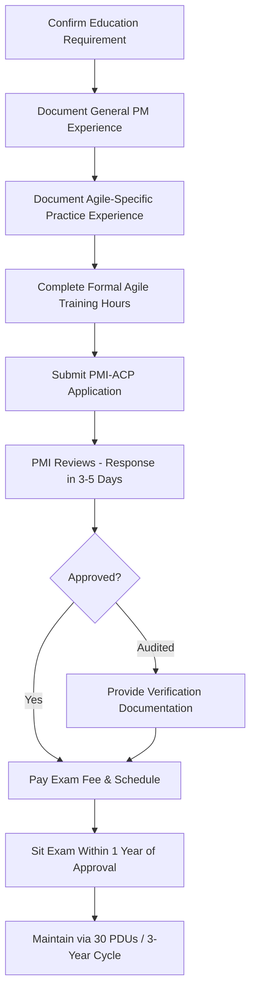

## PMI Agile Certified Practitioner and Other Agile Certifications

### Overview

PMI Agile Certified Practitioner (PMI-ACP) is PMI's credential validating hands-on agile competence across multiple frameworks rather than proficiency in a single methodology. It has become the credential employers point to when they want proof of real agile competence, not just familiarity with one framework, because — unlike Scrum-specific or SAFe-specific certifications — it assesses knowledge across Scrum, Kanban, Lean, Extreme Programming (XP), Test-Driven Development (TDD), and DSDM, among other approaches.

Beyond PMI-ACP, the broader agile certification landscape includes framework-specific credentials (Scrum Alliance's CSM, Scrum.org's PSM), scaled-agile credentials (SAFe Agilist), and hybrid-governance credentials (PRINCE2 Agile) — each suited to different organizational contexts.

### Key Points

- PMI-ACP suits professionals **already working inside agile environments** — project coordinators, Scrum team members, product owners, business analysts, and project managers — validating hands-on capability rather than theoretical knowledge from a single course.
- Eligibility is structured around **four areas**: education, general project experience, agile-specific experience, and formal training hours — all four must be satisfied before an application can be submitted.
- It is a natural complement to the PMP for professionals wanting to formally recognize agile delivery skills alongside traditional project management knowledge.
- Maintenance is comparatively lighter than the PMP: PMI-ACP is valid for 3 years and requires 30 PDUs to renew, compared to the PMP's 60 PDU requirement.

### PMI-ACP Eligibility Requirements

| Requirement Area | Detail |
| --- | --- |
| Education | Secondary degree — high school diploma, associate degree, or global equivalent (no bachelor's degree required, unlike the PMP's degree/experience trade-off) |
| General project experience | A baseline of general project management experience (verify current hour requirement directly with PMI, as this has been subject to periodic adjustment) |
| Agile-specific practice experience | Hands-on experience working on agile project teams |
| Formal agile training | Formal learning hours based on agile approaches, tools, and techniques included in PMI's Examination Content Outline (ECO) |

**Formal Training Hours — Recent Change**

[Unverified — source conflict] Sources disagree on the current required hour count: some describe a 21-hour minimum as the standing requirement per PMI's official March 2026 Examination Content Outline, while another source states PMI now requires 28 hours of formal training, noting that PMI accepted the older 21-hour standard only until March 31, 2025. Given this directly affects application eligibility, confirm the current hour requirement on PMI's official website before beginning training.

**What Counts Toward Training Hours**

Training hours are counted based on time spent in structured agile learning — courses, agile workshops, and educational sessions — completed in any combination (e.g., multiple shorter sessions rather than one continuous block). Self-learning and attending a PMI network/chapter meeting are not considered qualifying hours.

**Credit via Existing Agile Certifications**

An active third-party agile certification (such as a Scrum or SAFe credential) can be used to help fulfill PMI-ACP eligibility requirements — PMI credits 12 months of agile experience for a current agile certification that was earned more than a year prior. [Inference] Exact crediting rules and qualifying certification lists should be confirmed directly against PMI's current application system, as these can be adjusted over time.

### Application and Exam Workflow

**Key Points**

- Once an application is submitted, candidates typically receive a response within 3–5 days from PMI.
- If approved, candidates must appear for the exam within one year of application approval.

### Exam Content Structure

Per PMI's Examination Content Outline (ECO), the PMI-ACP exam is organized into four domains:

| Domain | Focus |
| --- | --- |
| I. Mindset | Agile values, principles, and mindset foundations |
| II. Leadership | Servant leadership, team empowerment, coaching |
| III. Product | Product backlog management, value delivery, stakeholder collaboration |
| IV. Delivery | Iterative delivery, technical practices, continuous improvement |

**Content Balance**

The exam draws roughly evenly across general agile skills/knowledge and specific agile methods and tools — candidates should expect substantial coverage of practical techniques (e.g., specific Scrum, Kanban, and Lean practices) rather than purely conceptual questions.

### Maintaining PMI-ACP Certification

**Key Points**

- The credential is valid for 3 years; renewal requires earning 30 PDUs and paying the renewal fee — half the PMP's 60-PDU requirement, making PMI-ACP comparatively easier to maintain.
- At least 18 of the 30 PDUs must come from Agile-topic education specifically, rather than general PM education.
- Qualifying activities for the remaining PDUs include PMI webinars, chapter events, reading project management books, attending agile events, and writing articles.

### Comparing Agile Certification Options

| Certification | Body | Best Fit |
| --- | --- | --- |
| PMI-ACP | PMI | PM-track professionals wanting cross-framework agile validation alongside PMP |
| CSM (Certified ScrumMaster) | Scrum Alliance | Entry-level Scrum-specific roles |
| PSM I (Professional Scrum Master) | Scrum.org | Scrum-only environments seeking a more rigorous, assessment-based alternative to CSM |
| SAFe Agilist | Scaled Agile, Inc. | Enterprise-scale agile transformations across multiple teams |
| PRINCE2 Agile | PeopleCert | UK public sector or PRINCE2-governed organizations blending agile delivery with PRINCE2 governance |

[Inference] One industry source frames a general recommendation set as: PMI-ACP for most PM-track professionals alongside a PMP, PSM I over CSM for Scrum-only environments seeking greater rigor, PRINCE2 Agile for UK public sector contexts, and SAFe Agilist for enterprise-scale agile programs — but the right choice ultimately depends on the specific organizational methodology already in place and regional hiring norms, which candidates should validate against their own market.

### Why Organizations Value PMI Credentials Generally

**Key Points**

- PMI has been active in the project management field for several decades, lending institutional credibility to its credentials.
- Certification standards and exam content are periodically reviewed using a role delineation study, ensuring assessments stay aligned with actual industry practice.
- Certification content — standards, practice guides, and exam outlines — is developed with contributions from practicing industry professionals who volunteer across multiple continents, then revised per the periodic role delineation study.

### Common Pitfalls

- Assuming self-study or informal reading satisfies the formal training hour requirement, when PMI requires structured coursework or workshops
- Missing one of the four eligibility pillars (education, general PM experience, agile experience, training hours) and having an application stalled as a result
- Confusing the current required training-hour threshold given recent adjustments — verify directly with PMI before enrolling in a training course
- Letting the one-year exam-scheduling window lapse after application approval
- Treating PMI-ACP as a replacement for a framework-specific certification (e.g., CSM/PSM) when a role specifically requires deep single-framework expertise rather than cross-framework breadth

**Next Steps**

- Comparing PMI-ACP Domains Against Real-World Scrum/Kanban Practice
- Building a 21–28 Hour Agile Training Plan That Satisfies PMI's ECO
- PMP + PMI-ACP as a Combined Credential Strategy
- SAFe Agilist vs. PMI-ACP for Enterprise-Scale Agile Transformation
- PDU Accumulation Strategies Across Multiple PMI Credentials
- Framework-Specific Certifications: CSM vs. PSM I Deep Comparison