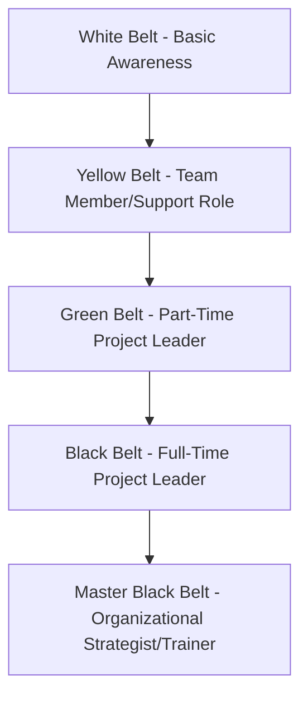
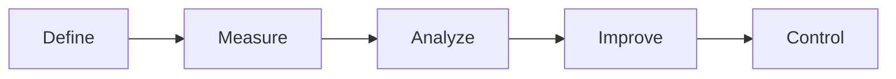
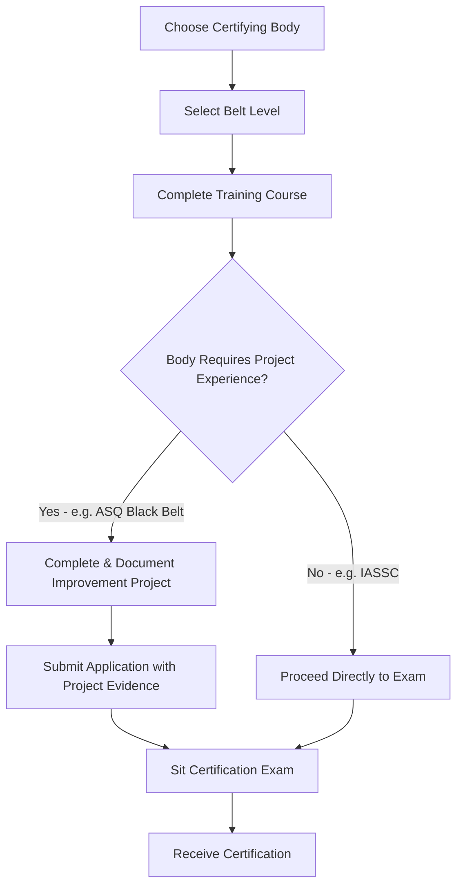

## Six Sigma Belt Certifications

### Overview

Six Sigma Belt Certifications form a tiered credentialing system for process-improvement and quality-management expertise, structured using a martial-arts-inspired "belt" hierarchy (White, Yellow, Green, Black, Master Black Belt). Unlike PMI or PeopleCert credentials, Six Sigma is not governed by a single global standards body — certifications are issued by multiple competing organizations (ASQ, IASSC, various universities and private training providers), meaning content depth and rigor vary meaningfully by issuer.

Six Sigma methodology focuses on reducing process variation and defects using statistical analysis, most commonly structured around the **DMAIC** framework (Define, Measure, Analyze, Improve, Control). It is widely applied in manufacturing but has extended into services, healthcare, IT, and — relevant to project managers — marketing and operational process improvement within project delivery.

### Key Points

- **No single certifying authority**: unlike PMP (PMI) or PRINCE2 (PeopleCert), Six Sigma certifications are issued by multiple independent bodies, so credential value depends partly on the reputation of the issuing organization.
- **Belt levels represent increasing statistical and leadership depth**, not merely increasing seniority — a Black Belt is expected to lead complex, cross-functional improvement projects, while a Green Belt typically supports projects part-time alongside other job duties.
- **DMAIC is the core problem-solving framework** underlying most belt-level project work, though Lean Six Sigma variants also incorporate Lean waste-reduction principles.
- For project managers specifically, Six Sigma complements rather than replaces PM methodologies — it provides a structured toolkit for diagnosing *why* a process underperforms, which a PM then manages as a project.

### Belt Hierarchy

| Belt | Typical Role | Statistical Depth | Project Involvement |
| --- | --- | --- | --- |
| White Belt | Basic awareness of Six Sigma concepts and terminology | Minimal | Observer/team member on improvement initiatives |
| Yellow Belt | Supports improvement projects as a team member | Basic data collection and charting | Contributes to Green/Black Belt-led projects |
| Green Belt | Leads smaller improvement projects, often part-time alongside regular job duties | Intermediate statistical tools (hypothesis testing, basic regression) | Leads or co-leads projects within own functional area |
| Black Belt | Leads complex, cross-functional improvement projects full-time or near-full-time | Advanced statistical analysis (DOE, advanced regression, control charts) | Leads major initiatives, mentors Green Belts |
| Master Black Belt | Organizational-level strategist, trainer, and mentor for Black/Green Belts | Expert-level, plus training/coaching capability | Sets improvement strategy, trains other belts |

### The DMAIC Framework

| Phase | Objective | Typical Tools |
| --- | --- | --- |
| Define | Clarify the problem, project goals, and customer requirements | Project charter, SIPOC diagram, Voice of Customer (VOC) |
| Measure | Quantify current process performance | Data collection plans, process mapping, measurement system analysis |
| Analyze | Identify root causes of defects/variation | Fishbone (Ishikawa) diagrams, hypothesis testing, Pareto analysis |
| Improve | Develop and implement solutions | Design of Experiments (DOE), pilot testing |
| Control | Sustain improvements over time | Control charts, standard operating procedures, monitoring plans |

**Example**

A marketing operations team using Green Belt-level DMAIC to reduce campaign-launch delays might: **Define** the problem as "35% of campaigns launch late," **Measure** actual launch-date variance against planned dates across 6 months, **Analyze** root causes (e.g., asset approval bottlenecks), **Improve** by redesigning the approval workflow, and **Control** by implementing a dashboard tracking approval cycle time going forward.

### Certifying Bodies and Variation in Rigor

**Key Points**

- **ASQ (American Society for Quality)** is broadly regarded as one of the more rigorous and widely recognized certifying bodies, particularly for Black Belt-level credentials, often requiring documented project experience in addition to exam passage.
- **IASSC (International Association for Six Sigma Certification)** offers a more standardized, exam-only certification path without a project-experience requirement, making it comparatively faster to obtain.
- Numerous universities and private training companies also issue belt certifications, with rigor and industry recognition varying significantly.
- [Inference] Because certification requirements and exam content differ by issuer, employers evaluating candidates' Six Sigma credentials often weigh the issuing body alongside the belt level itself — a detail worth verifying against specific employer or industry expectations rather than assuming uniform value across providers.

### Lean Six Sigma vs. Traditional Six Sigma

| Aspect | Traditional Six Sigma | Lean Six Sigma |
| --- | --- | --- |
| Primary focus | Reducing process variation and defects | Reducing variation AND eliminating non-value-added waste |
| Core framework | DMAIC | DMAIC, integrated with Lean waste-reduction principles (the "8 wastes") |
| Origin | Motorola/GE manufacturing quality programs | Merger of Lean (Toyota Production System) and Six Sigma methodologies |
| Best fit | Statistically complex defect-reduction problems | Broader process efficiency problems combining speed and quality |

### Application Within Project Management

**Key Points**

- Six Sigma tools are frequently used within the **Analyze** and **Control** phases of a broader project lifecycle to diagnose root causes and sustain quality gains after project closeout.
- A PM without belt-level statistical training can still apply lightweight Six Sigma tools (Pareto charts, fishbone diagrams, basic process mapping) without full certification.
- Organizations running continuous-improvement or operational-excellence programs often expect PMs overseeing process-improvement initiatives to hold at least a Green Belt.
- Six Sigma project selection criteria (a defined, measurable problem with a clear baseline) align closely with well-scoped PM project charters, making the two disciplines complementary in practice.

### Certification Pathway (Typical Structure)

[Inference] Exact exam formats, fees, and renewal requirements vary substantially by certifying body and were not verified against a single authoritative source for this content — candidates should confirm specifics directly with their chosen certifying organization (e.g., ASQ or IASSC) before enrolling.

### Common Pitfalls

- Assuming all Six Sigma certifications carry equivalent weight regardless of issuing body, when rigor and recognition vary meaningfully
- Pursuing a Black Belt without foundational Green Belt-level statistical grounding, leading to gaps in applying advanced tools like Design of Experiments
- Treating Six Sigma as a replacement for project management methodology rather than a complementary root-cause-analysis and quality-control toolkit
- Skipping the Control phase after implementing improvements, allowing process gains to erode over time without sustained monitoring
- Selecting improvement projects without a clear, measurable baseline, undermining the ability to demonstrate quantifiable results required for many certification pathways

**Related Topics**

- DMAIC Deep Dive: Statistical Tools for the Analyze Phase
- Lean Principles and the 8 Wastes in Process Improvement
- Selecting ASQ vs. IASSC for Black Belt Certification
- Integrating Six Sigma Root-Cause Analysis into PM Project Charters
- Design of Experiments (DOE) for Process Optimization
- Building a Control Plan to Sustain Post-Project Improvements