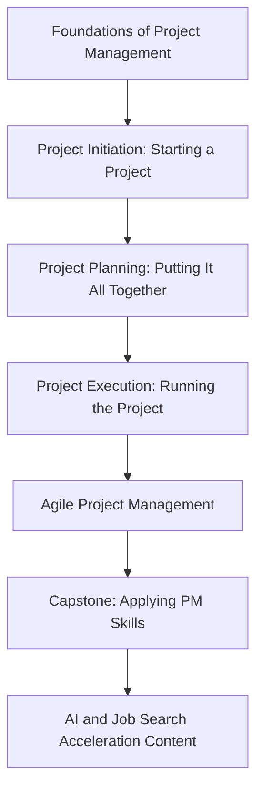

## Google Project Management Certificate

### Overview

The Google Project Management: Professional Certificate is an online, beginner-oriented credential developed by Google and hosted on Coursera, designed to build job-ready project management skills without requiring a prior degree or project management experience. It is positioned as an accessible entry point into project management careers, distinct from PMI or PeopleCert credentials, which generally assume some prior experience or charge substantially higher exam fees.

Unlike traditional project management certifications that require industry experience before eligibility, Google's program focuses on foundational knowledge and workplace-ready skills — making it a popular option for career changers, recent graduates, and professionals moving into project-focused roles from adjacent fields like operations, admin, or customer support.

### Key Points

- **No prerequisites**: no degree or prior project management experience is required to enroll or complete the program.
- **Delivered entirely online** through Coursera, self-paced, with structured weekly modules across multiple courses.
- **Covers both traditional and agile methodologies**, including Agile and Scrum frameworks alongside classic waterfall/predictive approaches.
- **Serves as a stepping stone toward PMI's CAPM certification** — the program prepares graduates for the CAPM exam, though additional study is typically required beyond course completion alone.
- **Recently expanded to include AI skills training**, reflecting an updated curriculum that incorporates Google's AI tools and job-search acceleration content.

### Program Structure

**[Unverified — source conflict]** Sources differ on the exact number of courses in the program: several describe it as consisting of **seven courses**, one source states **six courses**, and Coursera's own current listing suggests a more compressed, module-based structure. This may reflect the certificate being restructured or updated over time. Verify the current course count and structure directly on Coursera's official program page before enrolling or planning a study schedule.

**Key Points**

- The first course in the sequence, "Foundations of Project Management," introduces foundational terminology, the role and responsibilities of a project manager, and how prior work experience can translate into project management roles.
- The program culminates in a capstone project, producing real, portfolio-ready project artifacts rather than purely theoretical output.
- The curriculum has been updated to include an entire course focused on accelerating job search using AI tools, reflecting Google's broader integration of AI skills training across its career certificates.

### Core Topics Covered

| Topic Area | Coverage |
| --- | --- |
| Project lifecycle and methodologies | Initiation, planning, execution, closing; Agile, Waterfall, and hybrid approaches |
| Budgeting and cost management | Basic budget tracking and resource estimation |
| Risk management | Identifying and mitigating project risks |
| Team dynamics and leadership | Stakeholder communication, conflict resolution |
| Agile and Scrum | Agile principles, Scrum roles and ceremonies |
| AI tools for project management | Applying Google's AI tools to planning, execution, and communication tasks |

### Time Commitment and Format

**Key Points**

- Google estimates most learners finish in under six months studying at roughly ten hours per week, though the actual timeline varies depending on prior experience and available study time.
- The program is self-paced, allowing learners to move faster or slower than the estimated timeline.
- [Unverified — source conflict] One current listing describes a much shorter "3 weeks at 10 hours a week" estimate for at least part of the program structure, which is difficult to reconcile with the more commonly cited "under six months" estimate — this discrepancy may reflect measuring a single course within the certificate versus the full multi-course program. Confirm the current time estimate for the complete certificate on Coursera's official page.

### Cost Structure

| Access Method | Approximate Cost |
| --- | --- |
| Coursera monthly subscription | ~$49/month after a 7-day free trial |
| Coursera Plus subscription | ~$24/month or ~$160/year (better value for learners taking multiple courses/programs) |
| Coursera for Teams (organizational) | ~$319 per user/year for teams of 5–125 members |

[Inference] Total cost depends heavily on completion speed — a learner completing the program in one to two months under the standard monthly subscription pays substantially less than one who takes the full estimated six months, making pacing a meaningful cost factor to plan around.

### Credential and Career Outcomes

**Key Points**

- Upon completion, learners receive a Google-issued certificate and a shareable digital badge (via Credly, per some listings) for platforms like LinkedIn.
- The certificate can help qualify graduates for entry-level positions such as project coordinator, project assistant, or operations coordinator.
- The program is most valuable for beginners or career changers seeking entry-level project roles, rather than as a credential for experienced project managers seeking advancement.
- [Inference] Career outcome statistics (e.g., positive career outcomes within six months of completion) are typically self-reported through the platform's own job-postings and outcomes data sources; treat specific percentage claims as marketing-adjacent figures rather than independently audited statistics unless sourced from a neutral third party.

### Google PM Certificate vs. PMI Credentials

| Dimension | Google PM Certificate | PMP | CAPM |
| --- | --- | --- | --- |
| Prerequisites | None | 36–60 months experience | Secondary degree + 23 contact hours |
| Cost | ~$24–49/month subscription | $425–675+ exam fee | Lower fee than PMP, varies by provider |
| Target audience | Complete beginners, career changers | Experienced project leaders | Entry-level, no experience required |
| Industry recognition | Growing, but generally viewed as a foundational/entry credential | Gold-standard, globally recognized | Recognized as a credible entry-level PMI credential |
| Relationship | Can serve as preparation feeding into CAPM | Standalone advanced credential | Can be pursued after or alongside Google's program |

[Inference] Employers evaluating candidates typically weigh the Google certificate as a strong signal of foundational knowledge and initiative, particularly for career changers without a traditional PM background, but it is generally not viewed as equivalent in seniority signal to the PMP for roles requiring demonstrated leadership of complex projects.

### Common Pitfalls

- Assuming the Google certificate alone satisfies CAPM eligibility without confirming the current 23-contact-hour requirement is met through the program's specific structure
- Underestimating the ongoing subscription cost if completion is slower than the estimated timeline, given the monthly billing model
- Treating the certificate as equivalent to the PMP for roles requiring demonstrated multi-year project leadership experience
- Not verifying the current course count/structure before planning a study schedule, given inconsistencies in how the program has been described across sources and time
- Skipping the capstone project, missing the opportunity to build a portfolio-ready work sample for job applications

**Related Topics**

- Transitioning from the Google PM Certificate to PMI's CAPM Exam
- Building a Project Management Portfolio from Capstone Work
- Comparing Entry-Level PM Certificates: Google vs. Microsoft vs. Coursera Alternatives
- Leveraging AI Tools in Day-to-Day Project Management Tasks
- Entry-Level PM Job Titles and Career Pathing After Certification
- Cost-Optimizing Coursera Subscription Models for Multi-Course Certificates