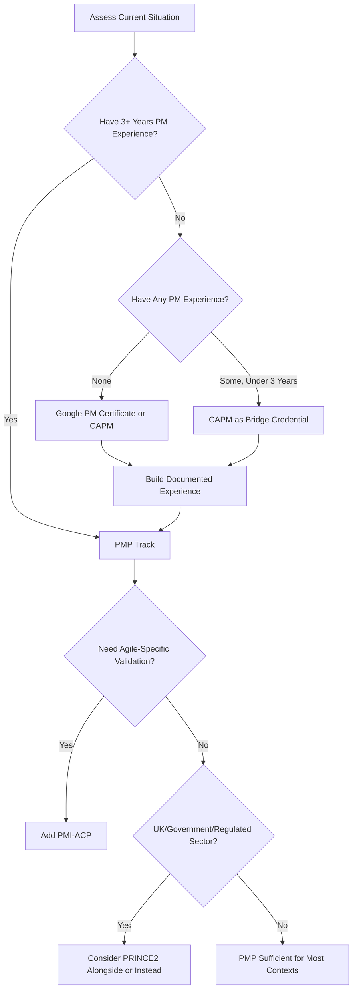
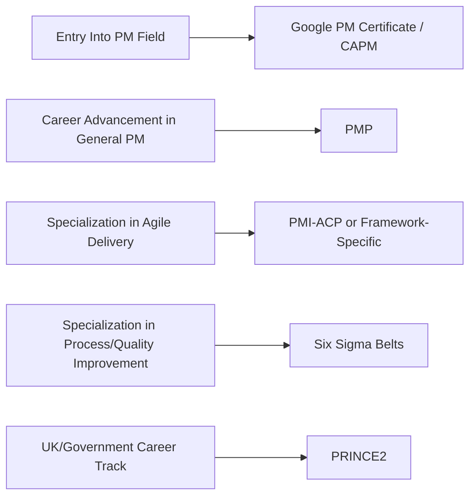

## Choosing the Right Certification Path

### Overview

Choosing the right certification path is the decision framework project management professionals use to select among competing credentials — PMP, CAPM, PRINCE2, PMI-ACP, Six Sigma belts, and vendor certificates like Google's — based on career stage, industry, geography, and target role, rather than assuming any single credential is universally optimal. Since each credential covered in this chapter serves a distinct purpose and audience, the selection decision is less about finding the "best" certification in the abstract and more about matching credential characteristics to a specific professional context.

### Key Points

- **No universal "best" certification exists** — the right choice depends on current experience level, target industry/geography, and whether the goal is entry into the field or advancement within it.
- **Experience level is the primary filter**: credentials requiring documented project leadership experience (PMP) are inaccessible to those without it, making entry-level credentials (CAPM, Google's certificate) the necessary starting point for career changers.
- **Geography and industry shape relative value**: PRINCE2 dominates in UK-influenced government and regulated sectors, while PMP holds broader recognition in North American and multinational private-sector contexts.
- **Credentials can be layered sequentially** rather than chosen exclusively — a common pathway progresses from an entry-level credential toward more advanced or specialized ones as experience accumulates.

### Decision Framework by Career Stage

### Certification Comparison Matrix

| Credential | Experience Required | Best For | Typical Cost Tier | Renewal Burden |
| --- | --- | --- | --- | --- |
| Google PM Certificate | None | Complete beginners, career changers | Low (subscription-based) | None (not a maintained credential) |
| CAPM | None (secondary degree + 23 hours training) | Entry-level PM roles, PMP on-ramp | Moderate | Moderate (PDU-based) |
| PMP | 36–60 months documented experience | Established project leaders across any methodology | High | Moderate (60 PDUs/3 years) |
| PRINCE2 Foundation/Practitioner | None for Foundation; Foundation required for Practitioner | UK/Commonwealth government, regulated industries | Moderate-High | Practitioner renews every 3 years |
| PMI-ACP | General PM + agile-specific experience, training hours | PM professionals wanting cross-framework agile validation | Moderate | Light (30 PDUs/3 years) |
| Six Sigma Belts | Varies by belt and issuing body | Process-improvement and quality-focused roles | Varies widely by issuer | Varies by issuer |

### Key Decision Factors

**1. Current Experience Level**

**Key Points**

- Candidates without any documented project leadership experience are structurally excluded from the PMP regardless of interest — this makes CAPM or the Google certificate the only viable PMI-adjacent starting points.
- Those already working in agile environments but without extensive general PM experience may find PMI-ACP eligibility more attainable than PMP, given its comparatively lower experience bar.

**2. Target Industry and Geography**

| Context | Likely Priority Credential |
| --- | --- |
| UK public sector, Commonwealth government | PRINCE2 |
| North American private sector, multinational corporations | PMP |
| Agile/tech-forward organizations (any region) | PMI-ACP, or framework-specific (CSM/PSM) |
| Manufacturing, healthcare, operations with quality focus | Six Sigma belts |
| Complete career-change entry point (any region) | Google PM Certificate or CAPM |

**3. Time and Cost Constraints**

**Key Points**

- Entry-level credentials (Google's certificate, CAPM) generally involve lower absolute cost and shorter timelines than PMP or PRINCE2 Practitioner.
- PMP represents the most significant time investment overall once the multi-year experience prerequisite is factored in alongside the 35-hour training and exam preparation itself.
- Six Sigma cost and timeline vary substantially by certifying body — IASSC's exam-only path is comparatively fast, while ASQ's project-experience requirement extends the overall timeline.

**4. Career Goal: Entry vs. Advancement vs. Specialization**

### Layering Multiple Credentials

**Key Points**

- A common progression path: Google PM Certificate or CAPM → documented experience accumulation → PMP → PMI-ACP as a specialization add-on.
- PMP and PRINCE2 are not mutually exclusive — some professionals working across UK and North American/multinational contexts pursue both for broader geographic career mobility.
- Six Sigma belts complement rather than replace PM credentials, since they address root-cause analysis and quality control rather than overall project governance — a Green Belt alongside a PMP is a common pairing in operationally-focused PM roles.
- [Inference] The value of pursuing multiple credentials tends to diminish beyond two or three well-chosen, complementary certifications — stacking credentials primarily for resume volume rather than addressing a genuine skill or market-recognition gap is generally less effective than depth in fewer, more relevant credentials for a specific career direction.

### A Simple Self-Assessment Checklist

- Do I have documented project leadership experience of 36+ months? → PMP becomes viable
- Am I entering the field with no prior PM experience? → Start with Google's certificate or CAPM
- Does my target industry or region have a dominant local standard (e.g., PRINCE2 in UK government)? → Prioritize that standard
- Is my work primarily agile/Scrum-based already? → PMI-ACP or a framework-specific credential may outweigh a general PMP in relevance
- Does my role involve process improvement, defect reduction, or quality control specifically? → A Six Sigma belt adds targeted value beyond general PM credentials
- Am I certain about long-term commitment to the PM field, or still exploring? → Lower-cost, lower-commitment entry credentials reduce risk while testing fit

### Common Pitfalls

- Pursuing PMP eligibility documentation prematurely before confirming the experience genuinely meets PMI's project-leadership definition, risking audit rejection
- Choosing a credential based on perceived prestige alone without verifying it matches the target industry or region's actual hiring expectations
- Stacking multiple credentials without a clear rationale for how each serves a distinct, non-overlapping purpose
- Underestimating the ongoing maintenance burden (PDUs, renewal fees) when selecting a credential, leading to lapsed certifications post-attainment
- Assuming an entry-level credential like Google's certificate substitutes for PMP-level seniority signaling in roles requiring demonstrated complex project leadership
- Ignoring geography-specific dominant standards (e.g., pursuing PMP exclusively while targeting UK government roles where PRINCE2 carries more weight)

**Next Steps**

- Building a Multi-Year Certification Roadmap Aligned to Career Goals
- Documenting Project Experience Early for Future PMP Eligibility
- Regional Certification Preferences: A Deeper Geographic Breakdown
- Cost-Benefit Analysis Framework for Certification Investment Decisions
- Transitioning Between Certification Bodies (e.g., PRINCE2 to PMP) Later in Career
- Maintaining Multiple Concurrent Certifications Without Renewal Overlap Conflicts