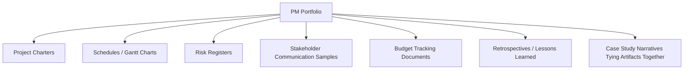
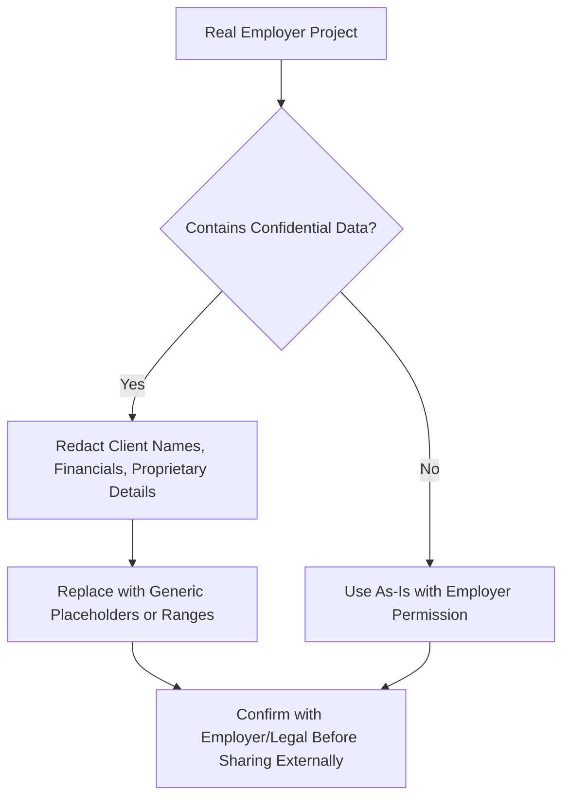
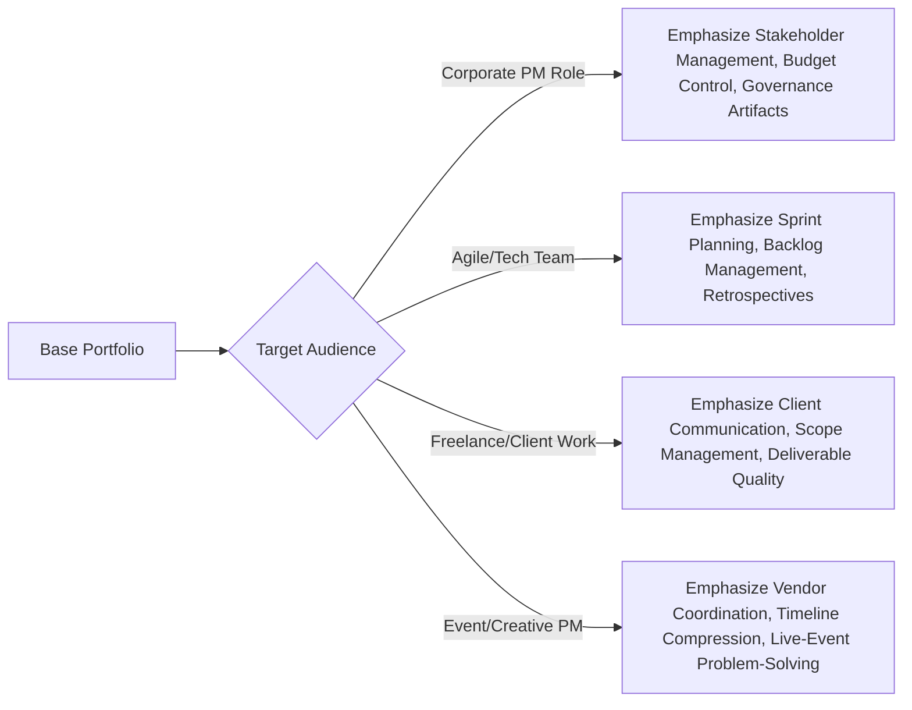

## Building a Project Management Portfolio

### Overview

Building a project management portfolio is the practice of assembling documented evidence of PM competency — real or simulated project artifacts, outcomes, and process documentation — into a cohesive presentation used for job applications, promotions, or client acquisition. Unlike fields with obviously visual portfolios (design, photography), project management portfolios must translate process work, coordination, and outcomes into demonstrable, reviewable artifacts, which makes artifact selection and framing a distinct skill in itself.

A strong portfolio serves a different function than a resume: where a resume claims competency, a portfolio demonstrates it through concrete work products a reviewer can inspect directly.

### Key Points

- **Artifacts matter more than narrative claims** — a portfolio's credibility comes from showing actual project charters, schedules, risk logs, and retrospectives rather than describing skills abstractly.
- **Career changers without "real" employer projects can still build credible portfolios** using capstone projects, volunteer work, freelance engagements, or well-documented personal projects.
- **Quantified outcomes strengthen every artifact** — a schedule is more compelling when paired with a stated result (e.g., "delivered 2 weeks ahead of the original baseline") than presented alone.
- **Confidentiality constraints shape what can be shown from real employer work** — sensitive client or company data typically must be redacted, anonymized, or replaced with representative mock versions.

### Core Portfolio Components

| Component | What It Demonstrates | Example |
| --- | --- | --- |
| Project charter | Ability to define scope, objectives, and success criteria upfront | A one-page charter for a marketing campaign launch |
| Schedule / Gantt chart | Planning and sequencing capability | A phased timeline showing dependencies and milestones |
| Risk register | Proactive risk identification and mitigation planning | A log of 5–10 identified risks with likelihood/impact ratings and response plans |
| Stakeholder communication plan | Structured stakeholder engagement approach | A RACI matrix or communication cadence table |
| Budget tracking document | Financial oversight capability | A sample budget-vs-actual tracker with variance notes |
| Retrospective / lessons learned | Reflective practice and continuous improvement mindset | A structured "what went well / what to improve" summary |
| Case study narrative | Synthesizes artifacts into a coherent story of the PM's role and impact | A 1-page write-up connecting the charter, schedule, and outcome |

### Sourcing Portfolio Material

**Key Points**

- **Employer projects** (when confidentiality allows) offer the strongest credibility since they reflect real organizational stakes and constraints.
- **Capstone projects** from structured learning programs (e.g., a Google PM Certificate capstone) provide a ready-made, complete artifact set for those without employer material.
- **Volunteer or nonprofit project work** offers genuine stakes and real stakeholders while typically carrying fewer confidentiality restrictions than corporate work.
- **Personal or simulated projects** (e.g., planning a hypothetical product launch, organizing a community event) are a valid fallback when no other source is available, provided they're framed honestly as self-directed rather than misrepresented as employer work.

**Handling Confidentiality**

### Structuring the Portfolio for Reviewers

**Key Points**

- Lead with a brief summary of the PM's role, methodology used (agile/waterfall/hybrid), and the project's business context before diving into artifacts.
- Organize by project rather than by artifact type, so each project reads as a coherent case study rather than a disconnected pile of documents.
- Highlight 2–4 strong projects in depth rather than including every project ever touched — depth and clarity outperform volume for reviewer attention.
- Include a mix of methodologies represented (e.g., one waterfall-style project, one agile/Scrum project) if the target roles span both, since this demonstrates versatility.

**Example Portfolio Project Entry Structure**

A single project entry within a portfolio might follow this sequence: (1) one-paragraph context — what the project was and why it mattered, (2) the PM's specific role and responsibilities, (3) key artifacts (charter, schedule excerpt, risk register sample), (4) challenges encountered and how they were addressed, (5) quantified outcome or result.

### Presentation Formats

| Format | Best For | Trade-offs |
| --- | --- | --- |
| PDF/document portfolio | Email attachments, formal applications | Static; less interactive, but universally accessible |
| Personal website/portfolio site | Ongoing career visibility, freelance/consulting positioning | Requires setup and maintenance |
| LinkedIn Featured section | Passive visibility to recruiters browsing profiles | Limited depth; best as a teaser linking to fuller portfolio |
| Slide deck | Interview presentations, walkthrough conversations | Strong for verbal narration; less useful as a standalone leave-behind |
| Project management tool exports | Showing actual tool fluency (Asana, Jira, MS Project) | Ties portfolio to specific tools, which may or may not match target employer's stack |

[Inference] A combination approach — a concise PDF or website summary supplemented by a slide deck for interview walkthroughs — tends to serve most job-search contexts better than relying on a single format alone, since different audiences (initial resume screeners vs. interview panels) consume portfolio material differently.

### Quantifying Impact

**Key Points**

- Wherever possible, pair each artifact or project summary with a measurable outcome: time saved, budget variance, stakeholder satisfaction improvement, or defect/error reduction.
- When precise figures aren't available (common for volunteer or personal projects), directional framing ("reduced approval cycle time noticeably" alongside a described before/after process) is preferable to fabricating specific numbers.
- Avoid vague claims like "successfully managed the project" without a concrete, specific detail backing it — specificity is what differentiates a portfolio from a resume bullet point.

### Tailoring the Portfolio by Audience

### Common Pitfalls

- Including too many projects at shallow depth rather than a focused set explored thoroughly
- Failing to redact confidential client or employer information, creating legal or professional risk
- Presenting artifacts without context — a Gantt chart alone means little without the surrounding project narrative
- Relying entirely on claims without quantified or specific outcomes to substantiate them
- Neglecting to update the portfolio after completing new, more relevant projects, leaving it stale relative to current skill level
- Choosing a portfolio format mismatched to how it will actually be reviewed (e.g., a dense PDF when a recruiter will only glance at a LinkedIn Featured link)

**Next Steps**

- Structuring a Capstone Project as Portfolio-Ready Material
- Redacting and Anonymizing Confidential Project Data for External Sharing
- Building a Personal Portfolio Website for PM Career Positioning
- Translating Volunteer/Nonprofit Work into Credible Portfolio Artifacts
- Interview Techniques for Walking Through a Portfolio Live
- Tailoring Portfolio Emphasis for Agile vs. Traditional PM Roles