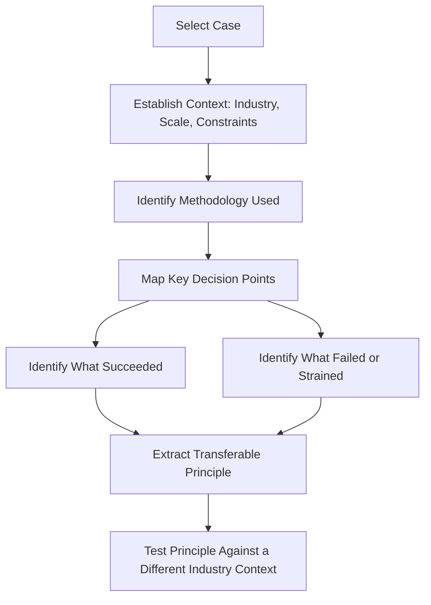
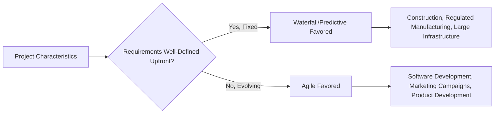

## Cross Industry Case Study Analysis

### Overview

Cross industry case study analysis is the practice of studying project management successes, failures, and methodological adaptations across multiple industries — construction, IT, healthcare, marketing, manufacturing, events — to build transferable judgment rather than industry-siloed expertise. Where a project manager working exclusively within one sector risks internalizing that sector's assumptions as universal truths, deliberately studying how PM principles play out differently across industries sharpens the ability to recognize which practices are context-dependent and which are genuinely fundamental.

For capstone-level practice, this discipline shifts a learner from *executing* known frameworks to *evaluating* how those frameworks succeed, strain, or fail under different real-world constraints.

### Key Points

- **The same PM principle can require different implementation depending on industry constraints** — risk management in construction (physical safety, regulatory compliance) looks structurally different from risk management in a software project (technical debt, integration failure) even though both use a risk register.
- **Failure analysis is often more instructive than success analysis** — case studies of well-documented project failures (e.g., cost overruns, missed deadlines, stakeholder misalignment) reveal decision points more clearly than success stories, which can obscure the role of luck or favorable conditions.
- **Methodology fit is industry- and context-dependent, not universally superior** — agile's iterative approach suits software and marketing well but requires significant adaptation for fixed-infrastructure projects like large-scale construction.
- Comparing analogous problems across industries (e.g., "how do both hospital IT rollouts and retail POS system rollouts manage change resistance among frontline staff?") builds pattern recognition that a single-industry case study cannot.

### A Structured Case Study Analysis Framework

**Key Points**

- Establishing context first (industry norms, regulatory environment, typical project scale) prevents misapplying lessons that only hold under specific conditions.
- The final step — testing an extracted principle against a different industry — is what distinguishes cross-industry analysis from single-case reflection; a principle that survives this test is more likely to be genuinely fundamental rather than context-specific.

### Illustrative Cross-Industry Comparison: Risk Management

| Industry | Primary Risk Categories | Typical Mitigation Approach | Consequence of Risk Materializing |
| --- | --- | --- | --- |
| Construction | Safety, weather, regulatory/permitting, material supply | Physical inspections, buffer scheduling, insurance/bonding | Physical harm, legal liability, schedule/cost overrun |
| Software/IT | Technical debt, integration failure, scope creep, security | Code review, staged rollouts, automated testing | System downtime, security breach, rework cost |
| Healthcare (clinical/operational projects) | Patient safety, regulatory compliance (e.g., data privacy), staff adoption | Phased pilots, compliance review boards, extensive training | Patient harm, regulatory penalty, reputational damage |
| Marketing/Creative | Brand reputation, creative approval delays, market timing | Approval workflow design, contingency creative assets | Missed market window, brand damage, wasted spend |
| Event Management | Vendor reliability, weather (for outdoor events), attendee safety | Vendor contracts with penalty clauses, contingency venues | Event failure, safety incident, reputational damage |

[Inference] Despite surface-level differences, every industry's risk register ultimately answers the same underlying questions — what could go wrong, how likely is it, how severe would it be, and what's the response plan — suggesting the risk management *process* is more universal than the specific *risk categories* it's applied to.

### Illustrative Cross-Industry Comparison: Methodology Fit

**Key Points**

- Industries with high physical/regulatory fixedness (construction, pharmaceutical manufacturing) tend toward predictive methodologies because requirements and sequencing are constrained by physical or regulatory reality.
- Industries with fast-changing requirements or creative iteration (software, marketing) tend toward agile approaches because the ability to adapt mid-project outweighs the value of rigid upfront planning.
- Hybrid approaches increasingly bridge both — e.g., a construction project might use predictive scheduling for physical build phases while using agile-style sprints for a parallel software/BIM coordination workstream.

### Conducting a Case Study: A Practical Walkthrough

**Example**

Analyzing a well-known type of case (e.g., a large-scale public infrastructure project with a documented cost overrun) for capstone practice might proceed as:

1. **Context**: Identify the project's scale, public/private funding structure, and regulatory environment.
2. **Methodology used**: Determine whether the project followed a predictive, agile, or hybrid approach, and whether that choice matched the project's actual requirements volatility.
3. **Decision points**: Identify specific junctures where scope changed, funding was reallocated, or stakeholder priorities shifted.
4. **What failed**: Isolate whether the primary driver was poor initial estimation, scope creep, stakeholder misalignment, or external factors (e.g., regulatory delays, supply chain disruption).
5. **Transferable principle**: Extract a general lesson (e.g., "underestimating regulatory approval timelines compounds across every downstream milestone") that could apply outside the original industry.
6. **Cross-industry test**: Ask whether that same principle would manifest in, for example, a healthcare IT rollout facing its own regulatory approval gate — and if the underlying dynamic holds, the principle is validated as broadly transferable.

### Sources for Case Study Material

**Key Points**

- Published post-mortems and retrospectives from well-documented public infrastructure or technology projects offer detailed, often multi-perspective accounts.
- Academic project management case study collections (business school case libraries) provide structured, pedagogically designed comparisons.
- Industry association publications (PMI's own case study resources, sector-specific trade publications) often provide practitioner-oriented analysis with more operational detail than press coverage alone.
- [Inference] Recent, high-profile project failures are often better documented in the months following public scrutiny (e.g., government inquiries, post-incident reports) than in real-time coverage, since detailed root-cause analysis typically takes time to emerge — this suggests analyzing cases with some historical distance often yields more reliable material than very recent events.

### Building Judgment, Not Just Knowledge

**Key Points**

- The goal of cross-industry analysis is not to memorize what happened in specific past projects, but to build a mental library of decision patterns that transfer to novel situations a PM hasn't directly experienced.
- A PM who has only ever worked in one industry is more prone to assuming that industry's norms (e.g., typical approval timelines, typical stakeholder behavior) are universal, which can lead to miscalibrated planning when moving into a new sector or cross-functional role.
- This analysis is particularly valuable capstone practice because it forces synthesis across multiple prior topics (risk management, methodology selection, stakeholder management, budgeting) rather than testing any single skill in isolation.

### Common Pitfalls

- Extracting a lesson from a single case and treating it as universally applicable without testing it against a different industry context
- Focusing exclusively on success stories, which tend to underreport the role of contextual luck or favorable conditions
- Ignoring industry-specific constraints (regulatory, physical, cultural) when attempting to directly port a practice from one sector to another without adaptation
- Analyzing cases too superficially (surface narrative only) without mapping specific decision points and their downstream consequences
- Treating methodology choice as a matter of trend or preference rather than a fit-to-context decision shaped by requirements volatility and physical/regulatory constraints

**Next Steps**

- Constructing a Personal Case Study Library Across Target Industries
- Root-Cause Analysis Techniques for Project Failure Post-Mortems
- Adapting Agile Practices for Fixed-Infrastructure Industries
- Comparative Stakeholder Management Across Regulated vs. Unregulated Industries
- Using Case Study Synthesis as Capstone Portfolio Material
- Cross-Industry Risk Register Design Patterns