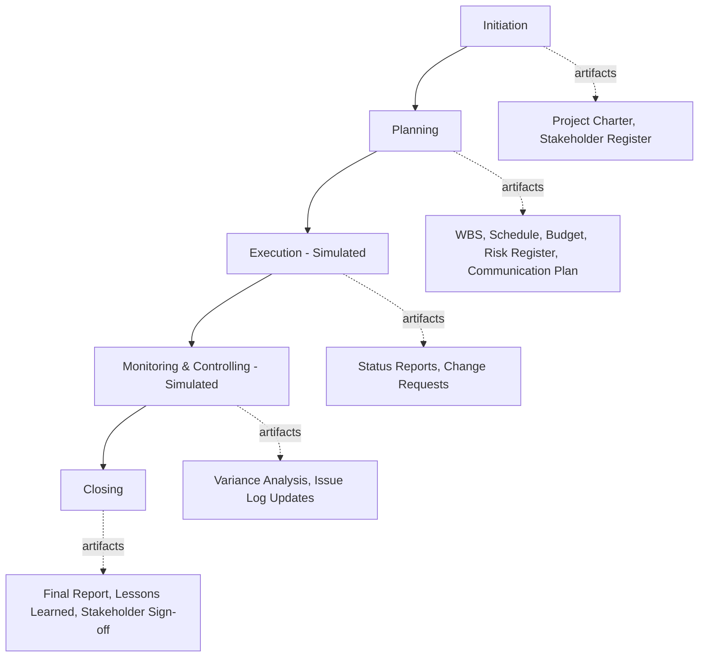
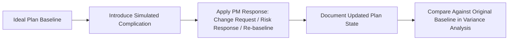

## Simulated End to End Capstone Project

### Overview

A simulated end-to-end capstone project is a self-directed exercise in which a learner plans and documents a complete project lifecycle — initiation through closure — for a fictional or hypothetical scenario, producing the full set of artifacts a real project would require. Unlike studying individual PM techniques in isolation, the capstone format forces integration: a schedule only makes sense in light of the scope defined in the charter, and a risk register only makes sense in light of the schedule and budget it threatens.

This exercise is the culminating self-study activity for a PM curriculum — it tests whether discrete knowledge (WBS construction, risk registers, stakeholder analysis) can be synthesized into a coherent, internally consistent project plan under realistic constraints.

### Key Points

- **Integration is the point, not novelty of technique** — a capstone doesn't need to introduce new PM concepts; it needs to demonstrate that previously learned concepts connect correctly to one another.
- **A good simulated scenario has genuine constraints and trade-offs** — an unconstrained scenario ("assume unlimited budget and time") produces a plan that never has to demonstrate prioritization or risk trade-off reasoning, which is the actual skill being tested.
- **The project should be scoped to be completable**, not simply ambitious — a capstone spanning too many workstreams becomes an exercise in surface-level listing rather than demonstrated depth.
- **Internal consistency across artifacts is a primary quality signal** — a schedule with a milestone that isn't reflected in the WBS, or a risk register that ignores a dependency shown in the schedule, reveals gaps in integrated thinking.

### End-to-End Lifecycle Structure

### Selecting a Capstone Scenario

**Key Points**

- Choose a scenario within a familiar or learnable domain — a scenario requiring deep subject-matter expertise the learner doesn't have (e.g., simulating a complex clinical trial without any healthcare background) adds friction unrelated to PM skill demonstration.
- Introduce at least one genuine constraint conflict — e.g., a fixed launch date that creates schedule pressure, or a fixed budget that forces scope trade-offs — since resolving a real trade-off is more instructive than planning under ideal conditions.
- Scope for completability within the available study time; a mid-sized scenario (e.g., "launch a new product feature," "organize a regional conference," "migrate a small team to new software") is generally more tractable than an enterprise-scale transformation.

**Example Scenario Framing**

"Plan the launch of a new mobile app feature for a mid-sized company, with a fixed 12-week deadline tied to a marketing campaign already scheduled, a cross-functional team of 6 (engineering, design, QA, marketing), and a budget covering only internal labor plus a small external contractor allowance for specialized testing." This framing supplies enough constraint (fixed deadline, fixed team size, limited budget) to force genuine prioritization decisions.

### Required Artifact Set

| Phase | Artifact | Purpose |
| --- | --- | --- |
| Initiation | Project charter | States objectives, scope boundaries, success criteria, sponsor |
| Initiation | Stakeholder register | Identifies stakeholders, their interest/influence, engagement approach |
| Planning | Work Breakdown Structure (WBS) | Decomposes scope into manageable work packages |
| Planning | Schedule / Gantt chart | Sequences work packages with dependencies and milestones |
| Planning | Budget | Allocates costs across labor, tools, and contingency |
| Planning | Risk register | Identifies risks with likelihood/impact and response plans |
| Planning | Communication plan | Defines stakeholder communication cadence and channels |
| Execution (simulated) | Status report sample | Demonstrates periodic progress reporting format and content |
| Execution (simulated) | Change request example | Shows how a scope/schedule/budget change would be evaluated and approved |
| Monitoring | Variance analysis | Compares planned vs. simulated actual performance on schedule/cost |
| Closing | Final report | Summarizes outcomes against original success criteria |
| Closing | Lessons learned | Reflects on what worked, what didn't, and why |

### Simulating Execution Realistically

**Key Points**

- Since a capstone doesn't involve a real team actually doing the work, "execution" is simulated by introducing plausible complications partway through the plan — a key team member becomes unavailable, a vendor delivers late, a stakeholder requests a scope addition.
- Responding to these simulated complications with realistic PM actions (a change request, a schedule re-baseline, a risk response activation) demonstrates applied judgment rather than static planning alone.
- A useful technique: write the capstone in two passes — first the "ideal plan" as if everything proceeds as scheduled, then a "complication and response" narrative showing how the plan adapts when something predictably goes wrong.

### Self-Evaluation Criteria

**Key Points**

- **Internal consistency**: Does every milestone in the schedule trace back to a work package in the WBS? Does every major risk in the register correspond to something visible in the schedule or budget?
- **Realistic constraint handling**: When the simulated complication occurred, was the response proportionate and grounded in an actual PM technique (not just narrated as "the team worked harder")?
- **Stakeholder-appropriate communication**: Does the communication plan differentiate cadence/format for different stakeholder groups (e.g., executive sponsor vs. working team) rather than treating all communication identically?
- **Completeness without padding**: Does each artifact serve a clear purpose, or are some included only to check a box without adding genuine planning value?

### Presenting the Capstone

**Key Points**

- A capstone project doubles naturally as portfolio material — the full artifact set, framed with a narrative case study write-up, is directly reusable for the kind of portfolio building covered elsewhere in this curriculum.
- When presenting, lead with the scenario context and constraints before showing artifacts, so a reviewer understands *why* specific planning choices were made rather than judging artifacts in a vacuum.
- Including the "complication and response" narrative specifically differentiates a capstone from a static template exercise, since it demonstrates applied judgment under pressure rather than only planning competence.

### Common Pitfalls

- Choosing an unconstrained scenario that never forces genuine trade-off decisions
- Producing artifacts that don't reference each other consistently (e.g., a risk register that ignores a dependency clearly visible in the schedule)
- Treating the capstone as a checklist of documents to produce rather than a coherent narrative of a single project's lifecycle
- Skipping the simulated execution/complication phase, leaving the capstone as pure planning without demonstrated adaptive response
- Scoping the scenario too large, resulting in shallow, generic treatment of each phase rather than depth in a completable scope
- Neglecting the closing phase (final report, lessons learned), which is often the most revealing artifact of genuine reflective PM practice

**Next Steps**

- Converting a Capstone Project into Polished Portfolio Material
- Designing Realistic Simulated Complications for Practice Scenarios
- Building a WBS-to-Schedule-to-Budget Traceability Check
- Writing an Effective Lessons Learned Document
- Practicing Change Request Evaluation Under Simulated Constraints
- Peer Review Techniques for Self-Directed Capstone Projects