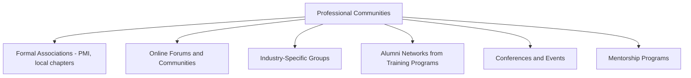
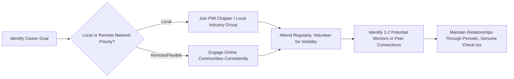

## Networking and Professional Communities

### Overview

Networking and professional communities encompass the relationships, organizations, and ongoing engagement channels project managers use to exchange knowledge, find opportunities, and stay current with evolving practice — extending career development beyond formal certification and self-study into an ongoing, relationship-based dimension of professional growth. Where earlier chapter items focused on individually acquired credentials and skills, this discipline addresses the fact that project management knowledge, hiring, and career mobility flow substantially through human networks and communities of practice, not solely through credentials alone.

### Key Points

- **Networking serves multiple distinct functions**: knowledge exchange (learning how others solve similar problems), career mobility (referrals, job leads), and credibility signaling (visible community involvement as a proxy for genuine engagement in the field).
- **PMI chapters and similar professional associations provide structured, ongoing engagement** beyond a one-time certification exam, including local events, mentorship programs, and continuing education credit opportunities.
- **Online communities complement in-person networking** by offering lower-friction, asynchronous engagement — useful for maintaining connections across geography or for those early in their careers without an established local network.
- **Community involvement can directly support certification maintenance** — many PMI credentials' PDU requirements are partially satisfiable through chapter events, volunteering, or community contributions like writing.

### Types of Professional Communities

| Community Type | Primary Value | Typical Engagement Level |
| --- | --- | --- |
| PMI local chapters | Structured networking, PDU-eligible events, mentorship access | Moderate — regular but scheduled events |
| Online forums/communities (e.g., PM-focused subreddits, LinkedIn groups) | Low-friction knowledge exchange, broader reach | Low-to-flexible — asynchronous, self-paced |
| Industry-specific PM groups (e.g., construction PM associations, healthcare PM networks) | Deep, sector-relevant practice exchange | Moderate — often smaller, more specialized communities |
| Alumni networks (from bootcamps, certificate programs, university programs) | Shared foundational context, peer accountability | Variable — depends on program's alumni infrastructure |
| Conferences (PMI Global Summit and similar) | Concentrated learning, high-visibility networking, exposure to emerging trends | Low frequency, high intensity |
| Mentorship programs | Personalized guidance, career navigation support | Ongoing, relationship-based |

### PMI Chapters and Formal Association Engagement

**Key Points**

- Local PMI chapters typically offer regular meetings, workshops, and networking events at the regional level, often more accessible and lower-cost than national/global conferences.
- Volunteering within a chapter (organizing events, serving on a board, mentoring newer members) often counts toward PDU requirements under the "Giving Back to the Profession" category referenced in certification maintenance.
- Chapter involvement provides visibility within a local professional community, which can translate into job referrals or awareness of unadvertised opportunities — a dynamic common across many professional fields, not unique to PM.

### Online Communities and Digital Engagement

**Key Points**

- Online PM communities (forums, LinkedIn groups, Slack/Discord communities focused on project management) allow asynchronous participation, useful for those balancing full-time work or without a robust local in-person option.
- Contributing thoughtfully to discussions (answering questions, sharing case studies, offering feedback on others' challenges) builds visible expertise signals over time, distinct from passive membership.
- [Inference] Online community quality varies significantly — some are dominated by low-effort content or certification-selling activity, while others sustain genuinely substantive practitioner discussion; evaluating a community's actual discussion quality before committing significant engagement time is a reasonable filter.

### Building a Networking Strategy

**Key Points**

- A networking strategy tied to a specific career goal (e.g., transitioning into healthcare PM, moving into a PMO leadership role) is more effective than generic "networking for its own sake," since it clarifies which communities and individuals are actually relevant.
- Consistency matters more than intensity — regular, modest engagement (attending most chapter meetings, periodic thoughtful online contributions) tends to build stronger professional relationships than sporadic high-effort bursts.
- Genuine reciprocity — offering help, insight, or connections to others in the network — sustains relationships more durably than a purely extractive approach focused only on what one can gain.

### Mentorship

**Key Points**

- Mentorship relationships, whether formally arranged through a chapter program or informally developed, offer personalized guidance that generic content (courses, articles) cannot replicate — particularly for navigating ambiguous career decisions or workplace-specific challenges.
- Serving as a mentor (once experienced enough to do so) reinforces the mentor's own knowledge through the act of teaching, while simultaneously building community standing and PDU-eligible activity where applicable.
- A mentorship relationship works best with some structure — even informally, agreeing on rough goals or a check-in cadence prevents the relationship from fading into infrequent, low-value contact.

### Conferences and Concentrated Learning Events

**Key Points**

- Major conferences (PMI Global Summit and similar large-scale industry events) offer concentrated exposure to emerging trends, thought leadership, and a wide cross-section of practitioners in a short timeframe.
- The networking value of conferences often comes as much from informal conversations (hallway discussions, shared meals) as from formal sessions — approaching conferences purely as a lecture-attendance exercise misses much of their networking value.
- Conferences represent a higher cost, lower-frequency engagement compared to ongoing chapter or online community participation, making them a complement to rather than a replacement for continuous networking activity.

### Networking's Role in Career Mobility

**Key Points**

- Many project management roles, particularly at senior levels, are filled partly or fully through referral and network awareness rather than purely open, cold applications — a pattern common across many professional fields.
- Visible community contribution (chapter volunteering, thoughtful online engagement, conference speaking) functions as an informal credibility signal that complements formal certifications, since it demonstrates ongoing, active engagement with the field rather than a one-time credentialing event.
- [Inference] For career changers without extensive formal PM experience, networking can partially offset a thinner resume by providing direct human vouching and introduction — this is a plausible general dynamic in professional hiring, though its specific weight varies by organization and hiring manager.

### Common Pitfalls

- Treating networking as purely transactional (only reaching out when actively job-searching), which tends to produce weaker, less durable relationships than sustained, genuine engagement
- Joining multiple communities without sustained follow-through in any of them, diluting the relationship-building benefit that comes from consistency
- Engaging with online communities that are low-substance or dominated by promotional content, mistaking activity volume for genuine professional development
- Overlooking the PDU-eligibility of community involvement, missing an efficient way to satisfy certification maintenance requirements while building genuine relationships
- Approaching conferences as passive lecture attendance only, missing the informal networking opportunities that often provide the greatest long-term value
- Neglecting reciprocity — focusing entirely on what can be gained from a network without contributing back to it

**Related Topics**

- Structuring PDU-Eligible Volunteer Activity Through PMI Chapters
- Finding and Structuring an Effective PM Mentorship Relationship
- Evaluating Online PM Community Quality Before Committing Engagement Time
- Leveraging Conference Attendance for Career Transition Networking
- Building an Informal Personal Brand Within Professional PM Communities
- Balancing In-Person Chapter Involvement with Remote/Online Networking