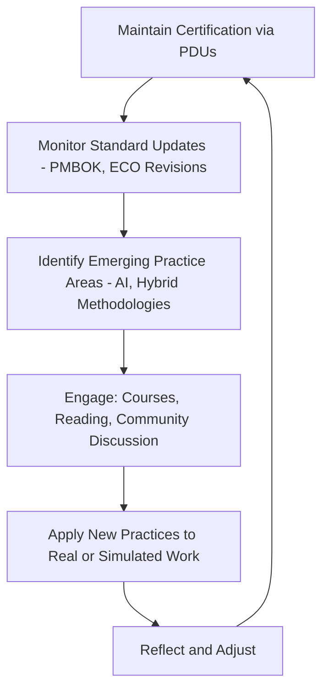
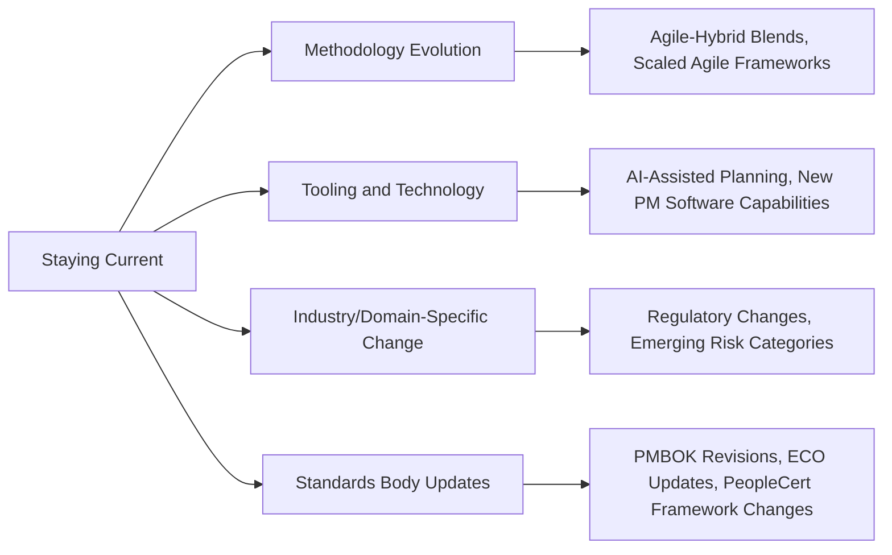

## Continuing Education and Staying Current

### Overview

Continuing education and staying current is the ongoing discipline of maintaining and expanding project management competency after initial certification or curriculum completion, in response to evolving methodologies, tools, and industry standards. Unlike the finite, milestone-based nature of earning a credential, this discipline is deliberately open-ended — project management as a field continues to absorb new practices (AI-assisted planning, evolving agile-hybrid blends, updated PMI standards) that a static credential earned years earlier will not reflect.

This item closes the curriculum's Career Development chapter by addressing what happens *after* certifications and capstone work: sustaining relevance over a multi-decade career rather than treating certification as a terminal achievement.

### Key Points

- **Certifications require active maintenance, not passive possession** — PMI credentials (PMP, CAPM, PMI-ACP) require PDU accumulation within defined renewal cycles, making continuing education structurally mandatory rather than optional for credential holders.
- **The field's standards themselves evolve** — PMI periodically revises exam content outlines and foundational guides based on role delineation studies, meaning knowledge that was current at initial certification can become outdated even without the credential lapsing.
- **Staying current spans multiple domains simultaneously**: methodology evolution (agile-hybrid blends), tool evolution (PM software, AI-assisted planning), and domain-specific evolution (industry regulatory changes, emerging risk categories).
- **Passive awareness is insufficient for genuine currency** — reading a headline about a trend differs meaningfully from understanding how to apply it, which requires more active engagement (courses, hands-on practice, community discussion).

### The Continuing Education Cycle

### PDU Maintenance as a Structural Driver

**Key Points**

- PMI's Continuing Certification Requirements (CCR) program requires credential holders to earn Professional Development Units within each renewal cycle — for example, the PMP requires 60 PDUs across a 3-year cycle, while PMI-ACP requires 30 PDUs across the same cycle length, with at least 18 required specifically in agile-related education for PMI-ACP.
- PDUs are generally earned through a mix of formal education, "giving back to the profession" (volunteering, mentoring), and practical work application, creating structural incentive to continuously engage with new learning rather than coast on prior knowledge.
- [Inference] Because PDU categories reward both formal coursework and community contribution, a well-rounded continuing education approach that blends structured learning with community involvement (as covered under Networking and Professional Communities) tends to satisfy maintenance requirements more efficiently than formal coursework alone.

### Monitoring Standards Evolution

**Key Points**

- PMI periodically revises its foundational guide (PMBOK) and Examination Content Outlines based on role delineation studies — research that analyzes how project managers actually operate in current delivery environments — meaning the "correct" current practice can shift even for well-established concepts.
- Recent PMI exam updates have incorporated content on AI, sustainability, and value delivery into revised content outlines, reflecting genuine shifts in what organizations expect from project managers rather than purely cosmetic exam changes.
- Credential holders should periodically check for outline or guide revisions relevant to their held certifications, even without an immediate renewal deadline, since organizational expectations may shift ahead of the next formal renewal cycle.

### Domains Requiring Ongoing Attention

| Domain | Why It Requires Ongoing Attention | Example |
| --- | --- | --- |
| Methodology evolution | Frameworks continue blending and adapting rather than remaining static | Hybrid predictive-agile approaches gaining adoption in traditionally waterfall-heavy sectors |
| Tooling and technology | New capabilities change what's operationally possible, shifting practitioner expectations | AI-assisted scheduling and risk-flagging features appearing in mainstream PM software |
| Industry/domain-specific change | Sector regulations and risk landscapes shift independent of PM methodology itself | New data privacy regulations affecting how PM tools handle stakeholder data in certain industries |
| Standards body updates | Certifying bodies periodically revise guides and exam content to reflect evolving practice | PMI's periodic PMBOK and ECO revisions following role delineation studies |

### Practical Approaches to Staying Current

**Key Points**

- **Structured learning**: periodically enrolling in updated courses (even revisiting a previously mastered topic through a current version of a course) surfaces changes that passive reading might miss.
- **Community engagement**: participating in the professional communities covered in the prior curriculum item serves a dual function — relationship-building and genuine knowledge currency through peer discussion of emerging practice.
- **Deliberate trend monitoring**: setting a periodic (e.g., quarterly) habit of reviewing PMI announcements, major PM publication updates, or industry conference themes helps catch shifts before they become urgent.
- **Applied experimentation**: testing a new tool feature or methodology adaptation on a low-stakes real or simulated project builds genuine working familiarity rather than superficial awareness.

### Balancing Depth vs. Breadth in Ongoing Learning

**Key Points**

- Attempting to stay current on every emerging trend simultaneously risks shallow engagement across too many fronts — prioritizing the domains most relevant to one's specific role or industry is more sustainable than comprehensive breadth.
- Deepening expertise in a chosen specialization (e.g., becoming genuinely skilled with AI-assisted planning tools relevant to one's sector) often provides more career value than superficial familiarity with many trends.
- [Inference] A reasonable approach is to maintain baseline awareness across all major domains (methodology, tooling, standards) while selecting one or two areas for deeper, applied investment based on current role relevance or career direction — this balances the risk of being caught unaware by a major shift against the impracticality of mastering everything simultaneously.

### Common Pitfalls

- Treating PDU accumulation as a compliance checkbox rather than genuine engagement, selecting the lowest-effort qualifying activities regardless of relevance
- Assuming a certification remains fully representative of current best practice indefinitely, without checking for standards body revisions between renewal cycles
- Passively consuming trend headlines without applied engagement, resulting in superficial rather than working familiarity with new practices
- Spreading attention too thinly across every emerging trend rather than prioritizing domains most relevant to current role or career direction
- Neglecting continuing education until a renewal deadline approaches, resulting in rushed, low-value activity selection purely to meet the PDU requirement
- Ignoring domain-specific (industry regulatory or risk) currency in favor of only tracking general PM methodology trends

**Related Topics**

- Structuring an Annual Personal Continuing Education Plan
- Tracking PMI Standards Revisions and Role Delineation Study Outcomes
- Evaluating AI-Assisted Project Management Tools for Practical Adoption
- Balancing PDU Compliance with Genuine Skill Development
- Building a Quarterly Trend-Monitoring Habit for Emerging PM Practices
- Specializing Deeply vs. Maintaining Broad Currency: A Career Strategy Framework