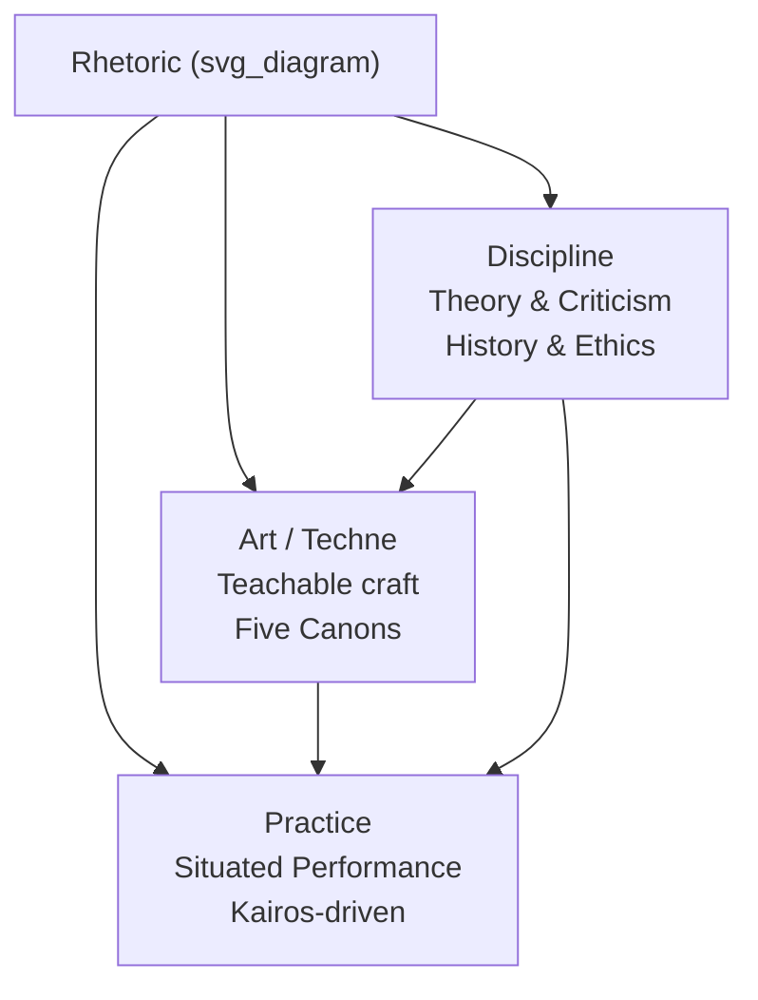

## Defining Rhetoric as Art, Discipline, and Practice

### Overview

Rhetoric occupies a contested definitional space: it is simultaneously an *art* (a productive skill, or *technē*), a *discipline* (a systematized body of academic knowledge), and a *practice* (a lived, applied activity of persuasion in real contexts). Understanding rhetoric requires holding all three dimensions together rather than collapsing them into a single sense. This tripartite framing traces back to classical antiquity and remains the organizing scaffold for how rhetoric is taught, researched, and applied in executive and professional communication today.

### Etymology and Core Definition

The term derives from the Greek *rhētorikē* (ῥητορική), meaning "the art of the orator" (*rhētōr*, "public speaker"). The most influential foundational definition comes from Aristotle, who described rhetoric as **"the faculty of observing in any given case the available means of persuasion."** This definition is significant because it frames rhetoric not as persuasion itself, but as the *capacity to discover* persuasive resources — a subtle but critical distinction that positions rhetoric as an analytical and generative skill rather than mere manipulation.

Other classical definitions inflect the concept differently:

- **Plato** (via the *Gorgias*) treated rhetoric skeptically, calling it a "knack" (*empeiria*) for producing gratification rather than a true art, since it lacked a stable object of knowledge comparable to medicine or justice.
- **Isocrates** framed rhetoric as civic education (*logos*) — the cultivation of practical wisdom and virtuous public speech for the good of the polis.
- **Cicero** and **Quintilian** (Roman tradition) defined the ideal orator as "a good man skilled in speaking" (*vir bonus dicendi peritus*), fusing ethical character with technical skill.
- **Kenneth Burke** (20th century) redefined rhetoric broadly as **"the use of words by human agents to form attitudes or to induce actions in other agents,"** centering identification and symbolic action over classical persuasion alone.

### Rhetoric as Art (Technē)

**Key Points**

- In the Aristotelian sense, *technē* denotes a rule-governed, teachable productive capacity — distinct from raw talent (*physis*) or mere routine (*empeiria*, "knack").
- Rhetoric-as-art implies it can be broken into replicable components: invention, arrangement, style, memory, delivery (the five *canons of rhetoric*).
- Because it is an art, rhetoric is teachable, improvable through deliberate practice, and evaluable against craft standards — not simply an innate gift some people have and others lack.
- Art in this sense does not mean "fine art" or aesthetic decoration; it means applied craft-knowledge, akin to architecture or medicine in the classical taxonomy.

**Example**

An executive learning to structure a quarterly earnings call is engaging rhetoric as art: they are applying teachable techniques (arrangement of good news before bad, calibrated hedging language, anticipatory framing of analyst questions) rather than relying purely on charisma or spontaneous eloquence.

### Rhetoric as Discipline

**Key Points**

- As a discipline, rhetoric is a formalized field of study with its own history, terminology, sub-branches, and scholarly methods — situated within the humanities and communication studies.
- Major disciplinary branches include:
  - **Classical rhetoric** — the study of Greco-Roman theory (Aristotle, Cicero, Quintilian).
  - **Rhetorical criticism** — the analysis of texts and discourses to reveal persuasive strategies and ideological effects.
  - **Composition and rhetoric (Rhet/Comp)** — the pedagogical study of writing instruction, especially in U.S. higher education.
  - **Communication studies / speech communication** — rhetoric's institutional home in many universities, emphasizing public address and argumentation.
  - **Digital and visual rhetoric** — extending rhetorical analysis to multimodal, networked, and algorithmic communication environments.
- Disciplinary rhetoric asks descriptive and critical questions: *How does persuasion work? What are its ethical limits? How has it been historically deployed and by whom?*
- It also generates canonical *rhetorical situation* frameworks (Lloyd Bitzer's exigence–audience–constraints model) used to analyze any communicative event, including executive communication.

**Example**

A business-school elective titled "Rhetoric of Leadership Communication" that examines CEO letters to shareholders using Aristotle's appeals and Burke's theory of identification is treating rhetoric as an academic discipline — an object of systematic study, not merely a skill to deploy.

### Rhetoric as Practice

**Key Points**

- As practice, rhetoric is rhetoric *in action* — the situated, applied performance of persuasive communication in real institutional, political, legal, or organizational contexts.
- Practice-oriented rhetoric is judged by effectiveness and appropriateness within a concrete *kairos* (opportune moment), not by theoretical elegance alone.
- Executive communication is largely rhetoric-as-practice: board presentations, crisis statements, town halls, investor calls, and internal memos are all live rhetorical performances with real stakes, deadlines, and audiences.
- Practice reintegrates the other two dimensions: practitioners draw on the art's teachable techniques and, often implicitly, on disciplinary theory (audience analysis, appeals, framing) to navigate specific situations.

**Example**

A CEO addressing employees during a layoff announcement must, in real time, balance ethos (credibility and empathy), pathos (acknowledging distress), and logos (business rationale) — this is rhetoric as lived practice, where theoretical knowledge is instrumentalized under pressure and time constraints.

### Synthesis: The Three Dimensions as an Integrated Whole

The three senses are not competing definitions but interlocking layers:

| Dimension | Central Question | Orientation | Executive Communication Parallel |
| --- | --- | --- | --- |
| Art (*technē*) | How is persuasion crafted? | Skill-building, technique | Learning frameworks: STAR, Monroe's Motivated Sequence, Pyramid Principle |
| Discipline | What is persuasion, and how should it be studied/critiqued? | Theory, history, ethics | Case-study analysis of famous corporate speeches, ethics of spin |
| Practice | How is persuasion enacted here and now? | Situational performance | Live delivery of a keynote, earnings call, crisis response |

[Inference] Most contemporary rhetoric curricula implicitly sequence instruction to move learners through all three: theory (discipline) informs technique (art), which is then tested and refined through applied performance (practice) — though the exact sequencing varies by program and instructor.

### Diagram: The Three Dimensions of Rhetoric

### Common Misconceptions

- **"Rhetoric is just empty talk or manipulation."** This colloquial, pejorative sense (as in "that's just rhetoric") conflates rhetoric with sophistry — the deceptive misuse of persuasive technique. Classical theorists like Aristotle and Quintilian explicitly distinguished legitimate rhetoric (grounded in available, honest means of persuasion) from sophistic trickery.
- **"Rhetoric is only about speaking."** While *rhētorikē* originally centered oratory, the discipline now encompasses written, visual, digital, and multimodal persuasion.
- **"Rhetoric is a natural talent, not a skill."** The *technē* framing explicitly rejects this — rhetoric is positioned as learnable and systematizable, which is precisely why it can be taught in executive communication curricula.

### Relevance to Executive and Organizational Communication

Understanding this tripartite definition equips professionals to:

- Diagnose *which mode* they are operating in during a given task (are they studying communication theory, practicing a technique, or performing live?).
- Apply disciplinary frameworks (audience analysis, appeals, rhetorical situation) diagnostically before high-stakes practice.
- Approach communication skill-building as a craft with identifiable components (per the art dimension) rather than an immutable personality trait.

### Related Topics / Next Steps

- The Five Canons of Rhetoric (Invention, Arrangement, Style, Memory, Delivery)
- Aristotle's Three Appeals: Ethos, Pathos, Logos
- The Rhetorical Situation (Bitzer) and Rhetorical Constraints
- Sophists vs. Classical Philosophers: The Ancient Debate on Rhetoric's Legitimacy
- Kenneth Burke's Theory of Identification and Dramatism
- Rhetoric vs. Sophistry: Ethical Boundaries in Persuasion
- The Progymnasmata and Classical Rhetorical Education
- Contemporary Branches: Visual Rhetoric, Digital Rhetoric, Organizational Rhetoric