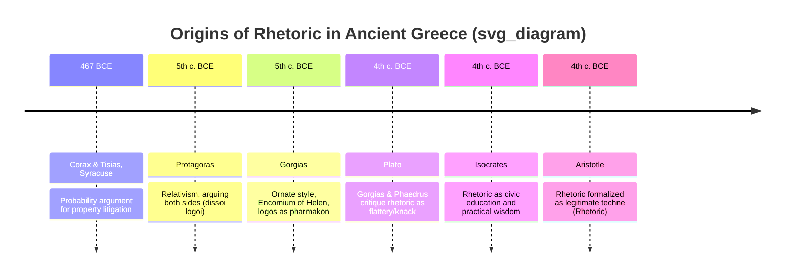

## Origins in Ancient Greece: The Sophists and Early Rhetoric

### Overview

The formal study of rhetoric emerges in 5th-century BCE Greece, closely tied to the political conditions of the Greek city-states — particularly the participatory democracy of Athens and the litigious legal culture of Sicily. Before rhetoric became a philosophical discipline (with Plato and Aristotle), it was first a practical trade taught by itinerant teachers known as the **Sophists**. Their work established the vocabulary, techniques, and controversies that would define rhetorical theory for the next two millennia.

### Historical and Political Context

**Key Points**

- Athenian democracy (5th century BCE) required male citizens to speak for themselves in the **Assembly** (*ekklēsia*), the **law courts** (*dikastēria*), and civic ceremonies — there were no professional lawyers, so persuasive self-advocacy was a practical necessity.
- The overthrow of tyrants in **Syracuse, Sicily** (c. 467 BCE) led to a surge of property litigation, as citizens sought to reclaim confiscated land — creating early demand for teachable argumentative techniques.
- **Corax and Tisias** of Syracuse are traditionally credited (via later, partly legendary accounts) as the earliest systematizers of rhetoric, developing techniques of *probability argument* (arguing from what is likely, not just what is provable) for courtroom use.
- [Inference] Much of what is known about Corax and Tisias comes from later, sometimes contradictory sources, so specific claims about their exact teachings should be treated with historical caution.

### The Sophists: Definition and Role

**Key Points**

- "Sophist" (*sophistēs*) originally meant simply "wise person" or "expert," without pejorative connotation; it acquired negative associations largely through Plato's critical portrayals.
- Sophists were **paid, itinerant teachers** who traveled between Greek city-states offering instruction in rhetoric, argumentation, and general civic education (*paideia*) — often to wealthy young men seeking political advancement.
- Their instruction responded to a real market demand: success in Athenian public life depended on the ability to speak persuasively in the Assembly and courts.
- Sophists were pragmatists rather than metaphysicians: they were less interested in eternal Truth (with a capital T) and more interested in effective, situational argument — a stance that put them in direct philosophical conflict with Socrates and Plato.

### Major Sophist Figures

**Protagoras of Abdera (c. 490–420 BCE)**

- Famous for the maxim **"Man is the measure of all things"** — a relativist position holding that truth and value are contingent on individual or collective perspective rather than fixed universals.
- Reportedly taught the technique of arguing both sides of any question (*dissoi logoi*, "twofold arguments"), training students to construct the strongest possible case for opposing positions — a precursor to modern debate pedagogy and devil's-advocate reasoning.
- Charged fees for instruction, which scandalized critics like Plato who believed wisdom should not be commodified.

**Gorgias of Leontini (c. 483–375 BCE)**

- Known for ornate, rhythmic prose style (*Gorgianic figures*): antithesis, isocolon (parallel clause lengths), and paromoiosis (rhyme-like sound patterning).
- His surviving work *Encomium of Helen* is a foundational rhetorical text: a defense of Helen of Troy arguing she was not morally culpable for the Trojan War because she was overpowered by *logos* (the persuasive power of speech itself), likening speech's effect on the soul to a drug (*pharmakon*) — simultaneously curative and dangerous.
- This text is often read as the earliest surviving example of a formal rhetorical demonstration piece (*epideictic* showpiece).

**Isocrates (436–338 BCE)**

- Though sometimes classified separately from the "first-generation" Sophists, Isocrates ran an influential rhetorical school in Athens that combined ethical civic education with practical rhetorical training.
- Advocated **rhetoric as the highest form of civic education**, believing that eloquence and sound practical judgment (*phronesis*) served the health of the polis — a more constructive, less relativist framing than Protagoras's.

### The Philosophical Backlash: Plato's Critique

**Key Points**

- Plato's dialogues, especially the ***Gorgias*** and ***Phaedrus***, present the classical philosophical attack on Sophistic rhetoric.
- In the *Gorgias*, Socrates argues rhetoric is not a true *technē* (art) but a **"knack" (*empeiria*)** for producing pleasure and flattery (analogous to cookery flattering the body, as opposed to medicine which genuinely heals it) — because it lacks grounding in objective knowledge of justice and the good.
- Plato's core objection: Sophists taught **persuasion without regard to truth**, making the weaker argument appear the stronger (a charge also leveled at Socrates himself in Aristophanes's comedy *The Clouds*, reflecting the era's broader anxiety about rhetorical trickery).
- This Platonic critique cemented the enduring pejorative sense of "sophistry" as **manipulative, truth-indifferent argumentation** — a usage that persists in English today ("sophistical," "sophistry").

### Aristotle's Reconciliation

**Key Points**

- Aristotle's ***Rhetoric*** (4th century BCE) responds to Plato's skepticism by attempting to legitimize rhetoric as a genuine art grounded in systematic principles, not mere flattery.
- Aristotle reframes rhetoric as **the counterpart (*antistrophos*) to dialectic** — a legitimate method for reasoning about probable matters (contingent human affairs) where certain demonstrative knowledge is unavailable.
- He formalizes the **three artistic proofs** (*ethos*, *pathos*, *logos*) and situates rhetoric within a defensible epistemic framework, distinguishing it from sophistic abuse by tying it to genuine civic and ethical purposes.
- This move effectively rescues rhetoric from Plato's condemnation by making it a *technē* like medicine or navigation — teachable, principled, and oriented toward legitimate ends, even though it can be misused.

### Diagram: The Evolution from Sophistic Practice to Philosophical Rhetoric

### Key Terminology

| Term | Greek | Meaning |
| --- | --- | --- |
| Sophist | *sophistēs* | Paid teacher of rhetoric and civic skills |
| Dissoi logoi | δισσοὶ λόγοι | "Twofold arguments" — arguing both sides of an issue |
| Pharmakon | φάρμακον | "Drug/remedy" — Gorgias's metaphor for speech's dual power |
| Kairos | καιρός | The opportune, timely moment for persuasive speech |
| Technē | τέχνη | Teachable, rule-governed craft or art |
| Empeiria | ἐμπειρία | Mere "knack" or experience-based routine, lacking systematic principle |

### Enduring Significance

The Sophist-versus-philosopher controversy established a foundational tension that persists in rhetorical theory: **is persuasive skill ethically neutral (a tool that can serve good or bad ends), or does its practice inherently risk prioritizing effectiveness over truth?** This question directly informs modern debates about spin, framing, and ethical persuasion in executive and political communication — where the line between legitimate advocacy and manipulative "sophistry" remains actively contested.

### Related Topics / Next Steps

- Aristotle's *Rhetoric*: The Three Artistic Proofs (Ethos, Pathos, Logos)
- Plato's *Gorgias* and *Phaedrus*: Philosophical Critiques of Rhetoric
- Isocrates and Rhetorical Education (*Paideia*)
- The *Encomium of Helen*: Gorgias and the Power of Logos
- Roman Rhetoric: Cicero, Quintilian, and the *Vir Bonus* Ideal
- Dissoi Logoi and the Pedagogy of Arguing Both Sides
- Sophistry vs. Ethical Persuasion in Modern Executive Communication