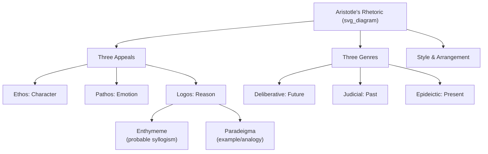

## Aristotle's Rhetoric and Its Influence on Western Thought

### Overview

Aristotle's ***Rhetoric*** (*Technē Rhētorikē*, c. 4th century BCE) is the founding systematic treatise of Western rhetorical theory. Written in response to both the Sophists' pragmatic techniques and Plato's philosophical skepticism toward rhetoric, it establishes rhetoric as a legitimate, teachable art (*technē*) grounded in logic, psychology, and ethics. Its core frameworks — the three appeals, the three genres of oratory, and the theory of the enthymeme — remain the dominant vocabulary for analyzing persuasion, including in contemporary executive and organizational communication.

### Historical Context and Purpose

**Key Points**

- Aristotle studied under Plato at the Academy and was deeply aware of Plato's critique (in the *Gorgias*) that rhetoric was a mere "knack" for flattery rather than a genuine art.
- The *Rhetoric* is Aristotle's attempt to reconcile rhetoric with philosophy: he defines it as **the counterpart (*antistrophos*) to dialectic**, positioning it as a legitimate method of reasoning about probable, contingent matters where certain proof is unavailable.
- The treatise is composed of three books: Book I addresses the sources of proof and the genres of rhetoric; Book II covers emotional appeals and character; Book III addresses style and arrangement.
- [Inference] The exact compilation history of the *Rhetoric* — whether it was a unified treatise or an edited collection of lecture notes — remains a subject of ongoing classical scholarship debate.

### Core Definition

Aristotle defines rhetoric as **"the faculty of observing in any given case the available means of persuasion."** This definition is deliberately neutral and analytical: rhetoric is not persuasion itself, nor is it inherently good or bad — it is the *capacity to identify* what could persuade a given audience in a given situation. This framing detaches rhetoric from any single moral valence, addressing Plato's ethical objections by making rhetoric a diagnostic and generative skill rather than an act of deception.

### The Three Artistic Proofs (Pisteis)

**Key Points**

Aristotle identifies three modes of persuasion available to a speaker, all constructed within the discourse itself (distinct from "inartistic" proofs like witnesses, contracts, or torture-extracted testimony, which exist independently of the speech):

- **Ethos** (character) — Persuasion through the perceived credibility of the speaker, built on three components: *phronesis* (practical wisdom), *arete* (virtue), and *eunoia* (goodwill toward the audience). Critically, Aristotle holds that ethos must be constructed **through the speech itself**, not through prior reputation.
- **Pathos** (emotion) — Persuasion through arousing the appropriate emotional state in the audience; Aristotle analyzes specific emotions (anger, calm, fear, confidence, shame, pity, indignation) in detail in Book II, treating emotional appeal as a legitimate cognitive tool rather than mere manipulation.
- **Logos** (reason) — Persuasion through the argument itself, primarily via the **enthymeme** (rhetorical syllogism) and the **example** (*paradeigma*), the two forms of rhetorical reasoning Aristotle treats as the "body of proof."

**Example**

A CEO's crisis-response statement typically deploys all three: citing the company's track record and personal accountability (ethos), acknowledging stakeholders' anger or fear directly (pathos), and presenting a structured remediation plan with data (logos).

### The Enthymeme and Rhetorical Syllogism

**Key Points**

- The **enthymeme** is Aristotle's central logical tool for rhetoric — a truncated or probabilistic syllogism, typically omitting a premise the audience is expected to supply themselves.
- Because rhetoric deals with contingent, everyday matters rather than scientific certainties, its premises are drawn from **probabilities (*eikota*) and signs (*sēmeia*)** rather than necessary truths.
- The audience's cognitive participation (mentally supplying the missing premise) is theorized to increase persuasive effect, since people find self-generated conclusions more convincing.
- The **example (*paradeigma*)** functions as rhetoric's counterpart to induction — arguing from a specific case or analogy to a general probability.

**Example**

"This vendor has missed three consecutive delivery deadlines, so they will likely miss this one too" is an enthymeme: the unstated general premise ("past performance predicts future performance") is left for the listener to supply.

### The Three Genres of Rhetoric

Aristotle classifies oratory into three types based on the audience's role and time orientation:

| Genre | Greek Term | Audience Role | Time Focus | Central Question |
| --- | --- | --- | --- | --- |
| Deliberative | *symbouleutikon* | Assembly/legislator (judge of future action) | Future | Should we do this? (expedient vs. harmful) |
| Judicial (Forensic) | *dikanikon* | Juror (judge of past action) | Past | Was this just or unjust? |
| Epideictic | *epideiktikon* | Spectator/observer | Present | Is this praiseworthy or blameworthy? |

**Example**

An investor-relations "guidance" call is largely deliberative (arguing for future strategy); a shareholder-lawsuit deposition is judicial (adjudicating past conduct); a company anniversary keynote or eulogy for a retiring executive is epideictic (ceremonial praise/blame).

### Style and Delivery (Book III)

**Key Points**

- Book III addresses **lexis** (style) and **taxis** (arrangement), including clarity, appropriateness, and the strategic use of metaphor — which Aristotle considered the highest mark of rhetorical skill, since it requires perceiving similarity between dissimilar things.
- Aristotle treats **delivery (*hypokrisis*)** as important but somewhat beneath the dignity of serious rhetorical theory, noting its emotional and quasi-theatrical power while framing it as an unfortunate concession to the audience's imperfections rather than the essence of the art.
- Arrangement guidance in Book III anticipates later formalization into canonical speech parts: introduction (*prooimion*), statement of the case (*prothesis*), proof (*pistis*), and conclusion (*epilogos*).

### Diagram: Structure of Aristotle's Rhetorical System

### Influence on Western Thought

**Key Points**

- **Roman rhetoric**: Cicero and Quintilian absorbed and expanded Aristotle's framework into the **five canons of rhetoric** (invention, arrangement, style, memory, delivery), which structured rhetorical education for over a millennium.
- **Medieval and Renaissance rhetoric**: Aristotle's *Rhetoric*, alongside his *Poetics* and *Organon* (logical works), was preserved and transmitted through Arabic scholarship (notably by Averroes) before re-entering European university curricula alongside grammar and logic as one of the **Trivium** arts.
- **Enlightenment and modern argumentation theory**: Aristotle's ethos-pathos-logos triad remains the default framework taught in composition, debate, law, and communication studies worldwide.
- **20th-century rhetorical revival**: Theorists like Chaïm Perelman (*The New Rhetoric*, developing argumentation theory around audience adherence) and Kenneth Burke (dramatism, identification) explicitly build on or react against Aristotelian categories.
- **Contemporary applied fields**: Legal argumentation, political speechwriting, advertising, and executive communication training all implicitly or explicitly structure instruction around Aristotelian appeals, even when the terminology (ethos/pathos/logos) is simplified or renamed.

[Inference] The near-universal persistence of the ethos-pathos-logos framework across so many disparate modern fields suggests it captures something structurally durable about persuasive communication, though this popularity also partly reflects centuries of pedagogical tradition rather than being purely a function of empirical validation.

### Modern Applications in Executive Communication

- **Ethos-building** — Executives establish credibility through demonstrated expertise, consistent messaging, and transparent acknowledgment of stakeholder concerns (mirroring Aristotle's *phronesis*, *arete*, *eunoia* triad).
- **Pathos calibration** — Crisis communications and change-management messaging deliberately modulate emotional register to match audience state (e.g., acknowledging anxiety during layoffs, building confidence during a turnaround narrative).
- **Logos and data-driven argument** — Board presentations and investor decks rely heavily on enthymeme-like compressed logical structures (a data point plus an implied strategic conclusion) rather than exhaustive formal proofs, since audiences fill in familiar business-logic premises.

### Related Topics / Next Steps

- The Five Canons of Rhetoric (Cicero and Quintilian's Expansion)
- Ethos, Pathos, Logos: Applied Frameworks for Executive Messaging
- The Enthymeme vs. Formal Syllogism: Logical Structures in Persuasion
- Deliberative, Judicial, and Epideictic Rhetoric in Corporate Contexts
- Chaïm Perelman and the New Rhetoric: Argumentation Theory
- Kenneth Burke's Dramatism and Identification
- The Trivium: Grammar, Logic, and Rhetoric in Classical Education
- Metaphor and Style in Persuasive Business Communication