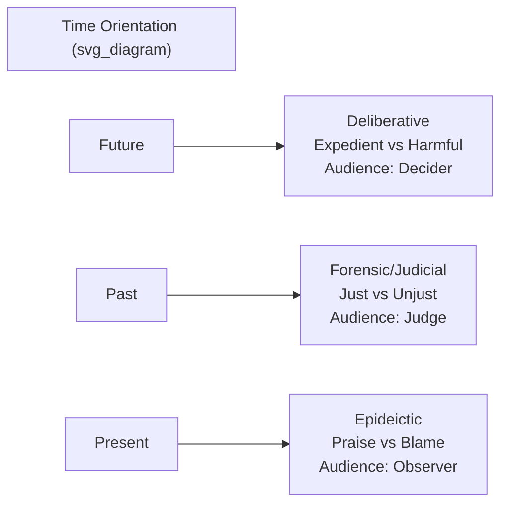

## The Three Genres of Oratory: Deliberative, Forensic, and Epideictic

### Overview

Aristotle's *Rhetoric* classifies all oratory into three genres based on two variables: the **temporal orientation** of the speech (past, present, or future) and the **role of the audience** (judge of past action, judge of future action, or observer/evaluator). This tripartite taxonomy — deliberative, forensic (judicial), and epideictic — remains the foundational classification system for analyzing the purpose and structure of persuasive speech, including in modern executive, legal, and ceremonial communication contexts.

### The Classificatory Logic

**Key Points**

- Aristotle's classification is built on the premise that **the audience determines the genre**, not merely the topic or setting. A speech's genre is defined by what kind of judgment the audience is being asked to render.
- Each genre pairs with a specific time frame, a specific type of audience "judge," and a specific underlying question of value (expediency, justice, or honor).
- The three genres are not always mutually exclusive in practice — a single speech (e.g., a CEO's annual address) may blend genres, but one typically dominates.

| Genre | Time Orientation | Audience Role | Central Value Question | Typical Setting (Classical) |
| --- | --- | --- | --- | --- |
| Deliberative | Future | Judge/decider of future action | Expedient vs. harmful | The Assembly (*ekklēsia*) |
| Forensic (Judicial) | Past | Judge of past action | Just vs. unjust | The law courts (*dikastēria*) |
| Epideictic | Present | Observer/spectator | Honorable vs. shameful (praise/blame) | Ceremonial occasions (funerals, festivals) |

### Deliberative Rhetoric (Symbouleutikon)

**Key Points**

- Concerned with **future action**: the speaker urges an audience to adopt or reject a proposed future course of action.
- Central appeal is to **expediency (*sympheron*)** — whether a proposed action is advantageous or harmful — though justice and honor may be invoked as supporting considerations.
- Classical topics include war and peace, national defense, legislation, and resource allocation — matters decided by a legislative body acting on behalf of collective future interest.
- Aristotle identifies the deliberative speaker's task as arguing from **probability**, since future outcomes cannot be known with certainty, making this genre heavily reliant on enthymemes built on likelihood rather than demonstrative proof.

**Example**

A corporate strategy presentation proposing entry into a new market ("We should acquire Company X because it expands our supply chain resilience and defends against Competitor Y's growth") is deliberative rhetoric: it argues for future action based on anticipated advantage.

### Forensic / Judicial Rhetoric (Dikanikon)

**Key Points**

- Concerned with **past action**: the speaker seeks to establish what did or did not happen, and whether that action was just or unjust.
- Central appeal is to **justice (*dikaion*)** — accusation (*kategoria*) versus defense (*apologia*).
- Classical setting is the law court, where jurors (not professional judges) rendered verdicts based on speeches from litigants (often ghostwritten by professional speechwriters, *logographoi*).
- Aristotle notes forensic rhetoric requires establishing **motive, capability, and circumstance** to argue the probability that an accused party did or did not commit an act.
- Forensic argument structure typically includes narration of facts (*diēgēsis*), proof (*pistis*), and refutation of the opposing account.

**Example**

An internal corporate investigation report presented to a board, arguing that a former executive did or did not violate company policy based on evidence and witness accounts, functions as forensic rhetoric — even outside a literal courtroom.

### Epideictic Rhetoric (Epideiktikon)

**Key Points**

- Concerned with the **present**, evaluating a person, event, or quality as praiseworthy or blameworthy (*to kalon* / honor vs. shame).
- Often called "ceremonial" or "display" oratory; classical examples include funeral orations (*epitaphios logos*, such as Pericles's famous funeral oration recorded by Thucydides), wedding speeches, and festival panegyrics.
- Historically undervalued relative to deliberative and forensic rhetoric because it does not directly produce a decision or verdict — but modern rhetorical theorists (e.g., Chaïm Perelman) have significantly rehabilitated its importance, arguing that epideictic rhetoric **reinforces shared values and communal identity**, making future deliberative and forensic persuasion possible by first establishing common ground.
- Epideictic speech frequently employs amplification (*auxesis*) — heightening the significance of virtues or achievements through comparison and vivid description.

**Example**

A CEO's keynote celebrating a company's anniversary, an internal awards ceremony speech recognizing an employee's achievements, or a eulogy for a departing founder are all epideictic: they render present judgment on character and achievement rather than arguing for future action or adjudicating past wrongdoing.

### Diagram: The Three Genres Mapped by Time and Audience Role

### Comparative Rhetorical Strategies Across Genres

**Key Points**

- **Deliberative** relies heavily on **logos** (cost-benefit projection, probability arguments about future consequences), though ethos (credibility of the proposer) and pathos (fear of harm, hope of gain) also play major roles.
- **Forensic** relies heavily on **establishing facts and motive**, blending logos (evidentiary reasoning) with pathos (appealing to jurors' sense of outrage or sympathy).
- **Epideictic** relies heavily on **pathos and stylistic amplification**, since its purpose is emotional and communal reinforcement of values rather than decision-forcing argument; style (Book III of the *Rhetoric*) plays a proportionally larger role here than in the other genres.

### Modern Applications in Executive and Organizational Communication

| Classical Genre | Modern Executive Parallel |
| --- | --- |
| Deliberative | Strategic planning proposals, investment pitches, policy recommendations, product roadmaps |
| Forensic | Crisis post-mortems, compliance/audit findings, litigation-related statements, root-cause analyses |
| Epideictic | Award ceremonies, company anniversaries, retirement tributes, mission/values speeches, brand storytelling |

[Inference] Because modern organizational communication is rarely confined to a single classical setting, many executive speech acts blend genres — for example, an all-hands address following a crisis often opens epideictically (honoring affected employees), transitions forensically (explaining what happened), and closes deliberatively (outlining future safeguards) — though this blended structure is a practical adaptation rather than something explicitly codified by Aristotle.

### Related Topics / Next Steps

- Aristotle's Three Artistic Proofs (Ethos, Pathos, Logos) Across Genres
- The Enthymeme in Deliberative vs. Forensic Argumentation
- Pericles's Funeral Oration as a Model of Epideictic Rhetoric
- Chaïm Perelman's Rehabilitation of Epideictic Rhetoric in "The New Rhetoric"
- Structuring Crisis Communication Using Forensic Rhetorical Principles
- The Five Canons of Rhetoric Applied Across the Three Genres
- Speechwriting for Ceremonial Occasions (Epideictic Techniques for Executives)