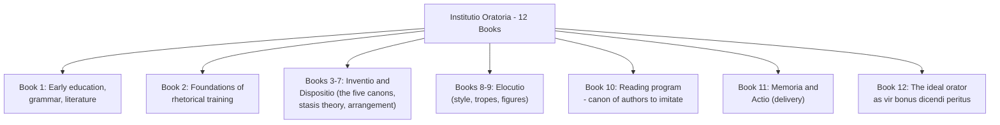

## Roman Rhetoric: Cicero and Quintilian

### Historical Context

**Key Points**

- Roman rhetoric developed as an adaptation of Greek rhetorical theory (particularly Aristotelian and Hellenistic traditions) to the practical demands of Roman political, legal, and educational life.
- The Roman Republic's court system and Senate created constant demand for skilled oratory, making rhetorical training a core component of elite education.
- Two figures dominate the study of Roman rhetoric: Marcus Tullius Cicero (106–43 BCE), the preeminent orator-statesman, and Marcus Fabius Quintilianus (c. 35–100 CE), the systematizer of rhetorical pedagogy under the early Empire.
- The shift from Cicero's Republican context to Quintilian's Imperial context reflects a broader shift in rhetoric's function — from a tool of live political persuasion to a discipline of formal education and display oratory (epideictic).

---

### Cicero: Life and Rhetorical Corpus

Cicero was a practicing advocate, consul (63 BCE), and philosopher who wrote extensively on rhetorical theory alongside his courtroom and senatorial speeches. His theoretical works span roughly four decades and show an evolving view of oratory's relationship to philosophy and civic virtue.

#### Major Theoretical Works

**De Inventione** (c. 91–88 BCE)

- An early, incomplete treatise written in Cicero's youth, focused narrowly on *inventio* (invention/discovery of arguments).
- Heavily indebted to Hellenistic rhetorical handbooks and the pseudo-Ciceronian *Rhetorica ad Herennium* (once misattributed to Cicero, now considered by a separate unknown author of the same period).
- Cicero later distanced himself from this work as immature.

**De Oratore** (55 BCE)

- Cicero's mature masterwork, structured as a dialogue set in 91 BCE among leading orators (Crassus and Antonius as principal speakers).
- Argues that the ideal orator must possess broad knowledge across philosophy, law, history, and ethics — not merely technical rhetorical skill.
- Rejects the narrow technical (Hellenistic handbook) approach in favor of an orator who is also a wise statesman.
- Introduces the concept that eloquence divorced from wisdom is dangerous, while wisdom without eloquence is powerless in civic life.

**Brutus** (46 BCE)

- A historical survey of Roman oratory presented as a dialogue, tracing the development of Roman eloquence through profiles of individual orators.
- Functions as both literary history and a defense of Cicero's own "Attic" versus "Asianic" stylistic choices (see Style Controversy below).

**Orator** (46 BCE)

- A companion piece to *Brutus*, describing the ideal orator's style.
- Introduces the three functions of the orator: *docere* (to teach/prove), *delectare* (to please/charm), and *movere* (to move/persuade emotionally) — later foundational to Western rhetorical theory.
- Discusses prose rhythm (*numerus*) and the tailoring of style to subject matter (the germ of the "three styles" doctrine — plain, middle, grand).

**Topica** (44 BCE)

- A treatment of topical invention adapted loosely from Aristotle's *Topics*, written as a practical guide for a friend, Trebatius.

#### Cicero's Five Canons of Rhetoric

Cicero systematized (though did not originate) the five-part division of the rhetorical process, which became the standard framework for the entire Western tradition:

1. **Inventio** (Invention) — discovering valid or seemingly valid arguments to render one's case plausible
2. **Dispositio** (Arrangement) — organizing arguments for maximum effect
3. **Elocutio** (Style) — fitting appropriate words and figures to the invented matter
4. **Memoria** (Memory) — mastering the material and often employing mnemonic techniques
5. **Actio/Pronuntiatio** (Delivery) — controlling voice and gesture

**Example**

In *De Oratore* Book III, Cicero has the character Crassus argue that *elocutio* is not mere ornamentation but the means by which thought becomes persuasive — style and substance are treated as inseparable rather than as decoration applied afterward.

#### The Attic–Asianic Style Controversy

- **Asianism**: an ornate, rhythmically elaborate, emotionally charged style associated with Hellenistic Asia Minor rhetoric; critics viewed it as excessive and bombastic.
- **Atticism**: a self-styled "purer," plainer style modeled on classical Attic (Athenian) orators like Lysias, championed by some of Cicero's Roman contemporaries (notably Licinius Calvus) as a corrective to perceived Asianic excess.
- Cicero, in *Brutus* and *Orator*, positioned his own style as a synthesis — capable of the plain style but also employing the "grand" style when the occasion (*kairos*-like judgment) demanded it. He argued that Atticism, narrowly conceived, unduly restricted the orator's range.
- [Inference] This debate is often read by modern scholars as also a political and generational contest over what counted as authentically "Roman" oratorical values versus Hellenized excess, though ancient sources frame it primarily in stylistic terms.

#### Cicero's Oratorical Practice

Cicero's surviving speeches (over 50) illustrate his theory in action across genres:

- **Judicial oratory**: *Pro Archia*, *Pro Caelio*, *Pro Milone* — defense speeches showcasing character-based appeal (*ethos*) and narrative construction
- **Deliberative oratory**: *Philippics* (against Mark Antony) — political speeches urging Senate action, delivered at great personal risk and ultimately leading to his proscription and death
- **Invective/prosecutorial oratory**: *In Verrem* (against Verres) — a prosecution built on accumulated documentary evidence and moral outrage

---

### Quintilian: Life and the *Institutio Oratoria*

Quintilian, a Spanish-born rhetorician, held the first state-funded chair of rhetoric in Rome under Vespasian and later tutored the grand-nephews of Domitian. His single surviving major work, the *Institutio Oratoria* (*The Orator's Education*, c. 95 CE), is the most complete rhetorical-pedagogical treatise to survive from antiquity — twelve books covering the entire formation of an orator from infancy to retirement.

#### Structure of the *Institutio Oratoria*

#### Core Doctrine: *Vir Bonus Dicendi Peritus*

- Quintilian's defining thesis, inherited from Cato the Elder's phrase, is that the true orator must be **"a good man skilled in speaking"** (*vir bonus dicendi peritus*).
- This is a stronger ethical claim than Cicero's ideal orator-statesman: Quintilian argues that rhetorical skill in the service of a bad person is not, properly speaking, oratory at all — moral character is a *necessary condition* of genuine eloquence, not merely a desirable trait.
- Book 12 develops this into a full argument that the orator's ethical formation must precede and undergird technical training.

**Key Points**

- Quintilian treats education as holistic and developmental — beginning with the selection of a child's nurse and early tutors (Book 1), on the premise that habits and speech patterns formed young are difficult to correct later.
- He advocates for **public schooling over private tutoring**, arguing that a child benefits from the competitive stimulation and social exposure of learning alongside peers.
- He opposes corporal punishment in education, a notably progressive position for the period, arguing it teaches submission to force rather than genuine discipline.

#### Stasis Theory and Invention (Books 3–7)

Quintilian systematically works through **status/stasis theory** — the method of determining the fundamental question at issue in a case — inherited from Hermagoras of Temnos and the Latin rhetorical tradition (including *Rhetorica ad Herennium* and Cicero's *De Inventione*):

- **Conjectural stasis**: Did the act occur? (question of fact)
- **Definitional stasis**: How should the act be defined/classified?
- **Qualitative stasis**: Was the act justified, and under what circumstances?
- **Translative stasis**: Is this the correct forum/procedure for the case?

**Example**

In a homicide case, conjectural stasis asks whether the defendant killed the victim at all; definitional stasis asks whether the killing constitutes murder or manslaughter; qualitative stasis asks whether it was committed in justified self-defense.

#### Style and the Canon of Authors (Books 8–10)

- Books 8–9 provide the most detailed ancient taxonomy of rhetorical **tropes** (metaphor, metonymy, synecdoche, irony) and **figures** (of speech and of thought) surviving from antiquity, building on and refining earlier Latin treatments such as the *Rhetorica ad Herennium*.
- Book 10 offers a canonical reading list of Greek and Latin authors recommended for the orator-in-training to imitate, organized by genre (epic, tragedy, comedy, history, oratory, philosophy) — this book is also a major source for later reception and ranking of classical authors, including Quintilian's famous assessment of Cicero as the preeminent Latin prose stylist.

#### Delivery and Memory (Book 11)

- Quintilian systematizes *actio* (delivery) in more technical detail than Cicero, addressing voice modulation, gesture, posture, and even appropriate dress for the orator.
- His treatment of *memoria* draws on and extends the Roman "method of loci" (memory palace) technique described earlier in the *Rhetorica ad Herennium*.

---

### Comparative Analysis: Cicero vs. Quintilian

| Dimension | Cicero | Quintilian |
| --- | --- | --- |
| **Era/Context** | Late Republic — active political and legal practice | Early Empire — formal pedagogy, reduced scope for free political oratory |
| **Primary Mode** | Practicing orator theorizing from experience | Professional teacher systematizing a discipline |
| **Ideal Orator** | Broadly learned statesman-philosopher | Ethically formed "good man skilled in speaking" |
| **Key Works** | *De Oratore*, *Brutus*, *Orator* | *Institutio Oratoria* (single comprehensive work) |
| **Treatment of Ethics** | Wisdom and eloquence should be united | Moral goodness is a *constitutive* requirement of true oratory |
| **Pedagogical Scope** | Focused on the mature orator's formation | Cradle-to-retirement developmental curriculum |
| **Stylistic Position** | Synthesizer defending range against Atticist critics | Systematizer of style via tropes/figures taxonomy and canon of models |

[Inference] Quintilian's more rigid ethical requirement can be read as partly a response to changed political conditions: under imperial rule, with the Senate's deliberative function diminished, rhetoric's civic justification shifted from political efficacy toward moral and educational formation — though Quintilian frames this as timeless doctrine rather than an adaptation to his era.

---

### The Five Canons: Visual Overview

<svg xmlns="http://www.w3.org/2000/svg" viewBox="0 0 720 320" font-family="Georgia, serif">
<text x="360" y="30" text-anchor="middle" font-size="18" font-weight="bold" fill="#2b2b2b">The Five Canons of Rhetoric (svg_diagram)</text>
<g>
<circle cx="90" cy="150" r="60" fill="#8c1c13" opacity="0.85" />
<text x="90" y="145" text-anchor="middle" font-size="13" fill="#fff" font-weight="bold">Inventio</text>
<text x="90" y="163" text-anchor="middle" font-size="10" fill="#fff">Invention</text>
</g>
<g>
<circle cx="230" cy="150" r="60" fill="#b5651d" opacity="0.85" />
<text x="230" y="145" text-anchor="middle" font-size="13" fill="#fff" font-weight="bold">Dispositio</text>
<text x="230" y="163" text-anchor="middle" font-size="10" fill="#fff">Arrangement</text>
</g>
<g>
<circle cx="370" cy="150" r="60" fill="#4a6741" opacity="0.85" />
<text x="370" y="145" text-anchor="middle" font-size="13" fill="#fff" font-weight="bold">Elocutio</text>
<text x="370" y="163" text-anchor="middle" font-size="10" fill="#fff">Style</text>
</g>
<g>
<circle cx="510" cy="150" r="60" fill="#2f5061" opacity="0.85" />
<text x="510" y="145" text-anchor="middle" font-size="13" fill="#fff" font-weight="bold">Memoria</text>
<text x="510" y="163" text-anchor="middle" font-size="10" fill="#fff">Memory</text>
</g>
<g>
<circle cx="630" cy="150" r="60" fill="#5b3a5e" opacity="0.85" />
<text x="630" y="145" text-anchor="middle" font-size="12" fill="#fff" font-weight="bold">Actio</text>
<text x="630" y="163" text-anchor="middle" font-size="10" fill="#fff">Delivery</text>
</g>
<line x1="150" y1="150" x2="170" y2="150" stroke="#333" stroke-width="2" marker-end="url(#arrow)" />
<line x1="290" y1="150" x2="310" y2="150" stroke="#333" stroke-width="2" marker-end="url(#arrow)" />
<line x1="430" y1="150" x2="450" y2="150" stroke="#333" stroke-width="2" marker-end="url(#arrow)" />
<line x1="570" y1="150" x2="590" y2="150" stroke="#333" stroke-width="2" marker-end="url(#arrow)" />
<text x="90" y="230" text-anchor="middle" font-size="10" fill="#444">Finding arguments</text>

<text x="230" y="230" text-anchor="middle" font-size="10" fill="#444">Ordering the case</text>

<text x="370" y="230" text-anchor="middle" font-size="10" fill="#444">Words and figures</text>

<text x="510" y="230" text-anchor="middle" font-size="10" fill="#444">Mastering material</text>

<text x="630" y="230" text-anchor="middle" font-size="10" fill="#444">Voice and gesture</text>

<text x="360" y="280" text-anchor="middle" font-size="11" fill="#666" font-style="italic">Systematized by Cicero (De Inventione, De Oratore); expanded pedagogically by Quintilian (Institutio Oratoria)</text>

</svg>

---

### Legacy and Influence

- Cicero's works, especially *De Oratore*, shaped Renaissance humanist education (via figures like Petrarch, who rediscovered Cicero's letters) and remained the primary Latin prose style model into the early modern period.
- Quintilian's *Institutio Oratoria* was largely lost in complete form during the medieval period and rediscovered intact by Poggio Bracciolini in 1416 at the monastery of St. Gall — a landmark event in Renaissance humanism that restored the full pedagogical program to circulation.
- Both authors' five-canon framework and *ethos-pathos-logos*-adjacent triad (via Cicero's *docere/delectare/movere*) remain foundational vocabulary in modern composition studies, legal rhetoric, and executive communication training.
- [Unverified] The specific claim that Quintilian's chair of rhetoric was the *first* state-salaried position of its kind is the standard scholarly characterization but rests on limited surviving administrative records from the Flavian period.

---

**Next Steps**

- Hellenistic Rhetoric and the *Rhetorica ad Herennium* (bridge between Greek theory and Roman practice)
- Stasis Theory in depth (Hermagoras of Temnos and forensic argumentation)
- The Second Sophistic and epideictic oratory under the Empire
- Renaissance Reception of Classical Rhetoric (Petrarch, Erasmus, Poggio Bracciolini)
- Ethos, Pathos, Logos: Aristotelian Foundations (comparative grounding for Cicero's *docere/delectare/movere*)
- Rhetorical Figures and Tropes: A Working Taxonomy (expansion of Quintilian Books 8–9)
- Ancient Memory Techniques: The Method of Loci