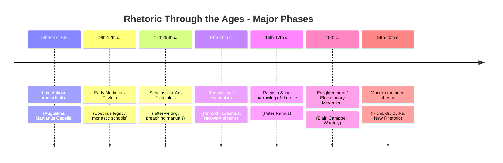
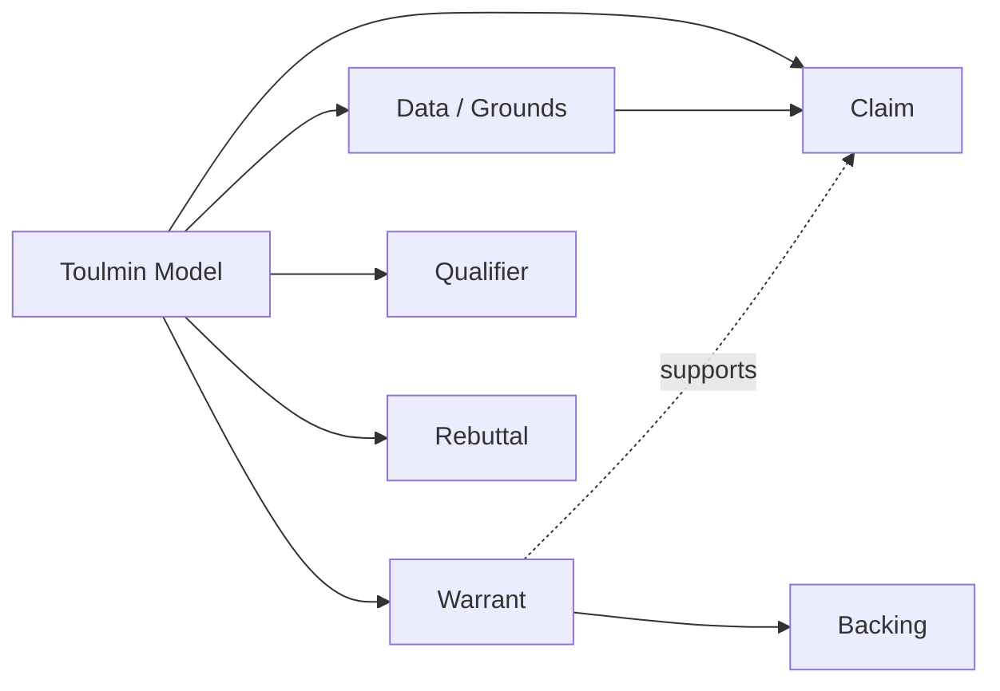

## Rhetoric Through the Middle Ages, Renaissance, and Modern Era

### Overview and Periodization

**Key Points**

- This period spans roughly 1,500 years, from the fragmentation of classical rhetorical education after the fall of the Western Roman Empire (5th century CE) through the emergence of modern rhetorical theory (19th–20th century).
- Rhetoric's institutional role shifts repeatedly: from a civic-oratorical art in antiquity, to a component of clerical and scholastic education in the Middle Ages, to a humanist literary discipline in the Renaissance, to a contested and marginalized field in the Enlightenment and beyond.
- Throughout, rhetoric is persistently reshaped by its relationship to three rival or complementary disciplines: **grammar** (language correctness), **logic/dialectic** (formal reasoning), and later **philosophy of science** and **composition studies**.

---

### The Medieval Period (c. 400–1400 CE)

#### The Trivium and Institutional Context

- Classical rhetoric survived the collapse of Roman civic institutions primarily by being absorbed into the **trivium** — the three-part liberal arts curriculum of grammar, rhetoric, and dialectic (logic) — alongside the quadrivium (arithmetic, geometry, music, astronomy).
- With the disappearance of the law courts and popular assemblies that gave classical oratory its purpose, rhetoric in the Middle Ages lost much of its original deliberative and forensic application and was redirected toward **written composition**, **preaching**, and **letter-writing**.

#### Key Figures and Texts

**Augustine of Hippo (354–430 CE)**

- *De Doctrina Christiana* (On Christian Doctrine, completed 426 CE) is the pivotal text bridging classical rhetoric and Christian pedagogy.
- Augustine, himself trained as a professional rhetorician before his conversion, argues that rhetorical skill is a morally neutral tool that Christian preachers should not abandon merely because pagan orators used it — knowledge and eloquence, in his framing, should serve scriptural truth.
- Book IV of *De Doctrina Christiana* explicitly adapts Cicero's three styles (plain, middle, grand) to the purposes of Christian teaching, delighting, and persuading.

**Boethius (c. 477–524 CE)**

- Translated and commented on Aristotelian logical works, helping preserve dialectical theory for the medieval West; his work anchored logic's growing dominance over rhetoric in scholastic education.

**Martianus Capella (5th century CE)**

- *De Nuptiis Philologiae et Mercurii* (The Marriage of Philology and Mercury) allegorized the seven liberal arts, including Rhetoria as a personified figure, and served as a standard encyclopedic textbook for centuries.

**Cassiodorus and Isidore of Seville (6th–7th c. CE)**

- Preserved and transmitted condensed handbook versions of classical rhetorical doctrine (drawing on Cicero) through monastic educational compilations, notably Isidore's *Etymologiae*.

#### Medieval Rhetorical Genres (Specialized "Artes")

Medieval rhetoric fragmented into specialized practical manuals (*artes*) rather than remaining a unified civic art:

| Genre | Focus | Approx. Period |
| --- | --- | --- |
| **Ars Praedicandi** | The art of preaching/sermon composition | 12th–15th c. |
| **Ars Dictaminis** | The art of letter-writing (formal correspondence, often for administrative/legal use) | 11th–14th c., centered in Bologna |
| **Ars Poetriae** | The art of poetic composition | 12th–13th c. |

**Example**

The *ars dictaminis* tradition, formalized at Bologna, prescribed a rigid five-part letter structure (*salutatio*, *exordium*, *narratio*, *petitio*, *conclusio*) mirroring classical oratorical arrangement but applied to administrative and diplomatic correspondence rather than live speech.

- [Inference] The dominance of these specialized *artes* over general oratorical training reflects the medieval Church's and universities' institutional needs (preaching, correspondence, legal documentation) rather than a civic assembly's need for live deliberative speech, which had largely disappeared as a political institution.

---

### The Renaissance (c. 1350–1600)

#### Humanism and the Recovery of Classical Texts

- Renaissance humanism was substantially driven by the **rediscovery of complete classical rhetorical texts** that had been lost, fragmentary, or inaccessible in the Middle Ages.
- **Petrarch (1304–1374)** is often credited as an early catalyst, discovering a manuscript of Cicero's letters (*Epistulae ad Atticum*) in 1345, which reframed Cicero as a personal, historically situated human figure rather than a purely doctrinal authority.
- **Poggio Bracciolini's** 1416 discovery of a complete manuscript of Quintilian's *Institutio Oratoria* at the monastery of St. Gall restored a text previously known only in fragmentary or corrupted form, reintroducing its full developmental pedagogy to European education.
- Humanist educators (notably Guarino da Verona and Vittorino da Feltre in Italy) built curricula directly on the recovered Ciceronian and Quintilianic model, emphasizing eloquence, classical Latin style, and the union of wisdom and eloquence as civic and moral goods.

#### Erasmus and Northern Humanism

- **Desiderius Erasmus (c. 1466–1536)**, working from the Northern European humanist tradition, produced influential rhetorical-pedagogical works including *De Copia* (On Copiousness, 1512), a manual teaching students to generate stylistic variety and abundance of expression — reflecting Renaissance rhetoric's strong emphasis on *elocutio* (style) as a marker of learned skill.
- Erasmus's approach exemplifies the period's characteristic blending of rhetoric with Christian humanist moral formation, echoing (and citing) Quintilian's *vir bonus* ideal.

#### Peter Ramus and the Narrowing of Rhetoric

- **Peter Ramus (Pierre de la Ramée, 1515–1572)** produced arguably the most consequential — and, for rhetoric, damaging — reorganization of the trivium in this period.
- Ramus reassigned **invention** and **arrangement** (the first two of the five classical canons) to the discipline of **logic/dialectic**, leaving rhetoric responsible only for **style (elocutio)** and **delivery (actio)**.
- This "Ramist" division had long-lasting institutional consequences: it reduced rhetoric's scope in much of subsequent Protestant European education (especially in England and colonial North America) to matters of ornamentation and figures of speech, detached from the reasoning process itself.
- [Inference] Many historians of rhetoric treat the Ramist split as a root cause of rhetoric's later reputation — persisting into modern colloquial usage — as mere "flowery language" or manipulative ornament, disconnected from substantive argument, in contrast to the earlier Ciceronian/Quintilianic view that invention and reasoning were rhetoric's proper core.

---

### The Early Modern and Enlightenment Period (c. 1600–1800)

#### The Elocutionary Movement

- 18th-century Britain saw a distinct **elocutionary movement** focused heavily on the canon of *delivery* — voice, pronunciation, gesture — as a standalone teachable skill, partly independent of content or argument.
- Figures such as Thomas Sheridan and John Walker produced popular manuals on pronunciation and elocution aimed at both public speakers and social self-improvement, reflecting rhetoric's diffusion into genteel education and elocution as performance training.

#### The "New Rhetoric" of the Scottish Enlightenment

Three figures substantially reoriented rhetorical theory toward the emerging fields of psychology, epistemology, and belletristic (literary/aesthetic) criticism:

**George Campbell (1719–1796)**

- *The Philosophy of Rhetoric* (1776) grounded rhetoric in an empiricist theory of mind, defining the ends of speech as enlightening the understanding, pleasing the imagination, moving the passions, and influencing the will — an explicit reworking of Ciceronian ends through the lens of contemporary faculty psychology.

**Hugh Blair (1718–1800)**

- *Lectures on Rhetoric and Belles Lettres* (1783) merged rhetorical instruction with literary criticism and taste, becoming one of the most widely used rhetoric textbooks in Britain and America well into the 19th century.

**Richard Whately (1787–1863)**

- *Elements of Rhetoric* (1828) refocused rhetorical theory on **argumentation** specifically, treating rhetoric as "the art of persuasive argument," and gave sustained attention to the *presumption* and *burden of proof* — concepts still central to modern argumentation theory and legal reasoning.

---

### The Modern Era (19th–20th century)

#### Rhetoric's Institutional Decline and Revival

- Through the 19th century, rhetoric was increasingly marginalized in university curricula relative to philology, literature, and the emerging social sciences; the elocutionary tradition's narrow focus on delivery contributed to its diminished academic prestige.
- The 20th century saw a substantial theoretical **revival**, often termed the "New Rhetoric," which reconnected rhetoric to broader questions of epistemology, ethics, and social meaning.

#### I.A. Richards (1893–1979)

- *The Philosophy of Rhetoric* (1936) reframed rhetoric as fundamentally concerned with **misunderstanding and its remedies** — the study of how words work (and fail to work) in discourse.
- Introduced influential distinctions in metaphor theory (tenor/vehicle) that remain standard in literary and rhetorical analysis.

#### Kenneth Burke (1897–1993)

- Developed **dramatism**, a theory treating human communication and motivation through the lens of drama, using the **pentad** (Act, Scene, Agent, Agency, Purpose) as an analytical framework for understanding rhetorical motive.
- Introduced the concept of **identification** as rhetoric's central mechanism — persuasion works by establishing shared substance/identity between speaker and audience, extending (and in some ways superseding) the classical emphasis on proof and argument alone.

#### Chaim Perelman and Lucie Olbrechts-Tyteca

- *The New Rhetoric: A Treatise on Argumentation* (1958, French; English translation 1969) revived rhetoric as a serious philosophical concern by analyzing how arguments achieve adherence from an audience, introducing the influential concept of the **"universal audience"** as a normative check on argumentative reasoning.

#### Stephen Toulmin

- *The Uses of Argument* (1958) proposed a practical model of argument structure — **claim, data, warrant, backing, qualifier, rebuttal** — widely adopted in composition studies, debate training, and applied argumentation analysis, including modern executive and legal communication contexts.

**Example**

Applied to executive communication: a claim ("We should enter the Southeast Asian market") is supported by data (market growth figures), justified by a warrant (growth trends predict sustainable demand), reinforced by backing (analogous successful past expansions), qualified ("likely," "under current conditions"), and anticipates rebuttal (regulatory risk, currency volatility) — a structure directly traceable to this modern rhetorical model.

---

### Comparative Summary Across Periods

| Period | Rhetoric's Primary Domain | Dominant Genre/Focus | Relationship to Logic |
| --- | --- | --- | --- |
| **Classical (Greek/Roman)** | Civic oratory (courts, assemblies) | Deliberative, forensic, epideictic speech | Rhetoric and dialectic distinct but both taught |
| **Medieval** | Religious and administrative writing | Preaching (*ars praedicandi*), letters (*ars dictaminis*) | Subordinated to theology; logic gains ground via Boethius/scholasticism |
| **Renaissance** | Humanist education, style, eloquence | Ciceronian imitation, *copia*, moral-civic formation | Ramus severs invention/arrangement from rhetoric |
| **Enlightenment** | Public speaking performance, aesthetics | Elocution, belles lettres, faculty psychology | Whately reconnects rhetoric to formal argumentation |
| **Modern** | Communication theory, composition, social meaning | Symbolic action, argumentation models, audience theory | Rhetoric reabsorbs reasoning (Perelman, Toulmin) as core concern |

[Unverified] Precise dating boundaries between these periods vary across scholarly sources; the transitions were gradual and regionally uneven (e.g., Ramist influence persisted much longer in England and New England than in continental Catholic Europe).

---

**Related Topics**

- *Ars Praedicandi* and Medieval Preaching Theory
- Ramism and the Trivium's Fragmentation
- Erasmus's *De Copia* and Renaissance Style Theory
- The Scottish Enlightenment and Faculty Psychology in Rhetoric
- Kenneth Burke's Dramatism and the Pentad
- The Toulmin Model in Modern Argumentation and Executive Communication
- Perelman's "New Rhetoric" and the Universal Audience