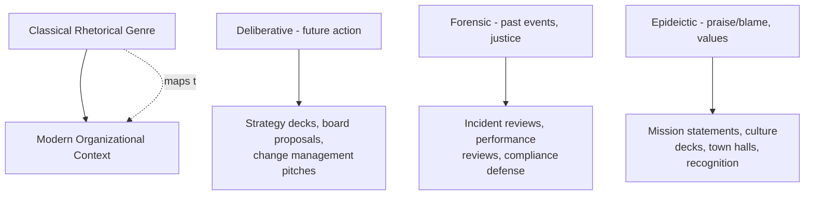

## Rhetoric's Role in Democratic and Organizational Life

### Overview

**Key Points**

- Rhetoric's original justification in the classical world was fundamentally civic: Athenian democracy and the Roman Republic both required citizens to persuade assemblies, juries, and senates through speech rather than force or unilateral decree.
- This civic function did not disappear with antiquity — it re-emerges structurally in any institution (democratic government, courts, corporations, nonprofits) where decisions require the consent, buy-in, or persuasion of a group rather than pure command authority.
- Modern organizational life — corporate leadership, internal communications, stakeholder management — inherits and adapts classical rhetorical structures (deliberative, forensic, epideictic) even where practitioners do not use classical terminology.
- A central tension runs through this history: rhetoric as a **tool of legitimate collective reasoning** (Aristotle's, Cicero's, Quintilian's framing) versus rhetoric as a **tool of manipulation** (the Platonic and popular pejorative view). This tension is directly relevant to executive communication ethics.

---

### Classical Democratic Foundations

#### Athenian Democracy and the Three Genres of Oratory

Aristotle's *Rhetoric* classified oratory according to the **institutional setting** and **temporal orientation** of the audience's decision — a framework still directly mappable onto modern organizational contexts:

| Genre | Setting (Classical) | Time Orientation | Question Addressed | Modern Organizational Analogue |
| --- | --- | --- | --- | --- |
| **Deliberative** | Assembly (*ekklesia*) | Future | What should we do? | Strategy proposals, board decisions, policy memos |
| **Forensic/Judicial** | Courts | Past | What happened; was it just? | Internal investigations, compliance hearings, incident post-mortems |
| **Epideictic** | Ceremonial occasions | Present | Praise or blame; values affirmed | All-hands addresses, award ceremonies, mission statements, eulogies |

**Example**

A CEO's quarterly all-hands address blending congratulations on past performance (epideictic praise) with a forward-looking strategic pivot (deliberative argument) is structurally the same rhetorical hybrid Athenian orators used when praising past civic achievements to build ethos before proposing future policy.

#### Why Athenian Democracy Required Rhetoric

- Direct democracy in Athens placed policy decisions before a mass assembly of citizens (not elected representatives), meaning persuasive public speech was not a supplementary skill but the **primary mechanism of governance itself**.
- The rise of the Sophists as paid rhetoric teachers reflects this institutional demand: political and legal success depended directly on speaking ability, creating market demand for rhetorical education (see Protagoras, Gorgias).
- Plato's critique in the *Gorgias* — that rhetoric is a mere "knack" for producing pleasure/persuasion without concern for truth, comparable to flattery — represents the foundational skeptical position toward rhetoric that recurs throughout its history, including in modern distrust of "spin" or "corporate messaging."
- Aristotle's *Rhetoric* is substantially a response to Plato, reclaiming rhetoric as a legitimate counterpart to dialectic — a means of reasoning with audiences (including non-expert ones) using *available means of persuasion* (ethos, pathos, logos) appropriate to matters of probability rather than certainty.

#### Roman Republican Adaptation

- Roman deliberative oratory operated in the **Senate** (advisory body, restricted membership) and, for legislation, before popular assemblies — a hybrid of elite deliberation and mass persuasion distinct from Athenian direct democracy.
- Roman forensic oratory operated in a highly developed court system that rewarded skilled advocacy (see Cicero's legal career), formalizing many argumentative techniques still used in modern litigation and internal corporate dispute resolution.
- The transition from Republic to Empire (following Augustus's consolidation of power, 27 BCE) sharply curtailed the practical stakes of deliberative oratory — a shift Tacitus and others lamented as the decline of "true" eloquence, since imperial rule reduced the Senate's genuine decision-making power. [Inference] This ancient debate about whether rhetoric declines when political stakes are removed is directly analogous to modern discussions of whether corporate rhetoric becomes hollow ("corporate speak") in highly centralized, low-accountability organizational cultures.

---

### Rhetoric in Modern Democratic Institutions

#### Legislative and Deliberative Bodies

- Modern parliamentary and congressional debate directly continues the deliberative genre: proposals are argued on grounds of future benefit/harm, using evidence, precedent, and value appeals.
- Formal debate procedures (points of order, motions, structured rebuttal time) function as institutionalized versions of classical rhetorical arrangement (*dispositio*) applied to group decision-making.

#### Judicial Rhetoric

- Modern legal argumentation (opening statements, closing arguments, appellate briefs) directly inherits forensic oratory's structure, including stasis theory's questions (did it happen; how should it be classified; was it justified; is this the right forum) as taught in Quintilian's *Institutio Oratoria*.
- Legal rhetoric remains one of the most direct institutional survivals of classical rhetorical training, with modern legal writing/oral advocacy courses often explicitly teaching classical argumentative structure.

#### Political Campaign Rhetoric

- Electoral campaigns combine all three genres: epideictic (candidate biography, values framing), deliberative (policy proposals), and forensic (attacking or defending records) — often within a single speech.
- [Unverified] Claims about the specific persuasive effectiveness of particular rhetorical techniques in contemporary political campaigns (e.g., precise impact of specific framing choices on voter behavior) are contested in political communication research and vary significantly by study design and context.

---

### Rhetoric in Organizational and Corporate Life

#### The Structural Parallel

Organizations — corporations, nonprofits, government agencies — face the same fundamental rhetorical problem ancient assemblies faced: **decisions and actions require the willing cooperation of people who are not compelled by force**, and persuasion (rather than pure authority) is often the actual mechanism by which cooperation is secured, even within hierarchical structures.

#### Executive Communication as Applied Deliberative Rhetoric

- Executive communication (board presentations, strategy memos, investor pitches) is structurally deliberative rhetoric: it argues for future action based on projected consequences, weighed against alternatives, using evidence (data, market analysis) and appeals to shared organizational values (ethos-based credibility of the speaker and pathos-based appeal to stakeholder interests).
- **Ethos** in organizational contexts is frequently built through demonstrated competence (track record, credentials) and perceived alignment with organizational/stakeholder interests — directly continuing Aristotle's tripartite division of ethos into *phronesis* (practical wisdom), *arete* (virtue), and *eunoia* (goodwill toward the audience).
- **Logos** in executive contexts typically manifests as data-driven argumentation, financial modeling, and market analysis — the modern analogue to classical *enthymeme*-based reasoning from generally accepted premises.
- **Pathos** appears in organizational rhetoric as appeals to shared mission, competitive fear/urgency, or aspiration — used carefully, since perceived manipulation via unsupported emotional appeal damages long-term ethos (a risk classical rhetoricians, particularly Quintilian, explicitly warned against).

#### Internal Communications and Change Management

- Organizational change initiatives function rhetorically as deliberative campaigns requiring sustained persuasion across multiple audiences (executives, middle management, frontline employees), each of which may weigh ethos, logos, and pathos differently.
- **Example**: A restructuring announcement typically layers epideictic framing (affirming the organization's core values as unchanged) with deliberative argument (why restructuring serves future goals) and implicit forensic justification (why current structure is inadequate) — a hybrid genre structure directly descended from classical practice.

#### Crisis Communication as Forensic Rhetoric

- Corporate crisis response (product recalls, scandal management, regulatory investigations) is structurally forensic rhetoric: organizations must address stasis questions — did the event occur, how should it be characterized, was the organization's conduct justified, and which body/forum has appropriate jurisdiction.
- Modern crisis communication frameworks (e.g., stakeholder apology structures, corrective action statements) parallel classical judicial defense strategies including *status qualitatis* (arguing justification/mitigation) even when not explicitly framed in classical terms.

---

### The Persistent Ethical Tension

**Key Points**

- The Platonic critique — that rhetoric can produce belief and compliance without regard to truth — remains the central ethical concern in both democratic and organizational contexts, manifesting as concerns about political "spin," corporate "messaging" divorced from substance, or manipulative internal communications.
- The Aristotelian/Ciceronian/Quintilianic counter-tradition holds that rhetoric is a **necessary and legitimate** tool for collective reasoning under uncertainty (most real decisions, political or organizational, involve incomplete information and competing values, not deductive certainty) — and that the solution to bad rhetoric is better, more ethically grounded rhetoric, not its abandonment.
- Quintilian's *vir bonus dicendi peritus* standard (the good person skilled in speaking) is frequently invoked, explicitly or implicitly, in modern professional communication ethics codes — the idea that persuasive skill divorced from integrity is a corrupted or incomplete form of the art.
- [Inference] Contemporary skepticism toward "corporate rhetoric" and political "spin" can be understood as a modern recurrence of the ancient Sophist/Platonic controversy — the same structural questions (is this genuine reasoning or mere manipulation of appearance?) recur because the underlying condition (persuasion under uncertainty, without coercive force) is structurally unchanged across two and a half millennia of institutional variation.

---

### Comparative Table: Classical to Contemporary Rhetorical Function

| Function | Classical Institution | Contemporary Institution |
| --- | --- | --- |
| Mass persuasion for policy | Athenian *ekklesia* | Legislatures, referenda, public campaigns |
| Elite deliberation | Roman Senate | Corporate boards, executive committees |
| Adjudication of disputes | Athenian/Roman courts | Modern courts, arbitration, internal HR/compliance review |
| Values affirmation/community cohesion | Funeral orations, festival speeches | Mission statements, town halls, corporate culture events |
| Professional rhetorical training | Sophists, rhetorical schools (Quintilian's chair) | MBA communication courses, executive coaching, media training |

---

**Next Steps**

- Aristotle's *Rhetoric*: Ethos, Pathos, Logos in Depth
- Stasis Theory Applied to Corporate Crisis Communication
- The Sophists and the Ethics of Persuasion
- Deliberative Rhetoric in Modern Legislative Debate
- Executive Ethos-Building: Classical Theory Applied to Leadership Communication
- Ancient vs. Modern Epideictic: From Funeral Orations to Corporate Town Halls