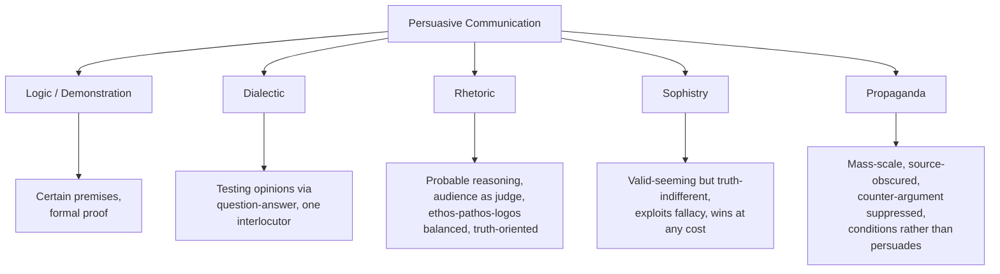

## Rhetoric Versus Logic, Sophistry, and Propaganda

### Overview

**Key Points**

- Rhetoric, logic, sophistry, and propaganda are frequently conflated in popular usage, but classical and modern theory distinguish them along precise criteria: the **standard of reasoning used** (probable vs. certain), the **intent toward truth**, and the **treatment of the audience** (as a reasoning participant vs. a target to be manipulated).
- Understanding these distinctions is foundational to rhetorical ethics: the same technical skills (framing, emotional appeal, stylistic figures) can serve legitimate persuasion or illegitimate manipulation depending on how they are deployed relative to truth and audience autonomy.
- This distinction has direct application to executive communication: the difference between persuasive leadership communication and manipulative "spin" often turns on exactly these classical criteria.

---

### Rhetoric vs. Logic (Dialectic)

#### Aristotle's Foundational Distinction

Aristotle opens the *Rhetoric* by explicitly pairing rhetoric with **dialectic** as counterparts (*antistrophos*), while distinguishing both from strict demonstrative logic:

| Dimension | Logic / Demonstration (*Apodeixis*) | Dialectic | Rhetoric |
| --- | --- | --- | --- |
| **Premises** | Necessarily true, certain | Generally accepted opinions (*endoxa*) | Probabilities, generally accepted opinions |
| **Domain** | Matters admitting certainty (mathematics, formal proof) | Philosophical inquiry via question-answer | Matters of practical deliberation (politics, ethics, law) where certainty is unavailable |
| **Audience** | None required (self-contained proof) | A single skilled interlocutor | A public, often non-expert audience |
| **Reasoning Form** | Syllogism | Syllogism (dialectical) | **Enthymeme** (rhetorical syllogism, often with a suppressed premise) |
| **Goal** | Establish truth with certainty | Test and clarify opinions | Produce reasoned belief/action under uncertainty |

**Example**

A formal logical syllogism: "All humans are mortal; Socrates is a human; therefore Socrates is mortal" demonstrates certainty from accepted premises. A rhetorical enthymeme instead argues from probability and often omits a shared premise the audience is expected to supply: "This policy will fail, because similar policies have failed before" — reasoning from probable pattern, not deductive certainty, and depending on the audience's tacit agreement with the unstated premise that past patterns predict future outcomes.

#### The Enthymeme as Rhetoric's Core Reasoning Tool

- The **enthymeme** is rhetoric's characteristic argumentative form — a truncated or probabilistic syllogism built from *endoxa* (commonly accepted premises) rather than certain axioms.
- Because full certainty is unavailable in matters of ethics, politics, and practical decision-making, Aristotle treats rhetoric not as an inferior or corrupted form of logic but as the **appropriate mode of reasoning for a distinct domain** — matters of probability and contingency where human affairs actually operate.
- [Inference] This framing directly counters the popular assumption that rhetoric is "logic's illegitimate cousin"; in Aristotle's system, applying strict demonstrative logic to inherently uncertain practical questions (should we go to war, should we adopt this policy) would itself be a category error, since such questions do not admit the certainty logic requires.

#### Practical Implication for Executive Reasoning

- Business and organizational decisions are almost always enthymematic in structure — data supports a probable conclusion, not a certain one ("Given current growth trends, this market is likely to be receptive" rather than a deductively certain claim).
- [Inference] Recognizing decisions as enthymematic (probability-based) rather than syllogistic (certainty-based) is itself a communication discipline: presenting business projections with false certainty (deductive-sounding language for what is actually probabilistic reasoning) is a common rhetorical failure mode in executive communication, arguably a category confusion between logic and rhetoric's proper domains.

---

### Rhetoric vs. Sophistry

#### The Sophists: Historical Context

- The **Sophists** (5th century BCE) were itinerant professional teachers — Protagoras, Gorgias, Hippias, and others — who charged fees to teach rhetorical and argumentative skill, primarily to ambitious young Athenian men seeking political or legal success.
- Their historical reputation is complicated: ancient sources (especially Plato) present a largely hostile caricature, while modern scholarship treats several Sophists as serious philosophical thinkers in their own right, particularly on questions of relativism, language, and civic virtue.

#### The Core Philosophical Charge Against Sophistry

Plato's dialogues (especially the *Gorgias* and *Protagoras*) articulate the foundational critique that later gives "sophistry" its pejorative modern sense:

- **Making the weaker argument the stronger**: the Sophists were accused (and some, like Protagoras, reportedly claimed) the ability to argue either side of any question with equal persuasive force, regardless of which side was true — treating argumentative victory, not truth, as the goal.
- **Rhetoric as flattery, not art**: in the *Gorgias*, Plato has Socrates classify rhetoric alongside cookery and cosmetics — a "knack" (*empeiria*) for producing pleasure and the *appearance* of good, rather than a genuine art (*technē*) aimed at real goods, comparable to how medicine genuinely benefits the body while cookery merely flatters the palate.
- **Relativism as enabling condition**: Protagoras's famous dictum ("man is the measure of all things") is read by Plato as underwriting a dangerous relativism — if there is no objective truth, only competing persuasive claims, then rhetorical skill becomes a tool for manufacturing whichever "truth" is most advantageous, independent of actual fact.

#### Aristotle's and Cicero's Rehabilitation

- Aristotle's response is not to defend the Sophists' alleged truth-indifference but to argue that rhetoric **itself** need not be sophistical — rhetoric is a neutral capacity (like any *technē*) that *can* be misused for deception but is properly aimed at helping true and just causes prevail by ensuring they are argued as effectively as false ones might be.
- Cicero and Quintilian extend this rehabilitation by embedding **moral character** into the definition of the legitimate orator (Quintilian's *vir bonus dicendi peritus*) — explicitly excluding the ethically indifferent "hired gun" persuader from the category of true orator, thereby drawing the rhetoric/sophistry line at the level of the practitioner's moral orientation rather than technique alone.

#### Modern Sense: "Sophistry" as Pejorative

- In contemporary usage, "sophistry" denotes reasoning that is **deliberately deceptive, fallacious, or manipulative while maintaining surface plausibility** — a specious argument crafted to persuade despite being unsound or dishonest.
- **Example**: Using a **false analogy** to make a weak policy proposal appear structurally identical to a previously successful one, while glossing over material differences, is a modern instance of the classical sophistic technique of "making the weaker argument appear stronger."

| Criterion | Legitimate Rhetoric | Sophistry |
| --- | --- | --- |
| Relation to truth | Aims to reveal/support true or probable conclusions | Indifferent or opposed to truth; aims only at victory/persuasion |
| Argument structure | Enthymeme grounded in genuinely shared, reasonable premises | Superficially valid-seeming but exploits fallacy, ambiguity, or false premises |
| Practitioner's stance | Quintilian's *vir bonus* — ethically committed speaker | Ethically indifferent "hired" persuader |
| Audience treatment | Reasoning partner capable of evaluating the argument | Object to be manipulated via exploited cognitive shortcuts |

---

### Rhetoric vs. Propaganda

#### Defining Propaganda

- **Propaganda** is a modern term (etymologically from the Catholic Church's 17th-century *Congregatio de Propaganda Fide*, "Congregation for Propagating the Faith") that acquired its contemporary, predominantly negative political sense primarily in the 20th century, especially following its association with World War I and World War II state information campaigns.
- Modern communication theory (e.g., Jacques Ellul's *Propaganda: The Formation of Men's Attitudes*, 1962) characterizes propaganda by structural features distinct from classical rhetoric: **mass-scale, centrally organized, often one-directional** communication designed to produce **uniform, often unreflective** attitude or behavior change across a large population, frequently using repetition, emotional saturation, and suppression of counter-argument.

#### Key Distinguishing Features

| Dimension | Classical/Legitimate Rhetoric | Propaganda |
| --- | --- | --- |
| **Audience relationship** | Addresses audience as capable of judgment; invites (at least formally) reasoned assent | Treats audience as a mass to be conditioned; often bypasses individual reasoned judgment |
| **Counter-argument** | Classical practice (esp. forensic) typically anticipates and addresses opposing arguments (*refutatio*) | Frequently suppresses, excludes, or delegitimizes opposing viewpoints entirely |
| **Transparency of source/intent** | Orator's identity, position, and interest are typically visible in the deliberative/forensic setting | Often obscures its origin, sponsorship, or organizing intent (covert or state-controlled sourcing) |
| **Scale and channel** | Historically face-to-face or small-group (assembly, court) | Mass media, systematically repeated across channels |
| **Reliance on emotional saturation vs. argument** | Pathos is one of three coordinated appeals (with ethos, logos) | Emotional/symbolic appeal frequently substitutes for or overwhelms substantive argument |

**Example**

A political candidate's stump speech that presents economic data, acknowledges opposing views, and argues for a policy conclusion operates within the deliberative rhetorical tradition. A coordinated, centrally produced messaging campaign that saturates multiple channels with the same simplified slogan, omits any acknowledgment of counter-evidence, and obscures its funding source exhibits the structural hallmarks modern theorists classify as propaganda rather than deliberative rhetoric — even if individual messages use recognizably rhetorical techniques (pathos, repetition, ethos-framing).

#### Points of Overlap and Ongoing Debate

- [Inference] The rhetoric/propaganda boundary is not absolute; the same techniques (repetition, emotional framing, selective emphasis) exist on a continuum rather than in categorically separate toolkits, which is why scholars disagree about where legitimate persuasive communication ends and propaganda begins — the distinction often rests on **intent, transparency, and respect for audience reasoning capacity** rather than technique alone.
- [Unverified] Claims about the precise psychological mechanisms by which propaganda "bypasses" rational judgment (as opposed to simply being highly effective rhetoric) remain an active area of interdisciplinary debate among rhetoric scholars, psychologists, and media theorists, without full scholarly consensus on sharp definitional boundaries.

#### Organizational Relevance

- Internal corporate communications that suppress dissenting data, rely on repetitive slogans divorced from substantiating argument, or obscure the source/motive of a message risk crossing from legitimate persuasive leadership communication into propagandistic territory by the criteria above — a distinction directly relevant to ethical executive communication practice.

---

### Synthesis: A Unified Comparative Framework

| Practice | Core Distinguishing Question |
| --- | --- |
| Logic | Is the conclusion certain given the premises? |
| Dialectic | Does this survive rigorous question-and-answer testing? |
| Rhetoric | Is this the most effective *available* means of persuading this audience toward a probable truth, while respecting their capacity to judge? |
| Sophistry | Does this argument merely appear sound regardless of whether it is true? |
| Propaganda | Does this communication bypass individual reasoned judgment via scale, repetition, and suppressed counter-view? |

---

**Related Topics**

- Aristotle's *Rhetoric*: The Enthymeme and Rhetorical Syllogism in Depth
- The Historical Sophists: Protagoras, Gorgias, and Relativism
- Plato's *Gorgias*: The Philosophical Case Against Rhetoric
- Logical Fallacies: A Working Taxonomy for Argument Evaluation
- Jacques Ellul and 20th-Century Propaganda Theory
- Ethical Frameworks for Executive and Organizational Communication
- Ethos, Pathos, Logos: Balancing the Three Appeals