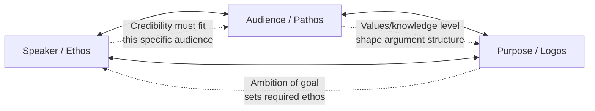

## The Rhetorical Triangle: Speaker, Audience, and Purpose

### Overview

**Key Points**

- The rhetorical triangle (also called the "communication triangle" or, in some pedagogical traditions, mapped onto Aristotle's ethos/pathos/logos) is a foundational heuristic modeling any act of communication as a relationship among three variables: the **speaker** (rhetor), the **audience**, and the **message/purpose**, situated within a broader **context**.
- The model's core claim is that effective rhetoric is never purely a property of the message itself — it is produced by the *fit* among who is speaking, who is listening, and what the speech is trying to accomplish, within a specific situational context.
- This framework directly underlies Aristotle's three artistic proofs (ethos, pathos, logos), which map onto the triangle's three points, and provides the standard diagnostic tool for analyzing or constructing any persuasive communication, including executive communication.

---

### The Three Points of the Triangle

#### Speaker (Rhetor / Ethos)

- The speaker is the source of the message — the person or entity whose credibility, character, and perceived authority shape how the message is received, independent of the message's logical content.
- Aristotle's concept of **ethos** operationalizes the speaker point of the triangle into three components:
  - ***Phronesis*** (practical wisdom) — perceived competence and good judgment
  - ***Arete*** (virtue) — perceived good character and moral standing
  - ***Eunoia*** (goodwill) — perceived good intent toward the audience specifically
- Aristotle explicitly argues that ethos is constructed **through the speech itself**, not merely imported from a speaker's pre-existing reputation — meaning a speaker's credibility can be built or damaged by how the argument is made, not only by who they already are.

**Example**

A new CFO presenting a cost-cutting plan builds *phronesis* by citing rigorous financial modeling, builds *arete* by acknowledging the human impact of layoffs honestly rather than euphemistically, and builds *eunoia* by explicitly framing the plan around long-term employee job security — all three ethos components constructed within the speech itself, not assumed from title alone.

#### Audience (Pathos)

- The audience point represents the receivers of the message — their values, prior beliefs, emotional state, knowledge level, and stake in the outcome.
- Aristotle's **pathos** operationalizes the audience point: the speaker's capacity to understand and appropriately engage the audience's emotional state as part of effective persuasion, since Aristotle treats emotion as integral to practical judgment, not as an irrational contaminant of it.
- Audience analysis in the rhetorical tradition typically requires assessing:
  - **Prior disposition**: friendly, hostile, neutral, or undecided toward the speaker's position
  - **Knowledge level**: expert, general, or novice audience, which determines appropriate complexity and jargon
  - **Values and interests**: what the audience cares about, which determines which appeals will land
  - **Decision authority**: whether the audience can act on the message (a board with approval power) or merely receives it (a general readership)

**Example**

The same product-launch delay must be communicated differently to a board of directors (audience with decision authority, financially literate, focused on risk/ROI) versus frontline sales staff (audience without decision authority, focused on customer-facing implications and morale) — same core message, different audience analysis driving different rhetorical choices.

#### Purpose / Message (Logos)

- The purpose point represents what the speech is trying to accomplish and the substantive content/reasoning that serves that goal.
- Aristotle's **logos** operationalizes this point: the logical structure of the argument itself, typically built from enthymemes (probabilistic reasoning from accepted premises) rather than strict deductive proof, given rhetoric's domain of contingent, practical matters.
- Purpose in classical theory is often categorized by the three oratorical genres, each with a distinct time orientation and aim:
  - **Deliberative**: future-oriented, aims to persuade toward or against a future action
  - **Forensic**: past-oriented, aims to establish justice/injustice regarding a past act
  - **Epideictic**: present-oriented, aims to praise or blame, reinforcing shared values

---

### Visual Model

<svg xmlns="http://www.w3.org/2000/svg" viewBox="0 0 600 520" font-family="Georgia, serif">
<text x="300" y="30" text-anchor="middle" font-size="18" font-weight="bold" fill="#2b2b2b">The Rhetorical Triangle (svg_diagram)</text>
<polygon points="300,80 100,420 500,420" fill="none" stroke="#333" stroke-width="2" />
<circle cx="300" cy="80" r="55" fill="#8c1c13" opacity="0.88" />
<text x="300" y="72" text-anchor="middle" font-size="15" fill="#fff" font-weight="bold">SPEAKER</text>
<text x="300" y="90" text-anchor="middle" font-size="12" fill="#fff">Ethos</text>
<text x="300" y="106" text-anchor="middle" font-size="9" fill="#fff">Credibility / Character</text>
<circle cx="100" cy="420" r="55" fill="#2f5061" opacity="0.88" />
<text x="100" y="412" text-anchor="middle" font-size="15" fill="#fff" font-weight="bold">AUDIENCE</text>
<text x="100" y="430" text-anchor="middle" font-size="12" fill="#fff">Pathos</text>
<text x="100" y="446" text-anchor="middle" font-size="9" fill="#fff">Values / Emotion</text>
<circle cx="500" cy="420" r="55" fill="#4a6741" opacity="0.88" />
<text x="500" y="412" text-anchor="middle" font-size="15" fill="#fff" font-weight="bold">PURPOSE</text>
<text x="500" y="430" text-anchor="middle" font-size="12" fill="#fff">Logos</text>
<text x="500" y="446" text-anchor="middle" font-size="9" fill="#fff">Message / Reasoning</text>

<text x="300" y="480" text-anchor="middle" font-size="12" fill="#555" font-style="italic">Effective rhetoric emerges from the fit among all three,</text>

<text x="300" y="498" text-anchor="middle" font-size="12" fill="#555" font-style="italic">situated within a specific context/occasion</text>

<rect x="230" y="220" width="140" height="40" rx="6" fill="none" stroke="#888" stroke-dasharray="4,3" />
<text x="300" y="245" text-anchor="middle" font-size="11" fill="#555">CONTEXT</text>
</svg>

---

### Context as the Implicit Fourth Element

- Many modern adaptations of the rhetorical triangle (particularly in composition studies) add **context** — the occasion, setting, medium, and constraints — as an implicit fourth dimension surrounding the triangle, since the same speaker/audience/purpose configuration can require different rhetorical choices depending on the setting.
- This reflects the ancient rhetorical concept of ***kairos*** — the opportune or fitting moment — which governs not only *what* is said but *when* and *how*, given situational constraints (time available, medium, competing events, audience mood at that specific moment).

**Example**

Announcing a leadership change via a scheduled board memo (planned, controlled context) requires different rhetorical handling than announcing the same change during an active PR crisis (urgent, reactive context) — same speaker, same audience, same core purpose, but *kairos* dramatically changes the appropriate rhetorical strategy.

---

### Interdependence of the Three Points

**Key Points**

- The triangle is not three independent checklist items but a system of interdependencies: a change at one point typically requires recalibration at the others.
- **Speaker–Audience interaction**: A speaker's ethos is not fixed but is partly *audience-relative* — a credential that builds credibility with one audience (e.g., an academic degree) may be neutral or even a liability with another (e.g., an audience skeptical of "ivory tower" expertise).
- **Audience–Purpose interaction**: The same purpose (e.g., persuading toward a budget cut) may require an entirely different logos structure depending on audience expertise — a technical, data-dense argument for a finance committee versus a simplified, consequence-focused argument for general staff.
- **Speaker–Purpose interaction**: Certain purposes require ethos the speaker may not yet possess — a new leader proposing a radical strategic pivot faces a higher ethos burden than an established leader with a long track record proposing the same pivot, often requiring additional logos (more rigorous evidence) or pathos (relationship-building) to compensate.

---

### Application to Executive Communication

| Triangle Point | Executive Communication Diagnostic Questions |
| --- | --- |
| **Speaker (Ethos)** | What is my actual standing with this audience? Do I need to establish competence, character, or goodwill before making my ask? |
| **Audience (Pathos)** | What does this audience already believe? What do they stand to gain or lose? What is their emotional starting point (anxious, skeptical, receptive)? |
| **Purpose (Logos)** | Is this deliberative (future action), forensic (defending past decisions), or epideictic (affirming values)? What evidence structure fits this audience's expertise level? |
| **Context (Kairos)** | Is this the right moment? What medium fits (live address vs. written memo)? What else is competing for this audience's attention right now? |

**Example**

A misapplication of the triangle: presenting a heavily data-dense (logos-saturated) turnaround plan to an anxious, non-technical audience (frontline staff, low logos capacity, high pathos need) during a period of active layoff rumors (high-stakes *kairos*) — the message is well-reasoned but mismatched to audience and context, illustrating that logical soundness alone does not guarantee rhetorical effectiveness.

---

### Common Pedagogical Variants

- [Unverified] The specific triangular diagram (as opposed to the underlying ethos/pathos/logos concepts, which are directly Aristotelian) is a modern pedagogical simplification; ancient sources do not present a literal geometric "triangle," and the visual format appears to be a later teaching convention rather than an ancient artifact — though its underlying three-part logic is textually well-grounded in Aristotle's *Rhetoric*.
- Some composition textbooks extend the triangle to a **rhetorical square or pentagon**, adding "text/message" as distinct from "purpose," or explicitly separating "context" and "exigence" (the problem prompting the communication) as additional named elements — reflecting refinements from 20th-century rhetorical theory (e.g., Lloyd Bitzer's concept of the *rhetorical situation*).

---

**Next Steps**

- Aristotle's *Rhetoric*: Ethos, Pathos, Logos in Full Detail
- Lloyd Bitzer and the Rhetorical Situation (Exigence, Audience, Constraints)
- *Kairos*: Timing and Opportunity in Classical and Modern Rhetoric
- Audience Analysis Frameworks for Executive Communication
- Building Ethos as a New Leader: Practical Applications
- The Enthymeme: Constructing Logos for Non-Expert Audiences