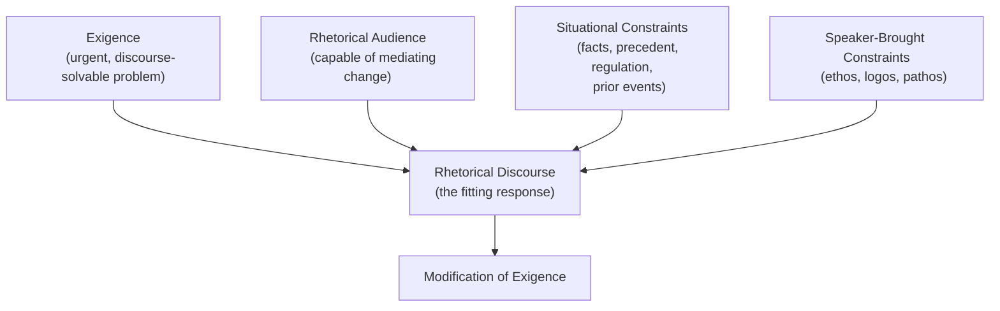

## The Rhetorical Situation: Exigence, Audience, and Constraints

### Overview

**Key Points**

- The "rhetorical situation" is a formal theoretical concept introduced by **Lloyd Bitzer** in his 1968 essay "The Rhetorical Situation" (*Philosophy and Rhetoric*), proposing that rhetorical discourse arises as a response to a specific situational structure rather than existing as a free-standing artistic performance.
- Bitzer defines the rhetorical situation as a complex of three necessary elements: **exigence**, **audience**, and **constraints** — and argues that discourse only becomes genuinely rhetorical when it functions as a *fitting response* to these situational conditions.
- The theory provoked significant scholarly debate — most notably from **Richard Vatz** — over whether rhetorical situations exist objectively prior to discourse or are themselves rhetorically *constructed* by the speaker, a debate directly relevant to understanding how executives and organizations frame (rather than merely respond to) events.

---

### The Three Constitutive Elements

#### Exigence

- **Exigence** is Bitzer's term for the imperfection, problem, or urgency in the world that demands response — "an imperfection marked by urgency," in Bitzer's own phrasing, which discourse has the *potential* to positively modify.
- Not every problem constitutes a rhetorical exigence: Bitzer specifies that a true rhetorical exigence must be one that discourse can actually help resolve or address — a problem solvable only by non-discursive means (a natural disaster in progress, requiring physical intervention rather than persuasion) does not by itself constitute a rhetorical exigence, though the human response to it (organizing aid, calming public fear) typically does.
- Exigence functions as the **generative cause** of the rhetorical act — it is the reason the discourse exists at all.

**Example**

A public company's stock price unexpectedly drops 20% after a competitor's product announcement. The exigence is the urgent problem of investor and employee confidence — a problem that *can* be positively modified through discourse (a CEO statement clarifying strategy, reassuring stakeholders), distinguishing it from a purely physical problem (e.g., a factory fire) that requires non-discursive resolution first, even though communication about the fire also becomes necessary.

#### Audience

- Bitzer's concept of audience in the rhetorical situation is narrower than a general readership or listenership: he specifies the **rhetorical audience** as consisting only of those "capable of being influenced by discourse and of being mediators of change" — that is, people who can actually act to help resolve the exigence.
- This distinguishes a rhetorical audience from a merely passive audience (people who hear or read the message but have no capacity to act on it) — a distinction with direct practical application in targeting executive communication toward genuine decision-makers or influencers rather than uninvolved bystanders.

**Example**

In the stock-drop scenario above, the rhetorical audience for the CEO's statement includes institutional investors (who can hold or sell shares), employees (who can stay or leave, affecting operational stability), and possibly key clients (who can maintain or cancel contracts) — not the general public with no stake or capacity to act, who might read the statement but are not "mediators of change" in Bitzer's specific sense.

#### Constraints

- **Constraints** are the set of persons, events, objects, relations, and facts that have the power to constrain the decision and action needed to modify the exigence — both limitations the speaker must work within and resources the speaker can draw upon.
- Bitzer divides constraints into two broad categories:
  - **Constraints given by the situation itself**: existing facts, prior events, precedent, legal/regulatory requirements, competitor actions, traditions, and beliefs already held by the audience — largely outside the speaker's control.
  - **Constraints brought by the speaker (the "artistic proofs")**: the speaker's own credibility (ethos), argumentative choices (logos), and style/emotional appeal (pathos), which the speaker actively constructs and deploys — directly overlapping with Aristotle's rhetorical proofs.

**Example**

For the CEO's stock-drop statement, situational constraints include SEC disclosure regulations (legal limits on what can be claimed), the specific competitor announcement's content (facts the audience already knows), and prior public commitments the company has made (precedent the audience will hold the speaker to). Speaker-side constraints include the CEO's personal credibility given past accuracy of guidance (ethos) and the quality of financial data available to support claims (logos).

---

### Visual Model of the Rhetorical Situation

---

### Bitzer's Central Claim: Discourse as "Fitting Response"

**Key Points**

- Bitzer's most distinctive and debated claim is that the rhetorical situation **exists objectively**, prior to and independent of the speaker's perception or construction of it — the situation "invites" a response, and discourse succeeds or fails to the degree it constitutes a **fitting response** to the actual exigence, audience, and constraints present.
- This is analogous, in Bitzer's own comparison, to a question requiring an answer or a problem requiring a solution — the situation itself imposes requirements that the discourse either satisfies or fails to satisfy, largely independent of the speaker's subjective framing.
- [Inference] This objectivist framing gives Bitzer's theory strong diagnostic power for post-hoc analysis (was this response fitting, given the actual situation?) but has been challenged as underestimating how much speakers actively shape audience perception of what the "real" exigence even is.

---

### The Vatz Critique: Situations as Rhetorically Constructed

- **Richard Vatz**, in his 1973 response "The Myth of the Rhetorical Situation" (*Philosophy and Rhetoric*), argues the reverse thesis: situations do not have inherent, objective meaning that discourse merely responds to — rather, **rhetors create exigence through the act of characterizing and selecting** which facts and problems are salient.
- Vatz's key claim: any given set of events could be characterized as a crisis, a non-event, an opportunity, or an outrage, depending entirely on how a rhetor selects and frames the situation — meaning the rhetor's choices are **constitutive** of the situation's meaning, not merely responsive to a pre-existing objective urgency.
- This has direct, practical significance for executive and political communication: leaders frequently do not simply "respond" to pre-formed crises but actively determine whether an event is framed as a minor setback or a major crisis through the language and emphasis chosen.

| Dimension | Bitzer (Situational Objectivism) | Vatz (Rhetorical Constructivism) |
| --- | --- | --- |
| **Source of exigence** | Exists objectively in the world, prior to discourse | Created/constituted by the rhetor's framing choices |
| **Speaker's role** | Perceives and fittingly responds to a given situation | Actively selects and characterizes what counts as significant |
| **Success criterion** | Fit between response and objective situational demands | Persuasive power of the framing itself |
| **Risk if theory is wrong** | Underestimates rhetor's agency and framing power | Underestimates real material constraints outside speaker's control |

[Inference] Most contemporary rhetorical scholarship treats Bitzer and Vatz as identifying two real, complementary dynamics rather than mutually exclusive theories — situations do impose genuine material constraints (Bitzer is right that not everything is infinitely reframeable), while framing choices genuinely shape which aspects of a complex situation become salient as "the" exigence (Vatz is right that selection is not neutral) — this synthesis view is common in later rhetorical situation scholarship though not universally formalized into a single named theory.

---

### Application to Executive Communication

#### Diagnostic Framework

| Element | Executive Communication Questions |
| --- | --- |
| **Exigence** | What specific, discourse-solvable problem or opportunity exists right now? Is this genuinely urgent, or does it only require monitoring? |
| **Audience** | Who among all possible readers/listeners can actually act to help resolve this — decision-makers, key stakeholders, mediators of change — versus who is merely informed? |
| **Situational Constraints** | What legal, regulatory, competitive, or historical facts limit what can credibly be said? What prior commitments will this audience hold the speaker to? |
| **Speaker-Brought Constraints** | What ethos does the speaker currently have with this audience? What evidence (logos) is available? What emotional register (pathos) fits the moment? |
| **Framing Choice (Vatz)** | How is this situation being characterized — crisis, opportunity, non-event? Is that framing accurate, or is it itself a strategic rhetorical choice with consequences? |

**Example**

Two executives facing the same product recall can rhetorically construct divergent situations from identical facts: one frames it as "a serious failure requiring full accountability" (Vatz-style construction emphasizing exigence and urgency, likely building long-term trust ethos at short-term reputational cost), the other frames it as "a routine precaution demonstrating our quality systems work" (minimizing exigence, protecting short-term stock price but risking ethos damage if later facts contradict the minimized framing) — same objective facts, different rhetorical situations constructed through framing.

---

### Related Refinements in Rhetorical Situation Theory

- **Exigence hierarchies**: later scholarship (e.g., work following Bitzer) distinguishes between a single controlling exigence and multiple subordinate exigencies within complex, multi-audience communications — relevant to executive communications addressing several stakeholder groups with distinct urgent concerns simultaneously.
- **Constraint asymmetry across audiences**: the same speaker-brought constraint (e.g., ethos) can function very differently across different segments of a complex audience — a CEO's ethos with institutional investors (built on financial track record) may differ substantially from ethos with employees (built on cultural/leadership trust), requiring the speaker to manage multiple constraint profiles within a single communication event.

---

**Related Topics**

- Lloyd Bitzer's "The Rhetorical Situation" (1968): Full Textual Analysis
- Richard Vatz's "The Myth of the Rhetorical Situation" (1973): Full Textual Analysis
- *Kairos* and Timing in Crisis Communication
- Framing Theory in Political and Organizational Communication
- Stakeholder Mapping as Applied Rhetorical Audience Analysis
- Crisis Communication Case Studies: Situational Framing in Practice