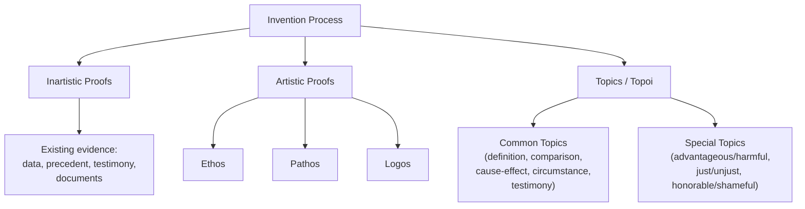

## Invention: Discovering Arguments and Content

### Overview

**Key Points**

- **Invention** (*inventio* in Latin; *heuresis* in Greek) is the first of the five classical canons of rhetoric — the systematic process of discovering available arguments, evidence, and content appropriate to a given rhetorical situation, before questions of arrangement or style are addressed.
- Classical rhetoricians did not treat invention as spontaneous inspiration but as a **teachable, systematic procedure**, using structured heuristics (topics, stasis theory, the three artistic proofs) to generate material methodically rather than relying on improvisation alone.
- Invention remains the conceptual root of "finding your argument" in modern writing and speaking pedagogy, and directly underlies structured business problem-solving frameworks (issue trees, root-cause analysis) even where classical vocabulary is absent.

---

### The Artistic and Inartistic Proofs

Aristotle's *Rhetoric* divides all available means of persuasion discoverable through invention into two fundamental categories:

#### Inartistic Proofs (*Atechnoi*)

- Evidence that exists **independent of the rhetorician's skill** — the speaker discovers and uses it but does not create it.
- Classical examples: laws, witness testimony, contracts, oaths, confessions under torture (in forensic contexts), prior judgments/precedents.
- **Modern organizational analogue**: financial statements, market research data, legal precedent, third-party audit results, customer testimonials — factual material the communicator marshals but does not originate.

#### Artistic Proofs (*Entechnoi*)

- Proofs the speaker **constructs through rhetorical skill** — this is Aristotle's famous tripartite division:
  - **Ethos** — proof through the speaker's constructed credibility
  - **Pathos** — proof through emotional engagement of the audience
  - **Logos** — proof through the argument's internal reasoning

**Example**

In building a case for a new product line, a market research report showing demand (inartistic proof, already existing) is combined with the CEO's articulated logic for why the company is well-positioned to capture that demand (artistic proof — logos constructed through the speaker's own reasoning), and delivered with appeals to the company's founding mission (artistic proof — pathos and ethos constructed rhetorically).

---

### The Topics (*Topoi*): A Systematic Search Procedure

#### Common Topics (*Topoi Koinoi*)

Aristotle and later rhetoricians (notably Cicero in the *Topica*) systematized invention through **topics** — literally "places" (from Greek *topos*, "place") — reusable lines of argument applicable across any subject matter, functioning as a mental search procedure for generating content.

Standard common topics include:

| Topic | Function | Example Application |
| --- | --- | --- |
| **Definition** | What kind of thing is this? | "Is this restructuring a 'layoff' or a 'realignment'? The classification shapes the argument." |
| **Comparison (similarity/difference)** | How does this compare to known cases? | "Our situation resembles Company X's 2019 turnaround more than Company Y's collapse." |
| **Relationship (cause/effect, antecedent/consequence)** | What causes or follows from this? | "If we delay this decision, what downstream costs compound?" |
| **Circumstance (possible/impossible, past fact/future fact)** | Is this feasible? Has it happened before? | "Has a company our size successfully executed this pivot before?" |
| **Testimony** | What do authorities, witnesses, or precedent say? | "Industry analysts and our own historical data both point the same direction." |

#### Special Topics (*Topoi Idioi*)

- Distinct from common topics, **special topics** are arguments specific to a particular genre of oratory, reflecting the distinct concerns of each:
  - **Deliberative** special topics: the advantageous and the harmful (future-oriented cost/benefit)
  - **Forensic** special topics: the just and the unjust (evaluating a past act)
  - **Epideictic** special topics: the honorable/virtuous and the shameful (praise/blame criteria)

**Example**

A deliberative business case for market entry naturally invokes the "advantageous/harmful" special topic (projected ROI vs. downside risk), while a forensic-style internal review of a failed project invokes the "just/unjust" special topic (was the original decision reasonable given information available at the time, even though the outcome was poor).

---

### Stasis Theory as an Invention Tool

- **Stasis theory** (developed by Hermagoras of Temnos, systematized by Cicero and Quintilian) functions as an invention procedure specifically for determining *what the actual question at issue is* before arguments can be usefully generated.
- The four stock stases guide invention by narrowing what kind of evidence and argument is actually needed:
  1. **Conjectural** (did it happen?) → invention focuses on factual evidence, witnesses, documentation
  2. **Definitional** (what is it?) → invention focuses on definitions, categories, precedent classifications
  3. **Qualitative** (was it justified/how significant?) → invention focuses on context, motive, mitigating/aggravating factors
  4. **Translative** (is this the right forum/process?) → invention focuses on procedural and jurisdictional arguments

[Inference] Applying stasis theory as a first step in invention prevents a common practical failure — marshaling extensive evidence and argument for the wrong question (e.g., building a detailed defense of *why* an action was justified when the actual audience dispute is still at the conjectural stage of *whether it happened at all*).

---

### Cicero and Quintilian on Invention

- Cicero's early *De Inventione* treats invention as the foundational and most extensively theorized of the five canons, reflecting Hellenistic handbook traditions' heavy emphasis on systematic argument-finding for legal oratory.
- Cicero's mature *De Oratore* reframes invention as inseparable from broad general knowledge — the ideal orator draws invention material not merely from rhetorical topics but from genuine expertise in law, philosophy, history, and ethics, arguing that a rhetorician ignorant of substantive subject matter cannot invent genuinely strong arguments regardless of technique.
- Quintilian's *Institutio Oratoria* (Books 3–7) provides the most extended surviving systematic treatment of invention combined with stasis theory, treating the two as integrated: stasis theory determines the question, and topical invention then supplies the answer's supporting material.

---

### Modern Invention Techniques (Composition and Business Adaptations)

| Classical Concept | Modern Adaptation |
| --- | --- |
| Common topics (definition, comparison, cause-effect) | Brainstorming heuristics, "5 Whys" root-cause analysis, SWOT frameworks |
| Special topics by genre | Genre-specific business frameworks (cost-benefit analysis for deliberative business cases; root-cause/accountability frameworks for forensic post-mortems) |
| Stasis theory | Problem-definition frameworks in consulting methodology (e.g., clarifying "is this a fact dispute or a values dispute" before argument-building) |
| Artistic/inartistic proof distinction | Distinguishing "hard data" (inartistic) from "narrative/framing" (artistic) in a business case |

**Example**

A modern strategy consultant's "issue tree" — systematically decomposing a business problem into sub-questions before gathering evidence — performs the same structural function as classical topical invention: it is a systematic search procedure ensuring no major line of relevant argument or evidence is overlooked before the case is built.

---

### Invention as Distinct from Arrangement and Style

**Key Points**

- A key discipline in classical rhetorical training is keeping invention **analytically separate** from arrangement (*dispositio*) and style (*elocutio*) — invention asks "what can I argue and with what evidence," arrangement asks "in what order," and style asks "in what words."
- [Inference] Conflating invention with style is a common modern communication failure — polishing language before the underlying argument and evidence are fully discovered and tested often produces well-written but substantively weak communication, since problems in the argument itself are easier to catch and fix before stylistic investment is made.
- Peter Ramus's 16th-century reassignment of invention to logic/dialectic (removing it from rhetoric's domain) remains a significant historical episode illustrating how invention's status — is it a rhetorical or purely logical operation? — has been genuinely contested across the discipline's history.

---

**Next Steps**

- Stasis Theory in Depth: The Four Stock Issues
- Cicero's *Topica*: A Working Translation and Commentary
- The Three Artistic Proofs: Ethos, Pathos, Logos as Invention Categories
- Arrangement (*Dispositio*): Organizing Invented Material
- Modern Brainstorming and Issue-Tree Techniques as Applied Invention
- Ramus and the Separation of Invention from Rhetoric