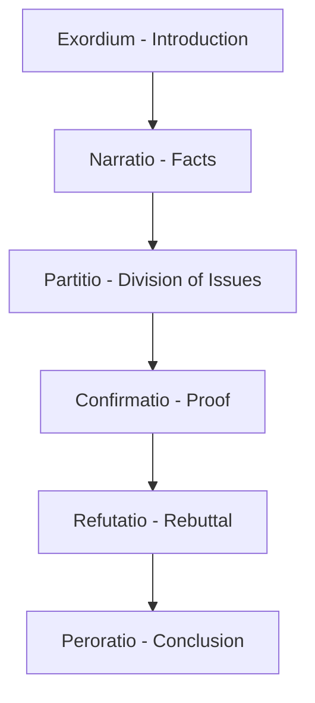

## Arrangement: Organizing Ideas for Maximum Effect

### Overview

**Key Points**

- **Arrangement** (*dispositio* in Latin; *taxis* in Greek) is the second of the five classical canons — the systematic ordering of invented material (arguments, evidence, appeals) into an effective sequence for a given audience and purpose.
- Classical rhetoricians treated arrangement as distinct from invention: invention discovers *what* can be argued, while arrangement determines *in what order* it should be presented for maximum persuasive effect — the same content can succeed or fail depending on sequencing alone.
- The classical oration structure, developed primarily for forensic (judicial) contexts and later generalized, remains the direct ancestor of modern speech, essay, and business-communication structures.

---

### The Classical Oration Structure (The Six/Seven-Part Model)

Roman rhetorical handbooks (the *Rhetorica ad Herennium*, Cicero's *De Inventione*, and Quintilian's *Institutio Oratoria*) converge on a standard multi-part structure, most fully elaborated for forensic oratory:

| Part | Latin Term | Function |
| --- | --- | --- |
| **1. Exordium** | Introduction | Secures audience attention and goodwill (establishing initial ethos); signals the speech's subject |
| **2. Narratio** | Statement of Facts | Presents the factual background/context needed to understand the case |
| **3. Partitio / Divisio** | Division | States what points are agreed upon and what remains in dispute; previews the argument's structure |
| **4. Confirmatio** | Proof | Presents the positive arguments and evidence supporting the speaker's position (the main logos content) |
| **5. Refutatio** | Refutation | Anticipates and rebuts opposing arguments |
| **6. Peroratio** | Conclusion | Summarizes the case and makes a final emotional appeal (pathos), closing with maximum persuasive force |

- [Unverified] Some ancient sources (and modern summaries) present this as a six-part model, others as five or seven, depending on whether *partitio* is treated as a distinct part or folded into *narratio*/*confirmatio*, and whether an additional *propositio* (explicit statement of the main claim) is separated out — the exact count varies by source without a single canonical standard across all classical handbooks.

**Example**

A modern legal closing argument still follows this structure closely: an opening that establishes attorney credibility and case importance (exordium), a recap of established facts (narratio), a clear statement of the central disputed question (partitio), the core evidentiary argument (confirmatio), anticipated rebuttal of the opposing counsel's likely arguments (refutatio), and a closing emotional appeal to the jury's sense of justice (peroratio).

---

### Arrangement Principles Beyond the Six-Part Structure

#### Natural vs. Artificial Order

- **Natural order** (*ordo naturalis*) follows the chronological or logical sequence of events/reasoning as they actually occurred or logically build.
- **Artificial order** (*ordo artificialis*) deliberately departs from strict chronological/logical sequence for strategic effect — for instance, leading with the strongest argument, or opening with a striking exception to build curiosity before context is supplied.
- Quintilian explicitly discusses circumstances warranting departure from natural order, particularly when the strongest evidence would be weakened by placement or when audience attention/skepticism requires strategic resequencing.

#### Primacy and Recency Effects

- Classical rhetoricians observed empirically (without modern psychological terminology) that **position within a speech affects persuasive impact** — material placed first and last tends to be retained and weighted more heavily than material placed in the middle.
- This underlies the classical recommendation to place the **strongest argument either first (to establish dominance) or last (to leave the strongest impression)**, with weaker supporting arguments placed in the middle — a strategic arrangement choice still taught in modern persuasive writing and public speaking.
- [Inference] This ancient observation anticipates what modern cognitive psychology later formalized as the **serial position effect** (primacy and recency effects on memory), though the classical rhetoricians arrived at the principle through practical oratorical experience rather than experimental research.

---

### Genre-Specific Arrangement Variations

| Genre | Typical Arrangement Emphasis |
| --- | --- |
| **Deliberative** | Often compresses *narratio* (less need for extensive fact-recitation about the future) and expands *confirmatio*/*refutatio* around competing future scenarios and their relative advantages |
| **Forensic** | Follows the full six-part structure most closely, given its origin in judicial contexts requiring careful fact establishment and rebuttal |
| **Epideictic** | Often organized topically (by virtue/quality praised) or chronologically (by life stages, in a eulogy), rather than around a disputed proof structure, since there is typically no opposing claim to refute |

---

### Modern Structural Descendants

#### The Five-Paragraph Essay and Business Memo Structures

- The modern five-paragraph essay (introduction, three body paragraphs, conclusion) is a simplified pedagogical descendant of the classical oration, compressing *confirmatio* and *refutatio* into topic-focused body paragraphs.
- Standard business communication structures directly parallel classical arrangement:

| Classical Part | Business Communication Equivalent |
| --- | --- |
| Exordium | Executive summary / opening hook establishing relevance |
| Narratio | Background / situation context |
| Partitio | Problem statement / key question to be resolved |
| Confirmatio | Supporting analysis / recommendation rationale |
| Refutatio | Addressing objections / risk mitigation section |
| Peroratio | Call to action / closing recommendation |

**Example**

A standard consulting recommendation deck follows this structure closely: situation/context slide (narratio), problem statement (partitio), analysis and recommendation (confirmatio), risk/objection-handling slide (refutatio), and a closing call-to-action slide (peroratio) — the classical arrangement logic operating without classical terminology.

#### The "Inverted Pyramid" and Modern Deviation from Classical Order

- Modern journalism's **inverted pyramid** structure (most important information first, decreasing importance thereafter) represents a deliberate departure from the classical oration's more gradual build toward *confirmatio*, reflecting different audience conditions — readers who may stop reading at any point, versus a captive courtroom or assembly audience.
- [Inference] This divergence illustrates a broader principle in arrangement theory: the "correct" order is not fixed by the content alone but depends on audience attention conditions (a captive audience permits gradual build; a scanning/skimming audience requires front-loaded key information) — a modern extension of the same audience-sensitivity Quintilian applied to natural/artificial order.

---

### Arrangement Failures: Common Diagnostic Patterns

**Key Points**

- **Buried lede**: placing the central claim or most important information too late, risking loss of an audience with limited attention (a natural-order failure in audience-attentive contexts).
- **Weak-argument sandwich**: placing the strongest argument in the middle, where primacy/recency effects predict weaker retention — often an unintentional arrangement error rather than deliberate strategy.
- **Missing refutation**: omitting anticipated counterarguments entirely, which classical theory treats as a significant weakness — Quintilian and Cicero both stress that ignoring known objections, rather than addressing them, damages credibility with an audience already aware of the counter-case.
- **Premature peroratio**: closing with a flat summary rather than genuine persuasive force (pathos-driven closing), underusing the classical insight that the conclusion carries disproportionate persuasive weight due to recency effects.

**Example**

An executive memo that opens with detailed methodology (natural chronological order — "first we did X, then Y, then Z") before revealing the recommendation buried on the final page exhibits a classical "buried lede" arrangement failure — the *confirmatio* content is present and sound, but its placement fails the audience's actual attention pattern, a problem arrangement theory (not invention theory) is specifically designed to diagnose and fix.

---

**Related Topics**

- The Six-Part Classical Oration Structure in Full Detail
- *Kairos* and Audience Attention: When to Front-Load vs. Build Gradually
- Refutation (*Refutatio*) Strategy: Anticipating and Addressing Counterarguments
- Style (*Elocutio*): The Canon Following Arrangement
- The Inverted Pyramid: Journalism's Departure from Classical Order
- Structuring Executive Recommendations: Classical Arrangement Applied