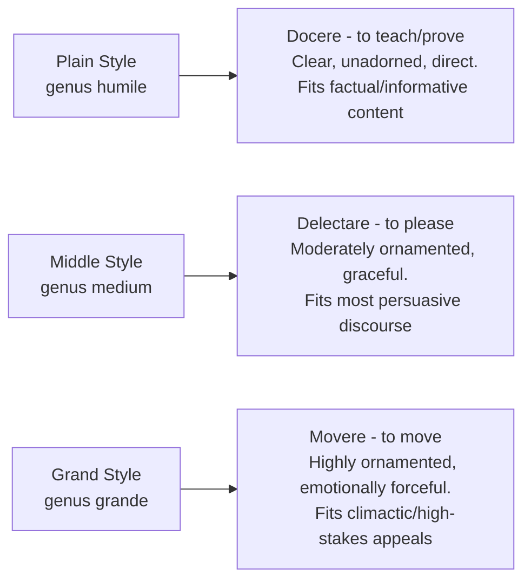

## Style: Crafting Language for Clarity and Impact

### Overview

**Key Points**

- **Style** (*elocutio* in Latin; *lexis* in Greek) is the third of the five classical canons — the selection and arrangement of language itself (word choice, sentence construction, figures of speech) to express invented and arranged material effectively.
- Classical theory treats style not as mere decoration applied after substantive content is settled, but as integral to how thought becomes persuasive — Cicero explicitly argues in *De Oratore* that style and substance are inseparable, since the *same* argument expressed poorly fails to persuade.
- Style theory in antiquity is organized around two major frameworks that remain foundational: the **virtues of style** (qualities good style should possess) and the **three levels of style** (register appropriate to different rhetorical purposes), alongside the extensive taxonomy of **tropes and figures**.

---

### The Virtues of Style (*Virtutes Elocutionis*)

Classical rhetoricians, particularly in the tradition running through the *Rhetorica ad Herennium* and Quintilian, identify core qualities that constitute good style:

| Virtue | Latin Term | Definition |
| --- | --- | --- |
| **Correctness** | *Latinitas* | Grammatical and idiomatic correctness — freedom from barbarism and solecism |
| **Clarity** | *Perspicuitas* | Language readily understood by the intended audience; avoidance of unnecessary obscurity |
| **Appropriateness** | *Aptum* / *Decorum* | Fit between style, subject matter, speaker, audience, and occasion |
| **Ornament** | *Ornatus* | Elevated, vivid, or embellished language that gives the speech force and distinction beyond bare clarity |

- Of these, **clarity (*perspicuitas*)** and **appropriateness (*aptum*)** are typically treated as the most fundamental — ornament without clarity or appropriateness is regarded as a stylistic failure, not an achievement, across the classical tradition.
- Quintilian is especially insistent that ornament must never come at the expense of clarity, warning against style that obscures meaning for the sake of apparent cleverness or elaborate effect.

**Example**

An executive memo using dense financial jargon with an unfamiliar general staff audience violates *aptum* (appropriateness) even if the jargon is technically correct (*Latinitas*) — the classical framework identifies this as a failure of fit between style and audience, not merely an issue of vocabulary difficulty.

---

### The Three Levels of Style (*Genera Dicendi*)

Roman rhetoric (most fully articulated in Cicero's *Orator* and the *Rhetorica ad Herennium*) codifies three registers of style, each suited to different rhetorical purposes:

| Style | Purpose (Cicero's Triad) | Characteristics | Modern Business Analogue |
| --- | --- | --- | --- |
| **Plain (*genus humile*)** | *Docere* — to teach/prove | Simple diction, minimal ornament, clarity-focused | Technical documentation, data reporting, procedural instructions |
| **Middle (*genus medium*)** | *Delectare* — to please | Moderate ornament, smooth and graceful, engaging without excess | Standard business presentations, most internal communications |
| **Grand (*genus grande*)** | *Movere* — to move/persuade emotionally | Elevated diction, rich figures, rhythmic force, high emotional register | Keynote addresses, crisis communications, mission-defining speeches |

**Example**

A CEO shifts registers within a single town hall: plain style to report quarterly figures accurately ("Revenue grew 4% quarter over quarter"), middle style to explain strategic context engagingly, and grand style in the closing call to action ("This is the moment our company defines what it stands for for the next decade") — a deliberate, classically-grounded register shift matched to shifting rhetorical purpose within one speech.

- [Inference] Skilled rhetorical practice, ancient and modern, typically involves moving fluidly among these three levels within a single communication rather than adopting one register throughout — Cicero himself is praised by Quintilian precisely for this stylistic range, in contrast to orators locked into a single register regardless of the moment's demands.

---

### Tropes and Figures: The Taxonomy of Ornament

Classical rhetoric (most extensively catalogued in the *Rhetorica ad Herennium* Book IV and Quintilian's *Institutio Oratoria* Books 8–9) distinguishes two broad categories of stylistic ornament:

#### Tropes (Changes in Meaning)

A **trope** alters a word's ordinary or literal meaning:

| Trope | Definition | Example |
| --- | --- | --- |
| **Metaphor** | Implicit comparison between unlike things | "The market is a battlefield." |
| **Metonymy** | Substituting an associated term for the thing meant | "The White House announced..." (institution for the people in it) |
| **Synecdoche** | Part representing the whole, or vice versa | "All hands on deck" (hands for workers) |
| **Irony** | Saying the opposite of what is literally meant, with contextual signal | "A brilliant strategy" (said of an evident failure) |
| **Hyperbole** | Deliberate exaggeration for effect | "This decision will make or break the entire company." |

#### Figures (Changes in Word Arrangement or Thought Pattern)

A **figure** alters the ordinary pattern of words or thought without necessarily changing literal meaning; classical theory further divides these into **figures of speech** (schemes, affecting word arrangement/sound) and **figures of thought** (affecting the structure of an idea's presentation):

| Figure | Definition | Example |
| --- | --- | --- |
| **Anaphora** | Repetition of a word/phrase at the start of successive clauses | "We will invest. We will adapt. We will win." |
| **Antithesis** | Juxtaposition of contrasting ideas in parallel structure | "Not a cost center, but a growth engine." |
| **Tricolon** | A series of three parallel elements | "Faster, cheaper, better." |
| **Rhetorical question** | A question posed for effect, not requiring a literal answer | "Can we afford to wait another quarter?" |
| **Chiasmus** | Inverted parallel structure (ABBA pattern) | "Ask not what your country can do for you—ask what you can do for your country." |

**Example**

A closing line combining tricolon and anaphora — "We built this together. We will grow this together. We will win this together." — layers multiple classical figures to produce cumulative rhythmic and emotional force, a technique directly traceable to Quintilian's cataloguing of figural combination for heightened *movere* (grand-style) effect.

---

### Prose Rhythm (*Numerus*)

- Cicero's *Orator* devotes substantial attention to **prose rhythm** — the deliberate patterning of long and short syllables (in Latin, based on quantity; in English rhetoric, more often based on stress patterns) to create pleasing and forceful cadence, particularly at clause endings (*clausulae*).
- [Inference] While classical *numerus* was built on quantitative Latin syllabic patterns not directly transferable to stress-based English, the underlying principle — that sentence rhythm and cadence affect persuasive and memorable impact independent of literal content — remains a recognized (if less formally systematized) consideration in modern speechwriting, particularly in techniques like varying sentence length for emphasis and rhythm at climactic moments.

---

### Style Failures and Classical Warnings

**Key Points**

- **Frigidity** (*frigiditas*): style that strains for grand effect but fails, producing an inflated or absurd impression rather than genuine force — Quintilian explicitly warns against mistaking excess ornament for genuine eloquence.
- **Obscurity**: violating *perspicuitas* by prioritizing apparent cleverness or complexity over the audience's actual comprehension — treated across the tradition as a fundamental stylistic failure regardless of how technically skilled the individual figures employed may be.
- **Register mismatch**: violating *aptum* by applying grand style to routine matters (bombast) or plain style to genuinely momentous occasions (flatness/anticlimax) — Cicero's own defense against Atticist critics (see prior module on the Attic-Asianic controversy) centers on the claim that skilled register-matching, not rigid adherence to one style, constitutes true stylistic mastery.

**Example**

Applying grand-style rhetoric ("a transformative, industry-defining leap forward") to a routine software patch announcement violates *aptum* — the mismatch between elevated style and mundane subject matter produces an unintentionally comic or credibility-damaging effect, illustrating why appropriateness is treated as more fundamental than ornament alone in classical style theory.

---

**Next Steps**

- Full Taxonomy of Classical Tropes and Figures (Quintilian Books 8-9)
- Cicero's *Orator*: Prose Rhythm and the Three Styles in Depth
- *Aptum*/Decorum: Matching Style to Audience and Occasion
- Memory (*Memoria*): The Canon Following Style
- Applying the Three Styles to Executive Speechwriting
- The Attic-Asianic Controversy Revisited Through Style Theory