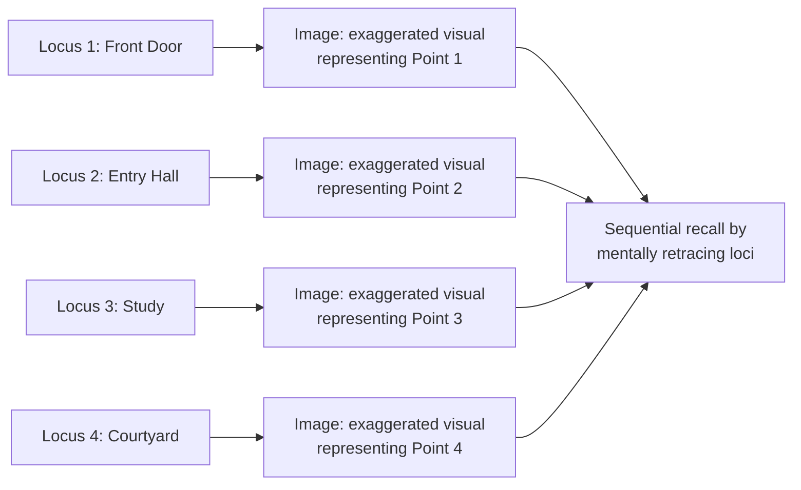

## Memory: Internalizing and Recalling Content

### Overview

**Key Points**

- **Memory** (*memoria* in Latin; *mneme* in Greek) is the fourth of the five classical canons — the systematic internalization of invented, arranged, and stylized material so it can be delivered fluently, without dependence on a written text read verbatim.
- Classical memory training was not treated as raw rote repetition but as a **structured technique** (the "art of memory," *ars memoriae*), most famously the **method of loci**, developed to handle speeches of substantial length and complexity reliably.
- Of the five canons, memory received comparatively less extended theoretical treatment in surviving texts than invention, arrangement, or style — but the *Rhetorica ad Herennium* preserves the single most detailed ancient account of mnemonic technique to survive, making it a disproportionately important source given the canon's otherwise sparse direct textual coverage.

---

### The Origin Legend: Simonides of Ceos

- Cicero (in *De Oratore*, Book II) and later sources (including Quintilian) attribute the discovery of the method of loci to the poet **Simonides of Ceos** (c. 556–468 BCE), in an anecdote describing a banquet hall collapse.
- According to the legend, Simonides had just left a banquet when the building collapsed, crushing the other guests beyond recognition; he was able to identify each victim for burial by recalling where each had been seated — leading him to the insight that spatial arrangement provides a powerful organizing structure for memory.
- [Unverified] This origin story is transmitted as anecdotal tradition by Cicero rather than independently verified historical fact; ancient rhetoricians themselves present it as an explanatory legend for the technique's discovery rather than a documented historical event.

---

### The Method of Loci (Memory Palace Technique)

#### Core Mechanism

The *Rhetorica ad Herennium* (Book III) provides the most detailed surviving ancient instructions for this technique, which operates on two components:

1. **Loci (places)**: A series of distinct, well-known physical locations — traditionally rooms or stations along a familiar building or route — memorized in a fixed, reliable order.
2. **Imagines (images)**: Vivid, often striking or unusual mental images representing the material to be remembered, mentally "placed" at each locus in sequence.

- To recall the material, the orator mentally "walks through" the sequence of loci in order, and each locus's associated image triggers recall of the corresponding point or argument.

#### Guidance on Effective Images (*Imagines Agentes*)

The *Rhetorica ad Herennium* provides specific guidance on constructing effective mnemonic images, anticipating principles later confirmed by modern memory research:

- **Striking and unusual images** are recommended over ordinary ones — the text explicitly advises that images should be memorable through their unusual, exceptional, or even comic/dramatic quality, since ordinary images fade from memory while unusual ones persist.
- **Active images** (*imagines agentes*, "images that act") — showing figures in motion or performing a vivid action — are recommended over static ones.
- **A manageable, well-ordered set of loci** must be memorized independently of any specific speech, so the same set of "backgrounds" can be reused for different speeches by simply substituting new images.

**Example**

To remember an argument about declining customer retention, rather than a plain mental note, the classical technique recommends a vivid image — for instance, imagining customers dramatically streaming out through a specific door in the memorized location sequence — since the exaggerated, active image is more reliably retrieved than an abstract or literal mental restatement of the point.

---

### Quintilian's Treatment of Memory

- Quintilian's *Institutio Oratoria* (Book 11) addresses memory alongside delivery, treating strong memory as a natural capacity that can nonetheless be substantially improved through the method of loci and disciplined practice.
- Quintilian is notably more cautious than the *Rhetorica ad Herennium* about the method of loci's practicality for very long or complex material, suggesting the technique works well for structured material but acknowledging the difficulty of applying elaborate imagistic systems to lengthy legal or deliberative speeches under real time pressure.
- He also emphasizes memorization of the **general sense and structure** of an argument (relying on the *arrangement* canon's logical sequence as an inherent memory aid) rather than rigid word-for-word memorization — an important distinction, since well-arranged material is inherently easier to remember than disorganized material, making arrangement itself a support for the memory canon.

---

### Memory's Relationship to the Other Canons

**Key Points**

- Memory is uniquely dependent on the prior three canons: well-invented material (clear, substantive content), well-arranged material (logical, memorable sequence), and well-styled material (vivid, patterned language, including figures like anaphora and tricolon) are all inherently easier to memorize than poorly constructed equivalents.
- [Inference] This interdependency suggests the five canons were never intended as fully independent, sequential steps but as a mutually reinforcing system — strong arrangement and style effectively function as memory aids in themselves, meaning a well-constructed speech partially "memorizes itself" through its own internal structure, reducing reliance on artificial mnemonic technique alone.
- Classical memory training was essential given ancient oratorical practice: formal oration was expected to be delivered from memory (not read from a text), unlike much of modern practice, which more often permits notes, scripts, or slides — making memoria a more load-bearing skill in antiquity than in most modern communication contexts.

---

### Modern Relevance and Applications

#### Memory Techniques in Contemporary Practice

- The method of loci remains empirically studied in modern cognitive psychology and is used competitively by memory athletes; contemporary research on spatial memory and the "memory palace" technique substantially validates the ancient intuition that spatial and imagistic encoding improves recall relative to rote linear repetition. [Unverified — specific comparative effect sizes vary by study and are outside rhetorical theory proper.]
- Executive and public speaking coaching frequently recommends structural techniques with the same underlying logic as classical memoria, even without classical terminology:
  - **Rule of three / tricolon structuring**: organizing key points into memorable groups of three, echoing both the arrangement and style canons' contribution to memorability
  - **Narrative/story structuring**: embedding data or arguments within a memorable narrative arc, functioning similarly to the vivid "active images" the *Rhetorica ad Herennium* recommends
  - **Spatial staging on a physical stage or slide sequence**: deliberately associating key points with distinct physical locations or slide positions during a presentation, a direct structural descendant of the method of loci

**Example**

A speaker preparing a board presentation without notes might mentally associate the opening financial overview with "standing at the podium," the strategic recommendation with "moving to center stage," and the closing call to action with "stepping toward the audience" — an informal, modern application of loci-based memory structuring, even if the speaker has never encountered the classical terminology.

#### The Shift from Memorization to Delivery-with-Notes

- [Inference] The classical canon of memory has become comparatively less central to modern rhetorical practice than in antiquity, given the widespread acceptance of notes, teleprompters, and slide decks in most contemporary public and executive speaking contexts — though the canon's underlying insight (well-structured, vividly styled content is inherently more memorable, for both speaker and audience) remains directly relevant regardless of whether verbatim memorization is required.
- Modern rhetoric pedagogy sometimes reframes memoria's core lesson toward the **audience's** memory rather than only the speaker's — i.e., using classical mnemonic principles (vivid imagery, structured groupings, striking figures) to make key messages more memorable *for listeners*, extending the canon's original speaker-focused purpose to audience-focused message design.

---

**Related Topics**

- The *Rhetorica ad Herennium* Book III: Full Method of Loci Instructions
- Simonides of Ceos and the Legend of the Banquet Hall
- Modern Memory Athlete Techniques and Cognitive Science Validation
- Delivery (*Actio*): The Canon Following Memory
- Designing Memorable Executive Messaging Using Classical Mnemonic Principles
- Arrangement and Style as Implicit Memory Aids