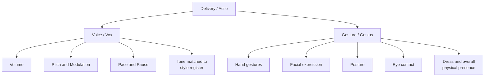

## Delivery: Presenting With Voice and Body

### Overview

**Key Points**

- **Delivery** (*actio* or *pronuntiatio* in Latin; *hypokrisis* in Greek) is the fifth and final classical canon — the physical execution of a speech through voice and body, governing how effectively invented, arranged, styled, and memorized content is actually communicated to a live audience.
- Ancient sources treat delivery as strikingly consequential — Demosthenes is reported to have identified delivery as the first, second, and third most important element of oratory, ranking it above invention and style themselves in practical persuasive effect.
- Delivery received systematic treatment across the tradition, from early handbook coverage through Quintilian's extensive Book 11 discussion of voice, gesture, posture, and even appropriate dress — representing the most detailed ancient synthesis of the canon.

---

### The Two Components: Voice and Gesture

Classical treatments (most fully in Quintilian, *Institutio Oratoria* Book 11.3) divide delivery into two coordinated domains:

#### Voice (*Vox*)

| Element | Classical Concern |
| --- | --- |
| **Volume** | Sufficient projection without strain; modulation for emphasis |
| **Pitch/Modulation** | Variation to avoid monotony; matching pitch to emotional content |
| **Pace/Tempo** | Speed appropriate to content complexity and emotional register |
| **Pause** | Strategic silence for emphasis, comprehension, and dramatic effect |
| **Tone/Quality** | Vocal quality conveying sincerity, conviction, or appropriate emotional coloring |

- Quintilian stresses that vocal delivery should vary according to the **content and emotional register** being expressed — a passage in plain style (*docere*) calls for measured, clear vocal delivery, while grand-style passages aimed at *movere* call for greater vocal intensity and variation, directly linking the delivery canon back to the style canon's three registers.

#### Gesture and Physical Presence (*Gestus*)

| Element | Classical Concern |
| --- | --- |
| **Hand gestures** | Quintilian catalogues an extensive taxonomy of specific hand positions and their conventional meanings within Roman oratorical practice |
| **Facial expression** | Coordinated with vocal tone and content to reinforce sincerity |
| **Posture and stance** | Composed, dignified bearing appropriate to the speaker's ethos |
| **Eye contact/gaze direction** | Engagement with the audience as part of establishing connection |
| **Overall bearing/dress** | Quintilian addresses appropriate attire and general physical presentation as part of the orator's credibility-supporting presence |

- [Unverified] Quintilian's specific catalogue of conventional Roman hand gestures is culturally and historically specific to Roman oratorical practice; the general principle (coordinated, purposeful gesture reinforces vocal delivery) transfers to modern contexts, but the specific gestural vocabulary described in the *Institutio Oratoria* is not directly applicable without adaptation to modern audiences and conventions.

---

### The Aristotelian and Ciceronian Ambivalence

- Aristotle addresses delivery only briefly in the *Rhetoric*, expressing some ambivalence — he acknowledges its practical importance for competitive success but treats sustained focus on delivery as somewhat beneath the philosophically serious concerns of invention and argument, reflecting a broader tension in the tradition between valuing delivery's practical effectiveness and viewing excessive focus on it as superficial "performance" over substance.
- Cicero, by contrast, gives delivery substantially more weight in *De Oratore*, treating it as inseparable from an orator's overall effectiveness and explicitly linking physical delivery to the sincere expression of genuine emotion — Cicero argues that an orator cannot move an audience to an emotion the orator does not genuinely convey through voice and body, tying delivery back to authentic ethos and pathos rather than mere technique.
- [Inference] This tension — delivery as essential practical skill versus delivery as potentially superficial "performance" divorced from substantive content — recurs directly in modern skepticism toward polished "presentation skills" training perceived as style-over-substance, echoing the ancient debate about delivery's proper status relative to the other canons.

---

### Quintilian's Systematic Treatment

- Book 11 of the *Institutio Oratoria* provides the most comprehensive ancient synthesis, treating delivery as a skill requiring the same deliberate, systematic training as the other four canons — not a natural talent some possess and others lack, but a teachable discipline.
- Quintilian explicitly connects delivery to **appropriateness (*aptum*/decorum)**, the same principle governing style choice: physical delivery, like verbal style, must fit the speaker's character, the subject matter, the audience, and the occasion — excessive theatrical gesture in a solemn context, or flat delivery in a moment demanding *movere*, both constitute decorum failures.
- He also connects delivery to memory (*memoria*), noting that a speaker who has genuinely internalized material (rather than reading verbatim from a text) delivers with greater natural fluency, eye contact, and audience engagement — reinforcing the interdependency among the five canons discussed in the memoria module.

---

### Modern Applications: Executive and Public Presence

#### Direct Continuities

| Classical Concept | Modern Executive Communication Application |
| --- | --- |
| Vocal modulation matched to content register | Varying pace/tone between data-reporting segments and vision-casting segments of a presentation |
| Strategic pause | Deliberate pausing before or after a key point for emphasis and audience processing |
| Gesture coordinated with content | Purposeful (not fidgety or distracting) hand movement reinforcing key points |
| Decorum/appropriateness in delivery | Matching physical energy and formality to the specific audience and occasion (board room vs. all-hands vs. media interview) |
| Genuine emotional congruence (Cicero) | Modern communication coaching's emphasis on "authenticity" — audiences perceive incongruence between stated content and actual vocal/physical delivery as insincerity |

**Example**

An executive delivering difficult layoff news with a flat, rapid, disengaged vocal delivery — regardless of how well-crafted the actual words are (strong invention, arrangement, and style) — undermines the message's credibility by violating Ciceronian delivery principles: the audience perceives a mismatch between the gravity of the content and the physical/vocal delivery, damaging ethos even when the verbal content itself is appropriate.

#### Modern Extensions Beyond Classical Scope

- **Video and remote delivery**: contemporary executive communication increasingly occurs via video call or recorded video, introducing delivery considerations (camera framing, eye-line to lens rather than to a live audience, screen-share coordination) with no direct classical antecedent, though the underlying principles of vocal modulation and purposeful gesture remain applicable and adapted.
- **Slide/visual coordination**: modern delivery often requires coordinating spoken delivery with a simultaneous visual display (slides, dashboards) — a layer of complexity absent from classical oratory's live-audience-only context, requiring new skills (not looking at slides while speaking, using slides to support rather than replace vocal delivery) that extend but do not contradict classical decorum principles.

---

### Delivery Failures: Common Diagnostic Patterns

**Key Points**

- **Monotone delivery**: failing to vary pitch/pace, undermining audience engagement regardless of content quality — a direct violation of the vocal modulation principle Quintilian emphasizes.
- **Gesture-content mismatch**: physical gestures disconnected from or contradicting spoken content (nervous fidgeting during a confidence-requiring moment) — a decorum failure in Quintilian's framework.
- **Reading verbatim without internalization**: delivery that is clearly read rather than genuinely known, reducing eye contact, natural vocal variation, and audience connection — the practical cost of skipping genuine memoria that Quintilian's Book 11 discussion anticipates.
- **Register mismatch in delivery**: overly theatrical, "grand style" vocal delivery applied to routine informational content, or flat "plain style" delivery applied to a moment genuinely requiring *movere* — paralleling the register-mismatch failure discussed under the style canon.

---

**Related Topics**

- Quintilian's *Institutio Oratoria* Book 11: Full Treatment of Delivery
- Demosthenes and the Primacy of Delivery in Ancient Oratory
- *Aptum*/Decorum Across All Five Canons
- The Five Canons as an Integrated System: Review and Synthesis
- Modern Public Speaking Coaching Through a Classical Lens
- Video and Remote Delivery: Extending Classical Principles to New Media