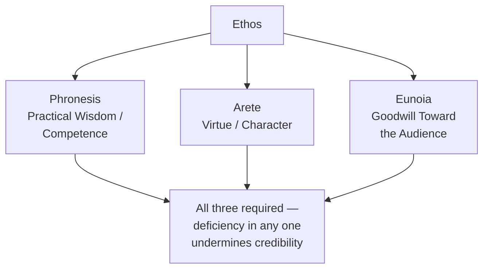

## Ethos: Establishing Credibility, Character, and Trust

### Overview

**Key Points**

- **Ethos** (Greek for "character") is one of Aristotle's three artistic proofs (*pisteis*) — persuasion achieved through the audience's perception of the speaker's credibility, character, and trustworthiness.
- Aristotle makes a striking claim in the *Rhetoric* that ethos is often the **most authoritative** of the three proofs — audiences are more readily persuaded by someone they judge credible, sometimes regardless of the argument's objective logical strength.
- Crucially, Aristotle insists ethos must be constructed **through the speech itself** — a speaker's prior reputation is a separate matter (what modern theory calls extrinsic/prior ethos); genuine rhetorical ethos is achieved through the quality of the argument, tone, and self-presentation within the discourse.

---

### Aristotle's Three Components of Ethos

Aristotle's *Rhetoric* (Book I, Chapter 2) identifies three qualities that jointly constitute persuasive ethos:

| Component | Greek Term | Definition |
| --- | --- | --- |
| **Practical Wisdom** | *Phronesis* | Perceived good sense, competence, and sound practical judgment |
| **Virtue** | *Arete* | Perceived good moral character and integrity |
| **Goodwill** | *Eunoia* | Perceived genuine concern for the audience's own interests, not merely the speaker's |

- All three are necessary; deficiency in any single component undermines overall ethos. Aristotle notes specifically that a speaker may be seen as competent (*phronesis*) and virtuous (*arete*) yet still fail to persuade if the audience doubts the speaker's goodwill (*eunoia*) toward them specifically — competence and character alone do not guarantee an audience believes the speaker has *their* interests at heart.

**Example**

A new CFO presenting a turnaround plan builds *phronesis* through rigorous, well-sourced financial modeling; builds *arete* by transparently acknowledging past forecasting errors rather than concealing them; and builds *eunoia* by explicitly framing the plan's benefits in terms of employee job security, not just shareholder return — an audience doubting the third component (suspecting the plan serves only executive bonuses) will resist the message even while acknowledging the CFO's competence and honesty.

---

### Intrinsic vs. Extrinsic Ethos

Modern rhetorical scholarship extends Aristotle's framework with a distinction not explicitly named in the *Rhetoric* itself but consistent with it:

- **Extrinsic (prior) ethos**: credibility a speaker brings *into* the speech situation — reputation, credentials, title, track record, known affiliations.
- **Intrinsic (situated) ethos**: credibility constructed *within* the discourse itself — through the quality of argument, tone, self-presentation, and demonstrated fairness to opposing views.

[Inference] Aristotle's insistence that ethos is "constructed through the speech" is best read as a claim about *intrinsic* ethos specifically — he is not denying that reputation matters in practice, but arguing that rhetorical theory proper should focus on what the speaker can construct through skill, since prior reputation is not itself a rhetorical technique that can be taught. This distinction remains directly useful for analyzing modern situations where extrinsic and intrinsic ethos diverge.

**Example**

A well-credentialed new executive (strong extrinsic ethos from a prior track record) can still damage credibility within a single presentation through evasive answers or a defensive tone (weak intrinsic ethos), while a lesser-known speaker can build substantial intrinsic ethos within a single well-reasoned, transparent presentation despite limited extrinsic reputation.

---

### Cicero and Quintilian on Ethos

- Cicero's *De Oratore* extends ethos beyond Aristotle's analytical framework into a fuller ideal: the orator should genuinely *be* broadly learned and wise, not merely appear so — treating ethos as substantially rooted in the speaker's actual character and education, not purely as a rhetorical effect to be manufactured.
- Quintilian's *vir bonus dicendi peritus* standard ("a good person skilled in speaking") represents the strongest classical claim about ethos: genuine moral goodness is treated as a **necessary condition** for true oratory, not merely an effective rhetorical strategy — a stronger and more ethically demanding position than Aristotle's more analytically neutral treatment of ethos as one persuasive proof among three.

| Thinker | Position on Ethos |
| --- | --- |
| **Aristotle** | Ethos is a proof constructed through the speech; analytically neutral regarding whether the speaker's underlying character is actually good |
| **Cicero** | The ideal orator should genuinely possess broad wisdom and virtue, not merely project it |
| **Quintilian** | Genuine moral goodness is a *necessary condition* for authentic oratory — a skilled bad person is not, properly speaking, achieving true rhetoric at all |

---

### Building Ethos in Executive Communication

#### Practical Mechanisms Mapped to the Three Components

| Component | Executive Communication Techniques |
| --- | --- |
| **Phronesis (competence)** | Demonstrating rigorous preparation; citing credible data and methodology; acknowledging complexity rather than oversimplifying; showing command of relevant detail without over-explaining |
| **Arete (character)** | Transparency about limitations, risks, or past mistakes; consistency between stated values and past actions; avoiding euphemism on difficult topics |
| **Eunoia (goodwill)** | Explicitly addressing audience-specific concerns and stakes; demonstrating the message serves audience interests, not only the speaker's/organization's; genuine responsiveness to questions and objections |

**Example**

An executive addressing a skeptical, previously misled audience (e.g., after a prior broken commitment) faces an elevated ethos burden — extrinsic ethos has been damaged by past events, requiring disproportionate intrinsic ethos-building within the current communication: unusually high transparency (*arete*), explicit acknowledgment of the prior failure (rather than avoidance, which would itself damage *arete* further), and concrete evidence of changed approach (*phronesis*) to rebuild trust.

#### Ethos Erosion: Common Failure Patterns

- **Overclaiming competence** (false *phronesis*): asserting certainty beyond what evidence supports, which damages credibility once contradicted by events — a violation of the honest enthymematic reasoning classical rhetoric requires.
- **Perceived self-interest** (failed *eunoia*): audiences who conclude a message serves only the speaker's or organization's interest, with no genuine concern for the audience, resist persuasion regardless of argument quality — directly matching Aristotle's observation that competence and virtue alone do not suffice without perceived goodwill.
- **Inconsistency between word and action** (failed *arete*): stated values contradicted by observable behavior over time erode character-based credibility cumulatively, often more damagingly than any single weak argument.

---

### Ethos and the Other Proofs: Interdependence

**Key Points**

- Ethos does not operate in isolation from **logos** and **pathos** — Aristotle's tripartite system treats the three proofs as mutually reinforcing: strong logos (sound argument) supports *phronesis*; appropriate pathos (genuine, well-calibrated emotional appeal) can reinforce *eunoia* by demonstrating the speaker shares the audience's concerns.
- [Inference] A common practical failure is treating ethos-building as a separate, isolated communication task (e.g., a standalone "credibility statement" at a speech's opening) rather than recognizing that ethos is cumulatively constructed through the quality of reasoning and appropriate emotional register throughout the entire discourse — consistent with Aristotle's claim that ethos should be produced by the speech itself, not asserted as a separate claim about the speaker's qualifications.

---

**Next Steps**

- Pathos: Engaging Audience Emotion Appropriately
- Logos: Constructing Sound Enthymematic Argument
- *Kairos*: Timing's Role in Ethos and the Broader Rhetorical Situation
- Quintilian's *Vir Bonus* Standard: Ethics and Oratory in Depth
- Ethos Repair: Rebuilding Credibility After a Trust Breach
- Intrinsic vs. Extrinsic Ethos in Modern Media and Political Communication