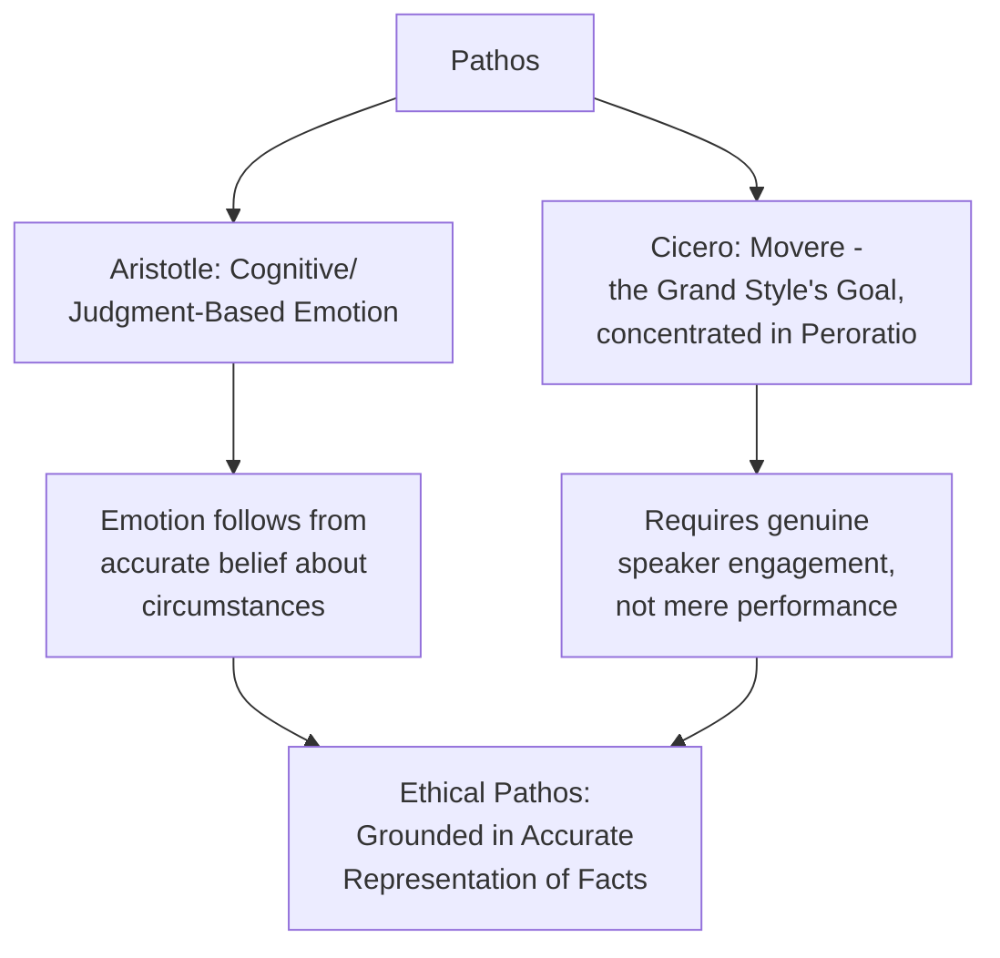

## Pathos: Engaging Emotion Without Manipulation

### Overview

**Key Points**

- **Pathos** (Greek for "suffering" or "experience," broadly "emotion") is the second of Aristotle's three artistic proofs — persuasion achieved by putting the audience into an appropriate emotional state, since judgments differ depending on whether one feels friendship or hatred, calm or anger.
- Aristotle's treatment of pathos is notably systematic and cognitive rather than merely manipulative in intent: the *Rhetoric* (Book II) provides a detailed analysis of specific emotions, each defined by the beliefs and circumstances that give rise to it — treating emotion as *responsive to reasoning*, not opposed to it.
- The ethical boundary between legitimate pathos and manipulation is a central and recurring concern across the classical tradition, directly relevant to modern executive and political communication ethics.

---

### Aristotle's Cognitive Theory of Emotion

- Unlike a view of emotions as purely irrational disturbances to be avoided in serious discourse (a view associated with some Stoic philosophy), Aristotle treats each emotion as **judgment-based**: an emotion arises from a person's belief about their circumstances, meaning emotions can be legitimately *appealed to* by presenting accurate information that reasonably produces that belief.
- For each emotion discussed in Book II, Aristotle provides a consistent three-part analysis:
  1. **The state of mind** of people who feel this emotion
  2. **The people** toward whom it is typically felt
  3. **The grounds** on which it is felt

**Example**

Aristotle's analysis of *anger* (Book II, Chapter 2) defines it as a desire for revenge accompanied by pain, arising from a perceived unjustified slight against oneself or those one cares about. This structured analysis allows an orator to legitimately evoke justified anger by accurately demonstrating that an actual unjustified slight has occurred — versus illegitimately manufacturing anger through exaggeration or fabrication of a slight that did not actually occur.

### Aristotle's Catalogue of Emotions (Selected)

| Emotion | Aristotle's Core Definition | Rhetorical Function |
| --- | --- | --- |
| **Anger** (*orge*) | Desire for revenge following a perceived unjustified slight | Motivating audience toward corrective action against injustice |
| **Fear** (*phobos*) | Pain/disturbance from imagining a destructive or painful future evil as near | Motivating caution, urgency, or preventive action |
| **Pity** (*eleos*) | Pain at an apparent undeserved evil befalling someone, imagining it could happen to oneself | Building sympathy and support for those affected |
| **Indignation** (*nemesis*) | Pain at someone's undeserved good fortune | Motivating resistance to perceived unfair advantage |
| **Emulation** (*zelos*) | Pain at another's possession of goods one desires and believes attainable, motivating self-improvement rather than resentment | Inspiring aspirational action |
| **Confidence** (*tharsos*) | The opposite of fear; expectation of safety or attainable good | Motivating decisive action or reassurance |

---

### Pathos in Cicero's Framework: *Movere*

- Cicero's tripartite division of the orator's aims (*docere*, *delectare*, *movere* — to teach, to please, to move) locates pathos specifically within *movere*, associated with the grand style (*genus grande*) and typically reserved for climactic or high-stakes moments in a speech, particularly the *peroratio* (conclusion).
- Cicero, echoed by Quintilian, argues that genuine emotional appeal requires the **speaker to actually feel** the emotion being conveyed — an orator cannot convincingly move an audience to grief, anger, or fear through purely technical performance without some genuine emotional engagement, linking pathos directly back to authentic ethos.

---

### The Ethical Boundary: Legitimate Appeal vs. Manipulation

**Key Points**

- The central ethical question for pathos, recurring from Plato's critique through modern communication ethics, is: does the emotional appeal accurately represent the underlying situation, or does it exploit emotional response independent of (or contrary to) the facts?
- Classical theory, particularly Aristotle's cognitive framework, provides a structural answer: **legitimate pathos is grounded in accurate representation of circumstances that reasonably produce the emotion**; **manipulative pathos manufactures or exaggerates the emotion-producing belief beyond what the actual facts support**.

| Dimension | Legitimate Pathos | Manipulative Pathos |
| --- | --- | --- |
| **Relationship to fact** | Emotion follows from an accurate account of real circumstances | Emotion is produced by exaggeration, fabrication, or selective distortion of circumstances |
| **Audience treatment** | Audience's emotional response is a reasonable judgment given true information | Audience's emotional response is engineered independent of (or despite) accurate information |
| **Transparency** | The basis for the emotional appeal is visible and can be evaluated by the audience | The basis is obscured, or the appeal relies on the audience not scrutinizing it |
| **Proportion** | Emotional intensity is proportionate to the actual stakes/facts | Emotional intensity is deliberately disproportionate to actual stakes to overwhelm judgment |

**Example**

A crisis communication describing a genuine safety incident's real severity, including honest acknowledgment of risk to build appropriate concern and urgency, constitutes legitimate pathos (fear/concern proportionate to actual facts). The same communication artificially amplifying minor, low-risk details with sensationalized language to manufacture disproportionate alarm — or conversely, minimizing genuinely serious facts to suppress warranted concern — both constitute manipulative pathos by this framework, in opposite directions.

- [Inference] This accuracy-based criterion does not eliminate all judgment calls (reasonable people can disagree about how "proportionate" a given emotional register is to genuinely uncertain or complex facts), but it provides a workable diagnostic distinct from a simple rule like "avoid emotional appeal entirely," which would misread both Aristotle's and Cicero's actual position — neither treats pathos itself as illegitimate, only its ungrounded or disproportionate use.

---

### Pathos in Executive and Organizational Communication

#### Legitimate Applications

| Emotion (Aristotelian) | Organizational Communication Context |
| --- | --- |
| **Confidence** (*tharsos*) | Reassuring stakeholders during uncertainty, grounded in genuine positive indicators |
| **Fear/Concern** (*phobos*) | Motivating urgency around a genuine competitive threat or compliance risk |
| **Emulation** (*zelos*) | Inspiring teams toward genuinely attainable performance benchmarks (e.g., a comparable company's achievement) |
| **Pity/Sympathy** (*eleos*) | Building support for employees or communities genuinely affected by a difficult decision (layoffs, restructuring) |

**Example**

A leader building urgency for a strategic pivot by accurately presenting a genuine competitive threat (grounded fear, proportionate to real market data) exercises legitimate pathos. The same leader manufacturing a crisis narrative disconnected from actual market conditions to pressure quick adoption of a preferred initiative exercises manipulative pathos — same emotional appeal (fear/urgency), different relationship to underlying fact, per the classical diagnostic framework.

#### Common Organizational Pathos Failures

- **Disproportionate urgency ("crying wolf")**: repeatedly invoking high-stakes emotional framing for routine matters erodes long-term ethos and pathos effectiveness, since audiences recalibrate their trust in the speaker's emotional signaling over time.
- **Suppressed legitimate emotion**: excessive plain-style, purely logos-driven communication during moments genuinely warranting acknowledgment of difficulty (layoffs, failures) can itself be a failure — Cicero's *movere* is not optional decoration but is treated as necessary for occasions that genuinely call for it; flat delivery of genuinely grave news can read as callous, damaging *eunoia*.
- **Emotion substituting for evidence**: using emotional appeal to paper over weak or absent logos, which classical rhetoric treats as an incomplete (and ethically questionable) use of the three proofs, since Aristotle's system assumes all three proofs work together rather than one compensating for the deliberate absence of another.

---

### Pathos and the Other Proofs

**Key Points**

- Aristotle explicitly treats ethos, pathos, and logos as **jointly necessary** rather than substitutable — an argument with sound logos but no pathos may fail to motivate action even when intellectually accepted; strong pathos with weak logos risks manipulation; and pathos disconnected from ethos (a speaker who does not seem to genuinely hold the represented concern) rings false.
- [Inference] The frequent modern framing of pathos as inherently suspect or the "least legitimate" of the three proofs likely reflects the Platonic critique's long cultural influence more than Aristotle's own more balanced treatment — in the *Rhetoric*, pathos receives the single longest sustained analytical treatment of the three proofs (the whole of Book II's early chapters), suggesting Aristotle regarded its careful, disciplined use as a serious and legitimate component of rhetorical skill, not a lesser or dispensable one.

---

**Related Topics**

- Aristotle's Full Catalogue of Emotions (*Rhetoric* Book II)
- Ethos: Establishing Credibility, Character, and Trust
- Logos: Constructing Sound Enthymematic Argument
- The Ethics of Persuasion: Legitimate Appeal vs. Manipulation Across History
- Crisis Communication and Proportionate Emotional Framing
- Cicero's *Movere* and the Grand Style Revisited