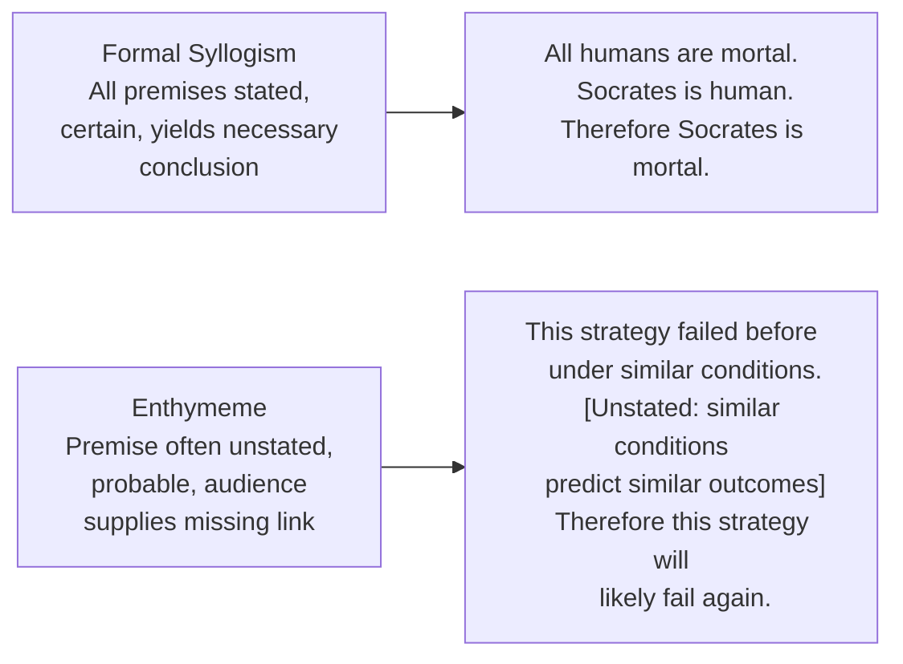
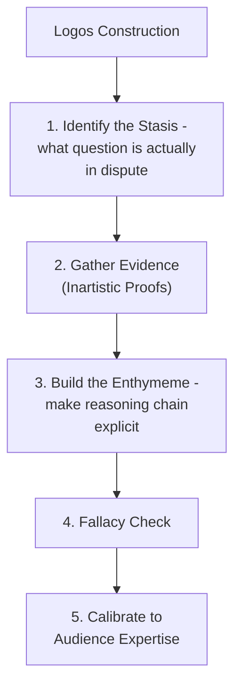

## Logos: Building Logical, Evidence-Based Arguments

### Overview

**Key Points**

- **Logos** (Greek for "word," "reason," or "account") is the third of Aristotle's three artistic proofs — persuasion achieved through the argument itself: the reasoning, evidence, and logical structure presented to the audience.
- Aristotle situates logos within rhetoric's proper domain of **probability rather than certainty** — practical matters (politics, ethics, business) rarely admit deductive proof, so rhetorical logos operates primarily through the **enthymeme** (a probabilistic, often abbreviated syllogism) rather than strict formal logic.
- Logos is frequently treated in popular usage as the sole legitimate basis of "real" argument (as opposed to ethos or pathos), but Aristotle's own framework treats all three proofs as jointly necessary — logos is not superior to ethos and pathos but addresses a distinct dimension of persuasion: the audience's reasoned judgment of the argument's substance.

---

### The Enthymeme: Rhetoric's Core Logical Structure

#### Definition and Structure

- An **enthymeme** is a rhetorical syllogism — an argument drawing a probable conclusion from premises that are themselves generally accepted (*endoxa*) rather than certainly true, and often with one premise left unstated because the audience is expected to supply it.
- This differs from a formal (dialectical/demonstrative) syllogism, which requires fully stated, certain premises to yield a necessary conclusion.

**Example**

"This vendor missed three consecutive deadlines, so we shouldn't renew the contract" is an enthymeme: the stated premise (missed deadlines) and conclusion (don't renew) rely on an unstated, generally accepted premise (past reliability predicts future reliability) that the audience supplies automatically — the argument's persuasive efficiency comes precisely from *not* over-explaining what the audience already accepts.

#### Why the Enthymeme Suits Rhetorical (Not Just Logical) Purposes

- Aristotle observes that enthymemes are persuasively efficient partly *because* they engage the audience in completing the reasoning themselves — an audience that supplies the missing premise experiences a degree of ownership over the conclusion, which classical and modern rhetoric both recognize as more persuasive than a fully explicit, externally imposed chain of reasoning.
- [Inference] This built-in audience participation is a specifically rhetorical (not purely logical) feature — a formal logical proof does not require or benefit from audience "buy-in" to be valid, but a persuasive enthymeme's effectiveness is partly constituted by the audience's active cognitive engagement in completing it.

---

### Sources of Enthymematic Premises: The Topics Revisited

- Logos construction draws directly on the **topical invention system** (covered under the Invention canon): the common topics (definition, comparison, cause-effect, circumstance, testimony) function as the standard sources from which enthymematic premises are generated.
- Aristotle also identifies specific **topics of the enthymeme** — patterns of probable inference particularly suited to rhetorical argument, including arguments from:
  - **Cause to effect** and **effect to cause**
  - **Degree** (if the greater/lesser case holds, the lesser/greater likely holds too — *a fortiori* reasoning)
  - **Precedent/analogy** (comparison to similar past cases)
  - **Consequence** (evaluating an action by its probable results)

**Example**

An *a fortiori* (degree-based) enthymeme in a business context: "If even our most loyal customers are complaining about response times, newer customers are almost certainly experiencing worse — we need to act now" reasons from a stronger case (loyal customers, presumably more tolerant) to infer an even stronger problem in a weaker case (newer customers, presumably less tolerant).

---

### Evidence and the Inartistic Proofs

- Logos frequently incorporates **inartistic proofs** (evidence existing independent of the speaker's rhetorical skill — see the Invention module) as the factual basis for enthymematic reasoning: data, precedent, documents, expert testimony.
- Aristotle's framework treats such evidence as raw material that logos organizes and reasons from, not as self-sufficiently persuasive on its own — data alone does not constitute logos; the *reasoning connecting the data to the conclusion* is what constitutes the rhetorical proof.

[Inference] This distinction has direct practical relevance to modern data-driven executive communication: presenting extensive data without a clearly articulated reasoning chain connecting that data to the recommended conclusion is a common logos failure — the inartistic proof (data) is present, but the artistic proof (the enthymematic reasoning linking data to conclusion) is missing or left implicit in a way the audience may not reliably supply correctly.

---

### Cicero and Quintilian on Logos

- Cicero's *Topica* systematizes topical invention specifically as a tool for generating logos, adapting Aristotle's topics into a practical Roman legal and deliberative framework.
- Quintilian's extensive treatment of **stasis theory** (Books 3–7) functions as a logos-construction discipline: correctly identifying the stasis (conjectural, definitional, qualitative, translative) determines what kind of evidence and reasoning is actually relevant, preventing logos from being marshaled toward the wrong question.
- Both authors, echoing Aristotle, treat logos as inseparable from the orator's broader command of subject matter — Cicero's insistence in *De Oratore* that the ideal orator possess genuine expertise (not merely rhetorical technique) reflects a view that strong logos requires substantive knowledge, not formal argumentative skill alone.

---

### Common Logical Fallacies: When Logos Fails

Classical and modern argumentation theory identify recurring patterns where apparent logos fails to constitute genuine sound reasoning — often overlapping with what the sophistry tradition identified as "making the weaker argument appear stronger":

| Fallacy | Definition | Example |
| --- | --- | --- |
| **False cause** (*post hoc*) | Assuming correlation or sequence implies causation | "Sales rose after the rebrand, so the rebrand caused the increase" (ignoring other concurrent factors) |
| **False analogy** | Treating two cases as sufficiently similar when key differences undermine the comparison | "This merger will succeed like Company X's did" (ignoring material differences in market conditions) |
| **Hasty generalization** | Drawing a broad conclusion from insufficient or unrepresentative evidence | "Two clients complained, so all clients are dissatisfied" |
| **False dilemma** | Presenting only two options when others exist | "Either we cut costs or we go bankrupt" (ignoring intermediate options) |
| **Appeal to authority (illegitimate)** | Citing authority irrelevant to the specific claim, or treating authority as sufficient without underlying evidence | Citing a celebrity endorsement as evidence for a technical business decision |

**Example**

An executive argument that "our competitor raised prices and their revenue grew, so we should raise prices too" risks both false cause (assuming the price increase, rather than other factors, caused their growth) and false analogy (assuming sufficiently similar market position/customer base to generalize the outcome) — illustrating how weak logos can appear structurally similar to strong logos without recognizing which fallacies undermine it.

---

### Logos in Executive Communication

#### Constructing Sound Logos

| Step | Executive Communication Application |
| --- | --- |
| **Identify the actual question (stasis)** | Confirm whether the audience disputes the facts, the interpretation, the justification, or the process/forum before building the case |
| **Gather inartistic proof** | Assemble credible data, precedent, and evidence relevant to the identified question |
| **Construct the enthymeme explicitly** | Make the reasoning chain connecting evidence to conclusion visible, not merely implied, especially for complex or high-stakes claims |
| **Check for fallacies** | Test the argument against common failure patterns (false cause, false analogy, hasty generalization) before presenting |
| **Match complexity to audience** | Adjust how much of the reasoning chain needs to be made explicit based on the audience's expertise and prior beliefs |

---

### Logos and the Other Proofs: Interdependence

**Key Points**

- Aristotle's system treats logos as necessary but not sufficient on its own — an audience may accept an argument's logical soundness yet remain unmoved to act without appropriate pathos, or may distrust even sound logos from a speaker lacking ethos.
- [Inference] The common assumption that "if the data is good enough, the argument will win" reflects an incomplete reading of Aristotle's tripartite system — the *Rhetoric*'s entire structure argues against logos-only persuasion as adequate for rhetoric's actual domain (contingent, practical matters before a general audience), treating all three proofs as jointly required rather than logos alone being sufficient.

---

**Next Steps**

- The Enthymeme in Depth: Aristotle's *Rhetoric* Book I, Chapter 2
- Stasis Theory as a Logos-Construction Discipline
- A Working Taxonomy of Logical Fallacies for Argument Evaluation
- Ethos: Establishing Credibility, Character, and Trust
- Pathos: Engaging Emotion Without Manipulation
- Data-Driven Persuasion: Making the Enthymematic Chain Explicit in Business Cases