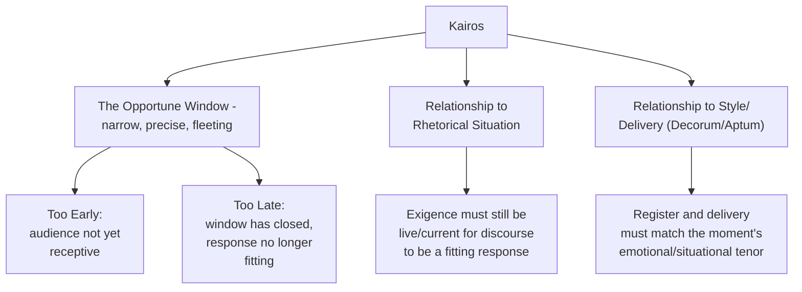

## Kairos: Reading Timing and Opportune Moments

### Overview

**Key Points**

- **Kairos** (Greek for "the right/opportune moment") is a foundational concept in classical rhetoric denoting the fitting, timely occasion for speech — the idea that the *same* content, delivered at the wrong moment, fails, while the right content at the right moment succeeds.
- Unlike ethos, pathos, and logos, kairos is not one of Aristotle's three artistic proofs in the *Rhetoric*'s formal structure, but functions as a **governing situational principle** that determines how the other proofs should be deployed — it answers not "what should be argued" but "when and how it should be argued, given this specific moment."
- Kairos has ancient roots predating formal rhetorical theory (originally an archery/weaving term denoting a precise critical point or opening) and remains one of the most direct classical concepts underlying modern strategic communication timing.

---

### Etymology and Pre-Rhetorical Origins

- *Kairos* originally referred to a precise, critical opening or moment of opportunity in concrete physical contexts — an archer's exact opening to loose an arrow through a gap, or the specific critical point in weaving where the shuttle must pass through the shed of threads.
- [Unverified] The precise technical origin (archery vs. weaving vs. both) is debated among etymologists and classicists, though both metaphors converge on the same core meaning: a narrow, precise window of opportunity that must be recognized and acted upon at the exact right instant, not before or after.
- The concept was personified in Greek art and poetry as **Kairos**, often depicted as a youth with a forelock of hair (graspable only while approaching, impossible to seize once passed) and winged heels (signifying how quickly the opportunity departs) — a visual encoding of the concept's core insight: opportunity is fleeting and must be seized precisely when present.

---

### Kairos vs. Chronos: Two Concepts of Time

Greek distinguished two words for "time," reflecting a conceptual distinction directly relevant to rhetorical theory:

| Concept | Greek Term | Meaning |
| --- | --- | --- |
| **Chronos** | Χρόνος | Sequential, measurable, quantitative time — clock time, duration, chronology |
| **Kairos** | Καιρός | Qualitative time — the right, fitting, opportune moment; a *critical point* rather than a *duration* |

**Example**

A product announcement scheduled six months in advance (chronos — a fixed point on the calendar) may or may not coincide with genuine kairos (the moment when the market, competitive landscape, and audience attention are actually receptive) — the classical distinction highlights that calendar scheduling and rhetorical timing are related but not identical considerations.

---

### Kairos in the Sophistic and Aristotelian Traditions

#### Gorgias and the Sophists

- Kairos held particular importance for the Sophists, especially **Gorgias**, for whom the concept was closely tied to a broader view that truth itself is situational and audience/context-dependent — since no fixed, timeless truth exists independent of circumstance, skillful rhetoric consists precisely in reading and responding to the specific, ever-shifting kairotic moment.
- [Inference] This sophistic emphasis on kairos as central (rather than as a secondary situational consideration) is consistent with the broader sophistic relativism Plato criticized (see the earlier module on Rhetoric vs. Sophistry) — if kairos essentially *is* the truth of the moment, this collapses the distinction between "reading the moment well" and "there being no stable truth beyond the moment," which is precisely what troubled Plato's critique.

#### Aristotle's More Modest Integration

- Aristotle does not develop kairos as an independent formal category to the same degree as the Sophists, but the concept is functionally embedded throughout the *Rhetoric* — particularly in his emphasis on rhetoric as concerned with **the available means of persuasion in a given case** (a formulation inherently situational and audience/moment-specific), and in his detailed treatment of how emotional appeals must fit the audience's actual present state of mind.
- Aristotle's discussion of **decorum/appropriateness** (later systematized more fully by Cicero and Quintilian as *aptum*) can be understood as kairos applied specifically to matching style and delivery to the fitting moment.

---

### Kairos in the Roman Tradition: *Occasio* and *Decorum*

- Latin rhetorical theory does not have a single direct equivalent term for Greek *kairos*, but the concept is distributed across related Roman concepts:
  - ***Occasio***: opportunity or fitting occasion, roughly parallel to kairos's temporal-opportunity sense
  - ***Decorum/Aptum***: appropriateness — fit between style, speaker, audience, subject, and occasion (see the Style module) — the broader Roman category that absorbs much of kairos's situational-fitness function
- Cicero's insistence (in *Orator*) that the skilled orator moves fluidly among the three styles (plain, middle, grand) according to the moment's demands is a direct practical application of kairotic judgment, even without the specific Greek term being retained as central technical vocabulary in Latin rhetorical handbooks.

---

### Kairos Within the Rhetorical Situation Framework

- Kairos connects directly to **Bitzer's rhetorical situation** (covered in an earlier module): Bitzer's concept of **exigence** — an urgent, discourse-solvable problem — is inherently time-bound, since an exigence that has passed or not yet arrived does not call for the same response.
- Kairos can be understood as the *temporal dimension* of fitting response within Bitzer's framework: a discourse can accurately address the correct audience and constraints yet still fail as a "fitting response" if kairos (timing) is wrong — delivered too early (before the audience recognizes the exigence) or too late (after the window for effective response has closed).

---

### Kairos in Executive and Organizational Communication

#### Practical Dimensions of Organizational Kairos

| Dimension | Application |
| --- | --- |
| **Market timing** | Announcing a strategic pivot when competitive/market conditions make the rationale legible to stakeholders, rather than before the need is apparent or after competitors have already moved |
| **Organizational readiness** | Introducing a major change when the organization has sufficient trust/stability to absorb it, versus during unrelated crisis or instability that would compete for attention and goodwill |
| **News cycle/attention context** | Recognizing when competing events (industry news, internal disruptions) will affect how a message is received, independent of the message's own merit |
| **Sequential timing** | Ensuring prerequisite communications (context-setting, stakeholder alignment) occur before a culminating announcement, rather than announcing before groundwork is laid |

**Example**

A well-reasoned (strong logos), well-delivered (strong ethos) proposal for a significant reorganization, announced immediately after a separate, unrelated layoff announcement, fails kairotically even if every other rhetorical element is sound — the audience's actual present emotional and cognitive state (anxious, distrustful) makes this a poorly timed moment regardless of the argument's independent merit, illustrating kairos as a distinct rhetorical failure mode separate from weaknesses in ethos, pathos, or logos themselves.

#### Kairos and Crisis Communication

- Crisis communication is an area where kairotic judgment is especially consequential: the same accurate, well-reasoned statement can be perceived as appropriately prompt or as either premature (before facts are established) or delayed (appearing evasive) depending on precise timing relative to the unfolding situation — a direct modern instance of the archer's "narrow window" metaphor underlying the original concept.
- [Inference] Because kairos concerns a narrow, non-repeatable window, poor kairotic judgment in crisis communication is often uniquely costly compared to failures in ethos, pathos, or logos, which can frequently be *repaired* in follow-up communication — a missed kairotic moment (the "silence" period before an organization's first crisis statement, for example) often cannot be fully recovered even by an excellent statement once finally delivered.

---

### Kairos as the Integrating Principle Across the Rhetorical Triangle

**Key Points**

- Kairos functions less as a fourth co-equal proof alongside ethos, pathos, and logos, and more as the **contextual lens governing how all three should be calibrated** at a given moment — the same speaker (ethos), same audience, and same argument (logos) may call for different pathos intensity, different stylistic register, and different timing depending on the specific kairotic conditions present.
- This makes kairos the practical bridge between the abstract rhetorical triangle/canons and the concrete, ever-shifting demands of real rhetorical situations — a reminder that rhetorical skill, in the classical view, is not simply mastery of fixed techniques but the trained judgment (closely related to Aristotle's *phronesis*) to read and respond to a specific, non-repeatable moment correctly.

---

**Related Topics**

- Gorgias and the Sophistic Roots of Kairos
- Bitzer's Rhetorical Situation: Exigence, Audience, and Constraints Revisited
- *Decorum*/*Aptum*: The Roman Absorption of Kairotic Judgment
- Crisis Communication Timing: Case-Based Analysis
- Ethos, Pathos, Logos: Reviewing the Full Tripartite System
- Strategic Communication Planning and Organizational Readiness