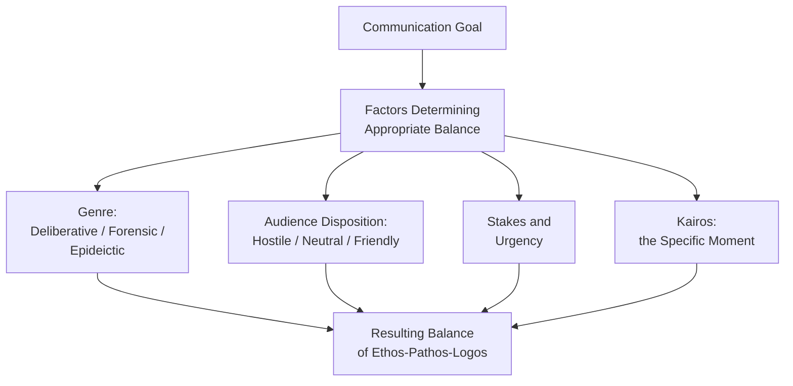
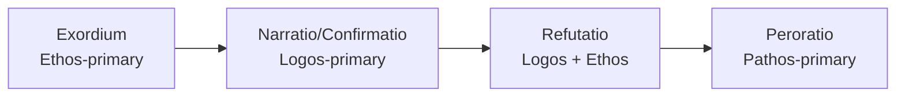

## Balancing the Three Appeals for Different Goals

### Overview

**Key Points**

- Aristotle's tripartite system of ethos, pathos, and logos was never intended as a menu of independent, substitutable options — the *Rhetoric* consistently treats all three as **jointly operative** in effective persuasion, with the appropriate *balance* among them shifting according to the rhetorical situation, genre, and specific communicative goal.
- Classical theory provides no single fixed formula for the "correct" proportion of ethos, pathos, and logos — instead, it provides diagnostic principles (genre, audience disposition, stakes, kairos) for determining what balance a given situation calls for, making balance itself a skill requiring judgment (*phronesis*) rather than mechanical application.
- Misbalancing the three appeals — not merely omitting one entirely — is one of the most common practical rhetorical failures, and classical sources (particularly Quintilian) explicitly warn against both under-use and over-use of any single proof relative to the situation's actual demands.

---

### Why Balance, Not Selection, Is the Governing Principle

- Aristotle's framework does not present ethos, pathos, and logos as alternative *strategies* to choose among, but as three simultaneously present dimensions of any persuasive act — even a purely "logical" argument implicitly carries ethos (the credibility with which it is delivered) and can evoke pathos (the emotional response to accepting or rejecting its conclusion).
- [Inference] This means the practical question facing a communicator is rarely "which proof should I use" but rather "what relative *weight and prominence* should each proof carry, given this specific audience, purpose, and moment" — a reframing that shifts rhetorical skill from binary selection toward calibrated proportion.

---

### Genre as a Primary Determinant of Balance

Classical genre theory (deliberative, forensic, epideictic) provides one of the clearest structural guides to appropriate balance, since each genre's characteristic question orients toward different proof emphases:

| Genre | Primary Question | Typical Emphasis | Rationale |
| --- | --- | --- | --- |
| **Deliberative** | What should we do (future)? | Logos-heavy, with pathos for motivation and ethos for credibility of judgment | Future action requires evidence-based projection (logos) plus sufficient emotional motivation (pathos) to actually move an audience to act, not merely agree intellectually |
| **Forensic** | What happened; was it just (past)? | Logos-heavy for factual/evidentiary questions; pathos concentrated in *peroratio*; ethos throughout for credibility of testimony/character | Establishing facts and justice requires rigorous evidentiary logos, but final judgment (especially before a jury) is also shaped by emotional and character-based appeal |
| **Epideictic** | Is this praiseworthy/blameworthy (present)? | Pathos and ethos-heavy; logos present but typically less argumentatively central since there is often no genuine dispute to resolve | Ceremonial occasions (eulogies, celebrations, culture-building addresses) center on shared values and emotional resonance more than adjudicating a contested claim |

**Example**

A board proposal for market expansion (deliberative) appropriately leads with rigorous logos (market data, financial modeling) but requires calibrated pathos (conveying genuine conviction and urgency) to move the board from intellectual agreement to actual approval — pure data presentation without any motivational register often fails to produce action even when the board finds the logic sound.

---

### Audience Disposition as a Determinant of Balance

- **Hostile or skeptical audiences** typically require disproportionate **ethos-building** before logos or pathos can gain traction — an audience that doubts the speaker's credibility or goodwill will resist even sound arguments and appropriate emotional appeals, since both depend on a baseline of trust to be received as intended rather than as manipulation.
- **Friendly or already-aligned audiences** often require less ethos-building and can proceed more directly to logos (confirming/extending shared views) or pathos (reinforcing shared commitment and motivation), since baseline trust already exists.
- **Highly analytical/expert audiences** typically expect logos to carry proportionally more weight, with restrained pathos (excessive emotional appeal to a technical audience can itself damage ethos by appearing to substitute for rigor).
- **General or non-expert audiences** often require pathos and ethos to carry more persuasive weight relative to logos, since complex technical logos may not be fully assessable by the audience, making trust in the speaker (ethos) and resonance with real stakes (pathos) proportionally more load-bearing.

| Audience Type | Ethos Weight | Pathos Weight | Logos Weight |
| --- | --- | --- | --- |
| Hostile/skeptical | High (must be established first) | Moderate (calibrated carefully to avoid appearing manipulative) | High (rigorous, transparent) |
| Friendly/aligned | Low-moderate (already present) | Moderate-high (reinforcing commitment) | Moderate (confirmatory) |
| Expert/technical | Moderate (competence-based) | Low (restrained) | High (primary driver) |
| General/non-expert | High (trust-dependent) | High (stakes must be made tangible) | Moderate (simplified, accessible) |

**Example**

Presenting the same cost-cutting rationale to a finance committee (expert, logos-primary: detailed modeling, minimal emotional framing) versus to general staff (non-expert, higher ethos/pathos weight: trusted messenger, honest acknowledgment of impact, simplified but transparent reasoning) requires substantially different appeal balances despite identical underlying logic and identical communicator.

---

### Quintilian's Warnings Against Imbalance

- Quintilian explicitly cautions against **excess in any direction**: over-reliance on pathos without sufficient logos risks the audience perceiving manipulation (echoing the sophistry critique); over-reliance on logos without any pathos risks failing to move the audience to actual conviction or action, since Quintilian (following Cicero) holds that intellectual assent and motivated action are distinct outcomes requiring different proof emphases.
- Quintilian's *vir bonus* standard implicitly governs balance as well as content: an ethically serious orator calibrates pathos to the genuine proportionate stakes of the situation (see the Pathos module's manipulation criterion) rather than either suppressing warranted emotion or manufacturing disproportionate emotion — meaning correct balance is partly an ethical, not purely technical, judgment.

---

### Balance Across a Single Communication's Structure

**Key Points**

- Balance is not necessarily uniform throughout a single speech or document — classical arrangement theory (see the Arrangement module) suggests appeal emphasis often shifts by section, following the classical oration's structure:
  - ***Exordium***: primarily ethos (establishing credibility and goodwill at the outset)
  - ***Narratio/Confirmatio***: primarily logos (factual grounding and evidentiary argument)
  - ***Refutatio***: logos-heavy (addressing counterarguments) with ethos reinforcement (demonstrating fairness by engaging opposing views seriously)
  - ***Peroratio***: pathos-concentrated (final emotional appeal, per Cicero's association of *movere* with the conclusion)

**Example**

An executive keynote might open by establishing personal credibility and shared purpose with the audience (ethos-primary exordium), move through data-driven strategic rationale (logos-primary body), address likely skepticism or known objections directly (logos/ethos-balanced refutation), and close with a motivational, values-based call to action (pathos-primary peroratio) — a deliberate shift in balance across the structure rather than uniform appeal-mixing throughout.

---

### Diagnostic Framework for Calibrating Balance

| Question | Implication for Balance |
| --- | --- |
| What genre is this (deliberative/forensic/epideictic)? | Sets baseline expectation per the genre table above |
| Is the audience hostile, neutral, or friendly? | Determines how much ethos-building must precede logos/pathos |
| Is the audience expert or general? | Determines relative logos vs. ethos/pathos weighting |
| What is the goal — intellectual agreement, or motivated action? | Agreement alone may be logos-sufficient; action typically requires pathos |
| What are the stakes and how urgent is kairos? | Higher stakes and greater urgency typically increase warranted pathos weight, proportionate to genuine severity |
| Where in the structure is this passage (opening/body/close)? | Classical arrangement suggests shifting emphasis by section |

---

### Common Imbalance Failure Patterns

- **Logos-only ("just the facts") communication** in contexts requiring motivated action: technically sound but fails to move the audience, particularly with general or emotionally invested audiences — a common failure in executive communication that assumes data alone should be self-evidently persuasive.
- **Pathos-heavy, logos-light communication**: risks being perceived as manipulative or insubstantial, particularly with skeptical or expert audiences who expect rigor — directly recalling the sophistry critique when detected.
- **Ethos-only communication (relying purely on authority/position)**: "trust me because of who I am" without supporting logos or appropriate pathos, which classical theory treats as an incomplete use of the tripartite system and a common failure mode for senior leaders relying on positional authority rather than constructed, situational credibility.
- **Uniform balance regardless of audience or section**: applying the same fixed ethos-pathos-logos ratio throughout a long or multi-audience communication, ignoring that classical theory treats balance as situationally variable rather than fixed.

---

**Next Steps**

- Genre Theory Revisited: Deliberative, Forensic, and Epideictic Balance Patterns
- Audience Analysis Frameworks for Calibrating Appeal Balance
- The Classical Oration Structure and Shifting Appeal Emphasis by Section
- Quintilian's Warnings on Rhetorical Excess and Imbalance
- Case Studies: Diagnosing Appeal Imbalance in Executive Communication
- Ethos, Pathos, Logos, and Kairos: Full System Review