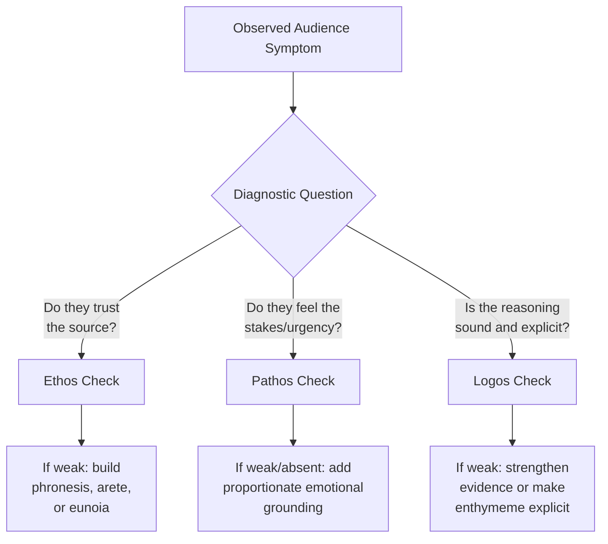
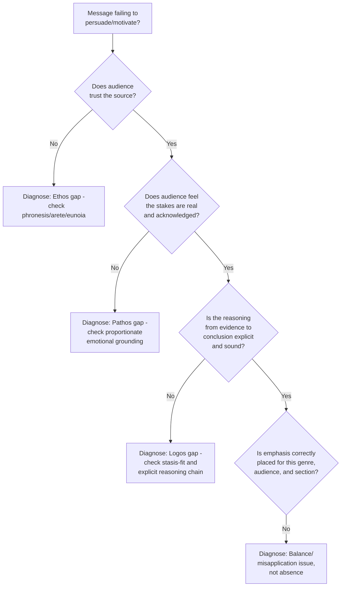

## Diagnosing Which Appeal a Message Is Missing

### Overview

**Key Points**

- Diagnosing appeal deficiency is the applied, analytical counterpart to the balance principles covered in the preceding module — rather than asking "what is the ideal balance," this module addresses the practical skill of examining an *existing* message and identifying which of ethos, pathos, or logos is underdeveloped, missing, or misapplied.
- Classical rhetoric provides no single diagnostic checklist (the ancients focused primarily on *construction* rather than *post-hoc audit* of speeches), but the underlying theoretical distinctions among the three proofs — reviewed across the preceding four modules — yield a systematic, reconstructable diagnostic method directly applicable to reviewing modern executive communication.
- A message can fail persuasively even when it is well-written, well-organized, and factually accurate — because failure often lies not in *any single* appeal being poorly executed, but in one appeal being **entirely absent or badly underweighted** relative to what the audience and purpose require.

---

### The Diagnostic Framework: Symptom → Likely Missing Appeal

Because each proof addresses a distinct audience need, characteristic *symptoms* of audience non-persuasion can be mapped back to a likely missing or weak appeal:

| Symptom | Likely Missing/Weak Appeal | Underlying Explanation |
| --- | --- | --- |
| Audience intellectually agrees but doesn't act | **Pathos** | Logos may be sound, but insufficient motivational force to convert agreement into action |
| Audience distrusts the message despite sound data | **Ethos** | Strong logos cannot compensate for perceived lack of credibility, character, or goodwill |
| Audience feels manipulated or uneasy despite emotional resonance | **Logos** (or ethos) | Pathos unsupported by adequate reasoning reads as manufactured rather than earned |
| Audience is engaged and sympathetic but unconvinced of the actual claim | **Logos** | Strong ethos/pathos has built receptivity, but the argument itself lacks sufficient evidentiary support |
| Audience perceives the message as cold, bureaucratic, or tone-deaf | **Pathos** (or ethos's *eunoia* component) | Content may be accurate and well-argued, but fails to acknowledge the audience's actual emotional stake |
| Audience questions "why should we listen to you/this source" | **Ethos** | Message lacks demonstrated competence, character, or explicit goodwill toward this specific audience |

---

### Step-by-Step Diagnostic Procedure

#### Step 1: Identify the Actual Communicative Goal

- Before diagnosing missing appeals, clarify what the message is actually trying to achieve: mere comprehension, intellectual agreement, emotional buy-in, or motivated action — since different goals have different minimum appeal requirements (see the Balancing module's genre table).
- [Inference] A frequent diagnostic error is treating a message as a "logos failure" (unclear, insufficiently evidenced) when the actual gap is pathos (the audience understands and even agrees but has no motivation to act) — misdiagnosis leads to the wrong fix (adding more data to a message that already has sufficient logos but lacks motivational force).

#### Step 2: Test Each Appeal Independently

**Ethos Test Questions**

- Does the message establish *why this speaker/source* should be trusted on this specific matter (*phronesis*)?
- Does the message demonstrate honesty about limitations, risks, or past errors (*arete*)?
- Does the message make clear that the audience's own interests, not only the speaker's, are genuinely considered (*eunoia*)?

**Pathos Test Questions**

- Does the message acknowledge the audience's actual emotional stake in the outcome?
- Is the emotional register proportionate to the real stakes (neither flat/dismissive nor disproportionate/alarmist)?
- Would a reasonable audience member feel their concerns have been recognized, not just their facts processed?

**Logos Test Questions**

- Is the reasoning chain connecting evidence to conclusion made explicit, or merely implied?
- Is the evidence itself credible, sufficient, and directly relevant to the actual claim (not just adjacent data)?
- Does the message address the specific stasis (conjectural, definitional, qualitative, translative) the audience actually disputes, or does it answer a different question than the one in dispute?

#### Step 3: Distinguish Absence from Misapplication

- A missing appeal is different from a **misapplied** one — pathos may be present but disproportionate (manipulative, per the Pathos module's criterion) rather than simply absent; logos may be present but directed at the wrong stasis question (per Quintilian's stasis-first discipline) rather than genuinely missing.
- **Example**: A message defending a controversial decision that extensively argues the decision was *effective* (qualitative stasis: was it good/justified) when the actual audience dispute is whether the decision-maker had *authority* to make it at all (translative stasis: was this the right process/forum) exhibits a logos misapplication — logos is present and well-constructed, but aimed at the wrong question, which will read to the audience as evasive or non-responsive regardless of its internal quality.

---

### Case-Based Diagnostic Examples

**Example 1 — Missing Pathos**

A merger announcement memo presents rigorous financial rationale (strong logos) and cites the CEO's proven track record (adequate ethos), but employees remain anxious and disengaged. Diagnosis: the memo never acknowledges the genuine uncertainty and stakes employees face (job security, role changes) — a pathos gap, not a logos or ethos gap. Fix: explicit acknowledgment of the emotional reality, not additional data.

**Example 2 — Missing Ethos**

A well-reasoned (strong logos), appropriately empathetic (adequate pathos) proposal from a newly hired executive is met with quiet skepticism from a long-tenured team. Diagnosis: the audience has not yet extended trust to this new, unproven source — an ethos gap specific to this audience's lack of prior relationship with the speaker, regardless of argument quality. Fix: explicit credibility-building (demonstrated understanding of team history/context) before or alongside the substantive proposal.

**Example 3 — Missing Logos**

A passionately delivered (strong pathos), personally credible (strong ethos) call to adopt a new strategic direction leaves an analytically-minded board unconvinced. Diagnosis: the emotional and character-based appeals are well-received, but the underlying evidentiary case for *why this specific strategy* is not made explicit — a logos gap. Fix: make the enthymematic reasoning chain (data → interpretation → recommendation) explicit rather than assuming conviction and credibility alone will carry the board to agreement.

**Example 4 — Present but Misapplied Pathos**

A crisis statement uses urgent, alarming language disproportionate to the actual (moderate) severity of the underlying issue. Diagnosis: pathos is not absent but miscalibrated — disproportionate to genuine stakes, risking a manipulation perception per the Pathos module's accuracy criterion. Fix: recalibrate emotional register to match actual severity, not add or remove pathos wholesale.

---

### A Consolidated Diagnostic Checklist

---

### Limits of the Diagnostic Framework

**Key Points**

- [Inference] This appeal-based diagnostic framework identifies *what kind* of gap likely exists but does not by itself specify the correct *content* of the fix — determining what specific evidence would strengthen logos, or what specific acknowledgment would strengthen pathos, still requires substantive knowledge of the situation (echoing Cicero's insistence that genuine subject-matter expertise, not rhetorical technique alone, underlies effective persuasion).
- The framework also assumes the underlying claim itself is defensible — a message can exhibit strong, well-balanced ethos, pathos, and logos and still fail to persuade a genuinely unpersuadable audience, or fail because the underlying decision itself does not withstand scrutiny; appeal diagnosis addresses *rhetorical construction*, not the independent soundness of the substantive position being argued.
- [Unverified] The relative frequency of each type of appeal gap (ethos vs. pathos vs. logos) across real-world executive communication failures is not something classical rhetorical theory quantifies, and available modern communication research on this specific question is limited; the diagnostic categories themselves are well-grounded in classical theory, but claims about which gap is "most common" in practice would be speculative.

---

**Related Topics**

- Ethos, Pathos, Logos: Full System Review
- Stasis Theory as a Diagnostic Tool for Logos Misapplication
- Balancing the Three Appeals for Different Goals (prior module)
- Audience Analysis Frameworks for Executive Communication
- Case Studies in Message Diagnosis and Revision
- Building a Pre-Delivery Rhetorical Audit Checklist