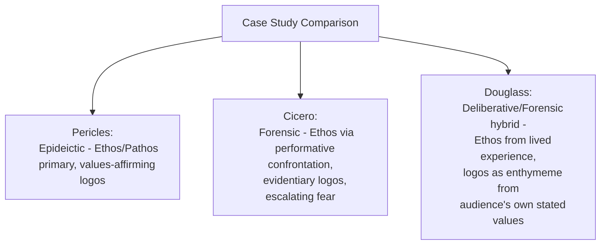

## Case Studies of Appeals in Influential Speeches

### Overview

**Key Points**

- This module applies the ethos-pathos-logos-kairos framework developed across the preceding modules to analysis of historically significant speeches, illustrating how the tripartite system and situational timing operate in practice rather than only in theory.
- Case-based analysis serves a distinct pedagogical function from abstract principle: it demonstrates how skilled rhetors calibrate balance dynamically within a single speech, shift register across sections (per the Arrangement module's structural logic), and respond to specific, non-repeatable kairotic conditions.
- The analyses below focus on structural and rhetorical technique rather than political endorsement of content; per standard practice for public figures' documented speech, only brief, sparingly used paraphrase (not extended quotation) is used to characterize content, consistent with source-attribution and copyright practice.

---

### Case Study 1: Pericles' Funeral Oration (Epideictic)

**Context**: Delivered (as reported by Thucydides) during the first year of the Peloponnesian War, honoring Athenian war dead — a defining example of classical epideictic oratory.

| Appeal | Analysis |
| --- | --- |
| **Ethos** | Pericles speaks as an elected leader with established civic standing; his ethos is largely extrinsic (position-based) but reinforced intrinsically through the speech's own dignified, measured tone |
| **Pathos** | Carefully calibrated grief and pride — mourning the dead while channeling that grief toward renewed civic commitment, exemplifying Aristotle's *pity* and *confidence* operating in sequence rather than isolation |
| **Logos** | Minimal argumentative logos in the strict sense (no contested claim to prove) — instead, extended praise of Athenian democratic values and way of life functions as the epideictic genre's characteristic "logos," reasoned reflection on what makes the polis praiseworthy |
| **Kairos** | Delivered at a moment of collective loss and uncertainty early in a costly war — the speech's function (reinforcing civic resolve) is inseparable from this specific, urgent moment |

- [Inference] This speech exemplifies the classical epideictic pattern discussed in the Balancing module: pathos and ethos carry the primary persuasive weight, with logos present chiefly in the form of value-affirming reflection rather than contested-claim argumentation, consistent with epideictic's characteristic function of reinforcing shared values rather than resolving a dispute.

---

### Case Study 2: Cicero's *Catiline Orations* (Forensic/Deliberative Hybrid)

**Context**: Delivered before the Roman Senate (63 BCE), accusing Catiline of conspiracy against the Republic — a direct primary-source example from the Roman rhetorical tradition covered in an earlier module.

| Appeal | Analysis |
| --- | --- |
| **Ethos** | Cicero speaks as sitting consul, but intrinsic ethos is heavily constructed through direct, confrontational address — the famous rhetorical technique of directly interrogating Catiline (present in the chamber) to demonstrate moral authority and control of the situation |
| **Pathos** | Escalating alarm and urgency (fear, per Aristotle's catalogue) calibrated to the genuine, high-stakes threat being alleged — a direct illustration of the "proportionate to actual facts" criterion from the Pathos module, assuming Cicero's factual claims are accepted |
| **Logos** | Accumulated circumstantial evidence and precedent-based argument (comparison to past threats to the Republic) — following the forensic genre's characteristic emphasis on evidentiary logos |
| **Kairos** | The speech's entire rhetorical strategy depends on the specific moment — Catiline's presence in the Senate chamber itself becomes a rhetorical resource, illustrating kairos's situational, non-repeatable character discussed in the Kairos module |

**Example**

Cicero's technique of directly addressing Catiline in the second person while the Senate observes exemplifies how ethos can be constructed through a specific *performative* choice available only in that exact situational moment — a technique that could not be replicated identically outside that specific kairotic context (an accused party physically present before the body being addressed).

---

### Case Study 3: Frederick Douglass, "What to the Slave Is the Fourth of July?" (1852) (Deliberative/Forensic Hybrid)

**Context**: Delivered to the Rochester Ladies' Anti-Slavery Society, using the occasion of Independence Day celebrations to indict the institution of slavery — widely studied as a masterwork of American rhetorical history.

| Appeal | Analysis |
| --- | --- |
| **Ethos** | Douglass's own lived experience as a formerly enslaved person constitutes uniquely powerful intrinsic and extrinsic ethos — direct personal authority on the subject matter that few speakers could claim |
| **Pathos** | Sustained, escalating moral indignation (Aristotle's *nemesis* — pain at undeserved circumstance/injustice) directed at the audience's own complicity, a notably confrontational pathos strategy toward a friendly-but-implicated audience |
| **Logos** | Systematic argument exposing the logical contradiction between stated national ideals (liberty, equality) and the institution of slavery — an extended enthymeme built on the audience's own accepted premises (the value of liberty) turned toward an uncomfortable conclusion |
| **Kairos** | The specific occasion (a national celebration of freedom) is rhetorically essential — the speech's power depends on the ironic tension between the occasion's stated meaning and the actual experience of enslaved Americans, a kairotic choice of moment that could not be separated from its content |

- [Inference] This speech illustrates a distinctive rhetorical strategy not fully covered in the balance-diagnostic framework above: deliberately *weaponizing* a mismatch between audience expectation (a celebratory epideictic occasion) and actual content (forensic indictment) as a rhetorical technique in itself — using the audience's own occasion-based assumptions as part of the argument's persuasive structure.

---

### Comparative Synthesis Across Case Studies

| Dimension | Pericles | Cicero | Douglass |
| --- | --- | --- | --- |
| **Primary genre** | Epideictic | Forensic (with deliberative urgency) | Deliberative/Forensic hybrid |
| **Ethos source** | Positional/extrinsic (elected leader) | Positional + performative intrinsic construction | Lived experience — uniquely strong intrinsic + extrinsic ethos |
| **Dominant emotion (pathos)** | Grief channeled to resolve | Escalating fear/urgency | Sustained moral indignation |
| **Logos structure** | Value-affirmation (epideictic mode) | Evidentiary accumulation (forensic mode) | Enthymeme built from audience's own stated ideals |
| **Kairos dependency** | High — collective wartime grief | Very high — accused physically present | Very high — irony of the specific occasion |

[Inference] Across all three cases, kairos functions not as a separable "fourth ingredient" but exactly as the Kairos module's synthesis suggested — as the contextual lens determining how ethos, pathos, and logos were each specifically calibrated; none of these speeches' particular rhetorical choices would transfer unchanged to a different moment, even holding speaker, audience type, and general purpose constant.

---

### Applying Case Study Analysis to Executive Communication

**Key Points**

- The diagnostic and analytical method demonstrated here — examining a real speech systematically across ethos, pathos, logos, and kairos, and noting how balance shifts by genre and moment — is directly transferable as a review technique for executive communication drafts, extending the diagnostic checklist from the prior module to historical/comparative analysis as a training method.
- [Inference] Studying documented, historically significant speeches through this framework offers a low-risk way to build the situational judgment (*phronesis*) that the Balancing and Kairos modules identify as ultimately more important than any fixed formula — since real skill in appeal-balancing is developed through repeated analysis of varied concrete cases, not through memorizing a single ideal ratio.

**Example**

An executive communications team reviewing a past internal town hall recording using this same four-part framework (what was the genre/purpose, what ethos was established and how, was pathos proportionate to actual stakes, was the reasoning chain explicit, was timing/kairos well-judged) can identify specific, actionable gaps using the same method applied to Pericles, Cicero, or Douglass above — the analytical method is genre- and era-agnostic.

---

**Related Topics**

- Diagnosing Which Appeal a Message Is Missing (prior module — applied method)
- Balancing the Three Appeals for Different Goals (prior module — theoretical foundation)
- Epideictic Oratory: Ancient Funeral Speeches to Modern Eulogies
- Cicero's Forensic Technique: The *Catiline Orations* in Depth
- Frederick Douglass and 19th-Century American Rhetorical Tradition
- Building an Executive Communication Case-Study Review Practice