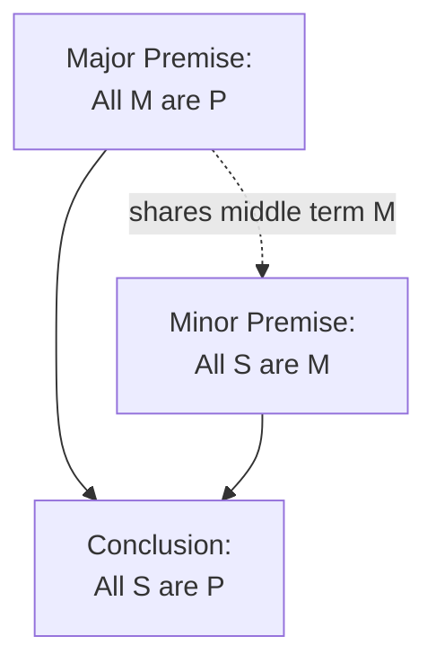
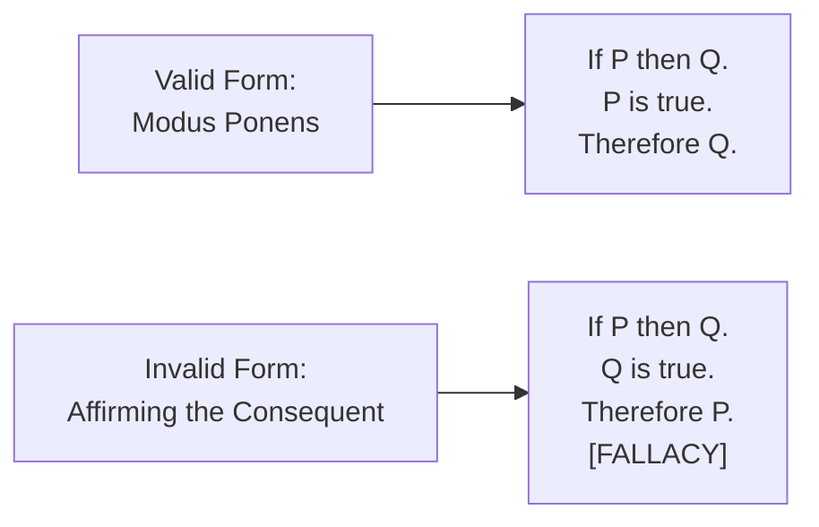

## Deductive Reasoning and the Syllogism

### Overview

**Key Points**

- **Deductive reasoning** is a form of inference in which a conclusion follows with **logical necessity** from its premises — if the premises are true and the argument's form is valid, the conclusion *must* be true; this distinguishes deduction from inductive and probabilistic (rhetorical/enthymematic) reasoning covered in earlier modules.
- The **syllogism**, formalized by Aristotle in the *Prior Analytics* (a companion work to the *Rhetoric*), is the foundational structure of deductive argument in the Western tradition — a three-part argument consisting of a major premise, a minor premise, and a conclusion.
- Understanding formal deductive structure is essential background for rhetoric specifically because the **enthymeme** (rhetoric's characteristic reasoning form, covered in the Logos module) is explicitly defined by Aristotle as a *truncated or probabilistic syllogism* — the rhetorical form cannot be fully understood without its logical parent structure.

---

### The Structure of the Categorical Syllogism

#### Basic Components

A standard categorical syllogism consists of exactly three propositions and three terms, each appearing exactly twice:

| Component | Function | Example |
| --- | --- | --- |
| **Major premise** | A general statement, containing the major term (the predicate of the conclusion) | All mammals are warm-blooded. |
| **Minor premise** | A more specific statement, containing the minor term (the subject of the conclusion) | All dogs are mammals. |
| **Conclusion** | The necessary inference, linking the minor term to the major term via the shared "middle term" | Therefore, all dogs are warm-blooded. |

- The **middle term** ("mammals" in the example above) appears in both premises but *not* in the conclusion — its function is to logically connect the major and minor terms.

**Example**

Major premise: All publicly traded companies must file quarterly reports. Minor premise: This company is publicly traded. Conclusion: Therefore, this company must file quarterly reports. The middle term ("publicly traded companies/this company is publicly traded") logically connects the general rule (major premise) to the specific case (minor premise), yielding a necessary conclusion.

#### Validity vs. Soundness

Two distinct evaluative criteria apply to any deductive syllogism, and confusing them is a common reasoning error:

| Criterion | Definition | Question Asked |
| --- | --- | --- |
| **Validity** | The conclusion follows necessarily from the premises **given the argument's logical form**, regardless of whether the premises are actually true | "If the premises were true, would the conclusion have to be true?" |
| **Soundness** | The argument is valid **and** all its premises are actually true | "Is this a valid argument with true premises?" |

**Example**

"All birds can fly. Penguins are birds. Therefore, penguins can fly." This syllogism is **valid** (the conclusion follows necessarily from the stated premises, given the form) but **unsound** (the major premise is factually false — not all birds can fly) — illustrating that validity is a purely formal/structural property, independent of real-world truth.

- [Inference] This distinction has significant practical importance in argument evaluation: a formally valid argument can still be worthless if built on false premises, meaning rigorous argument evaluation must check *both* the logical structure and the factual accuracy of premises — checking only one is insufficient.

---

### The Four Categorical Propositions

Aristotelian logic classifies all categorical statements into four standard forms, traditionally labeled by letters derived from Latin (*AffIrmo*, "I affirm," and *nEgO*, "I deny"):

| Label | Form | Example | Type |
| --- | --- | --- | --- |
| **A** | All S are P | All employees are trained. | Universal Affirmative |
| **E** | No S are P | No employees are untrained. | Universal Negative |
| **I** | Some S are P | Some employees are certified. | Particular Affirmative |
| **O** | Some S are not P | Some employees are not certified. | Particular Negative |

- These four propositional forms combine across the three-proposition syllogistic structure to generate the traditional **256 possible syllogistic forms**, of which only a specific subset (traditionally enumerated as **24 valid forms**, distributed across four "figures" based on middle-term placement) are logically valid — a systematic classification developed extensively in medieval scholastic logic building on Aristotle's foundational work.
- [Unverified] The precise historical figure of "24 valid forms" reflects the traditional medieval Aristotelian logic curriculum; some modern formal logic treatments count valid forms somewhat differently depending on specific assumptions about existential import, though the core Aristotelian framework and its general structure are well-established.

---

### Common Deductive Fallacies

Certain syllogistic patterns are formally **invalid** despite superficially resembling valid structures — recognizing these is essential to evaluating deductive claims:

| Fallacy | Structure | Example |
| --- | --- | --- |
| **Affirming the consequent** | If P then Q; Q; therefore P | "If it rains, the ground is wet. The ground is wet. Therefore it rained." (Ignores other possible causes of wet ground.) |
| **Denying the antecedent** | If P then Q; not P; therefore not Q | "If sales grow, we hire more staff. Sales did not grow. Therefore we will not hire more staff." (Ignores other reasons to hire.) |
| **Undistributed middle** | The middle term is not properly "distributed" (referring to the entire class) in at least one premise | "All cats are mammals. All dogs are mammals. Therefore all cats are dogs." |
| **Illicit major/minor** | A term distributed in the conclusion but not properly distributed in its premise | Various forms depending on specific term placement |

**Example**

A business argument: "If our marketing campaign is effective, engagement metrics will rise. Engagement metrics rose. Therefore, the marketing campaign was effective" commits **affirming the consequent** — engagement could have risen due to seasonal trends, a competitor's misstep, or unrelated factors, meaning the conclusion does not follow with logical necessity even though it may be a *plausible* (enthymematic/probabilistic) inference worth investigating further.

---

### Deduction's Relationship to Rhetoric: The Enthymeme Revisited

**Key Points**

- Aristotle explicitly defines the **enthymeme** (covered in depth in the Logos module) as a rhetorical counterpart to the syllogism — sharing the same basic three-part logical architecture (major premise, minor premise, conclusion) but differing in two crucial respects:
  1. **Premise certainty**: enthymematic premises are drawn from probable, generally accepted opinion (*endoxa*) rather than certain, demonstrated truth
  2. **Completeness**: enthymemes frequently leave one premise unstated, relying on the audience to supply it, whereas formal syllogisms in logical demonstration are typically fully stated

| Dimension | Formal Syllogism | Rhetorical Enthymeme |
| --- | --- | --- |
| **Premise type** | Certain, demonstrated | Probable, generally accepted (*endoxa*) |
| **Completeness** | Fully stated | Often one premise suppressed/implied |
| **Domain** | Mathematics, formal logic, matters admitting certainty | Politics, ethics, business — practical matters admitting only probability |
| **Audience role** | Passive verification of validity | Active completion of the argument (supplying missing premise) |
| **Evaluated by** | Validity and soundness | Persuasive plausibility and reasonableness of accepted premises |

- [Inference] Recognizing this parent-child relationship clarifies a common confusion in applying logical rigor to rhetorical contexts: criticizing a business enthymeme for "not being a valid syllogism" in the strict formal sense misapplies a standard the enthymeme was never designed to meet — the relevant question for an enthymeme is whether its (often unstated) premises are *reasonably accepted* and whether the probabilistic inference is *sound reasoning under uncertainty*, not whether it achieves deductive certainty.

---

### Deductive Reasoning in Executive and Business Contexts

#### Where Genuine Deduction Applies

- Deductive reasoning is directly and legitimately applicable to **rule-based, definitional, or contractual domains** where premises genuinely can be established with certainty: regulatory compliance ("If revenue exceeds threshold X, filing requirement Y applies"), contractual obligation, and formal policy application.
- **Example**: "All vendors handling customer payment data must comply with PCI-DSS standards. This vendor handles customer payment data. Therefore, this vendor must comply with PCI-DSS standards" is a genuinely deductive, sound business syllogism — the major premise is a true regulatory rule, and the conclusion follows with real necessity, not mere probability.

#### Where Deduction Is Misapplied

- [Inference] A common executive communication error is presenting **inherently probabilistic (enthymematic) business reasoning using deductive-sounding language** — phrasing a market projection or strategic recommendation as though it followed with logical necessity ("Given X, Y will definitely occur") when the underlying reasoning is actually probabilistic — this overstates certainty and can damage ethos when the "necessary" conclusion fails to materialize, since audiences who accepted the deductive framing will judge the failure more harshly than they would a clearly-flagged probabilistic projection.
- Correctly identifying which parts of a business argument are genuinely deductive (rule-based, certain) versus enthymematic (evidence-based, probable) allows for more honest and ultimately more credible communication — an application of the classical rhetoric/logic distinction directly to communication integrity.

---

**Next Steps**

- The Enthymeme in Full Depth: Aristotle's *Rhetoric* Revisited
- Inductive Reasoning: From Specific Cases to General Principles
- A Working Taxonomy of Logical Fallacies (Formal and Informal)
- Stasis Theory and Determining What Kind of Reasoning a Dispute Requires
- Toulmin's Model of Argument: A Modern Alternative to the Syllogism
- Distinguishing Certainty from Probability in Executive Communication