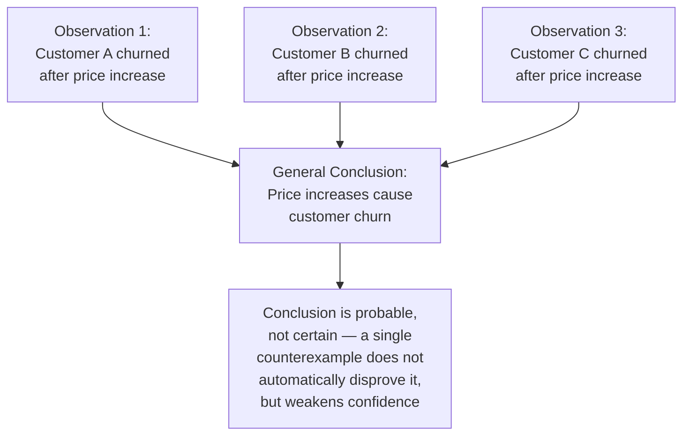
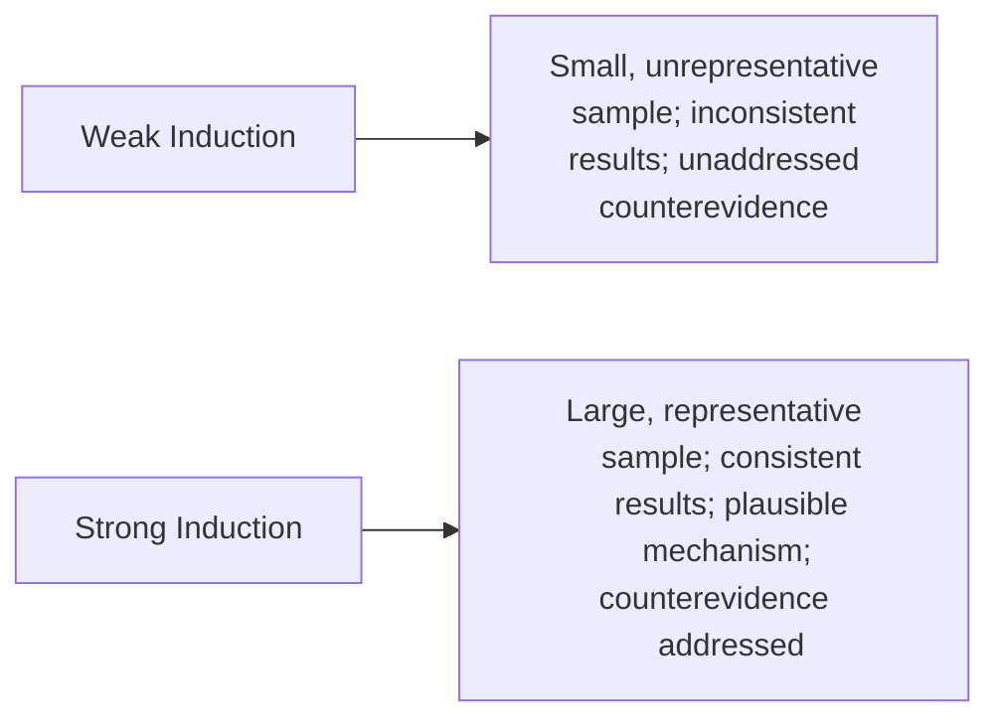

## Inductive Reasoning and Generalization From Evidence

### Overview

**Key Points**

- **Inductive reasoning** moves from specific observations or evidence to a general conclusion — unlike deduction (covered in the prior module), induction yields conclusions that are **probable, not necessary**, meaning true premises can support a false conclusion even when the reasoning is well-constructed.
- Aristotle treats induction (*epagoge*) alongside the syllogism as one of the two fundamental modes of inference in his logical works (*Prior Analytics*, *Posterior Analytics*), and it underlies much of the evidentiary reasoning used in rhetorical logos, scientific method, and business analysis alike.
- Because inductive conclusions are inherently probabilistic, evaluating inductive arguments requires different criteria than evaluating deductive syllogisms — the relevant questions concern the **quality, quantity, and representativeness of evidence**, not formal validity.

---

### Basic Structure of Inductive Reasoning

Unlike the syllogism's fixed three-part structure, inductive arguments generalize from a set of specific instances to a broader claim:

**Example**

Observing that five consecutive product launches with extensive beta-testing succeeded, while three launches without beta-testing failed, supports the inductive generalization "beta-testing improves launch success rates" — a reasonable, evidence-based conclusion, but not a logically necessary one, since the pattern could reflect other factors (team experience, market timing) correlated with, rather than caused by, beta-testing.

---

### Types of Inductive Reasoning

#### Enumerative Induction

- Generalizing from a **sample of observed instances** to a claim about the entire class — the most common inductive form, directly underlying statistical reasoning and market research.
- Strength depends on **sample size** (more observations generally support stronger confidence) and **sample representativeness** (an unrepresentative sample undermines the generalization regardless of size).

**Example**

Surveying 500 customers across all major market segments about product satisfaction supports a stronger enumerative generalization about overall customer sentiment than surveying 500 customers from a single, atypical segment — sample size alone does not guarantee inductive strength without representativeness.

#### Analogical Reasoning

- Inferring that because two cases share certain relevant similarities, they will likely share a further similarity — a form the classical topical tradition (see the Invention module's common topics) explicitly catalogued as the topic of "comparison."
- Strength depends on the **relevance and number of shared similarities** relative to the **relevant differences** between the compared cases.

**Example**

"Company X's market entry into a similar demographic with a similar product succeeded; our market entry, with comparable characteristics, is likely to succeed as well" is analogical induction — its strength depends entirely on how genuinely comparable the two situations are; a superficially similar but materially different case (different competitive landscape, different regulatory environment) yields a weak analogy, directly connecting to the "false analogy" fallacy covered in the Logos module.

#### Causal Induction

- Inferring a cause-effect relationship from observed correlation or repeated co-occurrence — one of the most consequential and error-prone forms of inductive reasoning, since correlation alone does not establish causation.
- Classical topical theory's "cause and effect" topic (see Invention module) provides the argumentative structure; modern methodology (controlled experiments, statistical controls for confounding variables) provides tools for strengthening causal inductive claims beyond mere correlation.

**Example**

Observing that revenue increased in the same quarter a new marketing campaign launched suggests a possible causal inductive hypothesis ("the campaign increased revenue"), but without ruling out confounding factors (seasonal demand, a competitor's product delay, broader economic conditions), the inductive causal claim remains weak — directly connecting to the "false cause" (*post hoc*) fallacy from the Deductive Reasoning module.

---

### Evaluating Inductive Strength

Unlike deductive validity (a binary, formal property), inductive arguments exist on a **spectrum of strength**, evaluated by several converging criteria:

| Criterion | Question | Impact on Strength |
| --- | --- | --- |
| **Sample size** | How many observations support the generalization? | Larger samples generally support stronger (though still probabilistic) conclusions |
| **Representativeness** | Does the sample reflect the full diversity of the population being generalized about? | Unrepresentative samples weaken the generalization regardless of size |
| **Consistency** | Do the observations point consistently in the same direction, or is there significant variation? | Greater consistency supports stronger generalization |
| **Counterevidence** | Are there known exceptions or contradicting cases? | Unaddressed counterevidence weakens the inductive claim |
| **Background plausibility** | Is there an independently plausible mechanism connecting the evidence to the conclusion? | A plausible causal mechanism strengthens confidence beyond correlation alone |

---

### The Problem of Induction

**Key Points**

- Philosophically, inductive reasoning faces the classic **problem of induction**, most famously articulated by David Hume (18th century): no amount of past observed instances can *logically guarantee* that a pattern will continue to hold in the future — the inference from "this has always happened" to "this will always happen" is itself not deductively justified, only pragmatically assumed.
- [Unverified] The philosophical problem of induction remains genuinely unresolved in a fully satisfying formal sense within epistemology, though most practical domains (science, business, law) proceed on the pragmatic assumption that well-supported inductive generalizations remain the best available basis for decision-making under uncertainty, even without formal logical guarantee.
- [Inference] This philosophical caveat has direct practical relevance to business forecasting: even the most rigorously constructed inductive generalization from historical data ("this market has grown consistently for ten years") carries inherent, irreducible uncertainty about future continuation — a limitation classical rhetoric's own domain-of-probability framing (see the Deductive Reasoning module's discussion of rhetoric operating in matters of contingency) anticipated without needing Hume's later formal articulation.

---

### Induction's Relationship to Classical Rhetoric

- Aristotle's *Rhetoric* treats induction as underlying the rhetorical use of the **example** (*paradeigma*) — citing specific past cases to support a general claim about a current situation, functioning as rhetoric's inductive counterpart to the enthymeme's deductive-form counterpart to the syllogism.
- Just as the enthymeme is a rhetorical, probabilistic version of the syllogism, the rhetorical *example* is a rhetorical, audience-oriented version of full inductive generalization — often citing a single vivid, well-chosen case rather than an exhaustive sample, relying on the example's persuasive resonance rather than rigorous statistical representativeness.

| Logical Form | Rhetorical Counterpart | Key Difference |
| --- | --- | --- |
| Syllogism (deduction) | Enthymeme | Probable premises, often incomplete, audience completes reasoning |
| Full induction (generalization from evidence) | Example (*paradeigma*) | Often a single or few vivid cases rather than exhaustive sampling; persuasive resonance emphasized over statistical rigor |

**Example**

A rhetorical *example* citing a single well-known company's successful digital transformation to argue for a similar approach functions inductively but does not claim the statistical rigor of a full inductive generalization from a representative sample — its persuasive power comes from the case's vividness and relevance, which classical rhetoric treats as legitimate but analytically distinct from rigorous inductive proof.

---

### Inductive Reasoning in Executive and Business Analysis

#### Legitimate Applications

| Business Context | Inductive Reasoning Application |
| --- | --- |
| **Market research** | Generalizing customer preferences from representative survey samples |
| **Performance trend analysis** | Inferring likely future performance from consistent historical patterns |
| **Best-practice identification** | Generalizing effective practices from multiple successful case observations |
| **Risk assessment** | Estimating likelihood of future events from historical frequency data |

#### Common Inductive Failures in Executive Communication

- **Hasty generalization**: drawing broad conclusions from too small or unrepresentative a sample (a fallacy directly covered in the Logos module) — e.g., generalizing company-wide sentiment from a handful of vocal complaints.
- **Cherry-picked examples**: selecting only supporting cases while ignoring contradicting ones, undermining the "counterevidence addressed" criterion of inductive strength.
- **Correlation-causation conflation**: presenting causal inductive claims supported only by correlational evidence, without acknowledging confounding factors or alternative explanations.
- **False precision**: presenting an inherently probabilistic inductive conclusion with unwarranted numerical precision or certainty, obscuring the genuine uncertainty inherent to inductive reasoning — an execution of the same deductive-sounding-language problem discussed in the prior module, applied specifically to inductive claims.

**Example**

An executive presentation claiming a new sales process "will increase close rates by exactly 15%" based on a small pilot with a handful of top-performing sales reps commits multiple inductive failures at once: unrepresentative sample (top performers, not typical reps), potential cherry-picking (if underperforming pilot results were excluded), and false precision (presenting a probabilistic estimate from limited data as an exact figure) — illustrating how these failure modes frequently compound in practice.

---

**Next Steps**

- Deductive Reasoning and the Syllogism (prior module — the counterpart mode of inference)
- The Rhetorical Example (*Paradeigma*): Induction Applied Persuasively
- Hume's Problem of Induction: Philosophical Foundations
- Confounding Variables and Causal Inference in Business Analysis
- A Working Taxonomy of Logical Fallacies (Formal and Informal)
- Statistical Literacy for Executive Decision-Making