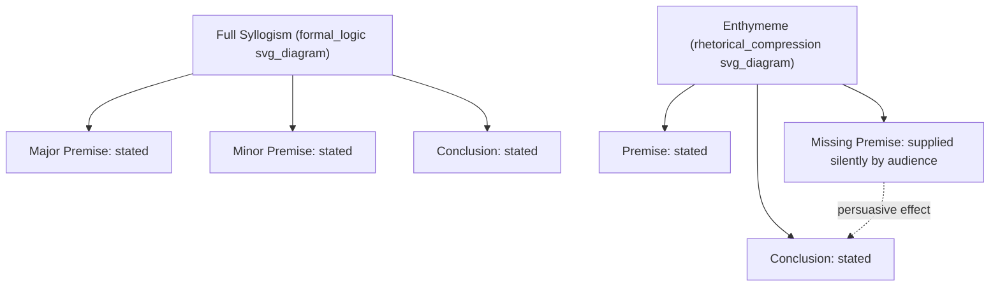

## The Enthymeme as Rhetorical Syllogism

### Definition and Core Concept

An enthymeme is a syllogism used in rhetorical argument in which one or more premises (or occasionally the conclusion) is left unstated because it is already accepted, assumed, or believed by the audience. Aristotle, in the *Rhetoric*, calls the enthymeme the "body of persuasion" (*sōma tēs pisteōs*) and treats it as the rhetorical counterpart to the dialectical syllogism used in formal logic.

The term derives from the Greek *enthymēma*, related to *en thymō* ("in the mind"), pointing to the fact that the missing premise exists "in the mind" of the listener rather than in the spoken argument. The speaker does not need to state it because the audience will supply it automatically.

**Key Points**

- An enthymeme is structurally a syllogism, but rhetorically incomplete by design, not by error.
- The omitted element is typically the premise the audience already believes, not the conclusion the speaker wants them to accept.
- Aristotle distinguishes two types: enthymemes from probabilities (*eikota*) and enthymemes from signs (*sēmeia*).
- The enthymeme is the primary logical instrument of rhetorical proof (*pistis*), alongside example (*paradeigma*), which functions as rhetorical induction.

### Structural Comparison: Syllogism vs. Enthymeme

A formal (Aristotelian) syllogism has three parts, all stated explicitly:

$$\text{Major Premise} + \text{Minor Premise} \implies \text{Conclusion}$$

Classic example:

- Major Premise: All men are mortal.
- Minor Premise: Socrates is a man.
- Conclusion: Therefore, Socrates is mortal.

An enthymeme compresses this into two stated parts (or sometimes one), letting the audience mentally reconstruct the missing link:

- Stated: Socrates is mortal, since he is a man.
- Suppressed premise (audience fills in): All men are mortal.

This compression is what separates the enthymeme from the syllogism functionally, even though logically it is a syllogism with a gap.

### Why Suppression Is Persuasive, Not Deceptive

The rhetorical power of the enthymeme comes from audience participation. When listeners supply the missing premise themselves, they experience the conclusion as self-derived rather than imposed. This produces three effects:

1. **Cognitive economy** — the argument feels efficient and confident, not labored.
2. **Psychological ownership** — because the audience completes the logic, they are more invested in the conclusion.
3. **Concealment of weak premises** — if the missing premise is actually questionable, suppressing it can (illegitimately) protect the argument from scrutiny. This is why the enthymeme is ethically double-edged: it is a tool of clarity in skilled hands and a tool of manipulation in careless or bad-faith ones.

[Inference] The persuasive lift from audience-completed premises is a plausible cognitive mechanism consistent with Aristotle's framing, but its precise psychological weight relative to other factors (credibility, delivery, emotional appeal) is not something Aristotle quantifies and remains under-specified in classical rhetorical theory.

### Aristotle's Two Types of Enthymeme

**1. Enthymeme from Probability (*eikos*)**

Based on premises that are generally true or true "for the most part," not universally or necessarily true.

- Example: "He is probably guilty, since he fled the scene."
- Suppressed premise: People who flee crime scenes are usually guilty.
- This is defeasible — it holds unless a counterexample or exception applies (innocent people also flee out of fear).

**2. Enthymeme from Sign (*sēmeion*)**

Based on an observable indicator or symptom taken as evidence of an underlying fact. Aristotle further divides signs into:

- **Fallible signs** (probable, refutable) — e.g., "She has a fever, so she is sick" (fever is common in sickness but not exclusive to it).
- **Infallible signs** (*tekmērion*, necessary, not refutable if the sign genuinely holds) — e.g., "She is lactating, therefore she has given birth" (a near-necessary physiological indicator).

**Example**

| Type | Stated Argument | Suppressed Premise | Logical Strength |
| --- | --- | --- | --- |
| Probability (eikos) | "He must be lying — he won't make eye contact." | Liars typically avoid eye contact. | Defeasible / weak |
| Fallible sign | "The lights are on, so someone is home." | People at home usually leave lights on. | Defeasible / moderate |
| Infallible sign (tekmērion) | "The wound is fatal; therefore he will die." | This category of wound is always fatal. | Near-necessary / strong |

### The Topoi (Common Topics) as Enthymeme Generators

Aristotle's *Rhetoric* pairs the enthymeme with the **topoi** (τόποι, "places" or "commonplaces") — reusable argumentative patterns or premise-templates a speaker draws on to construct enthymemes quickly across different subject matters. Examples of common topoi include:

- **From opposites**: If temperance is good, its opposite (intemperance) is bad.
- **From degree (more/less)**: If even the gods are not omniscient about X, humans certainly are not.
- **From correlative terms**: If it is just for A to do X to B, it is just for B to have X done to them by A.
- **From cause and effect**: If the cause is present, expect the effect; if absent, expect its absence.
- **From consequence**: Judge an action by its likely outcomes.

Speakers use these topoi as templates into which specific content is inserted, producing an enthymeme rapidly rather than constructing a full formal argument from scratch. This is why the enthymeme was considered a practical skill for orators operating in real time (courts, assemblies) rather than an artifact of a written treatise.

### Enthymeme in the Three Aristotelian Genres of Rhetoric

The enthymeme operates differently depending on the rhetorical genre:

- **Forensic/Judicial (past-oriented, courts)**: Enthymemes argue about what did or did not happen. Signs (evidence) are especially prominent here — "The knife was found in his car, therefore he committed the theft."
- **Deliberative (future-oriented, political assemblies)**: Enthymemes argue about what should or should not be done, typically from probability and consequence — "If we lower tariffs, trade will increase, since lower barriers historically increase trade volume."
- **Epideictic (present-oriented, ceremonial praise/blame)**: Enthymemes reinforce shared values — "She deserves honor, since she sacrificed her own comfort for the community," relying on the suppressed, culturally accepted premise that self-sacrifice for community is honorable.

### Enthymeme vs. Related Concepts

**Enthymeme vs. Syllogism**

A syllogism is a complete, formally valid deductive structure used in logic and dialectic, aimed at certainty. An enthymeme is a truncated, audience-adapted structure used in rhetoric, aimed at probability and persuasion, not certainty.

**Enthymeme vs. Example (Paradeigma)**

Aristotle pairs enthymeme (rhetorical deduction) with paradeigma (rhetorical induction). Where the enthymeme reasons from a general premise to a specific conclusion, the example reasons from one or more specific cases to a generalized conclusion, which is then applied to a new case.

**Enthymeme vs. Enthymematic Fallacy**

Because a premise is hidden, an enthymeme can conceal a false or unsupported premise. When this suppression is used to smuggle in an unjustified assumption, the enthymeme shades into fallacious reasoning (e.g., hasty generalization, false cause). The line between a legitimate enthymeme and a fallacious one often depends on whether the suppressed premise would survive being stated explicitly and examined.

### Practical Construction: Building an Enthymeme for Executive Communication

In executive and business rhetoric, enthymemes are used constantly to compress arguments into confident, audience-resonant statements without belaboring obvious premises. Construction process:

1. **Identify the full syllogism** underlying your claim.
2. **Identify which premise the audience already accepts** (shared values, industry norms, common sense).
3. **State only the accepted premise (or omit it) and the conclusion**, letting the audience supply the rest.
4. **Verify the suppressed premise is actually true and defensible** — this is the ethical checkpoint that distinguishes rhetoric from manipulation.

**Example**

Full syllogism:

- Major Premise: Companies that fail to innovate lose market share.
- Minor Premise: Our company has not launched a new product line in three years.
- Conclusion: Our company is at risk of losing market share.

Enthymeme (executive speech version):

> "We haven't launched a new product line in three years — and in this industry, that's how market leaders become market followers."

Here, the major premise ("failure to innovate causes loss of market share") is compressed into the audience's own understanding of "how market leaders become market followers," making the claim feel like shared knowledge rather than an assertion requiring proof.

### Diagram: Enthymeme Construction Flow

<svg xmlns="http://www.w3.org/2000/svg" viewBox="0 0 800 420">
<text x="400" y="30" text-anchor="middle" font-size="18" font-weight="bold" fill="#1a1a1a">Enthymeme Construction Flow (svg_diagram)</text>
<rect x="40" y="60" width="220" height="70" rx="8" fill="#e8f0fe" stroke="#4a72c4" stroke-width="2" />
<text x="150" y="88" text-anchor="middle" font-size="13" fill="#1a1a1a">Full Syllogism</text>
<text x="150" y="108" text-anchor="middle" font-size="11" fill="#333">Major + Minor → Conclusion</text>
<rect x="320" y="60" width="220" height="70" rx="8" fill="#fef3e0" stroke="#c48a2a" stroke-width="2" />
<text x="430" y="88" text-anchor="middle" font-size="13" fill="#1a1a1a">Identify Shared Premise</text>
<text x="430" y="108" text-anchor="middle" font-size="11" fill="#333">What audience already believes</text>
<rect x="600" y="60" width="160" height="70" rx="8" fill="#e6f4ea" stroke="#2e8b57" stroke-width="2" />
<text x="680" y="88" text-anchor="middle" font-size="13" fill="#1a1a1a">Suppress It</text>
<text x="680" y="108" text-anchor="middle" font-size="11" fill="#333">Leave unstated</text>
<line x1="260" y1="95" x2="315" y2="95" stroke="#555" stroke-width="2" marker-end="url(#arrow)" />
<line x1="540" y1="95" x2="595" y2="95" stroke="#555" stroke-width="2" marker-end="url(#arrow)" />
<rect x="220" y="180" width="360" height="70" rx="8" fill="#fbe9eb" stroke="#c0435a" stroke-width="2" />
<text x="400" y="208" text-anchor="middle" font-size="13" fill="#1a1a1a">Stated Enthymeme</text>
<text x="400" y="228" text-anchor="middle" font-size="11" fill="#333">Remaining premise + Conclusion, delivered as one claim</text>
<line x1="680" y1="130" x2="450" y2="178" stroke="#555" stroke-width="2" marker-end="url(#arrow)" />
<line x1="150" y1="130" x2="350" y2="178" stroke="#555" stroke-width="2" marker-end="url(#arrow)" />
<rect x="220" y="300" width="360" height="70" rx="8" fill="#f0e6fb" stroke="#7a4fc4" stroke-width="2" />
<text x="400" y="328" text-anchor="middle" font-size="13" fill="#1a1a1a">Audience Completion</text>
<text x="400" y="348" text-anchor="middle" font-size="11" fill="#333">Listener mentally supplies missing premise</text>
<line x1="400" y1="250" x2="400" y2="295" stroke="#555" stroke-width="2" marker-end="url(#arrow)" />
</svg>

### Ethical Considerations and Critique

Because the enthymeme's persuasive force depends on an unstated premise, it raises recurring ethical questions in rhetorical theory:

- **Transparency vs. efficiency**: Stating every premise explicitly would make speech exhaustingly pedantic; suppressing premises is necessary for natural communication, but the suppressed premise must still be true and reasonable.
- **Exploitable ambiguity**: A skilled but unscrupulous speaker can suppress a premise specifically because it would not survive scrutiny if stated ("dog-whistle" style arguments and some propaganda techniques rely on this).
- **Audience responsibility**: Critical listeners are expected to reconstruct and evaluate the suppressed premise rather than accept the conclusion passively. This is the basis for enthymeme analysis as a rhetorical-critical method — reconstructing what a speech assumes but never says.

[Unverified] Whether audiences in practice reliably perform this critical reconstruction, versus simply accepting persuasive conclusions at face value, is an empirical question in argumentation and persuasion research rather than a settled finding, and likely varies by audience expertise, motivation, and cognitive load.

### Reconstructing Enthymemes: Analytical Method

To analyze a speech or text for embedded enthymemes:

1. Extract the stated claim (conclusion).
2. Extract the stated support (premise), if any.
3. Ask: "What would have to be true for this support to lead to this conclusion?"
4. State that missing premise explicitly.
5. Evaluate the missing premise's truth, universality, and acceptability to the actual audience — not just its logical validity.

**Example**

> Speech line: "We must cut the budget — the shareholders are already unhappy."

- Conclusion: We must cut the budget.
- Stated premise: Shareholders are unhappy.
- Reconstructed missing premise: Cutting the budget will satisfy unhappy shareholders (or: unhappy shareholders' concerns are the deciding factor for this decision).
- Critical question: Is this missing premise actually true, or merely assumed for persuasive convenience?

### Related Topics

- Aristotle's Three Modes of Persuasion (*Ethos*, *Pathos*, *Logos*)
- The Paradeigma (Rhetorical Example) as Inductive Proof
- The Topoi (Commonplaces) as Argument-Generating Systems
- Fallacies of Suppressed Premise (Enthymematic Fallacies)
- Toulmin's Model of Argument (Claim, Data, Warrant) as a Modern Parallel to the Enthymeme
- Stasis Theory and Issue Identification in Forensic Rhetoric
- Rhetorical Syllogism in Political Speechwriting and Executive Messaging