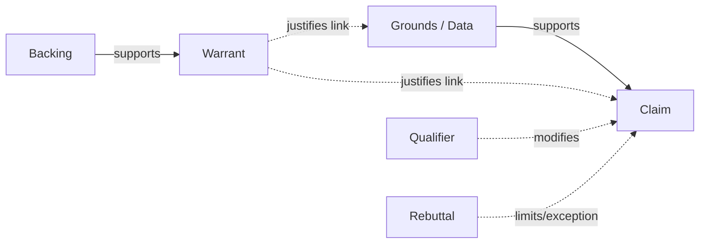

## The Toulmin Model: Claim, Grounds, Warrant, and Backing

### Overview and Origin

The Toulmin Model of argumentation was introduced by British philosopher Stephen Toulmin in his 1958 work *The Uses of Argument*. Toulmin developed the model as a reaction against formal, syllogistic logic, which he argued was poorly suited to describing how arguments actually function in law, ethics, science, and everyday discourse. Instead of treating arguments as abstract logical forms, Toulmin modeled argument as a practical, field-dependent process closer to how claims are made and defended in a courtroom.

The model breaks an argument into six functional components, though the first three (Claim, Grounds, Warrant) form the essential skeleton, and the remaining three (Backing, Qualifier, Rebuttal) provide refinement and nuance.

**Key Points**

- Toulmin's model describes the *layout* of arguments as they occur in practice, not idealized deductive form.
- It is widely used in composition studies, debate, legal reasoning, and executive/business argumentation because it maps naturally onto real persuasive discourse.
- The model is descriptive and analytical (for breaking down arguments) as well as generative (for constructing arguments).

### The Six Components

| Component | Function | Guiding Question |
| --- | --- | --- |
| Claim | The assertion or conclusion being argued for | What are you trying to prove? |
| Grounds (Data) | The evidence or facts supporting the claim | What evidence supports this? |
| Warrant | The logical link connecting grounds to claim | Why does this evidence support this claim? |
| Backing | Support for the warrant itself | Why should we accept the warrant? |
| Qualifier | Indicates the strength/certainty of the claim | How certain is this claim? |
| Rebuttal | Acknowledges exceptions or counterarguments | Under what conditions would this not hold? |

### Diagram: Toulmin Model Structure

### Component 1: Claim

The **claim** is the conclusion or assertion the arguer wants the audience to accept. It is the end point of the argument — the "so what" of the whole structure.

**Example**

> "Our company should adopt a four-day work week."

Claims can be of different types:

- **Factual claims**: assertions about what is or is not true.
- **Value claims**: assertions about worth, morality, or quality.
- **Policy claims**: assertions about what should be done (most common in executive and deliberative rhetoric).

### Component 2: Grounds (Data)

The **grounds** (sometimes called "data") are the evidence, facts, statistics, or observations offered as the foundation for the claim. Grounds answer the question "What do you have to go on?"

**Example**

> "Companies that piloted four-day work weeks reported a 20% reduction in employee burnout and no measurable drop in output."

Grounds must be relevant, sufficient, and — ideally — verifiable, since the credibility of the entire argument depends on the audience accepting the grounds as true.

### Component 3: Warrant

The **warrant** is the logical or inferential bridge that explains why the grounds justify the claim. It is often implicit (unstated), similar to the suppressed premise in an enthymeme, because it usually reflects a general principle, rule, or assumption the audience is expected to accept.

**Example**

> Warrant (often unstated): "Reduced burnout and maintained output indicate a policy is beneficial for both employees and the business."

The warrant is the most theoretically important — and most contestable — part of the model, because disagreements in argument often occur not over the grounds (facts) but over the warrant (the principle connecting those facts to the claim).

**[Confirmed]** Toulmin explicitly distinguishes the warrant from the grounds: grounds are facts already agreed upon or offered as evidence, while the warrant is a general, hypothetical, bridge-like statement that authorizes the step from grounds to claim.

### Component 4: Backing

**Backing** provides support for the warrant when the warrant itself is not self-evidently accepted by the audience. Backing answers: "Why should we believe the warrant is valid?"

**Example**

> Backing: "Studies from Iceland's nationwide 2015–2019 four-day work week trials, and Microsoft Japan's 2019 pilot, empirically demonstrate that reduced hours can maintain or improve productivity across multiple industries."

Backing is field-dependent: what counts as adequate backing in a scientific argument (peer-reviewed studies) differs from what counts as adequate backing in a legal argument (precedent, statute) or an executive argument (case studies, financial data, industry benchmarks).

### Component 5: Qualifier

The **qualifier** indicates the degree of force or certainty the arguer assigns to the claim. Common qualifiers include: *certainly, probably, presumably, likely, in most cases, typically.*

**Example**

> "Adopting a four-day work week will *likely* reduce burnout without harming output."

Qualifiers make arguments more intellectually honest by avoiding overstatement, and they signal to the audience the appropriate level of confidence to place in the claim.

### Component 6: Rebuttal

The **rebuttal** (or "reservation") specifies the conditions, exceptions, or counterarguments under which the claim would not hold. It preemptively addresses objections.

**Example**

> "...unless the role requires continuous customer coverage across five business days, in which case a compressed schedule with staggered teams may be needed instead."

Including rebuttals strengthens ethos (credibility) by demonstrating the arguer has anticipated counterarguments rather than ignoring them — a technique closely related to **procatalepsis** in classical rhetoric.

### Fully Assembled Example

**Claim**: Our company should adopt a four-day work week.

**Grounds**: Companies that piloted it reported a 20% drop in burnout with no measurable drop in output.

**Warrant**: A policy that reduces burnout while maintaining output benefits both employees and the business.

**Backing**: This is confirmed by Iceland's large-scale 2015–2019 trials and Microsoft Japan's 2019 pilot.

**Qualifier**: This will *likely* hold across most knowledge-work roles.

**Rebuttal**: Unless the role requires five-day customer coverage, in which case staggered scheduling may be needed instead.

### Diagram: Full Model with Assembled Example

<svg xmlns="http://www.w3.org/2000/svg" viewBox="0 0 900 460">
<text x="450" y="30" text-anchor="middle" font-size="18" font-weight="bold" fill="#1a1a1a">Toulmin Model — Assembled Example (svg_diagram)</text>
<rect x="60" y="70" width="240" height="80" rx="8" fill="#e8f0fe" stroke="#4a72c4" stroke-width="2" />
<text x="180" y="95" text-anchor="middle" font-size="13" font-weight="bold" fill="#1a1a1a">Grounds</text>
<text x="180" y="115" text-anchor="middle" font-size="10" fill="#333">20% less burnout,</text>
<text x="180" y="130" text-anchor="middle" font-size="10" fill="#333">no output drop</text>
<rect x="600" y="70" width="240" height="80" rx="8" fill="#fbe9eb" stroke="#c0435a" stroke-width="2" />
<text x="720" y="95" text-anchor="middle" font-size="13" font-weight="bold" fill="#1a1a1a">Claim</text>
<text x="720" y="115" text-anchor="middle" font-size="10" fill="#333">Adopt a four-day</text>
<text x="720" y="130" text-anchor="middle" font-size="10" fill="#333">work week</text>
<line x1="300" y1="110" x2="595" y2="110" stroke="#555" stroke-width="2" marker-end="url(#arrow2)" />
<rect x="330" y="190" width="240" height="90" rx="8" fill="#fef3e0" stroke="#c48a2a" stroke-width="2" />
<text x="450" y="215" text-anchor="middle" font-size="13" font-weight="bold" fill="#1a1a1a">Warrant</text>
<text x="450" y="235" text-anchor="middle" font-size="10" fill="#333">Less burnout + same</text>
<text x="450" y="250" text-anchor="middle" font-size="10" fill="#333">output = beneficial</text>
<text x="450" y="265" text-anchor="middle" font-size="10" fill="#333">policy</text>
<line x1="450" y1="188" x2="450" y2="155" stroke="#555" stroke-width="2" marker-end="url(#arrow2)" />
<rect x="330" y="320" width="240" height="80" rx="8" fill="#e6f4ea" stroke="#2e8b57" stroke-width="2" />
<text x="450" y="345" text-anchor="middle" font-size="13" font-weight="bold" fill="#1a1a1a">Backing</text>
<text x="450" y="365" text-anchor="middle" font-size="10" fill="#333">Iceland trials,</text>
<text x="450" y="380" text-anchor="middle" font-size="10" fill="#333">Microsoft Japan pilot</text>
<line x1="450" y1="318" x2="450" y2="283" stroke="#555" stroke-width="2" marker-end="url(#arrow2)" />
<rect x="620" y="190" width="200" height="60" rx="8" fill="#f0e6fb" stroke="#7a4fc4" stroke-width="2" />
<text x="720" y="215" text-anchor="middle" font-size="12" font-weight="bold" fill="#1a1a1a">Qualifier: "likely"</text>
<text x="720" y="232" text-anchor="middle" font-size="10" fill="#333">applies to most roles</text>
<line x1="720" y1="188" x2="720" y2="155" stroke="#555" stroke-width="2" stroke-dasharray="4" marker-end="url(#arrow2)" />
<rect x="620" y="270" width="200" height="90" rx="8" fill="#fde8e8" stroke="#c46a4a" stroke-width="2" />
<text x="720" y="295" text-anchor="middle" font-size="12" font-weight="bold" fill="#1a1a1a">Rebuttal</text>
<text x="720" y="315" text-anchor="middle" font-size="10" fill="#333">Unless role needs</text>
<text x="720" y="330" text-anchor="middle" font-size="10" fill="#333">5-day coverage</text>
<line x1="720" y1="268" x2="720" y2="253" stroke="#555" stroke-width="2" stroke-dasharray="4" marker-end="url(#arrow2)" />
</svg>

### Toulmin Model vs. Classical Syllogism

| Aspect | Classical Syllogism | Toulmin Model |
| --- | --- | --- |
| Origin | Formal deductive logic (Aristotle) | Practical/field-dependent argument (Toulmin, 1958) |
| Structure | Major Premise, Minor Premise, Conclusion | Claim, Grounds, Warrant (+ Backing, Qualifier, Rebuttal) |
| Certainty | Aims at logical necessity | Accommodates probability and qualified claims |
| Field-dependence | Same form across all subject matter | Warrant/backing standards vary by field (law, science, ethics, business) |
| Handles exceptions | Poorly (validity is binary) | Explicitly, via rebuttal and qualifier |

**[Confirmed]** Toulmin designed the model specifically to reflect field-dependent standards of argument — what counts as sufficient backing in a courtroom differs from what counts as sufficient backing in a scientific paper, a point central to his critique of one-size-fits-all formal logic.

### Application in Executive and Business Communication

The Toulmin Model is especially useful in executive communication because business arguments are rarely deductively certain — they are probabilistic, data-driven, and open to challenge from stakeholders. Applying the model helps executives:

1. **Structure a business case**: Claim (recommendation) → Grounds (data/KPIs) → Warrant (why the data implies the recommendation) → Backing (industry benchmarks, case studies).
2. **Anticipate pushback**: Building in a rebuttal preemptively addresses the objections a board or stakeholder is likely to raise.
3. **Calibrate confidence**: Using qualifiers avoids overpromising ("will guarantee" vs. "is likely to improve"), which protects credibility if outcomes vary.
4. **Diagnose disagreement**: When stakeholders push back on a proposal, the model helps identify *where* the disagreement actually lies — is it the grounds (they dispute the data), the warrant (they don't accept the inferential link), or the backing (they don't trust the source)? This diagnostic use is one of the model's most practical applications in negotiation and consensus-building.

### Common Pitfalls When Applying the Model

- **Confusing grounds with warrant**: Grounds are facts; the warrant is the reasoning connecting facts to the claim. A common analytical error is treating the warrant as just "more evidence" rather than the inferential principle itself.
- **Omitting backing when the warrant is contestable**: If an audience is skeptical, an unbacked warrant will be challenged, weakening the argument.
- **Overqualifying or underqualifying claims**: Excessive hedging ("might possibly perhaps") undermines authority; no hedging at all on a probabilistic claim damages credibility if the claim later fails.
- **Treating the model as strictly linear**: In practice, arguers often present grounds and claim together, then build warrant/backing only if challenged — the model describes underlying structure, not a mandatory delivery order.

[Inference] Real-world arguments frequently present components out of the canonical order (e.g., leading with claim, then grounds, backing warrant only reactively); the model is best understood as an analytical decomposition rather than a prescribed sequence for delivery, which aligns with Toulmin's own framing of the model as descriptive of argument structure rather than a rigid script.

### Related Topics

- The Enthymeme as Rhetorical Syllogism (comparison of implicit warrant vs. implicit premise)
- Stasis Theory and Identifying the Locus of Disagreement
- Field-Dependent Argumentation Standards Across Law, Science, and Business
- Rebuttal Construction and Procatalepsis in Executive Speech
- Data-Driven Persuasion: Selecting and Framing Grounds in Business Cases
- Qualifiers and Hedging Language in Risk Communication