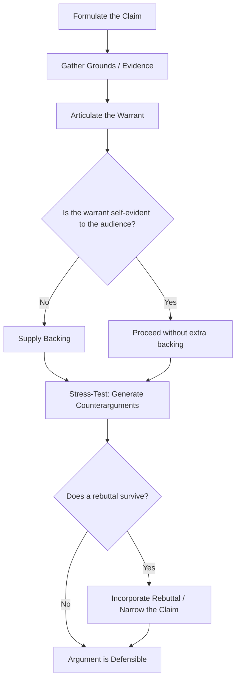

## Constructing Warranted, Defensible Arguments


### Overview

Constructing a warranted, defensible argument means building a claim whose logical bridge (warrant) is explicit or readily inferable, adequately backed, and resilient against reasonable counterarguments. This is a practical, synthetic skill that draws together elements from formal logic (validity, soundness), the enthymeme (audience-supplied premises), and the Toulmin model (claim, grounds, warrant, backing, qualifier, rebuttal) into a repeatable process for building arguments that survive scrutiny — particularly important in executive contexts where arguments face boards, stakeholders, regulators, and the press.

**Key Points**

- A defensible argument is not merely persuasive; it is persuasive *and* able to withstand direct challenge.
- Warrant strength, not just evidence volume, determines whether an argument holds up under pressure.
- Defensibility requires anticipating attack vectors before an audience raises them.

### What Makes an Argument "Warranted"

An argument is **warranted** when the inferential link between its grounds and its claim is explicit, logically sound (or at least reasonably probable), and would be accepted by a reasonable, informed audience if stated outright. This differs from an argument that is merely *asserted* — where a conclusion is stated but the connecting logic is either absent or would not survive being made explicit.

Distinguishing warranted from unwarranted claims:

| Warranted Claim | Unwarranted Claim |
| --- | --- |
| "Sales dropped 15% after the price increase, and price elasticity studies in this category confirm demand is highly price-sensitive — therefore the increase likely caused the drop." | "Sales dropped 15%. The price increase was clearly a mistake." |
| Explicit causal mechanism supported by domain-specific backing | Correlation asserted as causation with no stated mechanism |

**[Confirmed]** The distinction between correlation and causation is a foundational requirement for a warranted claim: an inference from correlated events to a causal claim requires an explicit warrant (a causal mechanism or ruling-out of confounds), not just the observation that two things occurred together.

### The Construction Process



**Step 1 — Formulate the Claim Precisely**

Vague claims are hard to defend because they can be attacked on multiple fronts simultaneously. Narrow, specific claims ("We should delay the product launch by one quarter" rather than "We should reconsider our strategy") are more defensible because the scope of possible objection is limited and known in advance.

**Step 2 — Gather Grounds That Are Verifiable and Sufficient**

Grounds should be:

- **Verifiable** — traceable to a checkable source (data, document, precedent).
- **Sufficient** — enough in quantity and quality to support the specific claim being made, not a broader claim than the evidence justifies.
- **Current** — outdated grounds are a common attack vector ("that study is from 2015; conditions have changed").

**Step 3 — Articulate the Warrant Explicitly (Even If You Won't State It Aloud)**

Even when a warrant will remain implicit in delivery (as in an enthymeme), the arguer should explicitly write out the warrant during construction to test it. Ask: "What general principle must be true for this evidence to support this claim?" If that principle is false, overly broad, or contested, the argument is not yet defensible.

**Example**

> Claim: We should outsource customer support.
>
> Grounds: Outsourced support costs 40% less per ticket.
>
> Warrant (to test): Lower cost-per-ticket is more important than any quality difference in this context.
>
> Testing the warrant reveals a gap: cost savings alone don't justify the decision unless quality impact is also addressed — the argument is incomplete until this is confirmed or the claim is narrowed.

**Step 4 — Supply Backing Proportional to Audience Skepticism**

The more contested or unfamiliar the warrant, the more explicit backing is required. A warrant accepted as common sense within a specific professional field may need no backing internally, but require substantial backing when presented to outside stakeholders, regulators, or the public.

**Step 5 — Stress-Test With Adversarial Counterarguments**

Before presenting an argument, systematically generate the strongest objections a hostile or skeptical party could raise. This is sometimes called "red-teaming" the argument. Categories of attack to check:

- **Attacking the grounds**: Is the evidence accurate, current, and representative?
- **Attacking the warrant**: Does the evidence actually justify this specific conclusion, or a narrower/different one?
- **Attacking the backing**: Is the source of support credible and unbiased?
- **Identifying exceptions**: Are there cases where the claim would not hold?

**Step 6 — Build In Rebuttal and Qualifier**

Incorporate the strongest surviving counterarguments as explicit rebuttals, and calibrate the claim's certainty with an appropriate qualifier rather than overstating confidence.

### Common Failure Modes in Argument Construction

**Key Points**

- **Non sequitur warrant**: the grounds are true, but they do not actually support the specific claim made (a warrant gap).
- **Hasty generalization**: grounds are too limited (small sample, atypical case) to support a general claim.
- **False cause (*post hoc ergo propter hoc*)**: treating temporal sequence or correlation as sufficient warrant for causation.
- **Unstated question-begging warrant**: the warrant assumes the very conclusion it is meant to prove.
- **Selective grounds (cherry-picking)**: presenting only supporting evidence while omitting disconfirming evidence, which collapses under scrutiny once the omitted evidence surfaces.
- **Overextended qualifier mismatch**: stating a claim with more certainty ("will," "guarantees") than the grounds and warrant actually support.

**Example of Warrant Gap**

> Claim: This vendor is the best choice for our contract.
>
> Grounds: This vendor has the lowest price.
>
> Gap: Lowest price alone does not warrant "best choice" unless price is established as the dominant criterion — the argument needs either a stated warrant ("price is the primary factor given budget constraints") or additional grounds addressing quality, reliability, and service.

### Defensibility Under Adversarial Questioning

A defensible argument should survive a structured line of challenge. A practical checklist, often used in executive briefing preparation and legal argument construction:

1. **Source challenge**: "Where does this data come from, and is the source credible?"
2. **Scope challenge**: "Does this evidence really support a claim this broad?"
3. **Causal challenge**: "Could something else explain this outcome?"
4. **Exception challenge**: "Is there a case where this wouldn't hold?"
5. **Consistency challenge**: "Does this argument's warrant, if applied elsewhere, produce conclusions we'd also accept?" (Testing for special pleading — applying a principle only when convenient.)

**Example**

> Claim: We should not expand into this market because our last three international launches failed.
>
> Consistency check: If "past pattern of failure justifies avoiding an action" is the warrant, does the arguer apply this consistently elsewhere, or selectively only for expansion decisions they oppose for other reasons? If applied inconsistently, this signals the true objection lies elsewhere and the stated warrant is not the real basis for the claim.

### Warranted Arguments vs. Rhetorically Effective but Fallacious Arguments

An argument can be rhetorically persuasive (moves an audience) without being warranted (logically defensible), and vice versa. Constructing defensible arguments in executive communication requires reconciling both dimensions — persuasive delivery built on a genuinely sound warrant — rather than treating them as substitutes.

| Dimension | Persuasive Only | Warranted and Persuasive |
| --- | --- | --- |
| Basis | Emotional appeal, authority, repetition | Explicit, testable logical connection |
| Survives scrutiny | Often collapses under direct questioning | Withstands structured challenge |
| Ethical standing | Risk of manipulation if warrant is false/hidden | Aligned with rhetorical ethics (Aristotelian *logos* used honestly) |
| Long-term credibility | Erodes if gaps are exposed later | Reinforces speaker's ethos over time |

[Inference] The claim that warranted arguments produce more durable long-term credibility than persuasion-only tactics is consistent with classical rhetorical ethics (the alignment of ethos with demonstrated logical integrity) and with general principles of trust-building in professional communication, but the precise magnitude of this effect in any given context is not something that can be stated as a fixed, measurable rule.

### Practical Template for Executive Use

**Output**



```
Claim: [Precise, scoped assertion]
Grounds: [Verifiable, sufficient, current evidence]
Warrant: [Explicit principle connecting grounds to claim — tested for validity]
Backing: [Support for the warrant, proportional to audience skepticism]
Qualifier: [Honest calibration of certainty]
Rebuttal: [Acknowledged exception or strongest counterargument, addressed]
```

Applying this template before presenting a recommendation — whether in a board memo, a strategy deck, or a public statement — surfaces weak links in the argument before an adversarial audience does.

### Related Topics

- The Toulmin Model: Claim, Grounds, Warrant, and Backing
- The Enthymeme as Rhetorical Syllogism
- Common Logical Fallacies in Executive and Political Argument
- Red-Teaming Arguments: Adversarial Stress-Testing Techniques
- Stasis Theory and Locating the True Point of Disagreement
- Ethos, Logos, and the Ethics of Persuasive Argument Construction