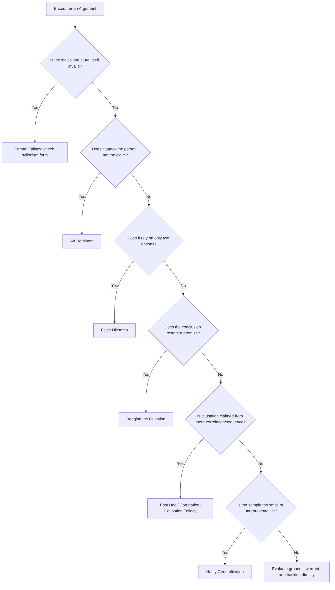

## Common Logical Fallacies and How to Spot Them

### Overview

A logical fallacy is a flaw in reasoning that undermines the logical validity or soundness of an argument, regardless of whether the argument feels persuasive. Fallacies are traditionally divided into **formal fallacies** (errors in the logical structure itself, independent of content) and **informal fallacies** (errors in content, relevance, or language that make an argument appear stronger than it is). For executive and rhetorical purposes, informal fallacies are the more frequently encountered and more consequential category, since they often succeed precisely because they are persuasive despite being invalid.

**Key Points**

- A fallacious argument can still be persuasive — fallacy identification is a logical, not a psychological, category.
- Fallacies are not always intentional; they frequently arise from genuine cognitive shortcuts (heuristics) rather than deliberate deception.
- Recognizing fallacies in others' arguments and avoiding them in one's own are both critical rhetorical skills tied directly to the constructive process in "Constructing Warranted, Defensible Arguments."

### Formal vs. Informal Fallacies

| Type | Definition | Example |
| --- | --- | --- |
| Formal | Error in the logical structure/form itself; the argument is invalid regardless of content | "If it rains, the ground is wet. The ground is wet. Therefore, it rained." (affirming the consequent) |
| Informal | Error in content, relevance, evidence, or language, even if the structure appears valid | "You can't trust his climate policy — he flew on a private jet." (ad hominem) |

### Formal Fallacies

**1. Affirming the Consequent**

$$P \rightarrow Q, \quad Q, \quad \therefore P$$

Invalid because $Q$ could have other causes besides $P$.

> "If the project fails, morale will drop. Morale has dropped. Therefore, the project failed."

**2. Denying the Antecedent**

$$P \rightarrow Q, \quad \neg P, \quad \therefore \neg Q$$

Invalid because $Q$ may still occur through other means.

> "If we cut the budget, we will miss the deadline. We did not cut the budget. Therefore, we will not miss the deadline."

**3. Undistributed Middle**

Occurs when a categorical syllogism's middle term is never distributed (does not refer to *all* members of its category in either premise).

> "All successful companies innovate. Our company innovates. Therefore, our company is successful."

### Informal Fallacies: Relevance

**Ad Hominem** — attacking the arguer's character, motives, or circumstances instead of the argument itself.

> "Why should we listen to her budget proposal? She's never even run a department."
>
> *Spotting it*: Ask whether the objection addresses the claim's evidence/logic or merely the person making it.

**Appeal to Authority (*Argumentum ad Verecundiam*)** — citing an authority as sufficient proof, especially outside their area of expertise or without addressing the substance of the claim.

> "This must be the right strategy — our celebrity spokesperson endorsed it."
>
> *Spotting it*: Legitimate appeals cite relevant, verifiable expertise as *one input*; fallacious appeals substitute authority *for* evidence entirely.

**Appeal to Emotion (*Argumentum ad Passiones*)** — using fear, pity, or anger to substitute for evidence.

> "If we don't approve this merger, hundreds of families will lose everything." (offered with no analysis of whether the merger actually prevents that outcome)
>
> *Spotting it*: Ask whether the emotional content is illustrative of a substantiated claim or is doing the entire persuasive work by itself.

**Red Herring** — introducing an irrelevant issue to divert attention from the original argument.

> "Yes, our emissions are up, but look at how many jobs we've created."
>
> *Spotting it*: Ask whether the new point actually addresses the original claim or merely changes the subject.

**Straw Man** — misrepresenting an opponent's argument in a weaker form, then refuting that weaker version.

> "My colleague wants to increase remote work flexibility — so she basically wants nobody to ever come into the office."
>
> *Spotting it*: Compare the rebuttal to the original claim; if the rebuttal targets a more extreme or simplified version, it's a straw man.

### Informal Fallacies: Presumption

**Begging the Question (*Petitio Principii*)** — the conclusion is assumed within a premise, making the argument circular.

> "This policy is the best option because it's clearly superior to the alternatives."
>
> *Spotting it*: Check whether a premise merely restates the conclusion in different words rather than offering independent support.

**False Dilemma (False Dichotomy)** — presenting only two options when more exist.

> "Either we lay off 20% of staff, or the company goes bankrupt."
>
> *Spotting it*: Ask whether genuinely more options exist that the argument has excluded.

**Hasty Generalization** — drawing a broad conclusion from an unrepresentative or too-small sample.

> "Two of our top clients complained about the new interface, so the redesign is a failure."
>
> *Spotting it*: Check sample size and representativeness relative to the scope of the conclusion.

**Slippery Slope** — asserting that a first step will inevitably lead to a chain of extreme consequences, without establishing the causal necessity of each link.

> "If we allow one exception to the dress code, soon there will be no standards at all."
>
> *Spotting it*: Ask whether each step in the chain is actually necessitated, or merely asserted as likely.

**Complex Question (Loaded Question)** — a question that presupposes something not yet established or granted.

> "Why does your policy continue to disadvantage smaller vendors?" (presupposes the policy does disadvantage them)
>
> *Spotting it*: Check whether answering the question requires accepting an unproven premise embedded within it.

### Informal Fallacies: Causal and Statistical

**Post Hoc Ergo Propter Hoc** ("after this, therefore because of this") — assuming causation from mere temporal sequence.

> "We changed our logo in March, and sales dropped in April — the rebrand hurt sales."
>
> *Spotting it*: Ask whether other factors occurring in the same timeframe could equally explain the outcome.

**Correlation/Causation Fallacy** — treating a statistical association as proof of a causal relationship.

> "Cities with more ice cream sales have more drownings, so ice cream causes drowning." (both driven by a confound: summer heat)
>
> *Spotting it*: Check for plausible confounding variables that could explain both phenomena.

**Texas Sharpshooter Fallacy** — cherry-picking data clusters after the fact to imply a pattern that wasn't predicted in advance.

> "Our top three sales reps all use the same CRM shortcut — that must be the secret to success," ignoring reps with the same habit who underperformed.
>
> *Spotting it*: Ask whether the pattern was predicted beforehand or only identified retroactively from selective data.

**Survivorship Bias** — drawing conclusions only from cases that "survived" a selection process, ignoring those that did not.

> "All our most successful executives skipped an MBA, so MBAs aren't necessary for success," while ignoring the far larger pool of unsuccessful executives who also skipped one.
>
> *Spotting it*: Ask what happened to the excluded/failed cases and whether they were counted.

### Diagram: Fallacy Detection Decision Path

### A General Method for Spotting Fallacies

1. **Isolate the claim and the support.** Separate what is being asserted from what is offered as justification.
2. **Reconstruct the implicit warrant** (as in enthymeme/Toulmin analysis). Many fallacies are exposed the moment the missing premise is stated explicitly, because the stated warrant is visibly false or overly broad.
3. **Test relevance.** Ask whether the evidence given actually bears on the claim, or merely feels emotionally or rhetorically adjacent to it.
4. **Test sufficiency and representativeness.** Ask whether the evidence, even if relevant and true, is enough in scope to support a claim this broad.
5. **Check for alternative explanations.** Especially for causal claims, ask what else could produce the same observed outcome.
6. **Check consistency.** Ask whether the same reasoning pattern, applied to a different case the arguer already accepts or rejects, produces a result they'd be comfortable with (a test for special pleading).

### Fallacies vs. Legitimate Rhetorical Techniques

**Key Points**

- Not every emotional appeal is an appeal-to-emotion fallacy; *pathos* used to contextualize a well-supported claim is legitimate (Aristotelian rhetoric explicitly includes emotional appeal as one of three proofs).
- Not every appeal to expertise is an appeal-to-authority fallacy; citing a relevant, qualified expert as *supporting evidence* (not as the sole proof) is legitimate use of *ethos*.
- The fallacy occurs when the emotional or authoritative element *substitutes for* rather than *supplements* a warranted argument.

[Inference] The boundary between legitimate persuasive technique and fallacy is not always sharply defined in practice and can depend on context, audience expectation, and how much interpretive weight the emotional or authority-based element is asked to bear relative to substantive evidence — this is a matter of ongoing discussion in argumentation theory rather than a fixed bright-line rule.

### Application in Executive Communication

Executives encounter and must both avoid and detect these fallacies constantly:

- **In their own arguments**: A CEO presenting a growth strategy built on a single successful quarter risks hasty generalization; framing a decision as "grow revenue or shut down" when a middle path exists risks false dilemma.
- **In stakeholder pushback**: Recognizing when board members or critics deploy ad hominem, red herring, or slippery slope arguments allows an executive to redirect discussion back to the substantive claim without appearing evasive or defensive.
- **In media and public communication**: Journalists and critics may (intentionally or not) use post hoc reasoning or survivorship bias when evaluating company performance; identifying this allows for a precise, credible rebuttal rather than a purely defensive reaction.

### Related Topics

- Constructing Warranted, Defensible Arguments
- The Toulmin Model: Claim, Grounds, Warrant, and Backing
- The Enthymeme as Rhetorical Syllogism
- Cognitive Biases Underlying Common Fallacies (Availability Heuristic, Confirmation Bias)
- Procatalepsis: Preemptively Addressing Counterarguments
- Statistical Literacy for Executive Decision-Making