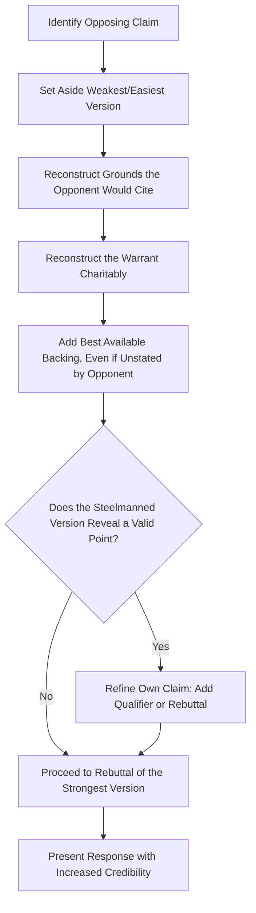

## Steelmanning Opposing Viewpoints

### Definition and Core Concept

Steelmanning is the rhetorical and argumentative practice of reconstructing an opposing position in its strongest, most persuasive, most charitable form before responding to, critiquing, or rebutting it. It is the direct inverse of the straw man fallacy, in which an opponent's position is intentionally weakened or distorted to make it easier to defeat. Where a straw man argument attacks a caricature, a steelman argument engages the best possible version of the opposing case — often stronger than the version the opponent actually articulated.

The term is a modern coinage (popularized in rationalist and philosophical discourse in the early 21st century, building on the older "principle of charity" in philosophy of language and argumentation theory), but the underlying practice draws on much older rhetorical and dialectical traditions, including Aristotle's requirement that a rhetor understand both sides of a question and the scholastic disputation method (*disputatio*) of stating an opponent's strongest objections before answering them.

**Key Points**

- Steelmanning is a *precursor* to rebuttal, not a substitute for it — after constructing the strongest opposing case, the arguer still responds to it.
- It differs from mere "devil's advocacy" in that its explicit goal is maximal charitable strength, not simply presenting an alternative view.
- It is grounded in the philosophical **principle of charity**, which holds that when interpreting an argument, ambiguous or underspecified elements should be resolved in the way that makes the argument as rational and defensible as possible.

### Steelman vs. Straw Man vs. Iron Man

| Technique | Definition | Effect |
| --- | --- | --- |
| Straw Man | Misrepresent the opposing view in a weaker form | Easy but illegitimate victory; damages credibility if exposed |
| Steelman | Reconstruct the opposing view in its strongest, most charitable form | Legitimate victory (if achieved) has greater persuasive and ethical weight |
| Iron Man (a variant sometimes distinguished from steelman) | Construct an even *stronger* version of the opposing argument than the opponent actually holds or intended | Useful for stress-testing one's own position against the best possible challenge, but risks attributing a position the opponent doesn't actually hold |

**[Unverified]** The distinction between "steelman" and "iron man" as separate terms is not universally standardized across rhetoric and argumentation literature; some sources use the terms interchangeably, while others reserve "iron man" specifically for constructing an argument stronger than any version the opponent has stated or would endorse.

### Why Steelmanning Strengthens an Argument

Steelmanning improves the arguer's own position in several interlocking ways:

1. **Increases ethos (credibility)**: An audience that sees a speaker accurately and fairly represent an opposing view before refuting it perceives that speaker as more trustworthy and intellectually honest.
2. **Produces more resilient rebuttals**: If a rebuttal only defeats a weak version of the opposing argument, it collapses the moment someone raises the actual strongest objection. Rebutting the steelmanned version pre-empts this.
3. **Surfaces genuine weaknesses in one's own claim**: The act of constructing the best opposing case can reveal that some part of the opponent's objection is valid, allowing the arguer to refine their own position (narrowing an overbroad claim, adding a qualifier or rebuttal per the Toulmin model) before presenting it publicly.
4. **Prevents easy dismissal by a hostile audience**: When facing a skeptical or opposed audience, immediately attacking a weak version of their view triggers defensiveness; charitably engaging their strongest view signals genuine consideration and increases the odds the audience will engage with the response.

### Diagram: Steelmanning Process Flow

### Method: Constructing a Steelman

1. **State the opponent's conclusion precisely**, without loaded or dismissive language.
2. **Identify the strongest available grounds** for that conclusion — even evidence the opponent themselves did not cite, if it exists and is relevant.
3. **Reconstruct the warrant charitably** — assume the most defensible general principle that could connect those grounds to the conclusion, following the same process used in Toulmin analysis and enthymeme reconstruction.
4. **Supply the strongest plausible backing** for that warrant.
5. **State the steelmanned argument aloud or in writing** before responding, ideally in a form the opponent themselves would recognize as a fair or even improved representation of their view.
6. **Only then respond** — with rebuttal, qualification, or, where warranted, partial or full concession.

### Worked Example

**Original (weaker) statement of opposing view**:

> "The other department just doesn't want to change anything."

**Straw man version (illegitimate)**:

> "They're basically saying we should never adopt new technology, ever, no matter how outdated we get."

**Steelmanned version**:

> "The strongest version of their objection is this: our last three system migrations caused significant downtime and required emergency support hours, at real cost to the business. They're not opposed to change in principle — they're raising a legitimate risk-management concern based on our actual track record of execution, and they want to see a credible mitigation plan before committing resources to another migration."

**Response after steelmanning**:

> "That track record is real, and it's a fair concern. Here's how this migration differs: we've built in a phased rollback plan and are running it in parallel with the existing system for 60 days before cutover, specifically to address the failure pattern from the last three attempts."

Note that the steelmanned version made the rebuttal *more precise and more credible* — the response directly addresses the actual risk (execution failure history) rather than a caricature (blanket resistance to change), and demonstrates the arguer engaged seriously with the objection.

### Steelmanning and the Toulmin Model

Steelmanning can be understood as applying Toulmin's structure *to the opposing argument* before critiquing it:

| Toulmin Component | Steelmanning Task |
| --- | --- |
| Claim | State the opponent's conclusion accurately, without distortion |
| Grounds | Identify the strongest evidence available for that conclusion, even unstated evidence |
| Warrant | Reconstruct the most defensible connecting principle, charitably |
| Backing | Supply the best available support for that warrant |
| Qualifier | Represent the opponent's claim at the level of certainty they would actually endorse, not an exaggerated version |
| Rebuttal | Only after all of the above, present the counter-response |

### Steelmanning vs. Genuine Agreement

Steelmanning is not the same as agreement, concession, or endorsement. It is possible — and common — to construct an excellent steelman of a position and still conclude it is wrong, provided the eventual rebuttal engages that strengthened version directly rather than reverting to a weaker target. The discipline lies in keeping the *construction* phase (charitable reconstruction) and the *evaluation* phase (rebuttal or agreement) distinct and sequential.

**Example**

> "The strongest case for keeping the legacy system is that a full replacement carries a documented 30% failure rate industry-wide within the first year, based on Gartner's migration studies, and our current system, while inefficient, is stable and fully depreciated. That's a legitimate risk argument. My response is that our current system's maintenance costs have grown 22% year-over-year for three consecutive years, which changes the risk calculus: the cost of *not* migrating is now compounding faster than the migration risk itself."

### Limitations and Practical Constraints

- **Time and audience constraints**: Full steelmanning takes rhetorical space; in time-limited formats (a short press statement, a tweet-length response), full steelmanning may be impractical, though even a brief acknowledgment of the strongest opposing point retains much of the credibility benefit.
- **Risk of legitimizing a genuinely bad-faith position**: Steelmanning an argument advanced in bad faith (e.g., a deliberately deceptive claim) can inadvertently lend it more credibility than it deserves; steelmanning is most appropriate for positions held in good faith by reasonable people, not for confirmed disinformation.
- **Should not be mistaken for false balance**: Steelmanning the strongest version of a minority or weaker-evidenced position does not mean treating it as equally supported as a well-evidenced position — steelmanning strengthens the *representation* of an argument, not its underlying evidentiary weight.

[Inference] The appropriate scope of steelmanning — how much rhetorical effort and space to devote to it — is a judgment call dependent on audience, format, and stakes, and general argumentation theory does not specify a fixed threshold for when steelmanning becomes disproportionate to a claim's actual evidentiary merit.

### Application in Executive Communication

Steelmanning is a high-value technique in several recurring executive scenarios:

- **Board presentations**: Preemptively steelmanning likely objections before a vote demonstrates preparation and reduces the chance of being caught off guard by a strong counter-question.
- **Crisis communication**: Acknowledging the strongest version of public or media criticism, rather than a minimized version, is often necessary to be perceived as credible and non-evasive.
- **Negotiation**: Demonstrating an accurate, charitable understanding of a counterparty's position builds trust and often reveals areas of actual overlap that a dismissive characterization would have obscured.
- **Internal decision-making**: Before finalizing a strategic decision, having a team steelman the rejected alternatives ensures the chosen path was selected on its merits rather than by comparison to a weakened alternative.

### Related Topics

- The Straw Man Fallacy and Its Relationship to Steelmanning
- The Toulmin Model: Claim, Grounds, Warrant, and Backing
- The Principle of Charity in Argument Interpretation
- Procatalepsis: Preemptively Addressing Counterarguments in Speech
- Constructing Warranted, Defensible Arguments
- Devil's Advocacy as a Decision-Making Technique