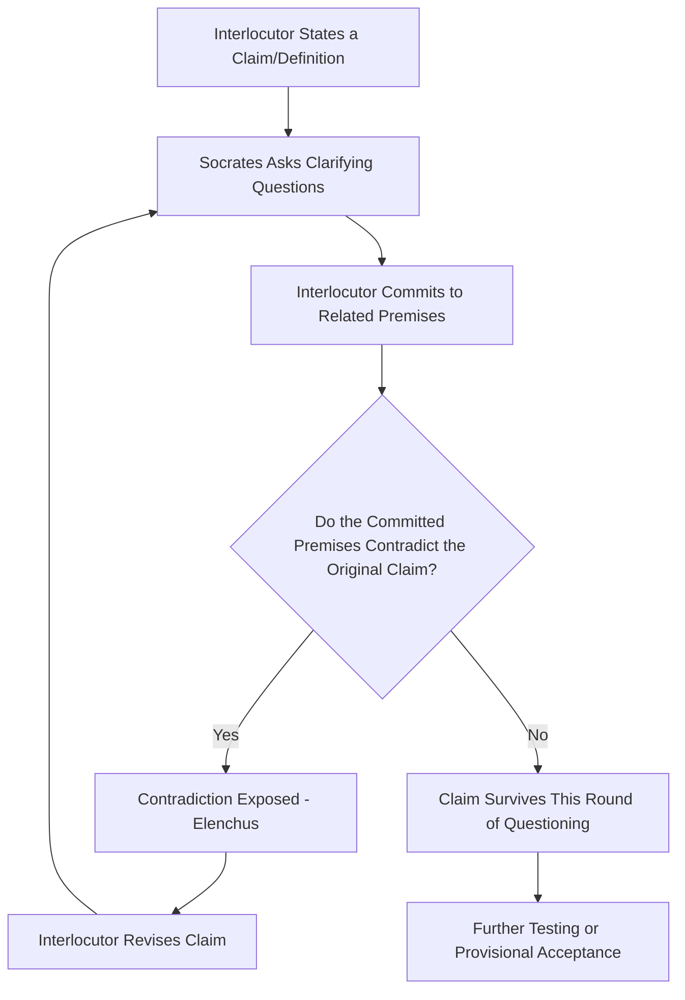

## Socratic Questioning and Dialectical Reasoning

### Overview

Socratic questioning and dialectical reasoning refer to a family of argumentative methods, originating with Socrates as depicted in Plato's dialogues, in which knowledge, definitions, and beliefs are tested and refined through systematic question-and-answer exchange rather than through one-directional assertion. Where rhetoric (in its classical sense) is often oriented toward persuading an audience, dialectic is oriented toward jointly testing the truth or coherence of a claim between two or more interlocutors. Aristotle explicitly distinguishes the two: rhetoric addresses a general audience about probable matters, while dialectic proceeds through question and answer between two parties toward a more rigorously examined conclusion.

**Key Points**

- The Socratic Method is fundamentally a method of *inquiry through cross-examination*, not a method of one-sided persuasion.
- Dialectical reasoning historically refers to the broader logical/philosophical tradition (Socratic elenchus, Platonic dialectic, Hegelian dialectic) concerned with resolving contradictions through structured opposition of viewpoints.
- Both are directly applicable to executive communication in contexts requiring rigorous internal vetting of ideas: strategy sessions, due diligence, decision review boards, and stakeholder negotiation.

### The Socratic Method: Structure and Purpose

The Socratic Method, as depicted in early Platonic dialogues, typically follows this pattern:

1. **Elicit a definition or claim** from the interlocutor (e.g., "What is courage?" or "What is justice?").
2. **Test the definition against cases** — proposing examples that appear to satisfy the definition but seem intuitively wrong, or counterexamples that seem to violate it while still being instances of the concept.
3. **Expose contradiction (*elenchus*)** — demonstrate that the interlocutor's stated beliefs, taken together, are logically inconsistent.
4. **Refine or abandon the original claim** in light of the contradiction, often arriving at a more precise or qualified definition — or, in many Platonic dialogues, arriving at *aporia*, a state of productive puzzlement without a final resolution.

This process is sometimes summarized as the **Socratic Elenchus** (from Greek *elenchos*, "cross-examination" or "refutation"), and its purpose is not to defeat the interlocutor for its own sake, but to expose gaps between what someone claims to know and what they can actually defend under systematic questioning.

**[Confirmed]** The Socratic method as depicted in Plato's early dialogues (e.g., the *Euthyphro*, on the definition of piety) characteristically ends in *aporia* — a state of unresolved puzzlement — rather than a settled positive conclusion, which is a defining feature distinguishing early ("Socratic") dialogues from Plato's later, more doctrinally constructive dialogues.

### Diagram: The Elenchus Cycle

### Categories of Socratic Questions

Socratic questioning is often organized into functional categories, widely adapted in critical thinking pedagogy (notably by Richard Paul and Linda Elder):

| Category | Purpose | Example Question |
| --- | --- | --- |
| Clarification | Force precision in terms and claims | "What exactly do you mean by 'efficient'?" |
| Probing assumptions | Surface unstated premises | "What are you assuming when you say this will work?" |
| Probing evidence/reasons | Test the grounds behind a claim | "What evidence leads you to that conclusion?" |
| Probing implications/consequences | Trace out what follows from a claim | "If that's true, what would that mean for our other product lines?" |
| Questioning viewpoint/perspective | Test whether alternative views were considered | "How would a competitor see this differently?" |
| Questioning the question | Examine whether the question itself is well-formed | "Is this the right question to be asking, or does it presuppose something unproven?" |

**Example**

> Claim: "We should cut the marketing budget because it isn't generating ROI."
>
> Clarification: "What specifically counts as ROI here — attributed sales, brand awareness, both?"
>
> Probing evidence: "What data are we using to measure that, and over what time window?"
>
> Probing assumptions: "Are we assuming marketing's effect is immediate rather than cumulative?"
>
> Probing implications: "If we cut it and sales drop next quarter, how would we know whether marketing was the cause?"

### Dialectical Reasoning: The Broader Tradition

**Platonic Dialectic**

In Plato's later work, dialectic becomes a more constructive method — moving through hypotheses toward higher, more general principles (the "Divided Line" and the ascent toward the Form of the Good in the *Republic*), rather than only the negative, contradiction-exposing method of the earlier Socratic dialogues.

**Aristotelian Dialectic**

Aristotle formalizes dialectic in the *Topics* as reasoning from generally accepted opinions (*endoxa*) toward a conclusion via structured question-and-answer, distinct from demonstrative (scientific) reasoning, which proceeds from premises known to be true, and distinct from rhetoric, which addresses a mass audience rather than a single respondent.

**Hegelian Dialectic**

A later, structurally different sense of "dialectic" — often summarized (though this exact triadic formula is a later simplification by commentators rather than Hegel's own terminology) as a process of **thesis → antithesis → synthesis**, in which a position and its contradiction are reconciled at a higher level of understanding. This sense is common in political and social theory but is a distinct tradition from the Socratic/Aristotelian sense described above.

**[Unverified]** The specific triadic phrase "thesis, antithesis, synthesis" is frequently attributed to Hegel in popular usage, but many Hegel scholars note this precise terminology is not how Hegel himself framed his dialectical method in his major texts; it is more accurately traced to Johann Fichte and later interpretive simplifications of Hegel's more complex dialectical structure.

### Socratic Questioning vs. Rhetorical Argument

| Dimension | Socratic/Dialectical Method | Rhetorical Argument |
| --- | --- | --- |
| Audience | One interlocutor (or small group) in direct exchange | A broader audience, often non-responsive in real time |
| Goal | Joint testing of truth/consistency | Persuasion toward a specific conclusion |
| Structure | Iterative question-and-answer | Structured presentation (claim, grounds, warrant) |
| Aristotelian category | Dialectic (*Topics*) | Rhetoric (*Rhetoric*) |
| Typical outcome | Refined understanding, or aporia | Audience acceptance or rejection of a conclusion |

Despite this distinction, dialectical and rhetorical methods are deeply complementary in executive practice: dialectical questioning is often used *internally* (in strategy sessions, red-teaming, due diligence) to stress-test and refine a position, which is then presented *externally* using rhetorical structure (Toulmin's claim-grounds-warrant, enthymematic compression) once the position has survived internal scrutiny.

### Applying Socratic Questioning in Executive and Organizational Settings

**Key Points**

- Used deliberately in strategic decision review to prevent groupthink and premature consensus.
- Functions as a structured alternative to direct disagreement, allowing flaws to surface through the proponent's own answers rather than through confrontation.
- Requires genuine, good-faith inquiry — questioning used purely to trap or embarrass a colleague (sometimes called "gotcha" questioning) undermines trust and is a corruption of the method, not an application of it.

**Example: Applying the Method in a Strategy Review**

> Proposal: "We should acquire Company X to enter the European market."
>
> Q1 (Clarification): "What does 'entering the European market' mean specifically — which countries, which customer segment?"
>
> Q2 (Probing evidence): "What data supports Company X being the best entry vehicle, versus organic expansion or a different partner?"
>
> Q3 (Probing assumptions): "Are we assuming Company X's existing customer relationships will transfer smoothly post-acquisition?"
>
> Q4 (Probing implications): "If regulatory approval is delayed a year, does the strategic case still hold?"
>
> Q5 (Questioning viewpoint): "How would this look from Company X's employees' or customers' perspective, not just ours?"

This sequence mirrors the elenchus structure: each answer either strengthens the proposal by surviving scrutiny or exposes a gap requiring revision — directly paralleling the "stress-test" step in constructing warranted, defensible arguments.

### The Socratic Method and the Toulmin Model Compared

Socratic questioning can be understood as a *live, interactive process* for surfacing the same components the Toulmin model identifies statically:

| Toulmin Component | Corresponding Socratic Question Type |
| --- | --- |
| Claim | Clarification questions ("What exactly are you asserting?") |
| Grounds | Evidence-probing questions ("What data supports this?") |
| Warrant | Assumption-probing questions ("What are you assuming connects this evidence to this conclusion?") |
| Backing | Follow-up evidence questions ("Why should we trust that assumption?") |
| Rebuttal | Perspective and implication questions ("What would a critic say? What if X were different?") |

### Limitations and Risks

- **Can be perceived as adversarial or evasive** if used to avoid stating one's own position while only questioning others.
- **Time-intensive**, making it less suited to time-constrained decision environments than direct argument presentation.
- **Risk of false aporia as an endpoint**: in organizational settings, arriving at productive puzzlement (appropriate in philosophical inquiry) is often insufficient — executive decisions require conclusions, so Socratic questioning in business contexts is typically a *diagnostic phase* preceding a decision, not the decision process itself.
- **Requires psychological safety**: participants must trust that questioning is aimed at improving the idea, not at personal criticism, or the method degrades into unproductive defensiveness.

[Inference] The effectiveness of Socratic questioning in organizational settings is plausibly contingent on the surrounding culture — specifically, whether participants trust the questioner's intent — though the precise conditions under which this method succeeds versus backfires are not reducible to a fixed formula and depend on team-specific dynamics not addressed in the classical sources.

### Related Topics

- Constructing Warranted, Defensible Arguments
- The Toulmin Model: Claim, Grounds, Warrant, and Backing
- Steelmanning Opposing Viewpoints
- Aristotle's Distinction Between Rhetoric and Dialectic
- Devil's Advocacy and Red-Teaming in Strategic Decision-Making
- Aporia and Productive Uncertainty in Executive Deliberation