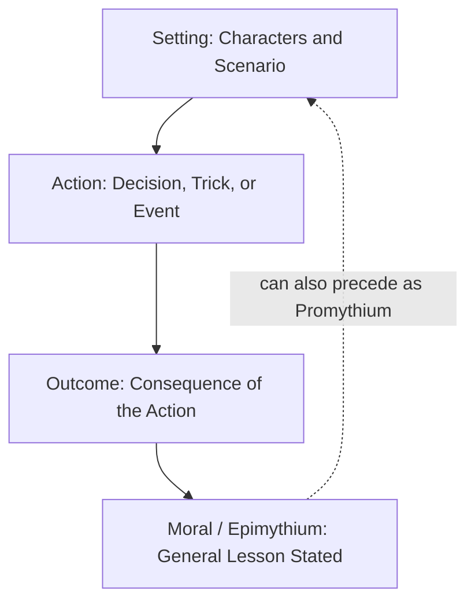

## Fable and Narrative Composition


### Overview

Fable (*mythos* / *fabula*) and Narrative (*diēgēma* / *narratio*) constitute the first two graded exercises in the classical **progymnasmata** — the sequence of preliminary rhetorical composition exercises used in Greek and Roman education to train students in the fundamentals of persuasive and structured discourse before advancing to full declamation. As documented in the surviving progymnasmata handbooks of Aelius Theon, Hermogenes of Tarsus, Aphthonius of Antioch, and Nicolaus the Sophist, these exercises were sequenced from simplest to most complex, with Fable typically placed first and Narrative second, establishing foundational skills — clarity, economy, causal sequencing, and moral/thematic point-making — that underlie all subsequent rhetorical training.

**Key Points**

- Fable and Narrative are foundational, not decorative: they train the compositional skills (clarity, sequence, economy, causality) that later exercises (Chreia, Confirmation, Refutation, Common Topic) and full oratory depend on.
- Both exercises historically required students to *retell* a given story in the student's own words, often followed by variation (expansion, compression, paraphrase in different styles) — the pedagogical emphasis was on flexible control of language, not invention of new plots.
- The progymnasmata sequence generally runs: Fable → Narrative → Chreia → Proverb → Refutation/Confirmation → Commonplace → Encomium → Comparison → Ethopoeia → Description → Thesis → Defend/Attack a Law — with Fable and Narrative as the entry point.

### Fable (*Mythos*/*Fabula*) as a Progymnasmata Exercise

**Definition**: A fable is a short fictional narrative, typically featuring animals, plants, or inanimate objects acting as rational agents, constructed to illustrate a general moral or practical truth. In the progymnasmata tradition, the fable exercise required students to retell, paraphrase, expand, compress, or moralize an existing fable (frequently drawn from the Aesopic corpus) rather than to invent an entirely new one, though invention was introduced at more advanced stages.

**[Confirmed]** Aphthonius's *Progymnasmata*, one of the most widely used and influential handbooks in both the Byzantine and later Western educational traditions (translated and used extensively in Renaissance grammar schools), places the fable exercise first in the sequence and explicitly links it to Aesop, treating fables attributed to Aesop as the standard source material for the exercise.

**Structural Components of the Classical Fable**

1. **Setting/Situation** — brief establishment of the scenario and characters (often anthropomorphized animals).
2. **Action/Conflict** — a short sequence of cause-and-effect events, usually involving a decision, trick, or misjudgment.
3. **Outcome** — the consequence that follows from the action, demonstrating the moral in dramatized form.
4. **Moral (*epimythium*)** — an explicit statement of the general lesson, which may be placed before the story (*promythium*) or after it (*epimythium*), or in more sophisticated versions, left partially implicit for the audience to draw out (an application of enthymematic compression to narrative).

**Example**

> **Fable**: A fox, seeing grapes hanging high on a vine, leapt repeatedly to reach them but could not. Failing after many attempts, the fox walked away, saying, "Those grapes are probably sour anyway."
>
> **Epimythium**: People often disparage what they cannot obtain, to avoid admitting failure.

**Pedagogical Function**: The fable exercise trained students in:

- **Compression and economy** — conveying a complete causal narrative and a generalizable lesson in minimal space.
- **Clarity of sequence** — presenting events in a logically and temporally coherent order.
- **Extracting and stating a general principle from a particular case** — a direct narrative parallel to inductive reasoning via the *paradeigma* (rhetorical example) used later in argumentative composition.
- **Stylistic variation**: students were often assigned to retell the same fable in different styles (plain, elaborated, compressed) or to change its moral while keeping the narrative largely intact, developing control over how the same underlying content could be reframed for different rhetorical purposes.

### Diagram: Fable Composition Structure



### Narrative (*Diēgēma*/*Narratio*) as a Progymnasmata Exercise

**Definition**: Narrative is the exercise of recounting an event — real, legendary, or fictional — in clear, complete, and well-ordered prose. Unlike the fable, the narrative exercise was not required to carry an explicit moral; its primary pedagogical purpose was training in factual/expository clarity, completeness, and structural control, since narrating events accurately and persuasively is a skill required across virtually all later rhetorical genres (forensic narration of facts in a legal case, historical narration, narrative sections of a speech).

**The Canonical Elements of Narrative (Circumstances)**

Classical rhetoricians (most notably formalized as the *septem circumstantiae*, "seven circumstances," associated with later rhetorical tradition building on Hermogenes and Cicero's *De Inventione*) specify the essential elements a complete narrative should address:

| Element | Latin Term | Question Answered |
| --- | --- | --- |
| Person | *quis* | Who was involved? |
| Act | *quid* | What happened? |
| Time | *quando* | When did it happen? |
| Place | *ubi* | Where did it happen? |
| Manner | *quemadmodum* | How did it happen? |
| Cause | *cur* | Why did it happen? |
| Means | *quibus adminiculis* | By what means/instruments? |

**[Confirmed]** This "seven circumstances" framework (often abbreviated in later rhetorical and journalistic tradition to the "Five Ws and How" — who, what, when, where, why, how) traces to ancient rhetorical theory concerned with achieving completeness in narrative, and Hermogenes' progymnasmata explicitly identifies core narrative virtues including clarity, brevity, and credibility/persuasiveness (*to pithanon*).

**Virtues of Narrative (per Hermogenes and Aphthonius)**

1. **Clarity (*saphēneia*)** — the account must be immediately comprehensible, avoiding ambiguity in sequence or reference.
2. **Brevity/Conciseness (*syntomia*)** — including only necessary detail, avoiding padding that obscures the throughline of events.
3. **Credibility/Persuasiveness (*pithanotēs*)** — the sequence of events must be plausible and internally consistent, so the audience accepts it as a coherent account of what happened.

These three virtues are frequently in tension (maximal brevity can compromise clarity; maximal detail can compromise concision), and part of the exercise's difficulty was in balancing them appropriately for the audience and purpose.

**Types of Narrative** (per the progymnasmata handbooks)

- **Mythical** — narrating events understood as legendary or fictional (myths, epic material).
- **Fictional/Plausible (*plasmatikon*)** — narrating invented but realistic events, similar to what would later be called fiction or plausible dramatization.
- **Historical** — narrating events treated as factually true, drawn from history.
- **Judicial/Civic** — narrating facts relevant to a legal or political matter, the type most directly preparatory for forensic oratory.

### Example: Narrative Applying the Seven Circumstances

> "Following the harbor fire at Piraeus [Place], the citizens of Athens [Person], fearing the loss of their naval stores [Cause], convened an emergency assembly at dawn the next day [Time] and voted, through open show of hands rather than secret ballot given the urgency [Manner], to allocate emergency funds from the treasury [Means] for immediate reconstruction [Act]."

Each circumstantial element is present and integrated into a single coherent account rather than presented as a disconnected checklist — a key stylistic requirement distinguishing skilled narrative composition from merely mechanical inclusion of the seven elements.

### Diagram: The Seven Circumstances of Narrative

<svg xmlns="http://www.w3.org/2000/svg" viewBox="0 0 800 380">
<text x="400" y="30" text-anchor="middle" font-size="18" font-weight="bold" fill="#1a1a1a">Seven Circumstances of Narrative (svg_diagram)</text>
<circle cx="400" cy="200" r="60" fill="#fef3e0" stroke="#c48a2a" stroke-width="2" />
<text x="400" y="196" text-anchor="middle" font-size="13" font-weight="bold" fill="#1a1a1a">Complete</text>
<text x="400" y="212" text-anchor="middle" font-size="13" font-weight="bold" fill="#1a1a1a">Narrative</text>
<g font-size="12" fill="#1a1a1a">
<circle cx="400" cy="70" r="42" fill="#e8f0fe" stroke="#4a72c4" stroke-width="1.5" />
<text x="400" y="65" text-anchor="middle">Person</text>
<text x="400" y="79" text-anchor="middle" font-size="10">(quis)</text>
<line x1="400" y1="112" x2="400" y2="140" stroke="#888" stroke-width="1.5" />



```
<circle cx="580" cy="120" r="42" fill="#e8f0fe" stroke="#4a72c4" stroke-width="1.5" />
<text x="580" y="115" text-anchor="middle">Act</text>
<text x="580" y="129" text-anchor="middle" font-size="10">(quid)</text>
<line x1="548" y1="152" x2="450" y2="180" stroke="#888" stroke-width="1.5" />

<circle cx="620" cy="260" r="42" fill="#e8f0fe" stroke="#4a72c4" stroke-width="1.5" />
<text x="620" y="255" text-anchor="middle">Time</text>
<text x="620" y="269" text-anchor="middle" font-size="10">(quando)</text>
<line x1="582" y1="245" x2="455" y2="215" stroke="#888" stroke-width="1.5" />

<circle cx="510" cy="340" r="42" fill="#e8f0fe" stroke="#4a72c4" stroke-width="1.5" />
<text x="510" y="335" text-anchor="middle">Place</text>
<text x="510" y="349" text-anchor="middle" font-size="10">(ubi)</text>
<line x1="485" y1="303" x2="430" y2="250" stroke="#888" stroke-width="1.5" />

<circle cx="290" cy="340" r="42" fill="#e8f0fe" stroke="#4a72c4" stroke-width="1.5" />
<text x="290" y="335" text-anchor="middle">Manner</text>
<text x="290" y="349" text-anchor="middle" font-size="10">(quemadmodum)</text>
<line x1="315" y1="303" x2="370" y2="250" stroke="#888" stroke-width="1.5" />

<circle cx="180" cy="260" r="42" fill="#e8f0fe" stroke="#4a72c4" stroke-width="1.5" />
<text x="180" y="255" text-anchor="middle">Cause</text>
<text x="180" y="269" text-anchor="middle" font-size="10">(cur)</text>
<line x1="218" y1="245" x2="345" y2="215" stroke="#888" stroke-width="1.5" />

<circle cx="220" cy="120" r="42" fill="#e8f0fe" stroke="#4a72c4" stroke-width="1.5" />
<text x="220" y="115" text-anchor="middle">Means</text>
<text x="220" y="129" text-anchor="middle" font-size="10">(quibus adminiculis)</text>
<line x1="252" y1="152" x2="350" y2="180" stroke="#888" stroke-width="1.5" />
```

</g>
</svg>

### Comparison: Fable vs. Narrative

| Dimension | Fable | Narrative |
| --- | --- | --- |
| Core content | Fictional, often anthropomorphized, illustrative | Event-based; real, legendary, or plausible |
| Explicit moral required | Yes (epimythium/promythium) | No — purpose is factual/expository clarity, not moralizing |
| Primary skill trained | Compression, generalization, extracting a principle from a case | Completeness, sequencing, circumstantial accuracy |
| Sequence position | First in progymnasmata | Second in progymnasmata |
| Later rhetorical application | Illustrative anecdotes, exempla in speeches (*paradeigma*) | Statement of Facts (*narratio*) in forensic oratory |

### Pedagogical Rationale for the Sequence

The progymnasmata authors placed Fable before Narrative deliberately: fable's fixed, simple narrative shape (setting → action → outcome → moral) and small scale make it a manageable first exercise in structuring sequential prose, while narrative's demand for completeness across seven circumstantial elements, applied to more complex and less schematic material (historical or civic events), represents an incremental increase in difficulty. Both exercises, in turn, directly prepare students for the *narratio* section of a forensic speech — the segment of a legal oration devoted to stating the facts of the case persuasively and completely before argument (*confirmatio*) begins.

**[Confirmed]** In classical rhetorical theory, particularly as systematized by Cicero (*De Inventione*) and later Quintilian (*Institutio Oratoria*), the *narratio* is a standard formal part of judicial oratory, positioned after the introduction (*exordium*) and before the proof (*confirmatio*) — directly building on the compositional skill trained by the progymnasmata narrative exercise.

### Application in Modern Executive Communication

Though rooted in ancient pedagogy, both exercises map directly onto contemporary executive communication needs:

- **Fable → Illustrative business anecdotes and case parables**: Executives frequently use short illustrative stories (a startup that failed by ignoring customer feedback, a competitor that succeeded by simplifying its product) functioning exactly as fables do — a compressed narrative concluding in an explicit or implied general lesson, applying enthymematic principles to narrative form.
- **Narrative → Incident reports, case statements, and factual briefings**: The seven-circumstances framework maps directly onto structuring a clear incident report, crisis communication statement, or "statement of facts" section of a business proposal — ensuring who, what, when, where, why, how, and by-what-means are all addressed before analysis or argument begins.
- **Balancing the three narrative virtues** (clarity, brevity, credibility) remains directly relevant to executive writing: an overly long incident report loses the audience; an overly compressed one omits information needed for trust and completeness; an implausible or internally inconsistent account undermines credibility regardless of length.

### Related Topics

- The Chreia and Proverb as Progymnasmata Exercises
- The Paradeigma (Rhetorical Example) as Inductive Proof
- The Structure of Forensic Oratory: Exordium, Narratio, Confirmatio, Peroratio
- Encomium and Comparison in the Progymnasmata Sequence
- Ethopoeia: Composing in Another's Persona or Voice
- Using Illustrative Anecdotes in Executive Storytelling