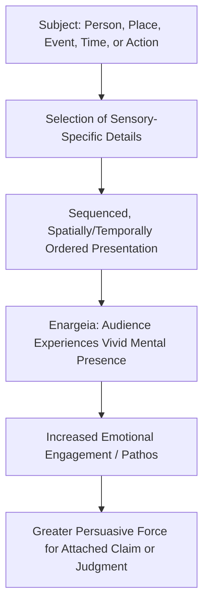

## Description and Vivid Scene-Setting (Ekphrasis)

### Overview

Ekphrasis (Greek *ekphrasis*, "description" or "speaking out") is one of the advanced exercises in the classical **progymnasmata**, defined by rhetorical theorists as a vivid, descriptive account that brings its subject "before the eyes" (*hypotyposis* / *enargeia*) of the audience with such immediacy that listeners feel they are seeing the subject directly rather than merely hearing about it. Unlike narrative, which primarily reports what happened, ekphrasis is concerned with rendering *how something appears* — a person, place, event, season, animal, or work of art — in sufficiently sensory and detailed language that it produces the psychological effect of witnessing.

**Key Points**

- The defining criterion of ekphrasis, per ancient rhetorical theory, is not subject matter but effect: it succeeds when it achieves *enargeia* (vividness), making an absent thing feel visually present to the audience.
- Ekphrasis appears in the progymnasmata sequence typically after Chreia, Proverb, and Refutation/Confirmation, and before or alongside Comparison and Encomium, reflecting its role as a technique that could be embedded within nearly any other rhetorical form rather than existing only as a standalone exercise.
- In later literary and art-historical usage, "ekphrasis" narrowed to refer specifically to the vivid verbal description of a visual artwork (a usage popularized by famous set-piece descriptions such as the shield of Achilles in Homer's *Iliad*), but the classical rhetorical sense is broader, covering persons, places, times, events, and actions generally.

### Ekphrasis in the Progymnasmata Handbooks

**[Confirmed]** Both Aphthonius's and Hermogenes' progymnasmata handbooks include ekphrasis as a distinct graded exercise and explicitly define it in terms of the effect of vividness (bringing the subject "before the eyes") rather than by restricting it to any single subject category; Aphthonius's own model example is a description of the Alexandrian temple of Tyche (Fortune), illustrating description of a place/structure rather than a painted artwork specifically.

**Categories of Subject Matter for Ekphrasis** (as classified across the progymnasmata tradition)

1. **Persons** (*prosōpa*) — physical appearance, bearing, dress, characteristic gestures.
2. **Actions/Events** (*pragmata*) — battles, festivals, storms, processions — dynamic scenes unfolding over time.
3. **Places** (*topoi*) — cities, buildings, landscapes, harbors.
4. **Times** (*chronoi*) — seasons, times of day, festivals tied to a calendar occasion.
5. **Manner of an occurrence** — how an event happened, emphasizing sensory sequence rather than bare fact (overlapping with, but more sensorily elaborated than, the "manner" circumstance in Narrative).

### The Core Rhetorical Principle: Enargeia

*Enargeia* (vividness, "visibility") is the technical term ancient rhetoricians used for the quality ekphrasis is designed to produce. It is closely related to, but distinct from, mere *clarity* (*saphēneia*, the narrative virtue discussed in relation to the Narrative exercise): clarity ensures the audience *understands* what happened, while enargeia ensures the audience *experiences* it as though present. Longinus (in the treatise *On the Sublime*) and Quintilian both treat vividness as one of the most powerful emotional and persuasive tools available to an orator, because an audience that feels it is directly witnessing a scene is more emotionally engaged and more likely to be moved to the desired judgment or action than an audience merely informed of facts.

**[Confirmed]** Quintilian, in the *Institutio Oratoria*, explicitly discusses *enargeia* (which he renders in Latin variously as *evidentia* or *repraesentatio*) as a quality that allows an orator to make an absent scene seem present to the mind's eye of the audience, and he connects this directly to increased emotional persuasive force in forensic oratory — for instance, in vividly describing the circumstances of a crime to increase a jury's indignation.

### Diagram: Mechanism of Ekphrastic Effect

### Techniques for Achieving Vividness

1. **Sensory specificity** — engaging multiple senses (sight, sound, smell, texture), not only visual detail, since multisensory description more strongly evokes presence than visual detail alone.
2. **Spatial or temporal ordering** — presenting details in an order that mirrors how an observer's eye or attention would actually move across the scene (near to far, top to bottom, beginning to end of an action), rather than a random list of features.
3. **Concrete, specific nouns and modifiers over abstract or generic ones** — "the harbor's salt-slick stones" rather than "the harbor area."
4. **Present-tense or immediate framing** (even when narrating a past event) to heighten the sense of witnessing rather than recollection.
5. **Selective, not exhaustive, detail** — ancient rhetoricians (and later composition theorists) note that vividness comes from a small number of precisely chosen, evocative details rather than an exhaustive inventory, which produces monotony rather than presence.

### Example: Ekphrasis of a Place

**Weak (non-ekphrastic) description**:

> "The harbor was busy with ships and workers."

**Ekphrastic version**:

> "Along the quay, ropes groaned taut against the pilings as hulls rocked with the incoming swell. Barefoot porters moved in a broken rhythm beneath crates stacked shoulder-high, their calls to one another cutting through the slap of water against stone, while the smell of tar and drying fish hung low over the whole basin, thickened by the noon heat."

The second version applies sound (groaning ropes, calls, slapping water), smell (tar, fish), tactile impression (bare feet, heat), and a clear spatial progression (quay → pilings → porters → basin), producing the "before the eyes" effect the progymnasmata authors specify as the exercise's defining goal.

### Example: Ekphrasis of a Person

> "He entered without hurry, though the room had been waiting for him — a tall man whose gray coat was creased at the elbows from years at a desk, whose hands, when he finally rested them on the table, were steady in a way that made the trembling papers before him look like someone else's problem entirely."

Note the technique here: physical detail (coat, hands) is selected not exhaustively but to imply character and situation (steadiness under pressure, long habituation to difficult work) — a technique bridging ekphrasis with the later progymnasmata exercise of **Ethopoeia** (composing in another's persona), since vivid description of a person often does double duty establishing both appearance and implied character.

### Ekphrasis vs. Narrative vs. Description-as-Ornament

| Dimension | Narrative | Ekphrasis | Merely Decorative Description |
| --- | --- | --- | --- |
| Primary goal | Report what happened, completely and clearly | Make the audience experience the subject as present | Add stylistic flourish without functional purpose |
| Governing virtue | Clarity, brevity, credibility (per Hermogenes) | Vividness (*enargeia*) | Elaborateness for its own sake |
| Structural anchor | The seven circumstances (who, what, when, where, why, how, by what means) | Sensory sequencing mirroring perception | No consistent structural principle |
| Rhetorical function | Establishes the facts of a case or account | Heightens emotional engagement and persuasive force | Often actively weakens an argument via padding/distraction |

**[Confirmed]** Classical rhetorical theory treats excessive or purposeless ornamentation (sometimes discussed under the broader category of stylistic excess) as a vice rather than a virtue of style; vivid description in the progymnasmata tradition is explicitly justified by its functional persuasive effect (enargeia increasing emotional engagement and credibility), not by decorative elaborateness alone.

### Ekphrasis in Forensic and Deliberative Oratory

Ancient rhetoricians recognized that ekphrasis was rarely used as a standalone exercise in mature oratory; instead, it was embedded within larger speeches at strategic points to intensify emotional effect at a moment where the argument benefited from heightened audience engagement:

- **In forensic oratory**: vividly describing the scene of a crime or the suffering of a victim to increase the emotional weight of an accusation (a technique Quintilian explicitly discusses and one closely tied to legitimate use of *pathos* as one of Aristotle's three proofs, provided it does not substitute for actual evidence — see the appeal-to-emotion fallacy for the illegitimate version of this technique).
- **In deliberative oratory**: vividly describing the likely future consequences of a policy decision (a flourishing city versus a devastated one) to make an abstract future outcome feel immediate and consequential to a deliberating audience.
- **In epideictic oratory**: vividly describing a person's deeds or a nation's history in ceremonial praise (encomium), where vivid presence heightens the emotional resonance of praise or blame.

### Modern Applications in Executive Communication

Ekphrastic technique, though rooted in ancient oratory, has direct application in executive and business rhetoric wherever an abstract situation benefits from being made concretely vivid to an audience:

- **Investor and stakeholder pitches**: Describing a future product experience or market opportunity vividly ("Picture a warehouse floor where every pallet scans itself as it passes...") rather than abstractly ("We will improve logistics efficiency") increases audience engagement and retention.
- **Crisis communication**: Precisely, vividly describing remedial action being taken (rather than vague assurance) can rebuild credibility — provided the vividness is grounded in true, verifiable specifics rather than emotionally manipulative embellishment (the ethical boundary paralleling the enthymeme's ethical caveat: vividness in service of a true, warranted claim is legitimate rhetoric; vividness used to obscure a weak or false claim is manipulation).
- **Change management communication**: Vividly describing "day one" of a new process or system helps employees form a concrete mental model of change that abstract policy language fails to produce.

### Practical Construction Checklist

1. **Identify the specific effect you want**: what emotional or judgmental response should the vividness produce, and is that response warranted by truth, not manufactured by embellishment alone?
2. **Select 3–5 precise sensory details** rather than attempting exhaustive coverage.
3. **Order details to mirror natural perception** (spatial sweep, chronological sequence of an unfolding action).
4. **Anchor abstraction in the concrete**: replace general claims ("this will be transformative") with a specific, imagined instance of the transformation in action.
5. **Verify the vividness serves the argument's warrant**, rather than functioning as an emotionally persuasive substitute for evidence — the same discipline required in legitimate, non-fallacious use of *pathos*.

[Inference] The precise number of sensory details that maximizes vividness without inducing monotony ("3–5" above) is a practical composition heuristic drawn from general rhetorical and creative-writing guidance rather than a fixed rule specified in the ancient sources, which describe the *principle* of selective, well-ordered detail without prescribing an exact quantity.

### Related Topics

- Fable and Narrative Composition
- Ethopoeia: Composing in Another's Persona or Voice
- Pathos and the Ethical Use of Emotional Appeal
- Encomium and Epideictic Oratory
- The Appeal-to-Emotion Fallacy and Its Legitimate Counterpart
- Vivid Scenario-Building in Investor and Crisis Communication