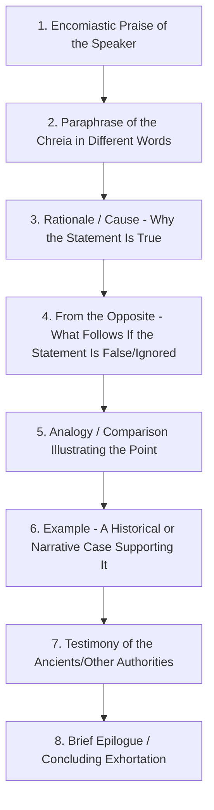

## Chreia and Maxim Exercises

### Overview

The Chreia (*chreia*, "useful statement" or "anecdote") and the Maxim (*gnōmē*, often rendered "proverb" or "sentence") are paired exercises in the classical **progymnasmata** sequence, typically positioned after Fable and Narrative and before Refutation/Confirmation. Both exercises center on a short, memorable statement — attributed to a specific person in the case of the chreia, or stated generally and anonymously in the case of the maxim — which the student then expands, analyzes, and elaborates through a fixed set of rhetorical operations. Together they train students in **amplification** (*auxēsis*): the ability to take a compact idea and develop it into extended, structured, persuasive prose, a skill foundational to nearly all mature oratory.

**Key Points**

- A chreia is anchored to an attributed speaker or agent ("Isocrates said..."); a maxim is a general statement with no attributed author ("Nothing in excess").
- Both exercises use a standardized set of elaboration steps (the *kephalaia*, or "headings") — the same analytical structure applied to a different type of source statement.
- These exercises directly train the amplification skill underlying developed argumentation, executive commentary on quotations, and the expansion of terse statements (mission statements, values statements, mottos) into substantive prose.

### The Chreia: Definition and Types

**Definition**: A chreia is a brief, memorable saying or action attributed to a specific, usually well-known person, offered because it is useful (*chreia* shares its root with the Greek word for "use" or "need") for instruction or exhortation.

**[Confirmed]** Ancient progymnasmata theorists (Theon, Hermogenes, Aphthonius) classify chreiai into distinct types based on form, most fundamentally distinguishing the **verbal chreia** (a saying attributed to someone, with no significant action involved) from the **action chreia** (a deed or action attributed to someone, sometimes with accompanying words, sometimes purely a wordless act) — and further subdividing verbal chreiai into simple statement, response to a question, and other conversational forms.

**Types of Chreia**

| Type | Structure | Example |
| --- | --- | --- |
| Verbal — Simple Statement | Person states something unprompted | "Isocrates said that the root of education is bitter, but its fruit is sweet." |
| Verbal — Responsive | Person responds to a question or circumstance | "When asked what advantage he had gained from philosophy, Aristotle said, 'I do without being ordered what others do from fear of the law.'" |
| Mixed (Verbal + Action) | Both a notable action and accompanying words are recorded | "Diogenes, seeing a boy drinking from his hands, threw away his own cup, saying, 'A child has beaten me in simplicity of living.'" |
| Action (Wordless) | A deed alone, without accompanying speech, carries the instructive point | "Diogenes, on seeing an official mishandling public funds, walked past him without a word, laying his hand briefly on his own threadbare cloak." |

### The Maxim (*Gnōmē*): Definition

**Definition**: A maxim is a short, general statement expressing a broadly applicable truth about life, conduct, or human nature, without attribution to a specific individual and without embedding it in a specific narrated circumstance. Where the chreia's authority derives partly from *who* said it (an appeal to the speaker's ethos), the maxim's authority derives from its own claimed universal applicability.

**Example maxims** (in the classical didactic tradition):

> "Know thyself."
>
> "Nothing in excess."
>
> "The unexamined life is not worth living." *(Note: this specific line, while maxim-like in form, is Socratic in attribution per Plato's Apology — illustrating how the chreia/maxim boundary can blur when a maxim-form statement is nonetheless linked to a known speaker.)*

**[Unverified]** The precise boundary between "maxim" and "chreia" in specific ancient examples is not always crisp in the surviving handbooks, since some sayings appear across sources both as anonymously stated maxims and as chreiai attributed to a named sage; ancient rhetoricians themselves noted this overlap rather than treating the categories as perfectly disjoint.

### The Elaboration Structure (*Kephalaia* / "Headings")

Both chreia and maxim exercises were developed using a standardized sequence of elaboration steps. Aphthonius's version of the chreia elaboration (the most influential in the later Byzantine and Western pedagogical tradition) typically includes eight headings:

**Explanation of Each Heading**

1. **Encomiastic Praise of the Speaker** — brief laudatory remarks establishing the speaker's credibility (an application of *ethos*), justifying why their statement merits attention.
2. **Paraphrase** — restating the chreia's content in the student's own words, demonstrating comprehension and stylistic control (directly building the paraphrasing skill trained in Fable and Narrative).
3. **Rationale (Cause)** — explaining *why* the statement is true; the logical justification, functioning much like supplying the warrant in a Toulmin-style argument for the maxim's claim.
4. **From the Opposite** — arguing that the contrary of the statement leads to bad or absurd consequences, a technique closely related to *reductio*-style argument and to the "from opposites" topos discussed under enthymeme construction.
5. **Analogy** — a comparison (often to nature or a familiar domain) illustrating the principle in different terms.
6. **Example** — a specific historical, legendary, or narrated case in which the principle held true, applying the same inductive logic as the *paradeigma*.
7. **Testimony of the Ancients** — citing additional authoritative sources (other wise figures, proverbs, established authors) who support the same point, reinforcing ethos through accumulated authority.
8. **Brief Epilogue** — a short closing exhortation urging the audience to accept or act on the principle.

**[Confirmed]** This eight-part elaboration schema is documented in Aphthonius's *Progymnasmata* and represents one of the most detailed and systematized components of the entire progymnasmata sequence; variations in the exact number and order of headings exist among Theon, Hermogenes, and Aphthonius, but the underlying operations (paraphrase, rationale, contrary, analogy, example, testimony, exhortation) recur consistently across the tradition.

### Worked Example: Elaborating a Chreia

**Chreia**: "Isocrates said that the root of education is bitter, but its fruit is sweet."

1. **Encomiastic Praise**: Isocrates, among the most respected teachers of rhetoric in Athens, spoke from decades of experience training students in the discipline of eloquent speech.
2. **Paraphrase**: What he meant was that learning is difficult and often unpleasant at its outset, yet the rewards it eventually yields are deeply satisfying.
3. **Rationale**: This is true because mastery of any skill requires enduring the discomfort of early struggle before the benefits of competence become available.
4. **From the Opposite**: Those who abandon learning at the first sign of difficulty, avoiding the bitterness, never taste the fruit at all, and remain without the very competence they sought.
5. **Analogy**: Just as a farmer must break and turn hard soil before it will yield a harvest, the mind must be worked through difficulty before it yields understanding.
6. **Example**: Demosthenes, whose early attempts at oratory were mocked for a weak voice and poor delivery, endured years of arduous practice before becoming Athens's greatest orator.
7. **Testimony**: This aligns with the common saying that "there is no royal road" to any worthwhile skill, echoed across many teachers of the era.
8. **Epilogue**: Let us, then, not shrink from the bitterness of early effort, since it is the very price of the fruit we seek.

This structure — praise, restatement, justification, contrary case, analogy, example, authority, exhortation — produces a fully developed short composition from a single-sentence starting point, which is the exercise's explicit pedagogical goal: training **amplification**, the capacity to expand a compact idea into substantive, well-supported prose.

### Chreia/Maxim Elaboration vs. the Toulmin Model

The chreia elaboration schema and the Toulmin model serve structurally parallel but historically independent functions — both convert a bare assertion into a fully supported case:

| Chreia/Maxim Heading | Approximate Toulmin Parallel |
| --- | --- |
| Paraphrase | Restating the Claim precisely |
| Rationale (Cause) | Warrant |
| From the Opposite | A form of Rebuttal-testing (stress-testing via contrary case) |
| Example | Grounds (a specific supporting instance) |
| Testimony of the Ancients | Backing (external authoritative support) |
| Encomiastic Praise | Ethos-based support for the Warrant's credibility |

### Application in Modern Executive Communication

The chreia/maxim elaboration structure maps directly onto a common executive communication task: **expanding a short quotation, motto, mission statement, or company value into substantive commentary** — for instance, in a keynote address, an internal memo explaining "why we say this," or a leadership essay built around a guiding principle.

**Example (Modern Application)**

> **Maxim/Company Value**: "Ship early, ship often."
>
> **Paraphrase**: We believe releasing work in small, frequent increments beats waiting for a single large, polished release.
>
> **Rationale**: Small releases surface problems while they are still cheap to fix and let real user feedback guide the next iteration.
>
> **From the Opposite**: Teams that wait for a "perfect" release often discover fundamental misunderstandings of user needs only after months of investment, when correction is far more costly.
>
> **Analogy**: It is like course-correcting a ship continuously versus setting a single heading and hoping the destination hasn't moved by the time you arrive.
>
> **Example**: [Company's own product history, or a well-known industry case, illustrating the principle in action.]
>
> **Testimony**: This aligns with the broader industry consensus favoring iterative and agile development methodologies over large, monolithic release cycles.
>
> **Epilogue**: This is why every roadmap we build favors frequent, smaller releases over infrequent, larger ones.

This is precisely the ancient chreia elaboration structure applied to a corporate value statement — demonstrating the exercise's continuing direct utility in leadership writing and speechwriting.

### Practical Construction Checklist

1. **Select or receive the source statement** — attributed (chreia) or general (maxim).
2. **Paraphrase it** in different, clearer, or more contextually relevant language.
3. **Supply the rationale** — the warrant explaining why it is true or valid.
4. **Test the contrary** — what happens if the principle is ignored or its opposite is followed.
5. **Find an illustrative analogy** from a different domain.
6. **Supply a concrete example** — historical, organizational, or personal — demonstrating the principle in action.
7. **Cite supporting authority or consensus**, where genuinely available and relevant (avoiding a fallacious appeal to authority if the cited support does not actually bear on the specific claim).
8. **Close with a brief, motivating restatement** connecting the principle back to the audience's immediate context or decision.

[Inference] The eight-heading schema is presented in the ancient handbooks as a comprehensive, ideal structure; in practice, especially in modern executive contexts, using a subset of these headings (e.g., paraphrase, rationale, example, epilogue) proportional to the speech's length and formality is a reasonable adaptation, though the classical sources themselves are prescriptive about the full sequence for the formal training exercise rather than offering guidance on which subset to select for abbreviated modern use.

### Related Topics

- Fable and Narrative Composition
- The Enthymeme as Rhetorical Syllogism (parallel use of Rationale/Warrant)
- The Paradeigma (Rhetorical Example) as Inductive Proof
- Refutation and Confirmation as Progymnasmata Exercises
- Amplification (*Auxēsis*) as a General Rhetorical Technique
- Expanding Mission Statements and Corporate Values into Leadership Rhetoric