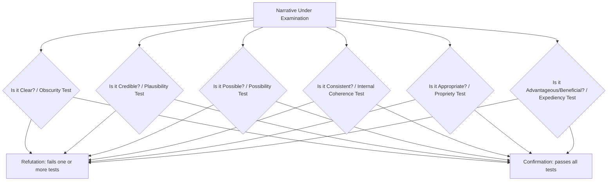

## Refutation and Confirmation Exercises

### Overview

Refutation (*anaskeuē*) and Confirmation (*kataskeuē*) are paired progymnasmata exercises requiring students to argue systematically against or for the credibility of a given narrative — typically a myth, legendary account, or received story — using a fixed set of standardized critical tests. Positioned after the Chreia and Maxim exercises in the classical sequence (as in Aphthonius's ordering), these exercises represent the point at which the progymnasmata shift from composition and elaboration skills toward explicit argumentative and critical-evaluative skill: testing a narrative's plausibility, consistency, and moral acceptability rather than merely retelling or expanding it.

**Key Points**

- Refutation and Confirmation are structurally mirror-image exercises: they apply the same set of evaluative criteria (the *kephalaia*, or "headings") to argue, respectively, that a narrative should be disbelieved or that it should be accepted.
- The exercise deliberately used legendary or mythical material (rather than contested contemporary claims) so students could practice rigorous critical technique on low-stakes material before applying the same skills to real forensic or deliberative arguments.
- The headings used in Refutation/Confirmation directly parallel later-developed argumentative frameworks (Toulmin's grounds/warrant, fallacy detection criteria), making this exercise a historical precursor to systematic argument evaluation.

### Definitions

**Refutation (*Anaskeuē*, literally "un-building" or "demolition")**: The exercise of arguing that a given narrative, statement, or account is not credible, not clear, impossible, inconsistent, inappropriate, or disadvantageous — i.e., building a systematic case for disbelieving or rejecting it.

**Confirmation (*Kataskeuē*, literally "building up" or "establishment")**: The exercise of arguing the reverse — that a given narrative or statement is credible, clear, possible, consistent, appropriate, and advantageous — i.e., building a systematic case for accepting it.

**[Confirmed]** Aphthonius's *Progymnasmata* explicitly pairs these two exercises and applies them to the same category of source material (typically mythical or legendary narratives, such as stories about the gods or legendary figures), instructing students to first refute and, in a separate exercise, confirm accounts of this kind — establishing that the exercise trains the *method* of critical evaluation independent of which side of a given claim the student is arguing.

### The Standard Headings (*Kephalaia*) for Refutation and Confirmation

Ancient rhetorical handbooks specify a consistent set of critical tests applied to the narrative under examination. While the exact number and ordering vary slightly among Theon, Hermogenes, and Aphthonius, the core evaluative categories are:

**Explanation of Each Test**

1. **Clarity/Obscurity (*to asaphes*)** — Is the account stated in a way that is comprehensible, or is it vague, ambiguous, or confusingly told? A refutation can attack obscurity itself as evidence of an unreliable account; a confirmation can point to its clear, well-specified telling as evidence of reliability.
2. **Credibility/Plausibility (*to apithanon* / *to pithanon*)** — Does the account align with common experience and probability, or does it strain belief? This test closely parallels the *pithanotēs* (credibility) virtue required of good Narrative composition.
3. **Possibility (*to adynaton*)** — Could the events described actually occur, given known physical, natural, or historical constraints? This is the most direct test for legendary/mythical material, since many such accounts involve claims exceeding natural possibility.
4. **Consistency (*to asystaton* / internal coherence)** — Do the details of the account cohere with one another, or does it contain internal contradictions (e.g., a timeline that doesn't add up, characters acting in ways inconsistent with earlier established traits)?
5. **Propriety/Appropriateness (*to aprepes*)** — Is the behavior attributed to the characters appropriate to their stated character, status, or the customs of the time and place? An account describing a revered figure acting in an uncharacteristic or dishonorable way, without explanation, is vulnerable on this ground.
6. **Advantage/Expediency (*to asympheron*)** — Does accepting the account serve a beneficial purpose (moral instruction, useful precedent), or does believing it produce harmful consequences (encouraging bad conduct, spreading falsehood)? This criterion reflects the pedagogical and moral orientation of ancient education, in which narratives were evaluated partly by their social utility.

**[Confirmed]** The application of the possibility, plausibility, and consistency tests specifically to mythical material reflects the broader tradition of ancient rationalist myth criticism (sometimes associated with the tradition of "Euhemerism," which sought natural or historical explanations for mythological accounts); the progymnasmata exercise formalized this critical tradition into a repeatable rhetorical training method rather than inventing it from nothing.

### Worked Example: Refutation

**Narrative under examination**: "It is said that Icarus flew so high on wings of feathers and wax that the sun melted the wax, and he fell into the sea."

1. **Obscurity**: The account leaves unclear precisely how feathers were affixed with wax in a manner capable of sustained flight at all, let alone flight at an altitude near the sun.
2. **Implausibility**: No known instance of human flight by artificial wings, ancient or otherwise, has ever been achieved by this method; the account requires us to believe an entirely unprecedented feat.
3. **Impossibility**: Basic reasoning about temperature shows the upper atmosphere grows colder, not hotter, with altitude — the very physical premise driving the story's climax is inverted from what would actually occur.
4. **Inconsistency**: If proximity to the sun were sufficient to melt wax at any survivable altitude, the ambient heat alone would have made the flight impossible long before reaching such a height.
5. **Impropriety**: It strains belief that a father skilled and cautious enough to construct wings would fail to anticipate so basic a risk to his own son.
6. **Disadvantage**: Accepting such an account uncritically encourages the uncritical acceptance of other implausible claims, undermining the very habits of reasoned judgment this education is meant to cultivate.

### Worked Example: Confirmation

**Narrative under examination** (a different, more historically plausible account): "It is said that after the Battle of Marathon, a runner carried news of the victory to Athens, delivered the message, and collapsed."

1. **Clarity**: The account is stated plainly, with a clear sequence — battle, message, delivery, collapse — leaving no ambiguity about what is claimed to have occurred.
2. **Plausibility**: Long-distance messengers were a standard and necessary practice in ancient Greek warfare, given the absence of faster communication methods; urgent news of a major battle's outcome would predictably be carried this way.
3. **Possibility**: A trained runner covering the described distance, while extreme, falls within the range of known human physical endurance, particularly for someone accustomed to long-distance running as a professional or trained role.
4. **Consistency**: The physical strain described (collapse after exertion) is consistent with, rather than contradicting, the extreme effort the account attributes to the runner.
5. **Propriety**: It is entirely fitting that a city anxiously awaiting news of a decisive battle would dispatch its fastest and most trusted runner, and that such a runner would drive himself to physical limits.
6. **Advantage**: Accepting the account preserves a historically instructive example of civic duty and physical dedication, of clear pedagogical and moral value regardless of the precise historical accuracy of every detail.

### Refutation/Confirmation vs. Modern Argumentative Frameworks

| Ancient Heading | Modern Parallel |
| --- | --- |
| Clarity/Obscurity | Precision requirement in claim formulation (Toulmin: well-formed Claim) |
| Credibility/Plausibility | Warrant and Backing sufficiency; base-rate/plausibility checks |
| Possibility | Testing physical/logical feasibility — a factual/scientific check on Grounds |
| Consistency | Internal coherence check — closely related to detecting the Undistributed Middle or self-contradiction in formal fallacy analysis |
| Propriety | Character/context consistency — related to assessing credibility of testimony (*ethos*-based evaluation) |
| Advantage/Expediency | Consequentialist evaluation — assessing the practical/social costs and benefits of accepting a claim |

This mapping demonstrates that Refutation/Confirmation functions as an ancient, systematized precursor to the modern practice of **fact-checking and claim evaluation**, and its six-test structure anticipates, in less formalized language, several of the diagnostic questions used in modern fallacy detection and warranted-argument construction.

### Refutation/Confirmation vs. Steelmanning

While related, these exercises differ in orientation from steelmanning:

| Dimension | Refutation/Confirmation | Steelmanning |
| --- | --- | --- |
| Object | A third-party narrative or claim (often not one's own position or an opponent's live argument) | An opponent's actual argument in a live disagreement |
| Symmetry | The same six tests are applied whether arguing for or against | Charitable reconstruction only — evaluation happens in a distinct, later step |
| Goal | Train systematic critical evaluation skill in general | Improve the fairness and eventual strength of one's specific rebuttal |
| Relationship | A precursor skill: the six-test method is a toolkit that can be applied *during* the "grounds/evidence" stress-test phase of steelmanning or fallacy-checking | Builds on evaluative rigor but adds the additional charity requirement |

### Application in Modern Executive and Professional Contexts

The Refutation/Confirmation six-test framework transfers directly to several recurring professional evaluation tasks:

- **Due diligence and claim verification**: Evaluating a vendor's, competitor's, or internal team's claims (a projected growth figure, a technical capability claim) using the same six tests — is it clearly stated, plausible given known conditions, physically/technically possible, internally consistent, consistent with the claimant's known track record (propriety), and would accepting it produce good or harmful downstream decisions (advantage)?
- **Media literacy and public claim evaluation**: Assessing viral claims, rumors, or unverified reports using the possibility, consistency, and plausibility tests before repeating or acting on them.
- **Internal red-teaming of proposals**: Systematically running a proposal through all six tests before presenting it externally, surfacing weaknesses that a less structured review might miss.

**Example (Modern Application — Confirmation of a Business Claim)**

> Claim: "Our new manufacturing process will cut unit costs by 30% within six months."
>
> Clarity: The claim specifies a precise figure and timeframe, avoiding vague language.
>
> Plausibility: Comparable process changes in this industry have historically achieved 15–35% cost reductions, placing this claim within an established plausible range.
>
> Possibility: The proposed equipment changes are already in commercial use elsewhere, confirming the underlying mechanism is achievable, not speculative.
>
> Consistency: The projected timeline aligns with the vendor's documented installation and ramp-up schedule, with no internal contradiction between stated capacity and stated cost impact.
>
> Propriety: The team proposing this has a track record of accurately forecasting prior process improvements, supporting confidence in this forecast as well.
>
> Advantage: Accepting and acting on this claim, if accurate, produces substantial and beneficial cost savings, and even if partially inaccurate, the underlying investment carries manageable downside risk.

### Practical Construction Checklist

1. **State the narrative or claim under examination precisely.**
2. **Apply the six tests systematically** (clarity, plausibility, possibility, consistency, propriety, advantage), rather than intuitively picking whichever objection or support comes to mind first.
3. **For Refutation**: identify which test(s) the claim fails most decisively, and lead with the strongest failure.
4. **For Confirmation**: identify which test(s) the claim passes most strongly, and anticipate which test a skeptic would attack, addressing it proactively.
5. **Distinguish disproof of the specific account from disproof of the underlying general point** — a narrative's specific details can fail refutation tests while the broader lesson or claim it illustrates remains separately defensible (or vice versa).

[Inference] The relative weight to assign each of the six tests when they produce mixed results (e.g., a claim that is plausible but only partially consistent) is not specified with a fixed formula in the ancient sources, which present the tests as a checklist of considerations rather than a scoring system with defined thresholds; in practice, weighting is a matter of rhetorical judgment calibrated to the specific claim and audience.

### Related Topics

- Chreia and Maxim Exercises
- Constructing Warranted, Defensible Arguments
- Common Logical Fallacies and How to Spot Them
- Steelmanning Opposing Viewpoints
- The Toulmin Model: Claim, Grounds, Warrant, and Backing
- Due Diligence Frameworks in Executive Decision-Making