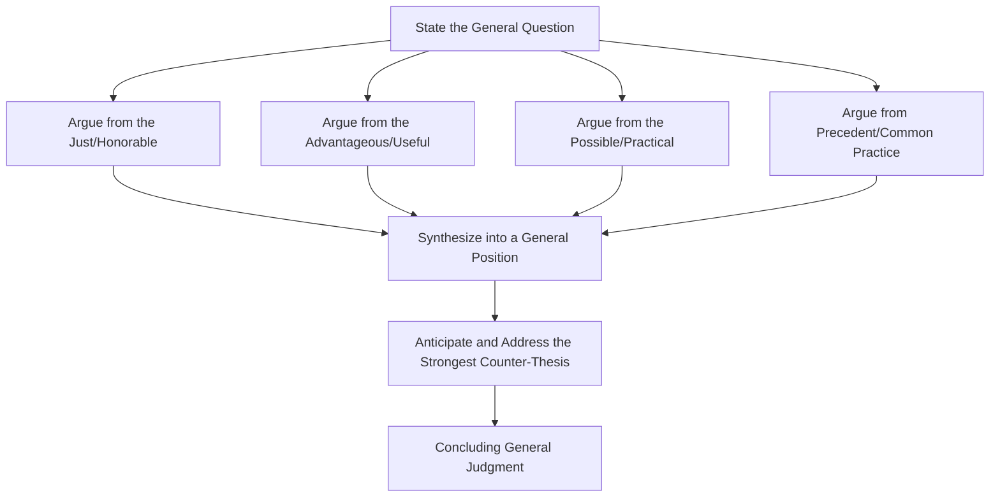

## Commonplace and Thesis Exercises

### Overview

Commonplace (*koinos topos*) and Thesis (*thesis*) are among the most advanced exercises in the classical **progymnasmata** sequence, positioned near the end of the curriculum, immediately preceding or alongside the final capstone exercise of proposing or opposing a law. Where earlier exercises (Fable, Narrative, Chreia, Refutation/Confirmation) work with a specific given narrative or statement, Commonplace and Thesis mark a decisive shift toward general, abstract argumentation detached from any single concrete case — directly preparing students for the kind of open-ended deliberative and forensic argument required in mature oratory and, ultimately, philosophical disputation.

**Key Points**

- The Commonplace exercise amplifies established guilt or virtue in a *known* category of person (a traitor, a tyrant, a courageous soldier) without needing to prove the underlying facts, which are treated as already settled.
- The Thesis exercise argues a general, abstract question ("Should one marry?", "Is a political life preferable to a philosophical one?") independent of any particular person or specific circumstance.
- Together they represent the exercise sequence's transition from case-specific argumentation to general, principle-level argumentation — the same shift reflected in the modern distinction between arguing a specific case and arguing a general policy or philosophical question.

### The Commonplace (*Koinos Topos*) Exercise

**Definition**: The commonplace exercise trains students to amplify (intensify emotionally and rhetorically) the qualities of a general category of person whose guilt or virtue is already established or stipulated — a tyrant, a traitor, an adulterer, a courageous general, a devoted mother — without needing to argue whether the specific accusation is true. The exercise assumes the underlying fact is settled and focuses entirely on **amplification** (*auxēsis*): building emotional and moral force around the *established* category.

**[Confirmed]** Ancient progymnasmata handbooks (Hermogenes, Aphthonius) explicitly distinguish the commonplace exercise from forensic argument proper: the commonplace does not argue *whether* the accused is a tyrant or traitor (that is presumed as a given for the exercise), but rather develops the rhetorical case for why such a person, once their status is established, deserves the harshest condemnation (or, in the case of virtue, the highest praise) — training amplification skill independent of the proof-of-fact skill trained elsewhere in the sequence.

**Structure of a Commonplace Composition**

1. **Contrary opening (*prooimion apo tou enantiou*)** — often begins by noting the inappropriateness or difficulty of adequately condemning/praising someone of such extreme character.
2. **Amplification of the general category** — elaborating why this type of person (tyrant, traitor) is especially harmful or virtuous, appealing to shared communal values.
3. **Comparison** — measuring the person's category against other categories of wrongdoing or virtue to establish relative severity or excellence (e.g., a traitor is worse than an ordinary thief because betrayal violates trust as well as law).
4. **Digression on related harm/benefit** — extending the amplification to the broader social consequences of this category of person's actions.
5. **Rejection of mitigating excuses** — anticipating and dismissing possible extenuating circumstances.
6. **Concluding exhortation** — a call to appropriate judgment or action (condemnation, honor) matching the amplified severity or virtue established.

**Example (Condemnation Commonplace)**

> "It is difficult to find words equal to a crime of this magnitude, for what could be worse than one who, entrusted with the city's defense, opened its gates to its enemies? The ordinary thief steals what belongs to one man; the traitor steals the safety of every man, woman, and child within the walls. Let no one speak of the hardships that drove him to this — hardship visits every citizen in times of siege, yet only he chose betrayal over endurance. Such a man does not deserve the mercy shown to lesser offenders, for his crime has no lesser counterpart against which to measure a lesser punishment."

Note that the passage never argues *whether* the person actually opened the gates — that fact is stipulated as the exercise's premise — and instead builds emotional and moral intensity around the established category of "traitor," a technique directly related to the emotional amplification function of *ekphrasis* and legitimate *pathos*.

### The Thesis (*Thesis*) Exercise

**Definition**: The thesis exercise trains students to argue a general question of policy, value, or philosophical import, entirely detached from any specific individual, case, or circumstance — the culmination of the progymnasmata's progressive move from concrete narrative toward abstract argument, and the direct precursor to full deliberative and philosophical oratory.

**[Confirmed]** Ancient rhetoricians distinguish the thesis from the **hypothesis** (a specific, circumstantially embedded question, e.g., "Should this particular general be recalled from this particular campaign?") — the thesis strips away all particular circumstances to leave a general question ("Should generals ever be recalled mid-campaign?"), a distinction discussed explicitly by both Hermogenes and Cicero (in the latter's treatment of general versus specific questions, *quaestiones infinitae* versus *quaestiones finitae*, in *De Inventione* and later rhetorical works).

**Categories of Thesis Questions**

1. **Practical/Political**: "Should one engage in political life?"
2. **Ethical/Personal**: "Should one marry?"
3. **Comparative-general**: "Is a life of contemplation preferable to a life of action?"
4. **Theoretical/Speculative**: "Does divine providence govern human affairs?"

### Diagram: General Method for Arguing a Thesis

**Standard Lines of Argument for a Thesis** (drawing on the broader deliberative topics used throughout classical rhetoric)

- **From the honorable/just** — is the position morally right in principle?
- **From the advantageous** — does it produce beneficial outcomes, generally construed?
- **From the possible** — is the position practically achievable or livable as a general rule?
- **From precedent/common practice** — what does established custom, law, or the practice of respected communities suggest?
- **From the opposite consequence** — what follows generally if the contrary position is adopted instead?

### Worked Example: Arguing a Thesis

**Thesis question**: "Should one engage in public/political life?"

**Affirmative line**:

> From the honorable: Contributing to the governance of one's community is among the highest expressions of civic virtue, since it applies one's abilities toward the common good rather than private advantage alone.
>
> From the advantageous: A community benefits directly from the participation of its most capable members; withdrawal by the capable leaves governance to the less capable or the self-interested.
>
> From the possible: History provides numerous examples of individuals successfully balancing public responsibility with personal life, demonstrating the position's practical viability.
>
> From precedent: The most respected traditions of civic philosophy hold public engagement as a duty owed by capable citizens to their community.

**Anticipated counter-thesis (to be addressed, applying steelmanning principles)**:

> The strongest objection holds that political life exposes one to corruption, compromises personal integrity, and diverts time from philosophical or family pursuits of comparable or greater value.

**Response addressing the counter-thesis**:

> This risk is real but does not establish that political life should be avoided altogether — only that it should be entered with clear-eyed awareness of its temptations, a caution applicable to nearly any position of influence or responsibility, public or private.

### Commonplace vs. Thesis: Structural Comparison

| Dimension | Commonplace | Thesis |
| --- | --- | --- |
| Subject | A general *category* of person (traitor, hero) whose status is stipulated | A general abstract *question* (should X be done?) |
| Underlying fact | Presumed settled; not argued | No settled fact; the entire question is open |
| Primary skill trained | Amplification (*auxēsis*) — emotional/moral intensification | Systematic general argumentation across multiple standard lines (honorable, advantageous, possible, precedent) |
| Rhetorical genre most closely tied to it | Epideictic (praise/blame) and forensic (condemnation/acquittal) | Deliberative (policy) and philosophical disputation |
| Position in progymnasmata sequence | Near the end, alongside/after Encomium and Comparison | Final or near-final exercise, immediately preceding full oratory/declamation |

### Relationship to Aristotle's Rhetorical Genres and to Dialectic

The thesis exercise is the progymnasmata's most direct bridge to **Aristotelian dialectic** (discussed in relation to Socratic Questioning and Dialectical Reasoning), since arguing a general thesis — detached from any single case — closely resembles the dialectical practice of arguing general questions from accepted opinions (*endoxa*). The commonplace exercise, by contrast, remains closely tied to **epideictic** and **forensic** rhetoric, since its amplification technique is precisely the skill Aristotle identifies as central to praise/blame and accusation/defense.

**[Confirmed]** Cicero's *De Inventione* and later rhetorical tradition explicitly identify the general thesis question (*quaestio infinita*) as foundational training for the specific case-based question (*quaestio finita*) that forensic and deliberative oratory ultimately require, treating the movement from general to specific argumentative skill as pedagogically deliberate rather than incidental.

### Application in Modern Executive and Professional Communication

**Commonplace parallel**: Executive communication frequently requires amplifying an already-established category of behavior or outcome without re-litigating the underlying facts — for instance, a company statement condemning a proven case of data breach negligence, or an internal address praising an already-recognized instance of exceptional teamwork. The rhetorical task is not to prove the underlying fact (already established) but to appropriately amplify its significance for the audience.

**Thesis parallel**: Strategic and policy questions faced by leadership frequently take the form of general theses before they are applied to a specific case — "Should our industry adopt remote-first work as standard practice?" is a thesis-level question, distinct from the hypothesis-level question "Should our specific team adopt remote-first work this quarter, given our current client contracts?" Executives benefit from first resolving the general thesis-level position (a matter of overall philosophy/values) before addressing the specific, circumstantially bound hypothesis-level decision — mirroring the ancient pedagogical sequence of general before specific.

**Example (Modern Application — Thesis in Strategic Planning)**

> General thesis: "Should companies prioritize rapid growth over sustainable profitability?"
>
> From the advantageous: Rapid growth can capture market share before competitors, producing long-term dominance that outweighs short-term margin sacrifice.
>
> From the possible: Sustained rapid growth without profitability is only viable given continued access to capital, which is not a universal or guaranteed condition.
>
> From precedent: Industry history shows both successful growth-first strategies (early-stage technology platforms) and catastrophic failures (overextended firms cut off from capital markets), indicating the answer depends on identifiable conditions rather than being universally true.
>
> Resolution: The general thesis resolves not to an unconditional answer but to a conditional principle — appropriate for a given company only under specific, identifiable capital-access and competitive conditions — which then informs the specific (hypothesis-level) decision for this particular company at this particular time.

### Practical Construction Checklist

**For Commonplace**:

1. Confirm the underlying fact/category is genuinely stipulated or already established — do not smuggle in unproven factual claims under the guise of amplification.
2. Open by acknowledging the difficulty of adequately capturing the category's severity or virtue.
3. Amplify using comparison, social consequence, and rejection of mitigating excuses.
4. Close with an exhortation matching the amplified emotional register.

**For Thesis**:

1. Strip the question of all case-specific circumstances to isolate the genuinely general question.
2. Argue systematically from the honorable, advantageous, possible, and precedent.
3. Steelman and address the strongest counter-thesis.
4. Recognize where a thesis resolves to a conditional principle rather than an unconditional universal answer, and state that conditionality explicitly rather than overclaiming certainty.

[Inference] Modern strategic use of thesis-level reasoning (resolving general organizational philosophy before specific case decisions) is a natural extension of the ancient general-before-specific pedagogical principle, though the ancient sources address this sequencing as a training method for oratorical skill rather than as an explicit prescription for organizational decision-making process design.

### Related Topics

- Refutation and Confirmation Exercises
- Encomium and Comparison in the Progymnasmata Sequence
- Socratic Questioning and Dialectical Reasoning
- The Structure of Forensic Oratory: Exordium, Narratio, Confirmatio, Peroratio
- Constructing Warranted, Defensible Arguments
- General Policy Principles vs. Case-Specific Decisions in Strategic Planning