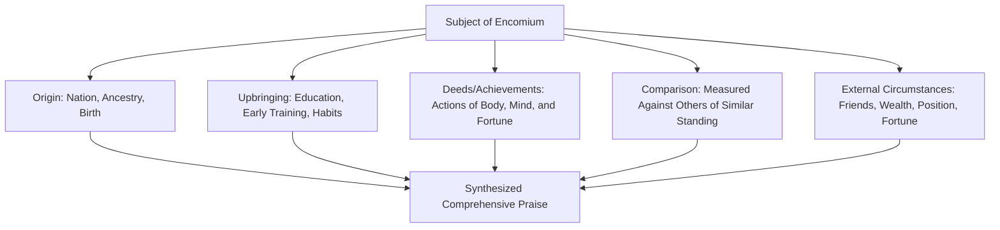

## Encomium and Invective Composition

### Overview

Encomium (*enkōmion*, formal praise) and its structural opposite, Invective/Vituperation (*psogos*, formal blame), are paired progymnasmata exercises positioned after Commonplace and typically alongside Comparison in the classical training sequence. Both exercises train systematic **epideictic** composition — the rhetorical genre of ceremonial praise and blame, one of Aristotle's three fundamental categories of oratory alongside forensic (judicial) and deliberative (political) rhetoric. Where the Commonplace exercise amplifies an already-established general category (a traitor, a hero) without arguing individual facts, Encomium and Invective apply a comprehensive, structured set of categories to praise or condemn a *specific* individual, in detail, across the whole of their life and qualities.

**Key Points**

- Encomium and Invective are structural mirrors: identical categories of examination (origin, upbringing, deeds, character, external circumstances), applied either to praise or to condemn.
- Unlike Commonplace, which addresses a general category, Encomium/Invective address a specific person, place, thing, or even abstract quality, treated individually and comprehensively.
- These exercises are the direct ancestors of the modern eulogy, the corporate award citation, the tribute speech, the competitor teardown, and the negative campaign advertisement — praise and blame remain a live, constant genre in executive and public communication.

### Definitions

**Encomium**: A formal, structured speech of praise for a person (living or dead), group, place, thing, or abstract quality, organized systematically across a fixed set of categories to demonstrate the subject's excellence comprehensively rather than through a single anecdote.

**Invective (Vituperation, *psogos*)**: The structural inverse — a formal, systematic speech of blame or condemnation, applying the same categories to demonstrate a subject's deficiency, wrongdoing, or worthlessness.

**[Confirmed]** Aphthonius's *Progymnasmata* explicitly presents the encomium exercise with a fixed topical outline and treats invective as its direct structural opposite, applying the identical set of headings but reversing the evaluative direction — Aphthonius's own model encomium is in praise of Thucydides, organized systematically through the categories described below.

### The Standard Encomium Topics (*Kephalaia*)

Classical rhetorical theory (most systematically in Menander Rhetor's later treatises on epideictic oratory, building on the progymnasmata tradition) organizes encomiastic praise around a consistent set of categories:

**Explanation of Each Category**

1. **Origin (*genos*)** — nation, city, family, ancestry; praised insofar as noble or distinguished origin reflects favorably, though ancient theorists also note virtue arising *despite* humble origin can itself be praiseworthy.
2. **Upbringing (*anatrophē*)** — education, early habits, training, and formative discipline that shaped the subject's later excellence.
3. **Deeds (*praxeis*)**, traditionally subdivided into three types of goods:
   - **Goods of the soul/mind** (*psychē*) — wisdom, courage, justice, temperance (the cardinal virtues).
   - **Goods of the body** (*sōma*) — strength, beauty, health, vigor.
   - **Goods of fortune** (*tychē*) — wealth, power, friends, favorable circumstances — treated as lesser and more contingent goods than goods of soul or body.
4. **Comparison (*synkrisis*)** — measuring the subject against comparably distinguished others to establish relative, not merely absolute, excellence (this category overlaps substantially with the standalone Comparison exercise in the progymnasmata sequence).
5. **External Circumstances** — the subject's associations, position, and the favorable or challenging conditions under which their achievements occurred (achievement against difficult circumstances typically amplifies praise further).

### Invective as Structural Inversion

Invective applies the identical category structure but inverts the evaluative content at each point:

| Category | Encomiastic Treatment | Invective Treatment |
| --- | --- | --- |
| Origin | Distinguished ancestry, or virtue achieved despite humble origin | Disreputable origin, or failure to live up to a distinguished heritage |
| Upbringing | Rigorous, virtuous education and habits | Neglected, corrupting, or self-indulgent upbringing |
| Deeds — Soul | Wisdom, courage, justice demonstrated in action | Foolishness, cowardice, injustice demonstrated in action |
| Deeds — Body | Health, strength used well | Physical excess or neglect reflecting poor self-governance |
| Deeds — Fortune | Wealth/position used for the benefit of others | Wealth/position abused for private gain at others' expense |
| Comparison | Favorable measurement against peers | Unfavorable measurement, showing inferiority even to lesser figures |
| External circumstances | Achievement despite hardship | Failure despite advantage, or exploitation of favorable circumstance |

### Worked Example: Encomium

**Subject**: A (generic, illustrative) civic leader.

> "Born to a family of modest means in a small provincial town [Origin — virtue despite modest origin], she was nonetheless raised under the discipline of parents who valued education above comfort, sacrificing what little they had to see her schooled properly [Upbringing]. As an adult, she distinguished herself first through sound judgment in matters of civic finance, guiding her city through a period of fiscal hardship without resorting to measures that would have burdened its poorest residents [Deeds — Soul: wisdom, justice]; she maintained this discipline despite the personal toll of long hours and public criticism, a vigor of will matched by an evident physical resilience across years of demanding service [Deeds — Body]. Where others in comparable positions used their influence to enrich themselves, she directed available resources toward public works that outlasted her own tenure [Deeds — Fortune, and implicit Comparison]. That she achieved this while facing organized political opposition at every turn only sharpens the praise her achievements deserve [External Circumstances]."

### Worked Example: Invective

**Subject**: A (generic, illustrative) corrupt official — structurally inverting the same categories.

> "Born into privilege that most citizens could scarcely imagine [Origin — advantage squandered], he was raised amid indulgence that taught him to expect deference rather than to earn it [Upbringing]. In office, he showed neither the wisdom to anticipate the consequences of his decisions nor the justice to distribute public resources fairly, favoring instead those positioned to return the favor privately [Deeds — Soul: folly, injustice]. His public vigor, so often praised, is revealed on closer examination to have been reserved almost entirely for self-promotion rather than the substantive work of governance [Deeds — Body, ironically inverted]. Where his predecessor used a far smaller budget to accomplish more for the city, he squandered abundant resources and left less behind than he inherited [Deeds — Fortune, Comparison]. That he did so while facing no meaningful opposition, with every advantage available to succeed, makes the failure not merely unfortunate but inexcusable [External Circumstances]."

### The Ethical Dimension of Invective

**Key Points**

- Ancient rhetorical theory recognized invective as a legitimate epideictic tool (particularly in forensic contexts, condemning a proven wrongdoer, or in political contexts, opposing a genuinely harmful figure or policy) but also recognized its capacity for abuse.
- The ethical boundary between legitimate invective and fallacious attack closely parallels the boundary between legitimate *ethos*-based argument and the **ad hominem fallacy**: invective becomes fallacious specifically when it substitutes personal condemnation for engagement with the substance of a policy, claim, or argument the person has made, rather than being a warranted (Toulmin-sense) conclusion about *established, relevant* wrongdoing.
- Invective aimed at genuinely established, relevant conduct (a proven corrupt official's actual corrupt acts) is structurally different from invective aimed at irrelevant personal characteristics unconnected to the matter at hand (attacking an official's personal appearance or family rather than their conduct in office) — the latter collapses into ad hominem regardless of how skillfully it is composed.

[Inference] The precise line between warranted invective and ad hominem fallacy in specific real-world cases often depends on whether the negative characterization is grounded in conduct genuinely relevant to the claim being disputed, a distinction the classical sources gesture toward (via the "advantage/consequence" and "propriety" categories used in Refutation) but do not reduce to a fully explicit, mechanically applicable test.

### Encomium/Invective vs. Commonplace: Structural Comparison

| Dimension | Commonplace | Encomium/Invective |
| --- | --- | --- |
| Subject | A general category (any traitor, any hero) | A specific, named individual (or specific place/thing) |
| Underlying facts | Stipulated as already settled | Detailed and specific to the individual, drawn from their actual biography |
| Structural categories used | Fewer, more emotionally focused (comparison, digression, rejection of excuses) | Comprehensive, biographical (origin, upbringing, deeds of soul/body/fortune, comparison, circumstance) |
| Typical modern form | Condemning/praising an already-established type of act | Eulogy, tribute speech, award citation, competitor profile, opposition research dossier |

### Encomium in Modern Executive and Professional Communication

The encomium structure is directly and frequently used in contemporary executive contexts, often without explicit awareness of its classical origin:

- **Eulogies and tribute speeches**: Following the origin–upbringing–deeds–circumstance structure remains the standard organizing pattern for a well-constructed eulogy or retirement tribute.
- **Award citations and employee recognition**: Corporate award narratives ("Employee of the Year") typically implicitly follow the deeds-of-soul (judgment, integrity), deeds-of-body (effort, resilience), and external-circumstance (achievement despite obstacles) categories.
- **Executive biography and investor-facing leadership profiles**: Founder/CEO biographies in investment materials frequently follow an encomiastic structure — origin story, formative background, key achievements, comparison to industry peers — whether or not the writer is consciously invoking the classical form.
- **Competitor analysis and opposition messaging**: The invective structure (applied ethically, grounded in verifiable, relevant conduct rather than irrelevant personal attack) underlies systematic, comprehensive critiques of a competitor's track record, leadership decisions, and market conduct.

### Practical Construction Checklist

**For Encomium**:

1. Establish origin — noting either distinguished heritage or virtue achieved despite modest origin.
2. Detail upbringing/formation relevant to later excellence.
3. Organize deeds into goods of soul (wisdom, courage, justice, temperance), body (vigor, resilience), and fortune (resources used well), giving primary weight to goods of soul as the classical tradition does.
4. Include comparison to relevant peers to establish relative, not merely asserted, excellence.
5. Note external circumstances, especially difficulty overcome, to amplify the achievement's significance.

**For Invective (used ethically)**:

1. Verify the underlying conduct is factually established and genuinely relevant to the point being made (avoiding ad hominem by anchoring blame in relevant deeds, not irrelevant personal traits).
2. Apply the same category structure in inverted form.
3. Use comparison to establish relative, not merely asserted, deficiency.
4. Avoid extending condemnation beyond what the established, relevant facts actually support — the same discipline required for a warranted, defensible argument generally.

### Related Topics

- Commonplace and Thesis Exercises
- Common Logical Fallacies and How to Spot Them (the Ad Hominem Fallacy)
- Description and Vivid Scene-Setting (Ekphrasis)
- Ethos and the Ethics of Character-Based Argument
- Comparison (*Synkrisis*) as a Progymnasmata Exercise
- Structuring Eulogies, Tribute Speeches, and Executive Award Citations