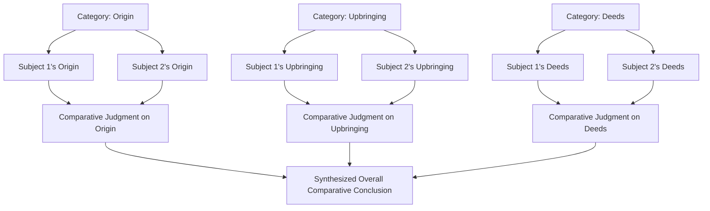
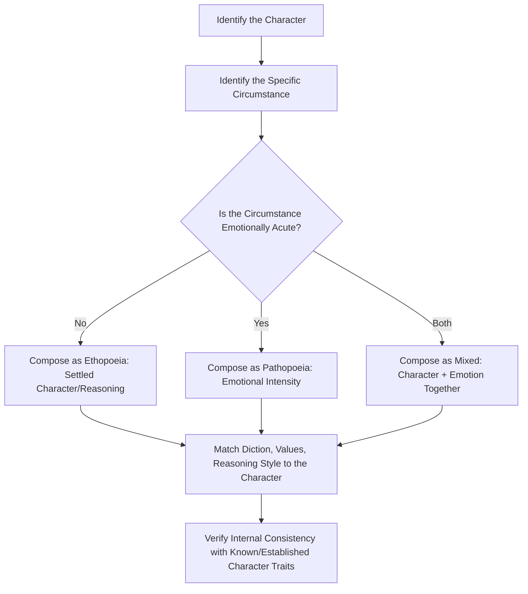

## Comparison and Characterization Exercises

### Overview

Comparison (*synkrisis*) and Characterization (*ēthopoiia*, "ethopoeia") are paired advanced progymnasmata exercises, positioned alongside or immediately after Encomium/Invective in the classical training sequence. Comparison extends the encomiastic structure to evaluate two subjects side by side, establishing relative rather than merely absolute excellence or deficiency. Characterization (Ethopoeia) shifts the exercise's focus inward, requiring the student to compose a speech *in the voice* of a specific person — real, legendary, or a type — matching diction, reasoning, and emotional register to the character's presumed psychology in a specific circumstance. Together, they train comparative judgment and imaginative, voice-matched composition, both essential to mature rhetorical practice.

**Key Points**

- Comparison (*synkrisis*) applies the encomium's category structure (origin, upbringing, deeds, circumstance) to two subjects simultaneously, category by category, rather than to one subject in isolation.
- Characterization (*ēthopoiia*) requires composing plausible speech *as* another person, trained through three recognized sub-types depending on how fully "in character" the exercise runs.
- Both exercises depend on and extend earlier progymnasmata skills: Comparison extends Encomium/Invective; Characterization extends the personal-description skill trained in Ekphrasis of persons, combined with the Chreia's use of attributed speech.

### Comparison (*Synkrisis*): Definition and Structure

**Definition**: Comparison is the systematic, category-by-category evaluation of two subjects (persons, places, actions, or things) against one another, to establish which is superior, inferior, or how they are comparably excellent in different respects. It is distinguished from a simple encomium of two subjects presented separately by its *structural interleaving* — each category (origin, upbringing, deeds, circumstance) is examined for both subjects together before moving to the next category, producing genuine comparative judgment rather than two independent praise-pieces placed side by side.

**[Confirmed]** Aphthonius's *Progymnasmata* includes comparison as a distinct exercise, applying it in his model example to a comparison between Achilles and Diomedes (or, in other transmitted versions, comparable legendary pairs), explicitly structured to examine both figures category by category (birth, upbringing, deeds) rather than treating them in sequential, separate encomia.

### Diagram: Comparison (Synkrisis) Structure

**Purposes of Comparison** (per ancient theory)

1. **Establishing relative excellence** — showing one subject superior overall, or superior in specific respects.
2. **Illuminating each subject by contrast** — qualities of one subject become clearer and more vivid when set directly against a comparable other, an effect not achievable through isolated description alone.
3. **Nuanced judgment** — comparison often reveals that neither subject is superior in every category, producing a more precise, differentiated evaluation than a simple ranking ("superior/inferior") would allow.

### Worked Example: Comparison

**Subjects**: Two (generic, illustrative) company founders being evaluated for a leadership retrospective.

> **Origin**: Founder A built the company from a modest garage operation with no outside capital, while Founder B launched with significant institutional backing from the outset — a difference that contextualizes, without diminishing, the relative significance of each founder's early decisions.
>
> **Upbringing/Formation**: Founder A's background in engineering shaped an early emphasis on product reliability; Founder B's background in finance shaped an early emphasis on capital efficiency — different formative influences producing different but comparably valid organizational strengths.
>
> **Deeds**: Founder A's defining achievement was surviving a near-failure through sheer product iteration and customer responsiveness; Founder B's defining achievement was scaling rapidly through disciplined financial management during a period of market expansion — the two deeds are not equivalent in kind, but each represents a distinguishing excellence in its respective domain (soul/judgment for A, arguably fortune-management skill for B).
>
> **Comparative Conclusion**: Neither founder's approach is straightforwardly superior; Founder A's approach would likely have served the company better during its early survival phase, while Founder B's approach was better suited to a later phase of rapid, capital-intensive growth — the comparison reveals complementary strengths rather than a single winner.

### Characterization (Ethopoeia): Definition and Types

**Definition**: Ethopoeia (from *ēthos*, "character," and *poiein*, "to make") is the exercise of composing a speech in the voice of a specific person, matching the imagined psychology, diction, values, and emotional state appropriate to that person in a specified circumstance. It trains the rhetorical skill of **prosopopoeia** more broadly (speaking in another's persona) in its most disciplined, character-consistent form.

**[Confirmed]** Ancient rhetorical theorists (Theon, Hermogenes, Aphthonius) distinguish three sub-types of this exercise based on the temporal and emotional relationship between the speaker and the circumstance being addressed:

| Sub-type | Description | Example Prompt |
| --- | --- | --- |
| **Ethopoeia proper** | Speech reflecting settled character (*ēthos*) — steady disposition, not acute emotion | "What words would a disciplined general use addressing troops before a difficult but not desperate campaign?" |
| **Pathopoeia** | Speech reflecting intense emotion (*pathos*) in an acute circumstance | "What words would Niobe say on seeing her children slain?" |
| **Mixed (Ethopoeia + Pathopoeia)** | Speech reflecting both settled character and situational emotional intensity together | "What words would Achilles say over the body of Patroclus?" — reflecting both his established heroic character and acute grief |

**Further subdivision by temporal orientation**:

- **Simple** — addressing a single circumstance at a single moment.
- **Compound/Double** — the same character addressing two different circumstances or two different addressees, requiring the student to show consistent underlying character adapted to different situational demands.

### Diagram: Ethopoeia Composition Process

### Worked Example: Ethopoeia (Settled Character)

**Prompt**: "What words might a veteran ship's captain say to a newly assigned crew before their first difficult voyage?"

> "I've buried better sailors than any of you for making the same mistakes you haven't made yet — not because you're worse than they were, but because the sea doesn't care how eager you are on your first morning out. Listen when the ship tells you something's wrong before you feel it yourselves. That's the only advantage experience gives me over you, and I intend to spend all of it keeping you alive."

Note the diction (plain, direct, weathered), reasoning (experience as practical safeguard, not boastfulness), and emotional register (steady, controlled authority) all cohere with the established character type — a disciplined veteran leader — without acute emotional crisis.

### Worked Example: Pathopoeia (Acute Emotion)

**Prompt**: "What might a scientist say upon learning a lifetime of research has been invalidated by a newly discovered error?"

> "Thirty years. I built an entire career, trained a generation of students, on a foundation I am only now discovering was never solid ground at all. I don't know yet whether to mourn the years or simply begin again — I only know that everything I taught with such certainty now requires an apology I don't know how to give."

Here diction and reasoning shift toward raw, less composed expression, appropriate to acute crisis rather than settled professional identity — illustrating the distinct register pathopoeia requires relative to ethopoeia proper.

### Comparison and Characterization in Relation to Earlier Exercises

| Prior Exercise | Skill Extended By |
| --- | --- |
| Ekphrasis of Persons | Characterization/Ethopoeia — vivid physical/psychological description extended into full imagined speech |
| Chreia (attributed sayings) | Characterization — the chreia records what a person actually said; ethopoeia imagines what they plausibly *would* say in an unrecorded circumstance |
| Encomium/Invective | Comparison — extends the same category structure (origin, upbringing, deeds, circumstance) from one subject to two, interleaved |
| Refutation/Confirmation | Comparison — plausibility and consistency tests apply equally to judging whether a comparative claim ("A is superior to B in this respect") is well-supported |

### Ethical and Practical Considerations in Ethopoeia

**Key Points**

- Ethopoeia requires disciplined imaginative restraint: the goal is psychologically *plausible* speech consistent with established or reasonably inferable character, not speech serving the composer's own agenda while merely borrowing the subject's name.
- When applied to real, named historical or contemporary figures rather than legendary or fictional ones, ethopoeia raises the same ethical concern addressed elsewhere regarding fabricated quotations: presenting invented words as a real person's plausible position is a legitimate imaginative/pedagogical exercise only when clearly framed as such, and becomes misleading or reputationally harmful if presented as, or mistaken for, an actual statement.
- This concern directly parallels the general rhetorical caution against attributing fictional quotes to real public figures, which remains an important ethical boundary in modern persuasive writing, journalism, and public communication.

[Unverified] The ancient sources do not extensively address the ethical risk of ethopoeia being mistaken for genuine historical testimony when applied to real rather than legendary figures, since the exercise's traditional subjects (Achilles, Niobe, generic character types) were understood by ancient audiences as clearly legendary or hypothetical rather than претending to report an actual historical statement; the ethical caution regarding real, named figures is a natural extension of the exercise's logic rather than an explicit ancient prescription.

### Application in Modern Executive and Professional Communication

**Comparison (Synkrisis) applications**:

- **Competitive analysis and vendor evaluation**: Systematically comparing two options category by category (cost, reliability, support, track record) rather than presenting isolated summaries of each, producing sharper, more decision-useful differentiation.
- **Performance review and succession planning**: Comparing two candidates for promotion category by category (technical skill, leadership demonstrated, growth trajectory) rather than separate, non-interleaved assessments.

**Characterization (Ethopoeia) applications**:

- **Stakeholder perspective-taking in negotiation and strategy**: Composing an imagined statement of "what would our largest customer say if presented with this price increase?" is a direct, practical application of ethopoeia, used to stress-test messaging before real-world delivery — closely related to the perspective-taking element of steelmanning an opposing viewpoint.
- **Speechwriting and persona-consistent messaging**: Ensuring a CEO's public statements remain consistent with their established public character (ethopoeia proper) versus appropriately reflecting genuine urgency or crisis (pathopoeia) when circumstances warrant a different register.
- **User personas in product and marketing strategy**: Composing a hypothetical customer's voice and reasoning ("What would a first-time user say encountering this onboarding flow?") is a direct commercial descendant of the ethopoeia exercise, used to anticipate audience reaction before real deployment.

### Practical Construction Checklist

**For Comparison**:

1. Select two genuinely comparable subjects (comparable standing, domain, or category).
2. Interleave the standard categories (origin, upbringing, deeds of soul/body/fortune, circumstance) rather than treating subjects sequentially and separately.
3. State a clear comparative conclusion per category before synthesizing an overall judgment.
4. Allow for split or conditional conclusions (each superior in different respects) rather than forcing an artificial single winner where the evidence doesn't support one.

**For Characterization**:

1. Identify whether the circumstance calls for settled character (ethopoeia), acute emotion (pathopoeia), or both.
2. Ground diction, reasoning, and values in what is genuinely known or plausibly inferable about the character, rather than the composer's own voice.
3. Verify consistency with any established prior characterization of the same person or persona.
4. When applied to real, named individuals rather than legendary or hypothetical personas, clearly frame the composition as imagined/hypothetical rather than allowing it to be mistaken for an actual statement.

### Related Topics

- Encomium and Invective Composition
- Description and Vivid Scene-Setting (Ekphrasis)
- Chreia and Maxim Exercises
- Steelmanning Opposing Viewpoints
- Prosopopoeia and Persona-Based Speechwriting
- Fabricated Quotations and the Ethics of Attributing Speech to Real Figures