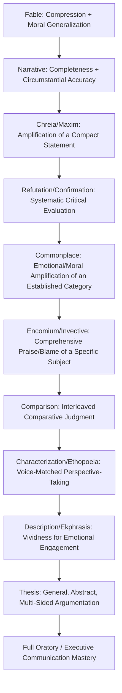

## Adapting Classical Exercises for Modern Practice


### Overview

The progymnasmata sequence — Fable, Narrative, Chreia/Maxim, Refutation/Confirmation, Commonplace, Encomium/Invective, Comparison, Characterization (Ethopoeia), Description (Ekphrasis), and Thesis — was designed as an integrated curriculum, each exercise building on skills trained by the ones before it, culminating in full declamation and mature oratory. This item consolidates the preceding exercises into a practical framework for adapting the entire sequence to modern executive, professional, and rhetorical training contexts — treating the ancient curriculum not as a historical curiosity but as a still-functional skill-development system whose underlying skill dependencies remain valid for contemporary communication training.

**Key Points**

- The pedagogical logic of the progymnasmata is cumulative and sequential: each exercise isolates and trains a specific sub-skill (compression, completeness, amplification, critical evaluation, comparative judgment, perspective-taking, vividness, general argumentation) that composite modern communication tasks require simultaneously.
- Modern adaptation is most effective when it preserves this skill-isolation principle — training one capability at a time — rather than only borrowing the ancient exercises' surface content (fables, mythical narratives) without their underlying pedagogical function.
- The full sequence maps onto a coherent modern professional-communication curriculum, from foundational writing clarity through advanced strategic argumentation and persona-based communication.

### The Full Sequence and Its Skill Dependencies



**[Confirmed]** The progymnasmata were used as formal preparatory education across the Greek, Roman, Byzantine, and — via Latin translations and adaptations, especially of Aphthonius's handbook — Western European educational traditions for well over a millennium, explicitly structured as sequential preparation for public oratory (forensic, deliberative, and epideictic), rather than as a set of independent, unrelated composition exercises.

### Skill-to-Modern-Task Mapping

| Ancient Exercise | Core Skill Trained | Direct Modern Executive Application |
| --- | --- | --- |
| Fable | Compression; deriving a general principle from a specific case | Illustrative business anecdotes; case-based lessons in leadership communication |
| Narrative | Completeness (seven circumstances); clarity, brevity, credibility | Incident reports; crisis statements; factual briefings; the "statement of facts" in any proposal |
| Chreia/Maxim | Amplification of a compact idea into developed prose | Expanding a mission statement, motto, or quoted principle into substantive commentary |
| Refutation/Confirmation | Systematic six-test critical evaluation (clarity, plausibility, possibility, consistency, propriety, advantage) | Due diligence; vetting vendor or competitor claims; media/claim literacy |
| Commonplace | Emotional/moral amplification of an already-established fact pattern | Condemning or praising an already-proven case (data breach negligence, a recognized team achievement) |
| Encomium/Invective | Comprehensive, category-based praise or blame of a specific individual | Eulogies, award citations, executive biographies, ethical competitor critique |
| Comparison | Interleaved, category-by-category comparative judgment | Vendor/candidate comparison; competitive analysis; succession planning |
| Characterization/Ethopoeia | Voice-matched perspective-taking | Stakeholder-perspective stress-testing; persona-consistent speechwriting; user-persona modeling |
| Description/Ekphrasis | Vividness (*enargeia*) for emotional engagement | Investor pitches; change-management vision statements; vivid crisis-response detail |
| Thesis | General, multi-sided, principle-level argumentation | Strategic policy questions ("should we prioritize growth over margin?") prior to case-specific decisions |

### Principles for Faithful Modern Adaptation

**1. Preserve Skill Isolation, Not Just Content**

The ancient exercises deliberately used low-stakes, often mythical or legendary material so students could master a *specific* skill (e.g., amplification in the chreia exercise) without the added cognitive load of also managing real stakes, incomplete information, or live audience reaction. A faithful modern adaptation should similarly isolate skills during training — practicing "amplification" on a low-stakes internal value statement before attempting it on a genuinely high-stakes public announcement — rather than skipping straight to composite, high-stakes tasks.

**2. Preserve the Sequential Dependency**

Just as ancient students moved from Fable to Narrative to Chreia only after demonstrating competence at each stage, modern communication training benefits from sequencing: foundational clarity and completeness (Narrative-equivalent skill) before attempting comparative judgment (Comparison-equivalent skill) or general abstract argumentation (Thesis-equivalent skill). Skipping foundational stages to practice advanced composite tasks (e.g., a junior communicator attempting full crisis-response speechwriting without first mastering plain factual narrative) mirrors the pedagogical error the ancient sequence was explicitly designed to avoid.

**3. Adapt Subject Matter, Preserve Structural Categories**

Where ancient exercises used mythical figures (Achilles, Niobe) and legendary events (the Trojan War, Aesopic animal fables), modern adaptation substitutes contemporary, professionally relevant material (a company's founding story for Encomium; a competitor's product claim for Refutation/Confirmation; a stakeholder's likely reaction for Ethopoeia) while preserving the *structural categories* (origin/upbringing/deeds/circumstance; clarity/plausibility/possibility/consistency/propriety/advantage) that give each exercise its analytical rigor.

**4. Maintain the Ethical Boundaries Embedded in the Original Exercises**

Several ancient exercises carry built-in ethical guardrails that must be preserved, not discarded, in modern adaptation:

- Invective's boundary against becoming ad hominem when condemnation strays from established, relevant conduct.
- Ethopoeia's requirement of plausibility grounded in known character, and the modern extension of this principle against fabricating quotations for real, named public figures.
- Ekphrasis's requirement that vividness serve a warranted claim rather than substitute emotional manipulation for evidence (the boundary against the appeal-to-emotion fallacy).
- Refutation/Confirmation's demand for genuine application of all six tests rather than selectively applying only the tests that favor a predetermined conclusion (a modern form of motivated reasoning the ancient structure was designed to counteract through its systematic, checklist-like completeness).

### A Practical Modern Training Sequence

Drawing directly on the ancient ordering, a structured modern executive-communication curriculum might proceed:

1. **Foundational Session — Narrative Discipline**: Draft a clear, complete incident report or factual briefing using the seven-circumstances framework (who, what, when, where, why, how, by what means), evaluated purely for clarity, brevity, and credibility.
2. **Compression Session — Fable-Equivalent**: Compress a real organizational lesson into a short illustrative anecdote with an explicit or implied general takeaway.
3. **Amplification Session — Chreia-Equivalent**: Take a company value or leadership quotation and expand it using the paraphrase/rationale/contrary-case/example/testimony/exhortation structure.
4. **Critical Evaluation Session — Refutation/Confirmation-Equivalent**: Apply the six-test framework (clarity, plausibility, possibility, consistency, propriety, advantage) to a real vendor claim, competitor announcement, or internal proposal.
5. **Amplified Judgment Session — Commonplace-Equivalent**: Practice appropriately amplifying the significance of an already-established fact pattern (a proven success or proven failure) without re-arguing the underlying facts.
6. **Comprehensive Evaluation Session — Encomium/Invective and Comparison-Equivalent**: Draft a comprehensive, category-based profile of a specific individual or a category-by-category comparison of two options (candidates, vendors, strategies).
7. **Perspective-Taking Session — Ethopoeia-Equivalent**: Compose a plausible, voice-matched statement from a key stakeholder's perspective to stress-test a planned communication before delivery.
8. **Vividness Session — Ekphrasis-Equivalent**: Take an abstract strategic claim and render it as a concrete, sensorily specific scenario, verifying the vividness serves rather than substitutes for the underlying warrant.
9. **Capstone Session — Thesis-Equivalent**: Argue a general strategic or policy question (independent of any single case) systematically from the honorable/ethical, the advantageous, the possible, and precedent, addressing the strongest counter-position.

### Diagram: Modern Curriculum Mapping

<svg xmlns="http://www.w3.org/2000/svg" viewBox="0 0 900 500">
<text x="450" y="30" text-anchor="middle" font-size="18" font-weight="bold" fill="#1a1a1a">Progymnasmata to Modern Curriculum (svg_diagram)</text>
<g font-size="11" fill="#1a1a1a">
<rect x="30" y="60" width="180" height="55" rx="6" fill="#e8f0fe" stroke="#4a72c4" stroke-width="1.5" />
<text x="120" y="82" text-anchor="middle" font-weight="bold">Fable / Narrative</text>
<text x="120" y="98" text-anchor="middle" font-size="10">Compression + Completeness</text>



```
<rect x="240" y="60" width="180" height="55" rx="6" fill="#fef3e0" stroke="#c48a2a" stroke-width="1.5" />
<text x="330" y="82" text-anchor="middle" font-weight="bold">Chreia / Maxim</text>
<text x="330" y="98" text-anchor="middle" font-size="10">Amplification</text>

<rect x="450" y="60" width="180" height="55" rx="6" fill="#e6f4ea" stroke="#2e8b57" stroke-width="1.5" />
<text x="540" y="82" text-anchor="middle" font-weight="bold">Refutation / Confirmation</text>
<text x="540" y="98" text-anchor="middle" font-size="10">Six-Test Evaluation</text>

<rect x="660" y="60" width="200" height="55" rx="6" fill="#fbe9eb" stroke="#c0435a" stroke-width="1.5" />
<text x="760" y="82" text-anchor="middle" font-weight="bold">Commonplace</text>
<text x="760" y="98" text-anchor="middle" font-size="10">Amplify Established Fact</text>

<rect x="30" y="180" width="180" height="55" rx="6" fill="#f0e6fb" stroke="#7a4fc4" stroke-width="1.5" />
<text x="120" y="202" text-anchor="middle" font-weight="bold">Encomium / Invective</text>
<text x="120" y="218" text-anchor="middle" font-size="10">Comprehensive Praise/Blame</text>

<rect x="240" y="180" width="180" height="55" rx="6" fill="#e8f0fe" stroke="#4a72c4" stroke-width="1.5" />
<text x="330" y="202" text-anchor="middle" font-weight="bold">Comparison</text>
<text x="330" y="218" text-anchor="middle" font-size="10">Interleaved Judgment</text>

<rect x="450" y="180" width="180" height="55" rx="6" fill="#fef3e0" stroke="#c48a2a" stroke-width="1.5" />
<text x="540" y="202" text-anchor="middle" font-weight="bold">Ethopoeia</text>
<text x="540" y="218" text-anchor="middle" font-size="10">Perspective-Taking</text>

<rect x="660" y="180" width="200" height="55" rx="6" fill="#e6f4ea" stroke="#2e8b57" stroke-width="1.5" />
<text x="760" y="202" text-anchor="middle" font-weight="bold">Ekphrasis</text>
<text x="760" y="218" text-anchor="middle" font-size="10">Vividness / Enargeia</text>

<rect x="330" y="300" width="240" height="60" rx="6" fill="#fbe9eb" stroke="#c0435a" stroke-width="2" />
<text x="450" y="325" text-anchor="middle" font-weight="bold" font-size="13">Thesis</text>
<text x="450" y="343" text-anchor="middle" font-size="10">General, Multi-Sided Argumentation</text>

<rect x="280" y="410" width="340" height="60" rx="6" fill="#1a1a1a" />
<text x="450" y="435" text-anchor="middle" fill="#fff" font-weight="bold" font-size="13">Executive Communication Mastery</text>
<text x="450" y="453" text-anchor="middle" fill="#ddd" font-size="10">Board decks, crisis response, negotiation, strategy</text>
```

</g>
<line x1="210" y1="87" x2="235" y2="87" stroke="#888" stroke-width="1.5" />
<line x1="420" y1="87" x2="445" y2="87" stroke="#888" stroke-width="1.5" />
<line x1="630" y1="87" x2="655" y2="87" stroke="#888" stroke-width="1.5" />
<line x1="760" y1="115" x2="120" y2="178" stroke="#888" stroke-width="1.5" />
<line x1="210" y1="207" x2="235" y2="207" stroke="#888" stroke-width="1.5" />
<line x1="420" y1="207" x2="445" y2="207" stroke="#888" stroke-width="1.5" />
<line x1="630" y1="207" x2="655" y2="207" stroke="#888" stroke-width="1.5" />
<line x1="450" y1="235" x2="450" y2="298" stroke="#888" stroke-width="1.5" />
<line x1="450" y1="360" x2="450" y2="408" stroke="#888" stroke-width="2" />
</svg>

### Common Pitfalls in Modern Adaptation

**Key Points**

- **Skipping foundational stages**: Attempting advanced composite exercises (Thesis-level strategic argument, full crisis-response speechwriting) without first securing basic Narrative-level clarity and completeness produces communication that is persuasive-sounding but structurally unsound — vulnerable to exactly the fallacies and warrant gaps the earlier exercises are designed to prevent.
- **Content-only adaptation without structural fidelity**: Modernizing subject matter (using a business case instead of a myth) while discarding the exercise's actual analytical categories (e.g., doing "comparison" as two separate, non-interleaved write-ups rather than genuine category-by-category comparative judgment) preserves surface resemblance without preserving the trained skill.
- **Treating exercises as purely stylistic rather than analytical**: The progymnasmata are frequently mischaracterized in modern pedagogical contexts as exercises in "eloquent writing style" alone; the ancient sources consistently frame them as trained *reasoning* and *evaluative* skills (the six-test refutation framework, the warrant-equivalent rationale in chreia elaboration) with stylistic elegance as a secondary, supporting concern rather than the primary goal.
- **Neglecting the ethical guardrails**: Adapting Invective, Ethopoeia, or Ekphrasis for modern persuasive use while discarding their built-in ethical constraints (avoiding ad hominem, avoiding fabricated quotation, avoiding emotional manipulation divorced from warranted claims) reproduces the exercises' persuasive power without their embedded safeguards against misuse.

[Inference] The relative modern value of following the full historical sequence in strict order, versus selecting individual exercises as standalone modules matched to an immediate professional need (e.g., training only the Refutation/Confirmation six-test framework for a due-diligence team), is a practical curriculum-design judgment; the ancient sources present the full sequence as cumulative preparation for oratory generally, but do not directly address the comparative effectiveness of partial, need-specific adoption in a modern professional training context.

### Synthesis: Why the Ancient Sequence Remains Pedagogically Sound

The progymnasmata's enduring relevance rests on a structural insight independent of its ancient content: complex communicative competence is genuinely composite, built from distinguishable sub-skills (compression, completeness, amplification, critical evaluation, comparative judgment, perspective-taking, vividness, and general argumentation) that are each more efficiently trained in isolation before being integrated. This is the same instructional logic underlying modern skill-based curricula in any complex performance domain — and it is precisely the logic that connects this chapter's classical exercises back to the argumentative frameworks (the Enthymeme, the Toulmin Model, Steelmanning, Socratic Questioning, Fallacy Detection) covered earlier in this course: the progymnasmata are the compositional and evaluative training ground on which those more explicitly logical and argumentative frameworks are ultimately applied in live, high-stakes executive rhetoric.

### Related Topics

- The Enthymeme as Rhetorical Syllogism
- The Toulmin Model: Claim, Grounds, Warrant, and Backing
- Constructing Warranted, Defensible Arguments
- Steelmanning Opposing Viewpoints
- Designing a Sequenced Executive Communication Training Curriculum
- Ethical Guardrails in Persuasive Technique: Invective, Ethopoeia, and Ekphrasis Revisited