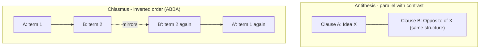

## Balance and Contrast: Antithesis and Chiasmus

### Overview

Antithesis and Chiasmus are rhetorical **schemes** organized around structural balance rather than repetition of identical words — where anaphora, epistrophe, and anadiplosis repeat the *same* terms at fixed positions, antithesis and chiasmus create effect through *parallel or inverted structure* holding contrasting or mirrored content. Both are documented extensively in classical rhetorical handbooks (Aristotle's *Rhetoric*, the *Rhetorica ad Herennium*, Quintilian's *Institutio Oratoria*) as tools for clarifying distinctions, heightening memorability, and producing a satisfying sense of formal closure.

**Key Points**

- Antithesis juxtaposes contrasting ideas within parallel grammatical structure, sharpening the perceived difference between two things by placing them in structurally equivalent positions.
- Chiasmus inverts the order of parallel elements in a second clause (ABBA structure), producing a mirrored, often memorable balance rather than a straightforward contrast.
- Both devices depend on genuine parallel construction (*parallelism*, or *isocolon* when clauses are of equal length) as their structural foundation, connecting this item to the broader family of balance-based schemes.

### Antithesis

**Definition**: Antithesis (Greek, "opposition" or "setting against") is the rhetorical scheme of placing two contrasting ideas side by side in parallel grammatical structure, so that each idea's meaning is sharpened by direct juxtaposition with its opposite.

**Structure**:

$$[\text{Clause A: Idea}] \; \text{vs.} \; [\text{Clause B: Opposite Idea, same grammatical form}]$$

**Example**

> "That's one small step for man, one giant leap for mankind."

**[Confirmed]** Aristotle explicitly discusses antithesis in the *Rhetoric* (Book III) as a stylistic device that pleases audiences because the juxtaposition of opposites is easier to grasp and more memorable than a single unopposed statement, and he links its effectiveness partly to its resemblance to a logical enthymeme — noting that antithetical statements often carry a persuasive, syllogism-like force because setting a claim against its opposite implicitly invites the audience to judge between them.

**Effect**: Antithesis clarifies distinctions by forcing two ideas into direct structural comparison, making differences vivid and easy to grasp quickly — particularly valuable in oral rhetoric, where an audience cannot pause to reflect on a complex distinction stated in isolation.

**Further Examples**

> "Ask not what your country can do for you — ask what you can do for your country."
>
> "Man proposes, God disposes."
>
> "Give me liberty, or give me death."

Each example places two grammatically parallel elements (a verb phrase, a noun phrase, an imperative) in direct opposition, relying on the parallelism to make the contrast land as a single, unified statement rather than two disconnected ideas.

### Chiasmus

**Definition**: Chiasmus (Greek, named for the letter *chi*, Χ, reflecting its crossed structure) is the rhetorical scheme in which the grammatical structure or key terms of a first clause are inverted in a second clause, producing an ABBA pattern rather than the straightforward AB-AB pattern of ordinary parallelism.

**Structure**:

$$A - B \ldots B' - A'$$

**Example**

> "Ask not what your country can do for you — ask what you can do for your country."

**Note**: This single, celebrated example is frequently cited as *both* antithesis and chiasmus simultaneously — it is antithetical in content (contrasting "country doing for you" against "you doing for country") *and* chiastic in structure (the terms "country" and "you"/"you can do" invert order across the two clauses: country→you / you→country). This overlap illustrates that the two devices are not mutually exclusive; a single well-constructed sentence can achieve both effects at once.

**Further Examples**

> "Fair is foul, and foul is fair." (Shakespeare, *Macbeth*)
>
> "You can take the boy out of the country, but you can't take the country out of the boy."

**[Confirmed]** Chiasmus is documented as a named rhetorical figure across the classical tradition and derives its name directly from the visual/structural resemblance of its inverted pattern to the crossed lines of the Greek letter chi, a naming convention noted consistently across rhetorical handbooks discussing the figure.

### Diagram: Structural Comparison

### Antithesis vs. Chiasmus: Key Distinctions

| Dimension | Antithesis | Chiasmus |
| --- | --- | --- |
| Core mechanism | Direct contrast in parallel structure | Inversion of order in mirrored structure |
| Content requirement | Requires genuinely *opposed* or contrasting ideas | Does not require opposition — can mirror related or even identical ideas in reversed order |
| Pattern | AB / A'B' (parallel, not inverted) | AB / B'A' (inverted) |
| Primary effect | Sharpens distinction, aids quick comprehension of contrast | Produces memorable balance and a sense of symmetrical closure |
| Can co-occur | Yes — a statement can be both antithetical in content and chiastic in structure simultaneously | Yes — see above |

### Antithesis and the Enthymeme

Aristotle's specific observation linking antithesis to the enthymeme merits further attention: because antithesis presents two structurally parallel but opposed claims, it implicitly invites the audience to judge between them — functioning similarly to how an enthymeme invites the audience to supply a missing premise. When a speaker says "Ask not what your country can do for you — ask what you can do for your country," the audience is led to complete an implicit evaluative judgment (that the second orientation is superior) without that judgment being stated outright — an enthymematic effect achieved through structural antithesis rather than through an explicitly suppressed logical premise.

[Inference] The degree to which antithesis functions as a *genuine* enthymematic argument (implying a real, testable warrant) versus a purely stylistic device that merely feels persuasive through structural symmetry is a matter of the specific content involved; Aristotle's observation establishes the general connection between the two, but does not provide a mechanical test for distinguishing well-warranted antithetical claims from antithetical statements whose persuasive force outruns their actual logical support — the same caution relevant to repetition schemes and vivid description generally.

### Isocolon and Parallelism as the Shared Foundation

Both antithesis and chiasmus depend on **parallelism** — grammatically equivalent construction across clauses — as their structural substrate. When parallel clauses are additionally matched in length and rhythm, the more specific term **isocolon** applies.

**Example (Isocolon)**

> "Veni, vidi, vici." ("I came, I saw, I conquered.")

Isocolon is not itself a contrast or inversion device, but it frequently underlies both antithesis and chiasmus, since the balanced, equal-length clauses make contrasts sharper (antithesis) and inversions more perceptible and satisfying (chiasmus) than unbalanced clause lengths would.

### Ethical and Practical Considerations

**Key Points**

- Like the repetition schemes, antithesis and chiasmus derive rhetorical force partly from aesthetic satisfaction (symmetry, balance) that is independent of the underlying claim's truth or warrant — a well-constructed antithesis can make a false or oversimplified dichotomy *feel* more compelling than its actual logical merit justifies.
- This risk connects directly to the **false dilemma fallacy**: because antithesis structurally presents exactly two options in opposition, a rhetorically skilled but logically unwarranted antithesis can smuggle in a false dichotomy under the cover of elegant parallel structure.
- The distinction between legitimate antithesis and a false-dilemma-disguised-as-antithesis rests on whether the two contrasted options are genuinely exhaustive and mutually exclusive, or whether additional, unacknowledged options exist that the neat parallel structure obscures.

**Example of the Risk**

> "Either we cut costs, or we go out of business." — This is stylistically effective antithesis, but if genuine alternatives exist (raising revenue, restructuring debt, seeking investment), the antithetical structure is functioning to disguise a false dilemma rather than to sharpen a genuinely binary distinction.

[Unverified] The classical sources treat antithesis primarily as a stylistic virtue and do not extensively theorize its specific risk of masking false dilemmas as a distinct ethical category; this connection is a natural extension of combining the classical stylistic analysis with the modern fallacy-detection framework covered earlier in this course, rather than an explicit ancient caution.

### Application in Executive and Business Communication

**Antithesis in executive use**: Effective for crystallizing a strategic choice or value proposition into a single, memorable, comparison-driven statement.

> "We're not building the cheapest product in this category — we're building the most trusted one."

**Chiasmus in executive use**: Effective for closing statements or mission-defining lines where a memorable, symmetrical formulation reinforces a company's identity or relationship to its stakeholders.

> "We don't succeed because our customers trust us — our customers trust us because we succeed for them."

**Practical caution**: Before deploying antithesis in a strategic or persuasive context, verify (per the Refutation/Confirmation six-test framework, particularly the *consistency* and *possibility* tests) that the two contrasted options are genuinely the operative choice, and that a middle path or third option hasn't been rhetorically eclipsed by the appeal of clean, balanced structure.

### Practical Construction Guidance

1. **For Antithesis**: Identify the two genuinely opposed elements of your claim; cast them in identical or near-identical grammatical form (same verb tense, same clause length where possible) to maximize the contrast's clarity.
2. **For Chiasmus**: Identify two key terms or concepts; construct a first clause establishing their order (A relates to B), then construct a second clause inverting that order (B relates to A) using the same or closely related vocabulary.
3. **Verify logical soundness before relying on either device to carry an argument's persuasive weight** — confirm the antithesis reflects a genuine, non-false dichotomy, and that any chiastic claim is not merely a symmetrical restatement masking an unwarranted equivalence between its inverted terms.
4. **Reserve for high-emphasis moments**: Both devices are most effective used sparingly, at a speech's or document's most consequential point (an opening thesis, a closing line), rather than distributed evenly throughout a text, where their impact diminishes with repetition.

### Related Topics

- Schemes of Repetition: Anaphora, Epistrophe, and Anadiplosis
- Common Logical Fallacies and How to Spot Them (the False Dilemma)
- The Enthymeme as Rhetorical Syllogism
- Isocolon and Parallelism as Structural Foundations of Style
- Tropes of Meaning: Metaphor, Metonymy, and Synecdoche
- Crafting Memorable Closing Lines in Executive Speeches