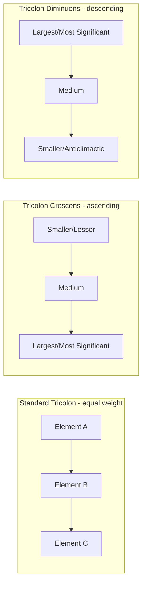

## Tricolon and the Rule of Three

### Overview

Tricolon is a rhetorical scheme consisting of three parallel words, phrases, or clauses of roughly equal length and grammatical structure, presented in sequence. It is the most specific and frequently cited instance of the broader stylistic pattern known popularly as the "Rule of Three" — the widely observed tendency for groupings of three elements to feel more complete, memorable, and rhetorically satisfying than groupings of two or four. Tricolon sits within the same family of balance-based schemes as antithesis and chiasmus, but its organizing principle is triadic grouping and escalation rather than contrast or inversion.

**Key Points**

- Tricolon is technically a specific case of **isocolon** (parallel clauses of equal length) restricted to exactly three units — distinguishing it from general parallelism, which can involve any number of parallel elements.
- The "Rule of Three" is a broader descriptive principle in rhetoric, cognitive psychology, and popular communication theory, of which tricolon is the classical, most formally defined instance.
- A special and especially powerful variant, the **tricolon crescens** (ascending tricolon), arranges the three elements in order of increasing length, weight, or intensity, producing a climactic effect.

### Definition and Structure

**Tricolon**: A series of exactly three parallel words, phrases, or clauses, typically of similar grammatical form and length.

**Structure**:

$$A, \quad B, \quad C \quad (\text{three parallel units})$$

**Example**

> "Veni, vidi, vici." ("I came, I saw, I conquered.")

**[Confirmed]** This phrase, attributed to Julius Caesar describing his victory at the Battle of Zela, is widely cited in rhetorical and stylistic analysis as a canonical example of tricolon, notable for its extreme brevity and perfectly matched grammatical parallelism (three verbs, identical tense, identical person, near-identical syllable count in the original Latin).

**Further Examples**

> "Government of the people, by the people, for the people."
>
> "Life, liberty, and the pursuit of happiness."
>
> "Blood, sweat, and tears."

### Why Three? The Cognitive and Rhetorical Rationale

**Key Points**

- A single item provides no pattern; two items provide a pattern but often read as a simple binary or contrast (frequently antithesis); three items are the minimum number required to establish a recognizable *series* or *pattern*, producing a sense of completeness that two items cannot achieve and that four or more items begin to dilute through excess.
- This structural sweet spot is discussed in classical rhetoric primarily through isocolon and tricolon specifically, while the broader "Rule of Three" as a named cognitive/communicative principle is a modern (20th–21st century) popularization and generalization of this older, more specific classical device.
- Three items are also generally easier to hold in short-term working memory and recall accurately than four or more, a cognitive factor frequently cited in modern communication and public-speaking literature to explain the rule's continuing intuitive force.

[Inference] The claim that three-item groupings are cognitively optimal for memorability, relative to two or four items, draws on general principles of short-term memory capacity and pattern-recognition discussed in cognitive psychology and popular communication theory; the classical rhetorical sources themselves justify tricolon primarily on grounds of aesthetic balance and completeness (via isocolon) rather than through an explicit cognitive-memory argument, so the specific cognitive-science framing of "why three works" is a modern, not ancient, addition to the classical device.

### Tricolon Crescens (Ascending Tricolon)

**Definition**: A tricolon in which the three parallel elements are arranged in ascending order of length, intensity, importance, or scope, producing a climactic or escalating effect as the sequence unfolds.

**Example**

> "I came, I saw, I conquered" arguably already exhibits mild ascending weight (arrival, observation, decisive victory), but a clearer example:

> "It's not just a product. It's not just a company. It's a movement."

Note the escalation in scope and abstraction across the three clauses — from a concrete object, to an organization, to a broad social phenomenon — each step larger and more significant than the last, producing a rhetorical "build" toward the final, most weighted term.

**Contrast: Tricolon Diminuens (Descending Tricolon)**

Less common but occasionally used deliberately for ironic, deflating, or anticlimactic effect — arranging elements in *decreasing* order of weight, often for comic or bathetic purposes.

> "He conquered nations, won elections, and remembered to water the office plants."

### Diagram: Tricolon Structures

### Tricolon vs. Other Repetition and Balance Schemes

| Scheme | Number of Units | Organizing Principle | Distinguishing Feature |
| --- | --- | --- | --- |
| Anaphora | Any number ≥ 2 | Shared opening | Repeats identical opening words |
| Epistrophe | Any number ≥ 2 | Shared closing | Repeats identical closing words |
| Isocolon | Any number ≥ 2 | Equal clause length | General parallelism of length, not restricted to 3 |
| Tricolon | Exactly 3 | Triadic grouping | Specifically three parallel units — the "complete set" effect |
| Antithesis | Exactly 2 (typically) | Contrast | Requires opposed content, not mere parallel listing |

Tricolon frequently *combines* with anaphora or epistrophe — a three-part list that also repeats a shared opening or closing word is both a tricolon and an instance of anaphora/epistrophe simultaneously, illustrating that these devices are not mutually exclusive categories but overlapping structural lenses on the same passage.

**Example (Tricolon + Anaphora combined)**

> "We shall fight on the beaches, we shall fight on the landing grounds, we shall fight in the fields." (a three-part excerpt of the earlier, longer anaphoric sequence — here forming a tricolon due to being grouped in a set of three within the larger passage)

### The Rule of Three Beyond Formal Tricolon

The broader "Rule of Three" extends beyond strict grammatical tricolon to a range of communicative and structural practices:

1. **List structure in speeches and writing**: Presenting supporting points, examples, or benefits in groups of three, even without strict grammatical parallelism (e.g., organizing a presentation's body into exactly three main sections).
2. **Narrative structure**: The three-act structure in storytelling (setup, confrontation, resolution) and the "rule of three" in comedic writing (two instances establishing a pattern, the third subverting or exaggerating it for comic effect).
3. **Persuasive framing**: Structuring an argument's supporting grounds into three clearly delineated reasons, a pattern common in both classical oratory and modern executive presentations, likely because three reasons are perceived as thorough without appearing exhaustive or padded.

**[Unverified]** While the three-act narrative structure and the "rule of three" in comedic writing are widely discussed in modern writing and screenwriting pedagogy as related applications of the same underlying triadic principle, the direct historical lineage connecting these modern narrative conventions to the classical rhetorical tricolon specifically (as opposed to independent convergent development) is not something the classical rhetorical sources themselves establish, since they address tricolon as a sentence-level stylistic device rather than a narrative-structure principle.

### Ethical and Practical Considerations

**Key Points**

- Like other schemes discussed in this chapter, tricolon's persuasive force derives partly from aesthetic satisfaction (a sense of "completeness") independent of the underlying content's actual merit — a weak argument can be made to feel more complete and convincing merely by being packaged into three parallel points, whether or not three points are the genuinely correct or exhaustive framing.
- This creates a specific version of the general risk already noted for other schemes: the "Rule of Three" can encourage artificially forcing content into exactly three categories (padding a two-point argument or truncating a five-point argument) purely for rhetorical effect, at the cost of accurately representing the actual structure of the underlying claim or evidence.
- The corrective is the same discipline required throughout this course: verify that the content's actual grounds and structure genuinely support a three-part framing before adopting it for its aesthetic appeal alone.

[Inference] The tendency to force arguments into three-part structures for rhetorical polish, even where the underlying content naturally divides into two, four, or an irregular number of points, is a commonly noted practical pitfall in modern speechwriting and presentation-design guidance; this is a natural extension of the tricolon's known aesthetic power rather than a concern documented in the classical sources themselves, which discuss tricolon's construction and effect without extensively cautioning against its potential to distort accurate representation of content.

### Application in Executive and Business Communication

**Standard tricolon in executive use**: Framing a value proposition or company priority set in three clearly parallel terms increases memorability and perceived completeness.

> "Faster, safer, simpler."

**Tricolon crescens in executive use**: Effective for building toward a culminating strategic priority or the emotional high point of a speech.

> "This year we stabilized the business. This year we grew the business. This year, for the first time, we transformed the business."

**Structuring presentations using the Rule of Three**: Organizing a pitch, board update, or strategic recommendation around exactly three main points (when genuinely warranted by the content) leverages the same cognitive and aesthetic completeness effect at the level of overall document or speech structure, not merely at the sentence level.

**Practical caution**: Before committing to a three-part structure for a major presentation, verify (per the general principle of constructing warranted, defensible arguments) that three points genuinely and accurately represent the strongest, most complete framing of the underlying grounds — rather than three points chosen because three is rhetorically pleasing while a fourth, equally important point is quietly dropped to preserve the pattern.

### Practical Construction Guidance

1. **Identify three genuinely parallel elements** — in grammatical form, scope, or category — from the content you are structuring.
2. **Decide on ordering**: standard tricolon (equal weight) for balanced emphasis; tricolon crescens (ascending) for building toward a climactic final point; tricolon diminuens (descending) only for deliberate ironic or anticlimactic effect.
3. **Match grammatical form as closely as possible** across all three elements (same part of speech, similar length, parallel tense) to maximize the sense of a unified, complete set.
4. **Verify the three-part framing is accurate to the underlying content**, not merely imposed on it for stylistic polish, following the same warrant-verification discipline applied to any rhetorical device covered in this course.
5. **Combine sparingly with other schemes** (anaphora, epistrophe) for reinforced effect at especially high-emphasis moments, but avoid stacking multiple devices in routine, lower-stakes prose where the effect becomes diminishing or mechanical.

### Related Topics

- Schemes of Repetition: Anaphora, Epistrophe, and Anadiplosis
- Balance and Contrast: Antithesis and Chiasmus
- Isocolon and Parallelism as Structural Foundations of Style
- Structuring Executive Presentations and Board Decks
- Amplification (*Auxēsis*) as a General Rhetorical Technique
- Narrative Three-Act Structure in Business Storytelling