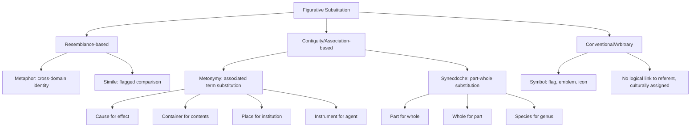

## Metonymy, Synecdoche, and Symbolic Language

### Definitions and Core Distinctions

**Metonymy** is a trope in which a thing is referred to not by its own name but by the name of something closely associated with it — a contiguous relationship (spatial, causal, institutional, or conventional) rather than a resemblance relationship. Example: "The White House issued a statement" (institution referred to by its physical seat).

**Synecdoche** is traditionally classified as a subtype of metonymy in which the association is specifically part-to-whole or whole-to-part. Example: "All hands on deck" (hands = sailors/crew members, part standing for whole), or conversely "The city voted for change" (whole standing for the part — the citizens who actually voted).

**Symbolic language** is the broader category: any use of a concrete sign, image, or object to represent an abstract concept, value, or entity, where the relationship between sign and referent may be conventional (culturally assigned, as in a flag representing a nation) rather than logically necessary. Metonymy and synecdoche are specific *mechanisms* by which symbolic substitution operates; not all symbolism is metonymic (some symbolism is purely conventional/arbitrary, as in religious or heraldic symbols with no contiguity or part-whole relation to their referent).

The key distinguishing test across all three: **contiguity/association (metonymy, synecdoche) vs. resemblance (metaphor) vs. arbitrary convention (pure symbol)**. This differentiates the chapter's earlier device (metaphor, built on similarity) from this one (built on real-world proximity or conventional assignment).

### Classical and Rhetorical Origins

Aristotle grouped metonymy and synecdoche under his broader treatment of metaphor in the *Poetics*, since ancient rhetorical taxonomy did not always sharply separate them from metaphor — both were seen as forms of "transferred naming" (*epiphora*). The Roman rhetorical tradition (Quintilian, *Institutio Oratoria*, Book VIII) formalized the distinction more clearly: metonymy (*denominatio*) substitutes an associated term (cause for effect, container for contents, instrument for agent), while synecdoche (*intellectio*) substitutes part for whole or whole for part, species for genus or genus for species.

Roman Jakobson's structuralist linguistics (mid-20th century) later reframed the metaphor/metonymy distinction as one of the two fundamental axes of language itself: metaphor operating on the axis of *selection* (paradigmatic substitution via similarity) and metonymy operating on the axis of *combination* (syntagmatic substitution via contiguity). This reframing elevated metonymy from a minor ornamental trope to a structurally fundamental mode of meaning-making, influential in literary theory, semiotics, and later cognitive linguistics.

### Structural Taxonomy

| Type | Relationship | Example |
| --- | --- | --- |
| Cause for effect | The producing cause names the result | "He earns his bread" (labor → wages/food) |
| Effect for cause | The result names the producer | "Gray hairs deserve respect" (age effect → the aged person) |
| Container for contents | The holder stands for what it holds | "The kettle is boiling," "drink the whole bottle" |
| Instrument for agent | The tool stands for the user | "The pen is mightier than the sword" |
| Place for institution/event | Location stands for the entity situated there | "Wall Street reacted," "Washington announced," "Hollywood responded" |
| Producer for product | Maker's name stands for the output | "I bought a Ford," "reading Shakespeare" |
| Symbol/emblem for institution | Conventional sign stands for the body it represents | "The Crown decided," "the Bar objected" |
| Synecdoche: part for whole | A component represents the entire entity | "All hands on deck," "new wheels" (car) |
| Synecdoche: whole for part | The entire entity represents a component | "The nation mourned" (a subset of citizens) |
| Synecdoche: species for genus | A specific instance stands for the general category | "Bread" for food generally ("give us this day our daily bread") |
| Synecdoche: material for object | The substance names the finished item | "Steel" for a sword/blade ("crossing steel") |
| Symbolic language (non-contiguous) | Purely conventional sign-referent link | A flag for a nation, a dove for peace, scales for justice |

### Cognitive and Rhetorical Function

Metonymy and synecdoche are persuasively significant because they perform **compression through indexical proximity** — the substituted term is genuinely connected to the referent (unlike metaphor's cross-domain leap), which lends the substitution an air of literalness and factuality even while performing significant rhetorical work.

**Key persuasive mechanisms:**

- **Institutional personification without explicit claim**: "Wall Street panicked" attributes a unified emotional/behavioral state to a diffuse, non-unified set of actors (banks, traders, algorithms, individual investors) — creating an illusion of coherent agency that supports simplified causal narratives. This is a common technique in economic and political commentary to render complex, distributed phenomena into an actor capable of blame or credit.
- **Selective foregrounding (synecdochic framing)**: choosing which "part" represents the "whole" is itself an argumentative act. Calling war casualties "boots on the ground" foregrounds the functional/military part and backgrounds the human whole, functioning as a euphemistic distancing device. Conversely, "every one of these caskets represents a family" foregrounds the human whole to intensify emotional impact.
- **Metonymic chains and euphemism**: repeated substitution can create a rhetorical distance from an uncomfortable referent (e.g., "collateral damage" for civilian casualties operates through a related but distinct mechanism — abstraction/euphemism — often used in combination with metonymic displacement).
- **Symbolic condensation**: national flags, corporate logos, and emblems allow an entire complex of values, history, and loyalty to be invoked instantly through a single visual or verbal token, which is central to branding, political rallies, and ceremonial executive rhetoric (e.g., invoking "the flag" rather than enumerating national values).

**[Inference]** The degree to which metonymic framing measurably shifts audience moral judgment (e.g., "boots on the ground" vs. "soldiers") has been studied in framing and euphemism research, but effect sizes and mechanisms are more securely established as consistent qualitative patterns in discourse analysis than as fixed, universally quantified persuasion coefficients.

### Function in Executive and Organizational Communication

**1. Institutional shorthand.** Executives routinely use place-for-institution and container-for-contents metonymy for efficiency: "The board wants answers," "Legal flagged this," "The Street is watching Q3." This is largely conventionalized (near-"dead" metonymy) but still carries the rhetorical effect of presenting an institution as a unified, decisive agent.

**2. Brand and logo as corporate synecdoche/symbol.** A company's logo, mascot, or product often functions synecdochically or symbolically for the entire enterprise ("the swoosh," "the golden arches"), allowing instantaneous audience recognition and value transfer (aesthetic, quality, trust associations) without restating them explicitly.

**3. Crisis communication and distancing.** Corporate spokespeople may deploy metonymic/euphemistic substitution to reduce the emotional charge of bad news ("headcount adjustments" for layoffs functions through abstraction more than pure metonymy, but is frequently paired with synecdochic minimizing language like "a small percentage of the workforce").

**4. Rallying and identity language.** "This company bleeds innovation," "We are Silicon Valley's engine" — synecdochic and symbolic self-description used to build internal culture and external brand identity in keynote and internal town-hall rhetoric.

**5. Attribution management.** Metonymic displacement can also serve accountability-shifting functions: "mistakes were made" (a related but distinct passive-voice evasion) is often reinforced by metonymic phrasing that names an institution ("the department failed to act") rather than a specific individual, diffusing personal responsibility across a synecdochic whole.

### Worked Example

> Literal statement: "Our marketing department, product team, and sales division all need to communicate more effectively with one another."
>
> Synecdochic/metonymic compression: "Marketing, Product, and Sales need to actually talk to each other."
>
> Function: each department name stands (via institutional metonymy) for the people within it; this is virtually unnoticed as figurative language because it is fully conventionalized, yet it still performs the rhetorical work of treating departments as unified agents capable of a relational failure ("not talking"), which supports a specific diagnostic narrative (silo problem) over alternative framings (e.g., individual accountability, process failure, resourcing failure).

### Risks and Rhetorical Failure Modes

- **False unification**: treating a diffuse, internally conflicted institution (a market, a nation, a department) as a single coherent agent can misrepresent the actual distribution of views or causes, and can be used manipulatively to obscure dissent or internal disagreement.
- **Euphemistic overreach**: excessive use of distancing metonymy/symbolic substitution in describing harm (layoffs, casualties, failures) risks being perceived as evasive or dishonest once the audience decodes the substitution, damaging ethos.
- **Symbol misappropriation or dilution**: overuse or inappropriate context for a powerful symbol (flag, national emblem, cultural icon) can generate backlash if perceived as exploitative rather than earned.
- **Ambiguous part-selection**: choosing a synecdochic "part" that the audience does not recognize as representative can produce confusion rather than compression (a failure of shared convention between speaker and audience).
- **Mixed device confusion**: because metonymy, synecdoche, and metaphor can visually resemble each other in a sentence, analysts and student rhetoricians frequently misclassify examples; the operative test remains contiguity/part-whole (metonymy/synecdoche) vs. resemblance (metaphor).

### Relationship to Adjacent Devices

- **Metaphor**: resemblance-based substitution across domains (see prior item); metonymy/synecdoche are contiguity-based substitution within a real-world associative or part-whole relationship.
- **Euphemism**: a semantic softening strategy that frequently *uses* metonymic or synecdochic substitution as its mechanism but is defined by its softening function rather than its structural relationship.
- **Symbol/Emblem (rhetorical iconography)**: the broadest category; metonymy and synecdoche are two possible *bases* for a symbolic relationship (contiguity, part-whole), alongside purely conventional/arbitrary symbolic assignment with no logical link to the referent (e.g., a color representing a political party by convention only).
- **Personification**: distinct trope granting human agency/attributes to non-human or abstract entities; often works alongside institutional metonymy ("the market panicked" combines metonymy — market for the aggregate of participants — with personification — panic attributed to it).

### Diagram: Substitution Relationships Across Tropes

### Chapter Comparison Table

| Dimension | Metonymy | Synecdoche | Symbolic Language (general) |
| --- | --- | --- | --- |
| Basis of substitution | Real-world association/contiguity | Part-whole or whole-part relation | Convention (may or may not involve contiguity) |
| Logical relation to referent | Causally/spatially/institutionally linked | Structurally contained within referent | Often arbitrary/culturally assigned |
| Typical executive use | Institutional shorthand ("the board," "Wall Street") | Selective foregrounding ("boots on the ground," "headcount") | Branding, ceremonial rhetoric, identity-building |
| Persuasive risk | False unification of diffuse actors | Misleading part-selection, euphemistic minimizing | Symbol dilution, perceived exploitation |
| Detection difficulty | Often fully conventionalized ("dead"), unnoticed | Often unnoticed in compressed institutional speech | Usually consciously recognized as symbolic |

### Related Topics

- Roman Jakobson's Metaphor/Metonymy Axis and structuralist linguistics
- Euphemism and Dysphemism as distancing/intensifying strategies
- Personification and institutional agency framing ("the market panicked")
- Branding Semiotics: logos, mascots, and corporate synecdoche
- Crisis Communication Language and accountability-diffusing rhetoric
- Framing Theory: part-selection as an argumentative act
- Iconography and Ceremonial Rhetoric in political and executive speech
- Passive Voice and Agentless Constructions in accountability management